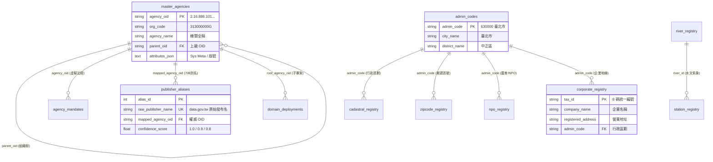

# 🏛️ 第 3 章：GOV-300 核心資料庫與 12 大實體表圖鑑百科 (03_db_glossary.md)

* **專案名稱**：`tw-gov-db` (台灣政府開放資料通用基石對照庫)
* **專案代號**：`GOV-300` (方案 A 權威機關簡碼 `300000000A`)
* **當前版本**：`v0.2.1`
* **歸檔路徑**：`events-2026Q3/gov-db-in/tw-gov-db/book/03_db_glossary.md`

---

## 🗺️ 3.0 12 大實體表總覽與雙資料庫關聯圖 (ERD)

`tw-gov-db` (`GOV-300`) 採用實體分庫與關聯對照整合設計。全系統共包含 **12 大核心實體資料表**，分別存放於 `master_agencies.sqlite` (4 張表) 與 `universal_keys.sqlite` (8 張表) 兩個 SQLite 檔案中，其實體 DDL 總藍圖集中管理於 [`ontology/schema.sql`](../ontology/schema.sql)：



---

## 🏛️ Part A: `master_agencies.sqlite` 權威機關與領域註冊庫 (4 大實體表)

### 3.1 機關權威主檔表 (`master_agencies`)
* 🎯 **詳細表格用途 (Table Purpose)**：
  收錄全台灣 **7,956 筆** 官方權威 OID 組織樹，作為全政府機關身份的「單一真實來源 (Single Source of Truth)」。為所有開放資料集的發布者提供不可變、不重複的權威實體編號。
* 🔗 **跨 DB / 跨模組連結性 (Inter-DB Connectivity)**：
  - **與 `publisher_aliases` 連結**：被 `publisher_aliases.mapped_agency_oid` 引用。將發布單位別名（如「農糧署」）向上對齊歸併至本表的權威 OID。
  - **與 `domain_deployments` 連結**：被 `domain_deployments.root_agency_oid` 引用。作為部會子專案（如 `GOV-A19` 農業部 `2.16.886.101.20003.20064`）的領域根節點。
  - **跨部會 DB 直連 (如 `tw-agro-db`)**：子專案中的資料集（如農藥登記表）強制以本表的 `agency_oid` 標註主管權責機關。
* 📜 **DDL 宣告**：
  ```sql
  CREATE TABLE master_agencies (
      agency_oid VARCHAR(128) PRIMARY KEY, -- 政府 OID (如 2.16.886.101.20003.20007)
      org_code VARCHAR(32),                -- 行政院機關程式碼 (如 313000000G)
      agency_name VARCHAR(128) NOT NULL,   -- 官方全稱 (如 經濟部水利署)
      parent_oid VARCHAR(128),             -- 上級機關 OID (樹狀關聯)
      level_type VARCHAR(16),              -- 層級 (院, 部, 署局, 處组)
      attributes_json TEXT,                -- [SPC-006] 動態屬性 JSON (地址, DN, spec_version)
      updated_at TIMESTAMP DEFAULT CURRENT_TIMESTAMP,
      FOREIGN KEY(parent_oid) REFERENCES master_agencies(agency_oid)
  );
  ```

### 3.2 機關處務規程與法定職掌虛擬表 (`agency_mandates`)
* 🎯 **詳細表格用途 (Table Purpose)**：
  記錄各中央與地方機關內設單位（組、科、司、處）的法定職掌與依據法規條文。採用 **法規虛擬層 (Virtual Law Layer)** 架構，本機 0MB 開銷，線上查詢時即時連線 PostgreSQL / `law_db` MCP。
* 🔗 **跨 DB / 跨模組連結性 (Inter-DB Connectivity)**：
  - **與 `master_agencies` 連結**：透過外鍵 `agency_oid` 連結至權威機關主檔。
  - **與外部 `law_db` 連結**：透過 `law_article` 條文編號與 `unit_name`，由 `VirtualLawAdapter` 連線外部全國法規資料庫/處務規程，提供 AI Agent 進行「這個資料集屬於哪一個科室的法定職掌」業務歸屬分析。
* 📜 **DDL 宣告**：
  ```sql
  CREATE TABLE agency_mandates (
      mandate_id INTEGER PRIMARY KEY AUTOINCREMENT,
      agency_oid VARCHAR(128) NOT NULL,    -- 對應之機關 OID
      unit_name VARCHAR(128) NOT NULL,     -- 內部組/科名稱 (如 水質管理組)
      law_article VARCHAR(32),             -- 依據法規條文 (如 第 5 條)
      mandate_text TEXT NOT NULL,          -- 法定掌理事項內文
      keywords_json TEXT,                  -- 萃取之業務關鍵字 JSON 清單
      attributes_json TEXT,                -- [SPC-006] 動態屬性 JSON (含 spec_version)
      FOREIGN KEY(agency_oid) REFERENCES master_agencies(agency_oid)
  );
  ```

### 3.3 發布機關別名對照表 (`publisher_aliases`)
* 🎯 **詳細表格用途 (Table Purpose)**：
  收錄 **708 筆** `data.gov.tw` 網路上各種髒亂、俗稱、舊制或業務司處字串（如「農糧署」、「行政院農業委員會農糧署」、「農糧署作物生產組」），透過名稱正規化清理並映射至權威 OID。
* 🔗 **跨 DB / 跨模組連結性 (Inter-DB Connectivity)**：
  - **與 `master_agencies` 連結**：`mapped_agency_oid` 外鍵直連 `master_agencies.agency_oid`。
  - **跨資料集對照整合 (Data Alignment Pipeline)**：當 Core SDK `BaseDomainAdapter.align_publisher_oid()` 收到任意字串時，查詢本表進行 1 毫秒別名歸併，傳回標註信心分數 (`confidence_score` 1.0/0.9/0.8) 的權威 OID。
* 📜 **DDL 宣告**：
  ```sql
  CREATE TABLE publisher_aliases (
      alias_id INTEGER PRIMARY KEY AUTOINCREMENT,
      raw_publisher_name VARCHAR(128) UNIQUE NOT NULL, -- data.gov.tw 原始名稱 (如 農糧署)
      mapped_agency_oid VARCHAR(128) NOT NULL,          -- 映射之 OID (2.16.886.101.20003.20064.20070)
      confidence_score FLOAT DEFAULT 1.0,               -- 匹配信心度 (1.0 完全, 0.9 司處上溯, 0.8 簡稱)
      attributes_json TEXT,                            -- [SPC-006] 規則標籤與修訂履歷
      FOREIGN KEY(mapped_agency_oid) REFERENCES master_agencies(agency_oid)
  );
  ```

### 3.4 部會子專案實體展開註冊表 (`domain_deployments`)
* 🎯 **詳細表格用途 (Table Purpose)**：
  負責登記所有已啟動建置或前置規劃中的部會子專案（如 `GOV-A19` 農業部 `tw-agro-db`、`GOV-A13` 內政部 `tw-moi-db`），保存其磁碟相對路徑 `repo_path` 與根機關 OID。
* 🔗 **跨 DB / 跨模組連結性 (Inter-DB Connectivity)**：
  - **與 `master_agencies` 連結**：`root_agency_oid` 直連領域根機關。
  - **與 `domain_map_config.json` 及 `DomainRegistryResolver` 連結**：作為動態路由的核心依據。Core SDK 導航解析器讀取本表，實現跨專案 CLI 命令調用 (`run_domain_cli`) 與跨專案 SQLite DB 實體直連。
* 📜 **DDL 宣告**：
  ```sql
  CREATE TABLE domain_deployments (
      domain_id VARCHAR(64) PRIMARY KEY,       -- 領域 ID (如 GOV-A19, GOV-A13)
      domain_name VARCHAR(128) NOT NULL,      -- 專案名稱 (如 農業部開放資料主題對照庫)
      root_agency_oid VARCHAR(128) NOT NULL,  -- 根機關 OID (如 2.16.886.101.20003.20064)
      repo_path VARCHAR(256),                 -- 相對路徑 (events-2026Q3/agro-db-in/tw-agro-db)
      deployment_status VARCHAR(32) DEFAULT 'ACTIVE',
      attributes_json TEXT,                  -- 維護團隊標籤與版本號
      registered_at TIMESTAMP DEFAULT CURRENT_TIMESTAMP,
      FOREIGN KEY(root_agency_oid) REFERENCES master_agencies(agency_oid)
  );
  ```

---

## 🔑 Part B: `universal_keys.sqlite` 五大通用基石庫 (8 大實體表)

### 3.5 行政區劃主檔表 (`admin_codes`) [基石二]
* 🎯 **詳細表格用途 (Table Purpose)**：
  收錄 **480 筆** 6 碼國家標準行政區劃程式碼 (22 縣市 + 368 鄉鎮市區，如 `630000` 臺北市、`680000` 桃園市)。為全台灣地理空間資料提供唯一的行政邊界關鍵字。
* 🔗 **跨 DB / 跨模組連結性 (Inter-DB Connectivity)**：
  - **被多表強烈引用 (Spatial Hub)**：被 `cadastral_registry` (地籍)、`zipcode_registry` (門牌)、`npo_registry` (農會) 與 `corporate_registry` (企業) 之 `admin_code` 外鍵引用。
  - **跨部會聯防 (如 `tw-agro-db` ↔ `tw-moi-db`)**：將農業部的休閒農場與內政部的國土使用分區，透過 6 碼 `admin_code` 於 SQL 中一秒完成 `JOIN` 碰撞！
* 📜 **DDL 宣告**：
  ```sql
  CREATE TABLE admin_codes (
      admin_code VARCHAR(8) PRIMARY KEY,   -- 6碼國家標準程式碼 (如 630000 臺北市)
      city_name VARCHAR(32) NOT NULL,      -- 縣市名稱
      district_name VARCHAR(32) NOT NULL,  -- 鄉鎮市區名稱
      updated_at TIMESTAMP DEFAULT CURRENT_TIMESTAMP
  );
  ```

### 3.6 全國地籍段名段號表 (`cadastral_registry`) [基石二]
* 🎯 **詳細表格用途 (Table Purpose)**：
  收錄全台地籍段名與段號正則化 `cadastral_id`（格式：`行政區碼_段碼_地號`，如 `68000_0100_0000`），解決中文地籍字串無法直接比對的痛點。
* 🔗 **跨 DB / 跨模組連結性 (Inter-DB Connectivity)**：
  - **與 `admin_codes` 連結**：透過 `admin_code` 歸屬至鄉鎮市區。
  - **與內政部地政庫 (`tw-moi-db`) 連結**：提供地籍圖邊界與土地變更對照整合。
  - **與農業部農地庫 (`tw-agro-db`) 連結**：連線農糧署產銷班與農地重劃圖資，進行國土違規侵占聯防。
* 📜 **DDL 宣告**：
  ```sql
  CREATE TABLE cadastral_registry (
      cadastral_id VARCHAR(32) PRIMARY KEY, -- 格式: 縣市碼_段號_地號 (如 68000_0100_0000)
      section_code VARCHAR(16) NOT NULL,   -- 段程式碼
      section_name VARCHAR(64) NOT NULL,   -- 段名稱 (如 成功段)
      admin_code VARCHAR(8) NOT NULL,      -- 所屬行政區劃
      attributes_json TEXT,
      FOREIGN KEY(admin_code) REFERENCES admin_codes(admin_code)
  );
  ```

### 3.7 郵遞區號與地址對照表 (`zipcode_registry`) [基石二]
* 🎯 **詳細表格用途 (Table Purpose)**：
  收錄 **372 筆** 本機 3 碼郵遞區號。並搭配 CLI 工具 `opendata_cli.py zipcode` 提供全台 6 碼（3+3 碼）門牌精確投遞區號的線上即時反查。
* 🔗 **跨 DB / 跨模組連結性 (Inter-DB Connectivity)**：
  - **與 `admin_codes` 連結**：透過 `admin_code` 連結至鄉鎮市區。
  - **與門牌地址轉碼服務 (TGOS / `tw-moi-db`) 連結**：將異質文字地址（如「臺北市重慶南路一段120號」）轉譯為 6 碼郵遞區號與 WGS84 經緯度。
* 📜 **DDL 宣告**：
  ```sql
  CREATE TABLE zipcode_registry (
      zipcode VARCHAR(8) PRIMARY KEY,      -- 3碼/6碼郵遞區號 (如 100005)
      admin_code VARCHAR(8) NOT NULL,      -- 所屬行政區劃 (如 630000)
      road_name VARCHAR(64),               -- 路名街名
      scope_text VARCHAR(128),             -- 投遞門牌範圍
      FOREIGN KEY(admin_code) REFERENCES admin_codes(admin_code)
  );
  ```

### 3.8 水系河川主檔表 (`river_registry`) [基石三]
* 🎯 **詳細表格用途 (Table Purpose)**：
  收錄 **122 條** 國家標準水系與主幹流域程式碼 (`river_id`，如 `1300` 淡水河水系、`1510` 濁水溪水系)。
* 🔗 **跨 DB / 跨模組連結性 (Inter-DB Connectivity)**：
  - **被 `station_registry` 引用**：氣象與水質監測站點透過 `river_id` 歸屬至流域。
  - **與經濟部水利署 (`tw-moea-db`) 連結**：連結水庫集水區、淹水潛勢圖與河川污染防治資料集。
* 📜 **DDL 宣告**：
  ```sql
  CREATE TABLE river_registry (
      river_id VARCHAR(16) PRIMARY KEY,    -- 水系程式碼 (如 1300 淡水河水系)
      river_name VARCHAR(64) NOT NULL,     -- 水系名稱
      main_stream VARCHAR(64),             -- 主幹流
      basin_area_sqkm FLOAT,               -- 流域面積 (平方公里)
      attributes_json TEXT
  );
  ```

### 3.9 氣象與環境監測站點主檔表 (`station_registry`) [基石三]
* 🎯 **詳細表格用途 (Table Purpose)**：
  收錄 **450 個** 中央氣象署與環境部官方測站，提供 WGS84 經緯度座標 (`latitude`, `longitude`)。
* 🔗 **跨 DB / 跨模組連結性 (Inter-DB Connectivity)**：
  - **與 `river_registry` 連結**：外鍵 `river_id` 標註水文站點流域。
  - **與農業部災防網 (`tw-agro-db`) 連結**：將氣象局低溫寒害測站資料與農藝作物產區進行 WGS84 空間碰撞。
* 📜 **DDL 宣告**：
  ```sql
  CREATE TABLE station_registry (
      station_id VARCHAR(32) PRIMARY KEY,  -- 測站程式碼 (如 466920 臺北氣象站)
      station_name VARCHAR(64) NOT NULL,   -- 測站名稱
      station_type VARCHAR(32) NOT NULL,   -- 類型 (WEATHER 氣象, WATER_QUALITY 水質)
      latitude FLOAT NOT NULL,             -- WGS84 緯度
      longitude FLOAT NOT NULL,            -- WGS84 經度
      river_id VARCHAR(16),                -- 鄰近水系
      attributes_json TEXT,
      FOREIGN KEY(river_id) REFERENCES river_registry(river_id)
  );
  ```

### 3.10 法人與企業旁路透傳快取表 (`corporate_registry`) [基石四]
* 🎯 **詳細表格用途 (Table Purpose)**：
  採用 **Pass-Through Cache 旁路透傳快取架構**。本機僅收錄 **1,103 筆** 熱門 Seed 上市/國營企業（5MB 空間），Cache Miss 時自動連線經濟部 GCIS API 並動態寫回。
* 🔗 **跨 DB / 跨模組連結性 (Inter-DB Connectivity)**：
  - **與 `admin_codes` 連結**：外鍵 `admin_code` 提供企業登記地緣分析。
  - **與經濟部商業庫 (`tw-moea-db`) 連結**：作為 160 萬全量公司商業登記的本地極速快取代理。
* 📜 **DDL 宣告**：
  ```sql
  CREATE TABLE corporate_registry (
      tax_id VARCHAR(8) PRIMARY KEY,       -- 8碼企業統一編號 (如 22570177)
      company_name VARCHAR(128) NOT NULL,  -- 企業名稱 (如 台灣積體電路製造股份有限公司)
      registered_address VARCHAR(256),     -- 登記營業地址
      admin_code VARCHAR(8),               -- 所屬行政區劃
      cached_at TIMESTAMP DEFAULT CURRENT_TIMESTAMP,
      FOREIGN KEY(admin_code) REFERENCES admin_codes(admin_code)
  );
  ```

### 3.11 農會與非營利組織法人主檔表 (`npo_registry`) [基石四]
* 🎯 **詳細表格用途 (Table Purpose)**：
  收錄 **23,218 筆** 依法登記之 NGO、基金會與 **342 家** 全台農漁會法人程式碼與地址。
* 🔗 **跨 DB / 跨模組連結性 (Inter-DB Connectivity)**：
  - **與 `admin_codes` 連結**：外鍵 `admin_code` 進行基層農會與鄉鎮市區對照整合。
  - **與農業部農會庫 (`tw-agro-db`) 連結**：連結農業部推廣課、信用部與休閒農場輔導名錄。
* 📜 **DDL 宣告**：
  ```sql
  CREATE TABLE npo_registry (
      npo_id VARCHAR(32) PRIMARY KEY,      -- 法人程式碼 / 統編 (如 03794705)
      npo_name VARCHAR(128) NOT NULL,      -- 法人名稱 (如 新竹縣竹北市農會)
      npo_type VARCHAR(32) NOT NULL,       -- 類型 (FARMERS_ASSOC 農會, NGO 非營利)
      admin_code VARCHAR(8),
      attributes_json TEXT,
      FOREIGN KEY(admin_code) REFERENCES admin_codes(admin_code)
  );
  ```

### 3.12 行政機關辦公日曆表 (`calendar_registry`) [基石五]
* 🎯 **詳細表格用途 (Table Purpose)**：
  收錄 **1,199 筆** (2018-2026) 行政院人事行政總處政府辦公日曆、例假日與颱風假分類。
* 🔗 **跨 DB / 跨模組連結性 (Inter-DB Connectivity)**：
  - **時序對照整合 (Temporal Alignment)**：為所有跨部會資料集中異質時間字串清洗後生成的 ISO-8601 日期，提供「是否為工作日/放假日/颱風假」的時序脈絡對照整合。
* 📜 **DDL 宣告**：
  ```sql
  CREATE TABLE calendar_registry (
      date_key VARCHAR(10) PRIMARY KEY,    -- ISO-8601 日期 (如 2024-08-22)
      is_holiday BOOLEAN NOT NULL,         -- 是否為例假日/放假日
      holiday_category VARCHAR(32),        -- 分類 (NATIONAL_HOLIDAY, TYPHOON)
      description VARCHAR(128)             -- 節日或颱風假備註 (如 中秋節)
  );
  ```

---

## ⚙️ Part C: 追溯與擴充中繼管線

### 3.13 `attributes_json` 欄位解析器與 SDK 動態讀寫指南 (`GovBaseEntity`)

所有實體表中的 `attributes_json` 均透過 Core SDK 中的 [`GovBaseEntity`](../src/core/gov_base_entity.py) 進行透明化讀寫。此欄位不僅保存 `spec_version: "0.2"` 受控版號與 Sys Meta，更完全負責儲存符合 `[SPC-013]` 規範的修訂履歷陣列 (`history_trail`)：

```python
from src.core.gov_base_entity import GovBaseEntity

# 實體化通用 Base Entity
entity = GovBaseEntity(
    entity_id="2.16.886.101.20003.20064.20070",
    spec_version="0.2"
)

# 寫入修訂履歷軌跡 (history_trail)
entity.add_history_trail(
    field="date_raw",
    original_val="113/08/22",
    cleaned_val="2024-08-22T00:00:00+08:00",
    rule_applied="BaseDomainAdapter.clean_datetime"
)

# 匯出符合 Schema.org 規範之 JSON-LD 物件
json_ld_output = entity.to_jsonld()
```

### 3.14 資料來源追溯中繼檔 (`datasource_metadata.json`) 與 CI/CD

為了確保 SQLite 實體庫保持純粹性，`GOV-300` 將原始資料集下載 URL、發布單位與歷史快照 Sha256 雜湊碼，完全解耦至獨立中繼檔案 [`ontology/datasource_metadata.json`](../ontology/datasource_metadata.json)：

```json
{
  "spec_version": "0.2",
  "datasources": [
    {
      "dataset_id": "master_agencies_oid_v1",
      "dataset_name": "政府機關唯一識別程式碼 (OID)",
      "publisher_oid": "2.16.886.101.20003.20007",
      "source_url": "https://data.gov.tw/dataset/173440",
      "sha256_hash": "a8f9c2d1b0e3f4a5...",
      "last_harvested": "2026-08-22T10:40:00+08:00"
    }
  ]
}
```
這種「Schema.sql + JSON 中繼檔」的解耦設計，能讓資料庫隨時進行 CI/CD 自動化重建驗證與 GitHub 差異追溯！
