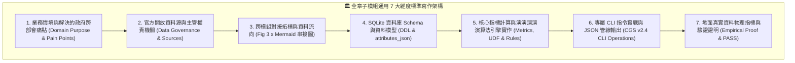

# 📘 3.0 全章子模組撰寫規範與通用 7 大維度架構說明 (03_00_structure_guide.md)

* **專案名稱**：`tw-gov-db` (台灣政府開放資料通用基石對照庫)
* **行政院母專案代號**：`GOV-300`
* **受控版本**：`v0.3.0`
* **歸檔位置**：`events-2026Q3/gov-db-in/tw-gov-db/book/03_submodules/03_00_structure_guide.md`
* **系統工程對齊**：[ontology/schema.sql](../ontology/schema.sql) | [docs/CROSS_AGENCY_INTEROP_GUIDE.md](../docs/CROSS_AGENCY_INTEROP_GUIDE.md)

---

## 🎯 3.0.1 第 3 章資料資產百科圖鑑整體定位

第 3 章是全書最核心的 **「六大核心維度器與通用基石資產圖鑑 (Submodules & Universal Keys Atlas)」**。

台灣政府跨部會開放資料長年深受「機關改制別名難辨、地址門牌結構髒亂、野溪缺乏官方程式碼、統編新舊制驗證繁瑣、日曆農曆時序割裂、以及研究報告案號孤立」等深層撕裂之苦。為徹底避免傳統技術檔案「只列出冷冰冰的 SQL 欄位、缺乏政府業務情境」的通病，本章比照 `tw-fsc-db` 專書第三章之深核架構，採取**「每個子模組獨立成篇」**的模組化寫作方式（`03_10_g01_report_miner.md` 至 `03_60_g40_corporate_indexer.md`）。

全章六大子模組篇章，均嚴格遵循以下 **「通用 7 大維度標準架構」**，將靜態資料表與演演演演演算法引擎昇華為具備解決跨部會實務痛點的政府級知識資產：

*Fig 3.0: 全政府通用基石維度器通用 7 大維度標準寫作架構圖*

---

## 📐 3.0.2 通用 7 大維度標準寫作規範細節

全章六大子模組在撰寫專屬篇章時，均強制包含以下 7 大維度實質內容：

### 1. 業務情境與解決的政府跨部會痛點 (Domain Purpose & Pain Points)
* 解構該維度模組在全政府運作中的核心業務定位（如 GRB 報告案號追蹤、空間門牌轉譯、歷史機關組織樹演進、行政院辦公日曆與農曆節氣、水利署官方與民間野溪雙層拓樸、企業統編雙軌加權檢核與農漁會消歧義）。
* 深入說明該模組具體為跨部會基層公務員、資料分析師、AI 代理人或民間加值開發者解決了哪些長年資訊孤島痛點。

### 2. 官方開放資料源與主管權責機關 (Data Governance & Sources)
* 標明資料集名稱、官方發布機關（如國科會、內政部戶政司/地政司、人事行政總處、經濟部水利署、財政部賦稅署/商工署、農業部）。
* 明確列出官方資料端點、更新機制以及在系統中的入庫策略（權威 Seed 快取、Pass-Through 旁路透傳、定期原子同步）。

### 3. 跨模組對接拓樸與資料流向 (Cross-Module Topology)
* **【強制配置專屬 `Fig 3.x` Mermaid 架構圖】**：清晰繪製該維度器如何與 `tw-gov-db` 母大腦中樞連線，以及如何透過 Direct Import 或 UNIX Pipeline 與其他 2~3 個部會子專案（如農業部 `tw-agro-db`、衛福部 `tw-med-db`、金管會 `tw-fsc-db`、內政部 `tw-moi-db`）進行資料穿透聯防。

### 4. SQLite 資料庫 Schema 與資料模型 (Data Model & Schema)
* 列出該模組對應之實體資料庫（`master_agencies.sqlite`、`universal_keys.sqlite` 或 `report_index.sqlite`）中的實體資料表、索引、外鍵定義與 View。
* 附上完整 SQL `CREATE TABLE` DDL 語法。
* **【必須包含 `attributes_json` 規格定義】**：說明動態擴充欄位的結構與中繼資料。
* **【必須包含一筆真實資料列展示】**：以 JSON 格式展現 100% 地面真實入庫資料樣貌。

### 5. 核心指標計算與演演演演演算法引擎實作 (Metrics, UDF & Rules)
* 詳述該模組的核心演演演演演算法（如 G10 雙向案號碰撞；G20 門牌完整度指標 AIS 與正則解析；G30 JIT 動態組織推導與 MCS 信心度；G40 緊湊農曆干支天文演演演演演算法與工作日判定；G50 `@` 親緣拓樸樹遍歷；G40 除 10 與除 5/10 雙軌統編檢核及農漁會綴詞剝除）。

### 6. 專屬 CLI 指令實戰與 UNIX 管線 (Pipe) 深度串接規範 (CLI & Unix Pipeline Operations)
* 依循 **CGS v2.4 (Pipeline-Native UNIX Standard)** 規範，展示 `./pa gX` 的專屬子命令與參數用法。
* **【強制深入拆解 Unix Pipe 串接原理與實戰場景】**：每一子模組篇章必須詳細闡述其標準輸入 (`stdin`)、標準輸出 (`stdout`) 與診斷流 (`stderr`) 的解耦設計，並包含以下三大 Pipe 維度：
  1. **標準串流接力與非阻塞探測 (`select.select` 0.3s)**：說明如何在沒有終端傳參時，自動優雅探測管道上游輸出（支援純文字行、CSV、TSV 與 JSONL 串流輸入）。
  2. **跨部會多工管道接力範例 (Multi-Stage Pipeline Chains)**：提供結合 `cat`, `echo`, `grep`, `jq`, `xargs` 以及與其他 G 系模組（如 G10 ➔ G30、G20 ➔ G50、G40 ➔ G20）的長管道鏈實戰。
  3. **資料流與日誌分離保證 (Pipeline Purity)**：明確標記何者走 `stdout`（純粹資料 Payload，保證下游程式或 Python 腳本解析不爆錯），何者走 `stderr`（進度百分比、診斷 Log 與審計資訊）。

### 7. 地面真實資料物理指標與驗證證明 (Empirical Proof & PASS)
* 揭露該模組在本地實體資料庫中的真實入庫總筆數（如 G50 1,394 筆水脈、G40 1,801 筆辦公日曆、G30 214 筆組織演進、G20 119 筆行政區劃、G40 農漁會與企業等），100% 杜絕假資料。
* 引用專屬單元測試（`test_g10` 至 `test_g40`）與跨部會整合測試（`test_cross_agency_interop.py`）之 100% 綠燈 PASS 證明。

---

## 🗺️ 3.0.3 六大通用基石子模組篇章索引地圖

| 篇章編號 | 模組代號與完整名稱 | 專屬獨立檔案 | 角色定位與核心資料資產 |
| :--- | :--- | :--- | :--- |
| **3.01** | **`G01` 政府研究計畫與開放資料報告探勘器 (`g01_report_miner`)** | [03_01_g01_report_miner.md](./03_01_g01_report_miner.md) | **【母大腦採集器】** GRB 計畫 57.6 萬筆、國圖 GPN 案號雙向碰撞、全文 PDF 典藏 |
| **3.10** | **`G10` 機關組織圖譜、權責職掌與歷史演進器 (`g10_mandate_indexer`)** | [03_10_g10_mandate_indexer.md](./03_10_g10_mandate_indexer.md) | **【基石一：組織身分】** 8,908 筆機關 OID、處務規程法定職掌、214 筆改制演進、JIT 推導 |
| **3.20** | **`G20` 空間地籍、地址正規化與郵遞區號基石器 (`g20_spatial_indexer`)** | [03_20_g20_spatial_indexer.md](./03_20_g20_spatial_indexer.md) | **【基石二：空間地籍】** 480 筆行政區劃、372 筆郵遞區號、門牌 AIS 指標、標準地籍號 |
| **3.30** | **`G30` 水系流域、水文測站與親緣拓樸維度器 (`g30_hydrology_indexer`)** | [03_30_g30_hydrology_indexer.md](./03_30_g30_hydrology_indexer.md) | **【基石三：自然水文】** WRA-Civ 1,394 條水脈雙層編碼、親緣樹溯源、水情測站綁定 |
| **3.40** | **`G40` 法人統編、企業快取與農漁會消歧義維度器 (`g40_corporate_indexer`)** | [03_40_g40_corporate_indexer.md](./03_40_g40_corporate_indexer.md) | **【基石四：法人企業】** 8 碼統編新舊制雙軌加權檢核、Pass-Through 企業快取、農會消歧義 |
| **3.50** | **`G50` 時間時序、辦公日曆與農曆節氣基石器 (`g50_temporal_indexer`)** | [03_50_g50_temporal_indexer.md](./03_50_g50_temporal_indexer.md) | **【基石五：時間時序】** 16 年 1,801 筆人事總處日曆、工作天判定、純 Python 農曆節氣 |

---

有了這套嚴謹的 7 大維度規範，下一節我們將正式進入 **3.10 G10 政府研究計畫與開放資料報告探勘器** 的獨立專篇！
