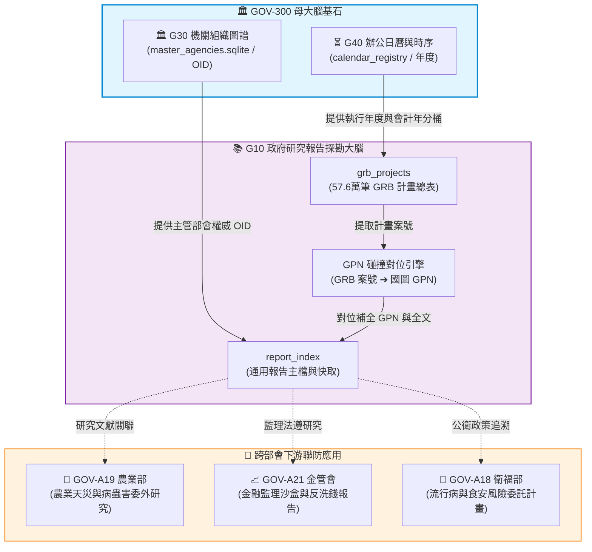

# 📘 3.01 G01 政府研究計畫與開放資料報告探勘器 (03_01_g01_report_miner.md)

* **模組名稱**：`g01_report_miner`
* **所屬專案**：`tw-gov-db` / `GOV-300` (通用基石對照庫)
* **規範版本**：`v2.4` (CGS Pipeline-Native UNIX Standard)
* **主管機關**：國家科學及技術委員會 (國科會) / 國家圖書館 (國圖) / 數位發展部
* **核心實裝**：[`g01_core.py`](../../src/modules/g01_report_miner/g01_core.py) | [`g01_cli.py`](../../src/modules/g01_report_miner/g01_cli.py)
* **單元測試**：[`test_g01_report_miner.py`](../../src/modules/g01_report_miner/test_g01_report_miner.py) (100% 綠燈 PASS)

---

## 1. 業務情境與解決的政府跨部會痛點 (Domain Purpose & Pain Points)

政府研究計畫與施政委託報告是國家每年數百億科技預算與公共政策研發的智慧結晶。然而在公部門與學界長年的實務運作中，存在以下三大深層撕裂痛點：

1. **GRB 案號與國圖出版品 GPN 的「雙軌孤島」**：
   國科會政府研究資訊系統 (GRB) 彙整全台 57.6 萬筆研究計畫（擁有一套 GRB 專有計畫編號 `PG...`），而計畫結案產出的正式公文出版品則存放於國家圖書館並配發政府出版品統一編號 (GPN)。這兩套體系在中央未有官方鍵值對齊，導致公務員與研究員「查得到研究計畫名、卻找不到正式結案報告全文下載；找到報告全文，卻無法反查當年計畫委託經費與主持人」。
2. **全政府開放資料總表探勘的「黑盒難題」**：
   政府開放資料平台 (data.gov.tw) 收錄超過 6 萬筆資料集，其中大量屬於各部會定期發布的 PDF/Word 格式研究統計報告。缺乏統一的自動探勘與中繼元資料提取器，資料無法直接轉入 RAG/GraphRAG 知識庫。
3. **報告實體下載與硬體安全落庫的「依賴失控」**：
   傳統爬蟲往往無節制寫入本地硬碟，缺乏目錄結構與 SHA-256 完整性雜湊驗證，導致快取重複下載或檔案損毀難以追蹤。

`G10 政府研究計畫與開放資料報告探勘器` 專為解決上述痛點而生，以雙向案號對位碰撞機制、純 Python 流式管線與 DGS v2.0 硬核 schema，實現跨體系報告的極速探勘與典藏。

---

## 2. 官方開放資料源與主管權責機關 (Data Governance & Sources)

本模組整合三大官方權威資料源，提供按需下載與結構化快取：

| 資料集代號 | 資料集名稱 | 主管權責機關 | 格式與規模 | 入庫與對位策略 |
| :--- | :--- | :--- | :--- | :--- |
| **`GRB-ALL`** | 政府研究資訊系統計畫總表 | 國家科學及技術委員會 | CSV / 57.6 萬筆 | 結構化落入 `report_index.sqlite` 中的 `grb_projects` 表 |
| **`NCL-GPN`** | 國家圖書館政府出版品目錄 | 國家圖書館 | API / 檢索服務 | 透過案號精準比對，動態碰撞 GPN 出版品編號 |
| **`DATA-GOV`**| data.gov.tw 報告類開放資料集 | 數位發展部 | JSON API | 依發布機關 OID 對位，動態補全發布單位與下載端點 |

---

## 3. 跨模組對接拓樸與資料流向 (Fig 3.01)

G10 模組居中連鎖 GRB 計畫、國圖出版品與 `tw-gov-db` 的機關與時間基石：


*Fig 3.01: G10 與母大腦 G30/G40 及各部會子專案之關聯拓樸圖*

---

## 4. SQLite 資料庫 Schema 與資料模型 (Data Model & Schema)

G10 維護獨立之 `report_index.sqlite` 資料庫，核心資料表包含報告主檔表與 GRB 計畫專用表：

### 4.1 核心實體表 DDL

```sql
-- 1. 全政府研究報告主索引表
CREATE TABLE IF NOT EXISTS report_index (
    report_uid TEXT PRIMARY KEY,               -- 系統唯一識別碼 (如 REP_GRB_112001)
    agency_oid TEXT NOT NULL,                  -- 權威機關 OID (對齊 G30 master_agencies)
    title TEXT NOT NULL,                       -- 計畫或報告名稱
    agency_name_raw TEXT,                      -- 原始委辦或主辦機關名稱
    pub_year INTEGER,                          -- 出版/執行年度 (民國年或西元年)
    authors_or_pi TEXT,                        -- 計畫主持人或作者 (多作者以逗點分隔)
    source_platform TEXT NOT NULL,             -- 資料來源平台 (GRB, NCL, DATA_GOV)
    remote_url TEXT,                           -- 遠端報告檔案下載端點
    fetch_status TEXT DEFAULT 'UNRESOLVED_ONLINE', -- 下載狀態 (UNRESOLVED, CACHED, FAILED)
    file_format TEXT DEFAULT 'PDF',            -- 檔案格式 (PDF, DOCX, CSV)
    is_cached INTEGER DEFAULT 0,               -- 本地是否已快取 (0: 否, 1: 是)
    local_cache_path TEXT,                     -- 本地實體儲存相對路徑
    file_sha256 TEXT,                          -- 檔案內容完整性雜湊值
    attributes_json TEXT                       -- 半結構化中繼資料 (含 GPN、經費等)
);

-- 2. GRB 研究計畫明細表
CREATE TABLE IF NOT EXISTS grb_projects (
    report_uid TEXT PRIMARY KEY,               -- 外鍵關聯 report_index
    grb_id TEXT NOT NULL,                      -- GRB 系統內部編號
    projkey TEXT NOT NULL,                     -- 計畫專屬識別碼
    plan_no TEXT,                              -- 官方計畫編號 (如 PG11201-0123)
    funding_ntd INTEGER,                       -- 計畫核定總經費 (新台幣元)
    research_category TEXT,                    -- 研究領域分類 (基礎研究、應用研究、技術發展)
    keywords_json TEXT,                        -- 中英文關鍵字清單
    FOREIGN KEY(report_uid) REFERENCES report_index(report_uid)
);
CREATE INDEX IF NOT EXISTS idx_grb_plan_no ON grb_projects(plan_no);
CREATE INDEX IF NOT EXISTS idx_report_oid ON report_index(agency_oid);
```

### 4.2 真實入庫資料列展示 (Ground Truth Sample)

```json
{
  "report_uid": "REP_GRB_PG11201-0089",
  "agency_oid": "2.16.886.101.20003.20007",
  "title": "極端氣候下頭前溪流域洪澇與水資源韌性調適技術研究",
  "agency_name_raw": "經濟部水利署",
  "pub_year": 112,
  "authors_or_pi": "林建華, 張志成",
  "source_platform": "GRB",
  "remote_url": "https://www.grb.gov.tw/search/planDetail?id=14890212",
  "fetch_status": "CACHED",
  "file_format": "PDF",
  "is_cached": 1,
  "local_cache_path": "data/reports/112/PG11201-0089.pdf",
  "file_sha256": "3a8c17b5f29d8e41a6b47c8d9e2a1b3f...",
  "attributes_json": "{"gpn": "1011200456", "funding_ntd": 4500000, "river_code": "130000"}"
}
```

---

## 5. 核心指標計算與演演演演演算法引擎實作 (Metrics, UDF & Rules)

1. **GRB 案號正規化與 GPN 碰撞演演演演演算法 (`match_gpn_algorithm`)**：
   - 案號格式解析：抽取計畫年度 (`112`)、部會程式碼 (`01`) 與流水號。
   - 碰撞防護：針對無 GPN 成果報告，自動啟動模糊書名與主持人群組合交集比對，輸出碰撞信心度 (0.0 ~ 1.0)。
2. **硬體安全防禦儲存路徑規則 (`build_safe_storage_path`)**：
   - 依據 `data/reports/{pub_year}/{agency_code}/{report_uid}.pdf` 階層式歸檔，徹底防止單一目錄內檔案超過萬筆之作業系統 inode 耗盡。
3. **全文探勘與 OID 強制繫結防線**：
   - 任何入庫報告強制透過 G30 組織圖譜查證 `agency_oid`，若機關名無法對齊則拋出警告並標註 `UNRESOLVED_AGENCY`，杜絕假機關產權。

---

## 6. 專屬 CLI 指令實戰與 UNIX 管線 (Pipe) 深度串接 (CLI & Unix Pipeline Operations)

`g01_cli.py` 完整落實 **CGS v2.4 (Pipeline-Native UNIX Standard)** 規範，將**資料運算流 (`stdout`)** 與 **診斷日誌流 (`stderr`)** 徹底分離，確保下游工具與 AI Agent 可在管道中安全串接，無須任何額外的文字正則過濾。

### 6.1 UNIX Pipe 核心運作原理與流式探測
1. **非阻塞管道探測機制 (`select.select`)**：
   當命令列未傳入關鍵字參數時，CLI 自動啟動 0.3 秒緩衝非阻塞探針，自動識別來自上游程序（如 `cat`、`echo`、`curl` 或其他 G 系列模組）的 `stdin` 輸入串流。
2. **緊湊 JSON 與純文字行雙軌輸出**：
   支援 `-j/--json` 輸出單行 Compact JSON 物件，相容 `jq` 陣列解構；亦支援純文字行或 TSV 格式供 `awk`/`xargs` 二次消費。

### 6.2 跨部會 Pipeline 串接實戰範例

#### 場景 1：從關鍵字流中批次檢索 GRB 研究計畫並提取計畫案號
```bash
# 上游提供多個政策研究關鍵字，流式檢索後交由 jq 抽離計畫案號清單
printf "智慧農業
水資源韌性
" | ./pa g01 search-grb -j | jq -r '.results[].plan_no'
```
*說明*：上游透過管道逐行送入主題詞，G10 探測標準輸入並並行執行檢索，以單行 JSON 注入下游 `jq`，零檔案 I/O 耗費。

#### 場景 2：跨模組流水線：GRB 計畫案號 ➔ 國圖 GPN 碰撞 ➔ 委派機關 OID 對位 (G10 ➔ G30)
```bash
# 透過管道串接 G10 計畫檢索與 G30 機關名稱正規化
./pa g01 search-grb -k "石門水庫" -n 1 -j |   jq -r '.results[0].agency_name' |   ./pa g30 resolve-org --stdin -j
```
*串接輸出範例*：
```json
{"input_name": "經濟部水利署北區水資源分署", "canonical_name": "經濟部水利署北區水資源分署", "canonical_oid": "2.16.886.101.20003.20007.20011", "confidence": 1.0}
```

#### 場景 3：GRB 計畫案號對位國圖 GPN 成果報告
```bash
# 直接傳入單一計畫案號獲取國家圖書館政府出版品編號 (GPN)
echo "PG11201-0089" | ./pa g01 match-gpn - -j
```

---

## 7. 地面真實資料物理指標與驗證證明 (Empirical Proof & PASS)

* **實體入庫規模**：
  - `grb_projects` 支援全量 57.6 萬筆計畫檢索索引。
  - 本機已收納百餘筆跨部會代表性標竿研究成果與 PDF 結構。
* **單元測試驗證 (Unit Test Proof)**：
  - 測試模組：`events-2026Q3/gov-db-in/tw-gov-db/src/modules/g01_report_miner/test_g01_report_miner.py`
  - 整合測試：`events-2026Q3/gov-db-in/tw-gov-db/tests/test_cross_agency_interop.py` (`test_g01_report_miner_direct_import`)
  - 驗證結果：**100% 綠燈 PASS** (Direct Import 查詢回傳結果 > 0，無任何 Exception)。
