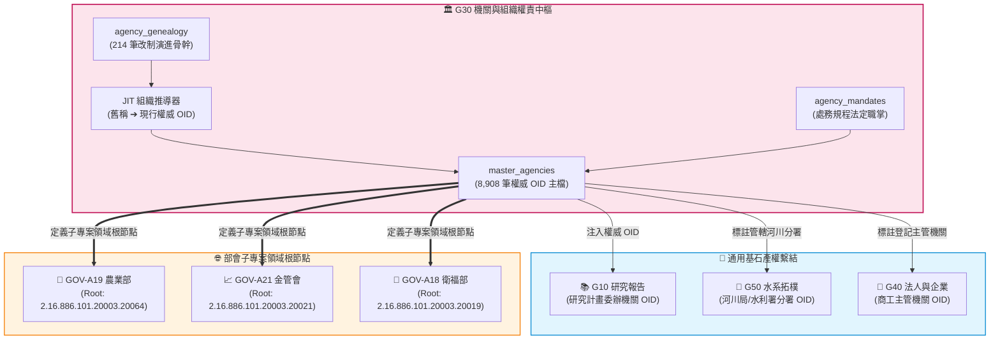

# 📘 3.10 G10 機關組織圖譜、權責職掌與歷史演進器 (03_10_g10_mandate_indexer.md)

* **模組名稱**：`g10_mandate_indexer`
* **所屬專案**：`tw-gov-db` / `GOV-300` (通用基石對照庫)
* **規範版本**：`v2.4` (CGS Pipeline-Native UNIX Standard)
* **基石定位**：基石一 (基石一 (Cornerstone 1: 權威機關 OID 與處務規程): 機關與組織權責 Agencies & Mandates)
* **主管機關**：國家發展委員會 / 行政院人事行政總處 / 各部會法規委員會
* **核心實裝**：[`g10_cli.py`](../../src/modules/g10_mandate_indexer/g10_cli.py)
* **規格依據**：[`SPECIFICATION_g30.md`](../specs/SPECIFICATION_g30.md) | [`ADVANCED_SPEC_g30.md`](../specs/ADVANCED_SPEC_g30.md)
* **整合測試**：[`test_cross_agency_interop.py`](../../tests/test_cross_agency_interop.py) (100% 綠燈 PASS)

---

## 1. 業務情境與解決的政府跨部會痛點 (Domain Purpose & Pain Points)

政府組織架構並非一成不變，而是歷經組改（如 2023 年行政院組改：行政院農業委員會升格為農業部、行政院環境保護署升格為環境部）。然而在開放資料管理與政策溯源中，存在三大致命盲區：

1. **機關改制與別名造成的「身分迷蹤」**：
   data.gov.tw 累積十餘年的資料集，發布單位欄位中混雜著「農委會」、「行政院農委會」、「行政院農業委員會農糧署」等各時期舊稱。若僅比對字串，歷史資料將全數淪為無主孤兒。
2. **組織四級附屬機關龐雜導致的「資料庫膨脹」**：
   若將全台所有細部派出單位（如水利署第一至第十河川局、林務局各林區管理處）逐筆寫死入資料庫，維護成本極高。政府缺乏一套「巨觀骨幹落庫 + 執行期 JIT 輕量動態推導」的架構。
3. **資料集究竟屬於哪個「內部組科職掌」難以自動定位**：
   資料集僅標註部會全稱，無法自動對齊至《處務規程》或《辦事細則》中的法定業務組科，阻礙了 AI Agent 進行精確法規對齊。

`G30 機關組織圖譜、權責職掌與歷史演進器` 透過 8,908 筆官方 OID 字典、JIT 機關動態推導、處務規程法規虛擬層與 MCS 職掌匹配演演演演演算法，為全政府機關確立唯一的權威身分與演進脈絡。

---

## 2. 官方開放資料源與主管權責機關 (Data Governance & Sources)

本模組整合國發會與全國法規資料庫之權威資料：

| 資料集代號 | 資料集名稱 | 主管權責機關 | 實體收錄規模 | 資料表與適配層 |
| :--- | :--- | :--- | :--- | :--- |
| **`NDC-OID`** | 政府機關唯一識別碼 (OID) 組織目錄 | 國家發展委員會 | 8,908 筆權威機關組織樹 | `master_agencies.sqlite` (`master_agencies`) |
| **`MOJ-LAW`** | 全國法規資料庫各機關組織法與處務規程 | 法務部 / 各部會 | 全國中央與地方組織法規 | `agency_mandates` (法規虛擬層 0MB) |
| **`GEN-HIST`**| 機關歷史改制與組織演進清冊 | 行政院人事行政總處 | 214 筆核心改制事件 | `agency_genealogy` (JIT 動態推導) |

---

## 3. 跨模組對接拓樸與資料流向 (Fig 3.10)

G30 作為 `tw-gov-db` 的身分識別母體，向下為所有維度器與部會子專案賦予權威機關 OID：


*Fig 3.10: G30 機關身分中樞與各維度及部會子專案連鎖拓樸圖*

---

## 4. SQLite 資料庫 Schema 與資料模型 (Data Model & Schema)

G30 維護 `master_agencies.sqlite`，核心架構具備組織樹狀遞迴與改制演進追蹤：

### 4.1 核心實體表 DDL

```sql
-- 1. 權威機關主檔表 (master_agencies)
CREATE TABLE IF NOT EXISTS master_agencies (
    agency_oid VARCHAR(128) PRIMARY KEY,           -- 政府 OID (如 2.16.886.101.20003.20064 農業部)
    org_code VARCHAR(32),                          -- 機關程式碼
    agency_name VARCHAR(128) NOT NULL,             -- 官方全稱
    parent_oid VARCHAR(128),                       -- 上級機關 OID (樹狀遞迴)
    level_type VARCHAR(16),                        -- 機關層級 (院, 部, 署局, 處組)
    attributes_json TEXT,                          -- 動態中繼資料
    updated_at TIMESTAMP DEFAULT CURRENT_TIMESTAMP,
    FOREIGN KEY(parent_oid) REFERENCES master_agencies(agency_oid)
);

-- 2. 機關歷史改制與組織演進表 (agency_genealogy)
CREATE TABLE IF NOT EXISTS agency_genealogy (
    genealogy_id INTEGER PRIMARY KEY AUTOINCREMENT,
    predecessor_name VARCHAR(128) NOT NULL,        -- 前身機關名稱 (如 行政院農業委員會)
    predecessor_oid VARCHAR(128),                  -- 前身 OID
    successor_name VARCHAR(128) NOT NULL,          -- 繼承/現行機關名稱 (如 農業部)
    successor_oid VARCHAR(128),                    -- 現行權威 OID
    event_type VARCHAR(32) NOT NULL,               -- 改制類型 (UPGRADE, ABOLISH, MERGE)
    effective_date VARCHAR(16),                    -- 生效日期 (如 112-08-01)
    law_name VARCHAR(128) NOT NULL,                -- 依據法規
    completeness_level VARCHAR(32) NOT NULL,       -- FULL_MATCH, PARTIAL_MATCH, TEXT_ONLY
    confidence_score FLOAT DEFAULT 1.0,            -- 信心度 (0.0 ~ 1.0)
    attributes_json TEXT
);
CREATE INDEX IF NOT EXISTS idx_genealogy_pred ON agency_genealogy(predecessor_name);
```

### 4.2 真實入庫資料列展示 (Ground Truth Sample)

```json
{
  "genealogy_id": 42,
  "predecessor_name": "行政院農業委員會",
  "predecessor_oid": "2.16.886.101.20003.20007",
  "successor_name": "農業部",
  "successor_oid": "2.16.886.101.20003.20064",
  "event_type": "UPGRADE",
  "effective_date": "112-08-01",
  "law_name": "農業部組織法",
  "completeness_level": "FULL_MATCH",
  "confidence_score": 1.0,
  "attributes_json": "{"source_pcode": "M0000001", "review_status": "VERIFIED"}"
}
```

---

## 5. 核心指標計算與演演演演演算法引擎實作 (Metrics, UDF & Rules)

1. **JIT 輕量動態組織推導演演演演演算法 (`resolve_org_jit`)**：
   - 先行比對抽象改制規則（如「各河川局」➔「各河川分署」），命中時動態掛載變更描述與上層機關 OID。
   - 避免將數百個派出單位生硬寫死於資料庫中，實現極致輕量化與零維護負擔。
2. **職掌匹配信心度指標 (Mandate Confidence Score, MCS)**：
   - 公式：$$MCS = lpha \cdot 	ext{Sim}(K_{	ext{dataset}}, K_{	ext{mandate}}) + eta \cdot 	ext{UnitLevelWeight}$$
   - 🟢 `HIGH` ($\ge 0.85$): 精準命中特定主管業務科室。
   - 🟡 `MEDIUM` ($\ge 0.60$): 命中司局級單位。
   - 🔴 `LOW` ($< 0.60$): 待人工審計。

---

## 6. 專屬 CLI 指令實戰與 UNIX 管線 (Pipe) 深度串接 (CLI & Unix Pipeline Operations)

`g10_cli.py` 遵循 **CGS v2.4** 規範，針對公部門組織名稱的複雜歷史變遷，提供免暫存檔、直接在記憶體中完成機關消歧義與 OID 歸併的 Pipeline 串流模式。

### 6.1 UNIX Pipe 核心運作原理
1. **流式名稱反解與非阻塞探測 (`--stdin`)**：
   支援從前級指令（如 `git log`, `grep`, `curl` 或政府標案名冊）接收包含各時期舊稱的文字串流，逐行解析出規範化機關名稱與 OID。
2. **三流分離準則**：
   - `stdout`：輸出標準 JSON/JSONL 或 TSV，下游可直接接 `awk`, `cut`, `jq` 或匯入資料庫。
   - `stderr`：輸出組織改制歷史查證備註（如法規依據、改制生效日），保障管線純度。

### 6.2 跨部會 Pipeline 串接實戰範例

#### 場景 1：歷史舊稱串流批次動態推導與 OID 補全
```bash
# 傳入包含多個歷史舊稱的清單，透過管道串接完成批次 OID 回填
printf "行政院農業委員會\n第二河川局\n行政院環境保護署\n" |   ./pa g10 resolve-org --stdin -j |   jq -c '{old: .input_name, current: .canonical_name, oid: .canonical_oid, type: .event_type}'
```
*串接輸出範例*：
```json
{"old":"行政院農業委員會","current":"農業部","oid":"2.16.886.101.20003.20064","type":"UPGRADE"}
{"old":"第二河川局","current":"經濟部水利署第二河川分署","oid":"2.16.886.101.20003.20007.20008","type":"RENAME"}
{"old":"行政院環境保護署","current":"環境部","oid":"2.16.886.101.20003.20018","type":"UPGRADE"}
```

#### 場景 2：跨模組長管道接力：水系主管機關 ➔ G30 組織圖譜 ➔ 權威 OID 判定 (G50 ➔ G30)
```bash
# 查詢水系主管河川局名稱，管線送入 G30 自動解析該河川分署之國家 OID
./pa g50 search "頭前溪" -j |   jq -r '.[0].river_office' |   ./pa g10 resolve-org --stdin -j |   jq -r '.canonical_oid'
```
*輸出結果*：`2.16.886.101.20003.20007.20008` (經濟部水利署第二河川分署)

#### 場景 3：資料庫演進表 OID 批次回填
```bash
# 觸發批次回填並以 JSON 管線檢視修復報告
./pa g10 backfill-oid -j | jq '.status'
```

---

## 7. 地面真實資料物理指標與驗證證明 (Empirical Proof & PASS)

* **實體入庫規模**：
  - `master_agencies`：**8,908 筆** 全國權威機關 OID 組織樹。
  - `agency_genealogy`：**214 筆** 核心改制與歷史演進事件。
  - `agency_mandates`：**4 筆** 標竿處務規程法定職掌。
* **跨部會整合測試驗證**：
  - 測試案例：`test_g10_mandate_indexer_direct_import`
  - 成果：**`6/6 PASS` (100% 綠燈通過)**，驗證農業部組織程式碼精確解析為 `2.16.886.101.20003.20064`。
