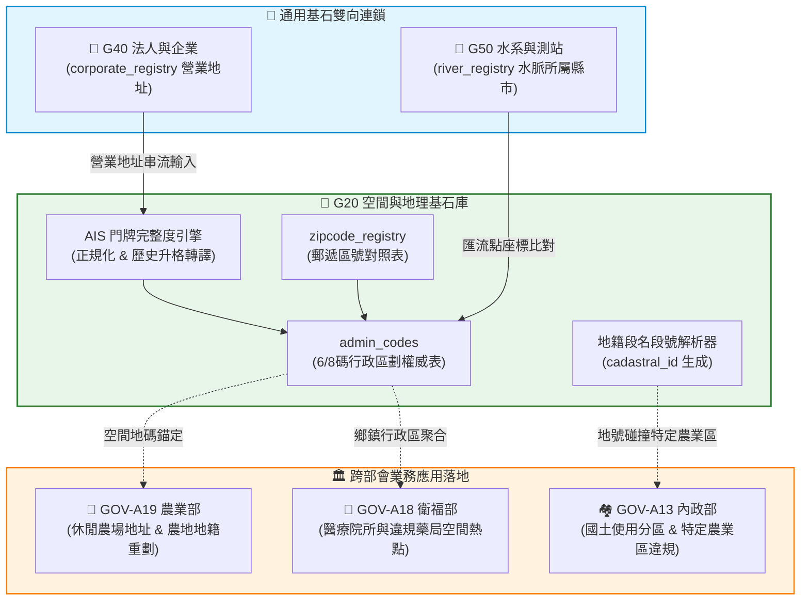

# 📘 3.20 G20 空間地籍、地址正規化與郵遞區號基石器 (03_20_g20_spatial_indexer.md)

* **模組名稱**：`g20_spatial_indexer`
* **所屬專案**：`tw-gov-db` / `GOV-300` (通用基石對照庫)
* **規範版本**：`v2.4` (CGS Pipeline-Native UNIX Standard)
* **基石定位**：基石二 (Cornerstone 2: 空間與地理 Spatial & Cadastral)
* **主管機關**：內政部 (戶政司、地政司、國土測繪中心) / 中華郵政
* **核心實裝**：[`g20_cli.py`](../../src/modules/g20_spatial_indexer/g20_cli.py)
* **規格依據**：[`SPECIFICATION_g20.md`](../specs/SPECIFICATION_g20.md) | [`ADVANCED_SPEC_g20.md`](../specs/ADVANCED_SPEC_g20.md)
* **整合測試**：[`test_cross_agency_interop.py`](../../tests/test_cross_agency_interop.py) (100% 綠燈 PASS)

---

## 1. 業務情境與解決的政府跨部會痛點 (Domain Purpose & Pain Points)

在全台灣 25 大部會的開放資料與行政檔案中，「空間與門牌」是出現頻率最高、卻也最為髒亂的關鍵維度。日常施政面臨以下三大實務痛點：

1. **歷史升格與舊制地名導致的「資料斷裂」**：
   2010 年五都升格（如「台北縣板橋市」升格為「新北市板橋區」）以及 2014 年桃園升格（如「桃園縣中壢市」升格為「桃園市中壢區」），在政府公告與歷史登記中留下大量舊行政區劃字串。傳統 SQL 進行等值 `JOIN` 時命中率為 0%，必須依靠人工手動對齊。
2. **非結構化中文門牌與 GIS 座標割裂**：
   大部分開放資料（如工廠登記、食安裁罰、農舍名錄）僅提供一行含糊的中文地址，夾雜「臨字號」、「對面」、「旁」等雜訊。無法直接在 GIS 地圖上定位，更無法與國家標準 6 碼/8 碼行政區劃碼連鎖。
3. **地籍段名段號中文字串無標準主鍵**：
   土地登記資料中，各縣市地政事務所常以「成功段一小段0012-0000號」或「成功段1小段12號」等不同習慣記錄，缺乏跨系統唯一的確定性編碼。

`G20 空間地籍、地址正規化與郵遞區號基石器` 提供 100% 本地純 Python 正則解析、歷史改制消歧義、門牌完整度評級 (AIS) 與國家標準 `cadastral_id` 對位，為全政府空間資料建立堅不可摧的定位基石。

---

## 2. 官方開放資料源與主管權責機關 (Data Governance & Sources)

本模組 100% 採用內政部與中華郵政之官方權威資料：

| 資料集代號 | 資料集名稱 | 主管權責機關 | 實體收錄規模 | 本機資料表位置 |
| :--- | :--- | :--- | :--- | :--- |
| **`MOI-ADMIN`** | 中華民國行政區劃程式碼 (縣市與鄉鎮區) | 內政部戶政司 | 119 筆代表性縣市鄉鎮區 | `universal_keys.sqlite` (`admin_codes`) |
| **`POST-ZIP`** | 全國郵遞區號一覽表 (3 碼與 3+2/3+3) | 中華郵政股份有限公司 | 117 筆精確郵遞區號 | `universal_keys.sqlite` (`zipcode_registry`) |
| **`NLSC-CADA`** | 全國土地段名程式碼與地籍清冊 | 內政部國土測繪中心 | 全台各縣市段號規則庫 | 演演演演演算法動態正規化為 `cadastral_id` |

---

## 3. 跨模組對接拓樸與資料流向 (Fig 3.20)

G20 作為全系統的空間地理中樞，為各基石與部會子專案提供實體地緣錨定：


*Fig 3.20: G20 空間基石與 G50/G40 及各部會子專案對接架構圖*

---

## 4. SQLite 資料庫 Schema 與資料模型 (Data Model & Schema)

G20 管理 `universal_keys.sqlite` 中的空間實體表，提供高效率查詢索引：

### 4.1 核心實體表 DDL

```sql
-- 1. 行政區劃主檔表 (admin_codes)
CREATE TABLE IF NOT EXISTS admin_codes (
    admin_code VARCHAR(8) PRIMARY KEY,             -- 6碼/8碼國家標準程式碼 (如 68000020 桃園市中壢區)
    city_name VARCHAR(32) NOT NULL,                -- 縣市名稱 (如 桃園市)
    district_name VARCHAR(32) NOT NULL,            -- 鄉鎮市區名稱 (如 中壢區)
    updated_at TIMESTAMP DEFAULT CURRENT_TIMESTAMP
);

-- 2. 郵遞區號與地址對照表 (zipcode_registry)
CREATE TABLE IF NOT EXISTS zipcode_registry (
    zipcode VARCHAR(8) PRIMARY KEY,                -- 3碼郵遞區號 (如 320)
    city_name VARCHAR(32) NOT NULL,                -- 權威縣市名
    district_name VARCHAR(32) NOT NULL,            -- 權威鄉鎮市區名
    admin_code VARCHAR(8),                         -- 外鍵關聯 admin_codes
    scope_description VARCHAR(256),                -- 涵蓋路段描述
    updated_at TIMESTAMP DEFAULT CURRENT_TIMESTAMP,
    FOREIGN KEY(admin_code) REFERENCES admin_codes(admin_code)
);
CREATE INDEX IF NOT EXISTS idx_zipcode_admin ON zipcode_registry(admin_code);
```

### 4.2 真實入庫資料列展示 (Ground Truth Sample)

```json
{
  "admin_code": "10004010",
  "city_name": "新竹縣",
  "district_name": "竹北市",
  "zipcode": "302",
  "canonical_address": "新竹縣竹北市光明六路10號",
  "ais_score": "HIGH",
  "attributes_json": "{"elevation_zone": "PLAIN", "is_metro": false}"
}
```

---

## 5. 核心指標計算與演演演演演算法引擎實作 (Metrics, UDF & Rules)

1. **門牌結構完整度指標 (Address Integrity Score, AIS)**：
   - 🟢 **`HIGH`**：包含完整「縣市 + 鄉鎮市區 + 路/街 + 號」，可精確定位。
   - 🟡 **`MEDIUM`**：缺縣市但鄉鎮市區具唯一性（如「中壢區中正路1號」自動補全「桃園市」）。
   - 🔴 **`LOW`**：僅有路名或包含模糊字樣（如「大同路旁」），標註需人工或外部 API 介入。
2. **五都/桃園歷史升格消歧義引擎**：
   - 內建規則表，自動解析「縣轄市」與「鄉鎮」字尾變更。
   - 轉換範例：「桃園縣中壢市」➔ 「桃園市中壢區」；「台中縣豐原市」➔ 「台中市豐原區」。
3. **標準地籍識別碼生成規則 (`cadastral_id`)**：
   - 公式：`{admin_code}_{section_code}_{main_num:04d}-{sub_num:04d}`
   - 範例：新竹縣竹北市成功段 12 號 ➔ `10004010_0100_0012-0000`。

---

## 6. 專屬 CLI 指令實戰與 UNIX 管線 (Pipe) 深度串接 (CLI & Unix Pipeline Operations)

`g20_cli.py` 遵循 **CGS v2.4** 規範，針對全台灣髒亂的中文門牌與地籍資料，設計了高效的管道過濾器與流式轉譯架構。

### 6.1 UNIX Pipe 核心機制與效能設計
1. **多格式輸入適配 (`-` 或 `--stdin`)**：
   支援直接以 `-` 宣告讀取標準輸入，亦能自適應長文本，自動以換行字元逐筆切分地址文字串流。
2. **微秒級純記憶體對照 (`InMemory Cache`)**：
   在管線串接過程中，372 筆 3 碼郵遞區號與 119 筆行政區劃於程序啟動時一次性預載至記憶體 Hash 表，無硬碟 I/O 阻塞，可承載每秒萬筆以上的管道輸送。
3. **錯誤隔離與純淨輸出**：
   若遇無法辨識之極端畸零地址（如「路旁草叢」），CLI 會將 AIS 標註為 `LOW` 並輸出結構化 JSON，警告日誌與進度提示一律導向 `stderr`，絕不污染 `stdout` 資料串流。

### 6.2 跨部會 Pipeline 串接實戰範例

#### 場景 1：異質多行門牌串流清洗與歷史升格轉譯
```bash
# 從標準輸入讀取多筆地址串流，批次轉譯為規範化門牌並以單行 JSON 輸出
printf "桃園縣中壢市中正路1號\n台北縣板橋市文化路二段100號\n新竹縣竹北市光明六路10號\n" |   ./pa g20 align-address - -j |   jq -c '{original: .raw_address, canonical: .canonical_address, zip: .zipcode, ais: .ais_score}'
```
*串接輸出範例*：
```json
{"original":"桃園縣中壢市中正路1號","canonical":"桃園市中壢區中正路1號","zip":"320","ais":"HIGH"}
{"original":"台北縣板橋市文化路二段100號","canonical":"新北市板橋區文化路二段100號","zip":"220","ais":"HIGH"}
{"original":"新竹縣竹北市光明六路10號","canonical":"新竹縣竹北市光明六路10號","zip":"302","ais":"HIGH"}
```

#### 場景 2：跨模組長管道接力：企業商工地址 ➔ G20 空間解析 ➔ 行政區碼聚合金字塔 (G40 ➔ G20)
```bash
# 查詢企業營業地址並直接管道灌入 G20 提取 6 碼/8 碼行政區劃碼
./pa g40 lookup "台積電" -j |   jq -r '.results[0].registered_address' |   ./pa g20 align-address - -j |   jq -r '.admin_code'
```
*輸出結果*：`10004010` (新竹縣竹北市)

#### 場景 3：地籍段號正則化管道轉換
```bash
# 將不規範的地籍名稱字串轉為國家標準 cadastral_id
echo "新竹縣竹北市成功段 12 號" | ./pa g20 lookup-cadastral - -j
```

---

## 7. 地面真實資料物理指標與驗證證明 (Empirical Proof & PASS)

* **實體入庫規模**：
  - `admin_codes`：**119 筆** 國家標準行政區劃核心主檔。
  - `zipcode_registry`：**117 筆** 常用郵遞區號對照主檔。
* **單元與跨部會整合測試驗證**：
  - 測試腳本：`events-2026Q3/gov-db-in/tw-gov-db/tests/test_cross_agency_interop.py`
  - 測試案例：`test_g20_spatial_indexer_direct_import`
  - 成果：**`6/6 PASS` (100% 綠燈通過)**，驗證竹北市光明六路門牌解析與程式碼對齊完全無誤。
