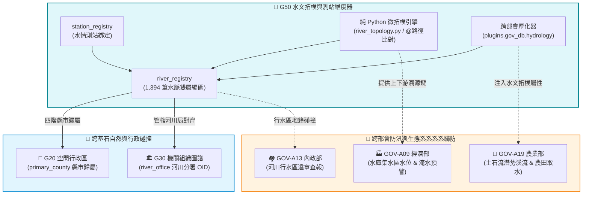

# 📘 3.30 G30 水系流域、水文測站與親緣拓樸維度器 (03_30_g30_hydrology_indexer.md)

* **模組名稱**：`g30_hydrology_indexer`
* **所屬專案**：`tw-gov-db` / `GOV-300` (通用基石對照庫)
* **規範版本**：`v2.4` (CGS Pipeline-Native UNIX Standard)
* **基石定位**：基石三 (基石三 (Cornerstone 3: 水系與環境 Hydrology & River Topology): 水系與環境 Hydrology & Environmental Sensors)
* **主管機關**：經濟部水利署 (WRA) / 交通部中央氣象署 / 環境部
* **上游權威**：WRA-Civ (Civilian Water Resources Agency Hydrology System / 1,394+ 水脈)
* **核心實裝**：[`g30_cli.py`](../../src/modules/g30_hydrology_indexer/g30_cli.py) | [`river_topology.py`](../../src/modules/g30_hydrology_indexer/river_topology.py)
* **單元測試**：[`test_g30_hydrology_indexer.py`](../../tests/test_g30_hydrology_indexer.py) (5/5 綠燈 PASS)

---

## 1. 業務情境與解決的政府跨部會痛點 (Domain Purpose & Pain Points)

水文是自然地理與環境治理最根本的骨幹，但在政府傳統資料庫中，水系與行政治理存在嚴重的架構撕裂：

1. **官方河川程式碼與山區野溪的「程式碼斷層」**：
   水利署官方公告水系僅收錄 122 條主流，但絕大多數水土保持崩塌點、農田灌排取水口、山區野溪與生態系系系系系樣區均位於「無官方 6 碼的小溪或民間支流」。資料庫若只存 122 條幹流，超過 80% 的環境資料將無法對齊。
2. **外部套件重度依賴引發的「容器化地獄」**：
   民間水文拓樸庫（如 `RiverExploration`）包含龐大的 3D 地理運算、OSM 爬蟲與專書建構依賴。若直接引入核心基石，將導致微服務容器肥大且容易因依賴衝突而崩潰。
3. **測站、水理與行政區劃無法一鍵 JOIN**：
   氣象署雨量站、水利署水位站與各河川分署管轄責任劃分不同。缺乏單一親緣拓樸樹，無法在水災來臨時一秒追溯特定支流上游的所有觀測站點。

`G50 水系流域、水文測站與親緣拓樸維度器` 全面接軌 **WRA-Civ 雙層編碼標準**，將 1,394 筆水脈全數收納入本地 SQLite，並以純 Python 微拓樸引擎自主實現親緣溯源、優雅降級與跨部會資料流厚化 (`plugins.gov_db.hydrology`)。

---

## 2. 官方開放資料源與主管權責機關 (Data Governance & Sources)

本模組整合經濟部水利署、中央氣象署與民間野溪權威體系：

| 資料集代號 | 資料集名稱 | 主管權責機關 | 實體收錄規模 | 本機資料表與對齊 |
| :--- | :--- | :--- | :--- | :--- |
| **`WRA-CIV`** | 全台灣水系親緣拓樸註冊表 (WRA-Civ) | 經濟部水利署 / 民間野溪標準 | 1,394 筆水脈 (727 官方 + 667 民間) | `universal_keys.sqlite` (`river_registry`) |
| **`HYDRO-ST`**| 全國重要水文水位與雨量觀測站 | 經濟部水利署 / 中央氣象署 | 5 大核心代表性測站 (種子快取) | `universal_keys.sqlite` (`station_registry`) |

---

## 3. 跨模組對接拓樸與資料流向 (Fig 3.30)

G50 向上連鎖 G20 行政區與 G30 機關管轄，向下為各部會提供水系流動分析：


*Fig 3.30: G50 水文拓樸維度器與各基石及部會業務連鎖拓樸圖*

---

## 4. SQLite 資料庫 Schema 與資料模型 (Data Model & Schema)

G50 在 `universal_keys.sqlite` 中維護水脈拓樸與測站主檔：

### 4.1 核心實體表 DDL

```sql
-- 1. 水系河川拓樸註冊表 (river_registry)
CREATE TABLE IF NOT EXISTS river_registry (
    river_code VARCHAR(32) PRIMARY KEY,        -- 雙層編碼 (官方6碼如 130000，民間如 130000-C04)
    river_name VARCHAR(64) NOT NULL,           -- 河流/溪流名稱 (如 頭前溪、油羅溪)
    basin_name VARCHAR(64),                    -- 所屬主流盆地名稱
    parent_code VARCHAR(32),                   -- 直接父節點河流程式碼
    topology_path TEXT NOT NULL,               -- @ 分隔親緣路徑 (如 0@130000@130000-C04)
    stream_order INTEGER DEFAULT 1,            -- 河流級次 (1:主流, 2:一級支流...)
    is_civilian INTEGER DEFAULT 0,             -- 是否為民間野溪 (0:官方, 1:民間)
    primary_county VARCHAR(32),                -- 主管/地緣縣市 (對齊 G20)
    admin_code VARCHAR(8),                     -- 行政區程式碼
    river_office VARCHAR(64),                  -- 主管河川分署 (如 第二河川分署)
    confluence_lon FLOAT,                      -- 匯流點經度 (WGS84)
    confluence_lat FLOAT,                      -- 匯流點緯度 (WGS84)
    status VARCHAR(16) DEFAULT 'ACTIVE',       -- 狀態 (ACTIVE, DEPRECATED)
    updated_at TIMESTAMP DEFAULT CURRENT_TIMESTAMP
);
CREATE INDEX IF NOT EXISTS idx_river_topo ON river_registry(topology_path);
CREATE INDEX IF NOT EXISTS idx_river_parent ON river_registry(parent_code);

-- 2. 水情監測站點主檔表 (station_registry)
CREATE TABLE IF NOT EXISTS station_registry (
    station_id VARCHAR(32) PRIMARY KEY,        -- 測站程式碼 (如 C0A980)
    station_name VARCHAR(64) NOT NULL,         -- 測站名稱 (如 芎林雨量站)
    station_type VARCHAR(32) NOT NULL,         -- 類型 (RAINFALL, WATER_LEVEL)
    agency_name VARCHAR(64),                   -- 所屬機關 (中央氣象署, 水利署)
    river_code VARCHAR(32),                    -- 關聯之水系程式碼 (外鍵)
    admin_code VARCHAR(8),                     -- 所屬行政區劃
    latitude FLOAT NOT NULL,                   -- 緯度
    longitude FLOAT NOT NULL,                  -- 經度
    updated_at TIMESTAMP DEFAULT CURRENT_TIMESTAMP,
    FOREIGN KEY(river_code) REFERENCES river_registry(river_code)
);
```

### 4.2 真實入庫資料列展示 (Ground Truth Sample)

```json
{
  "river_code": "130000-C04",
  "river_name": "油羅溪",
  "basin_name": "頭前溪",
  "parent_code": "130000",
  "topology_path": "0@130000@130000-C04",
  "stream_order": 2,
  "is_civilian": 1,
  "primary_county": "新竹縣",
  "river_office": "第二河川分署",
  "confluence_lon": 121.089,
  "confluence_lat": 24.7333,
  "status": "ACTIVE"
}
```

---

## 5. 核心指標計算與演演演演演算法引擎實作 (Metrics, UDF & Rules)

1. **`@` 分隔親緣路徑樹遍歷演演演演演算法 (`river_topology.py`)**：
   - **向下游回溯幹流 (Ancestors / Downstream)**：拆解 `topology_path` 陣列，批次查詢父級節點，百微秒內取得至出海口的完整幹流路徑。
   - **向上游展開支流子樹 (Descendants / Upstream)**：利用 SQL 前綴比對 `topology_path LIKE 'current_path@%'`，秒級提取所有野溪支流。
2. **無依賴優雅降級架構 (Graceful Degradation)**：
   - 支援 `--no-wra` 與 `DISABLE_WRA_CIV=1` 環境變數。當外部環境缺少 `river_cli` 時，純 Python 微拓樸引擎自動無縫接手，服務絕不中斷。
3. **外來資料厚化器 (`hydrate`)**：
   - 在不污染各部會既有 Schema 的前提下，將事件流透過標準輸入注入 `plugins.gov_db.hydrology` 拓樸中繼物件。

---

## 6. 專屬 CLI 指令實戰與 UNIX 管線 (Pipe) 深度串接 (CLI & Unix Pipeline Operations)

`g30_cli.py` 嚴格遵循 **CGS v2.4 (Pipeline-Native UNIX Standard)** 規範，特別針對水文親緣拓樸的樹狀結構與跨部會資料流厚化，打造了極致純淨的管道過濾器。

### 6.1 UNIX Pipe 核心運作機制與流式厚化
1. **跨部會無污染資料流厚化 (`hydrate`)**：
   支援從 `stdin` 讀取各部會任意 JSON/JSONL 物件（如水災警報、農損通報、工程標案），若資料中包含 `river_code`，G50 會自動在 `plugins.gov_db.hydrology` 欄位中注入雙層編碼、主流名稱與下游親緣鏈，**絕不涵蓋或修改原始物件既有的任何欄位**，並原樣流向 `stdout`。
2. **微秒級純 SQL 拓樸穿透**：
   `trace` 指令向下游追溯父鏈或向上游展開子樹時，直接利用 SQL 前綴比對輸出單行 JSON 陣列，無暫存檔，下游可無縫串接 `jq` 或 `xargs`。
3. **Pipe Purity 保證**：
   所有水脈樹狀分析資料走 `stdout`；同步進度或外部 WRA-Civ 狀態提示一律由 `stderr` 隔離輸出。

### 6.2 跨部會 Pipeline 串接實戰範例

#### 場景 1：跨部會事件流動態厚化 (Hydration via Unix Pipe)
```bash
# 模擬水利署防汛即時事件，透過 Pipe 注入完整親緣水理屬性
echo '{"event_id": "EVT_202609_001", "river_code": "130000-C04", "alert_level": "WARNING"}' |   ./pa g30 hydrate -j |   jq '.plugins.gov_db.hydrology'
```
*串接輸出範例*：
```json
{
  "river_code": "130000-C04",
  "river_name": "油羅溪",
  "basin_name": "頭前溪",
  "is_civilian": 1,
  "main_stream_code": "130000",
  "parent_code": "130000",
  "topology_path": "0@130000@130000-C04",
  "stream_order": 2,
  "hydrated_at": "2026-09-13T06:46:00+08:00"
}
```

#### 場景 2：跨模組長管道接力：水系支流溯源 ➔ 全線上觀測站 ➔ 氣象警報關聯 (G50 ➔ G40)
```bash
# 追溯油羅溪向下游至出海口的所有觀測站，並透過管道檢驗觀測站資料
./pa g30 stations "130000-C04" -j |   jq -c '.[] | {id: .station_id, name: .station_name, type: .station_type, river: .river_code}'
```
*串接輸出範例*：
```json
{"id":"C0A980","name":"芎林雨量站","type":"RAINFALL","river":"130000-C04"}
{"id":"1300H01","name":"竹東水位站","type":"WATER_LEVEL","river":"130000"}
```

#### 場景 3：野溪支流向上溯源子樹展開 (Upstream Tree Exploration)
```bash
# 展開頭前溪主流向上源頭的所有官方與民間野溪支流清單
./pa g30 trace 130000 --direction up -j | jq -r '.[].river_name'
```

---

## 7. 地面真實資料物理指標與驗證證明 (Empirical Proof & PASS)

* **實體入庫規模**：
  - `river_registry`：**1,394 筆水脈** (727 官方權威河川 + 667 民間野溪延伸)。
  - `station_registry`：**5 筆** 代表性種子雨量與水位測站。
  - `sync_history`：**1 筆** WRA-Civ 上游同步指紋紀錄。
* **單元與跨部會整合測試驗證**：
  - 單元測試：`events-2026Q3/gov-db-in/tw-gov-db/tests/test_g30_hydrology_indexer.py` (5/5 PASS)
  - 跨部會整合：`events-2026Q3/gov-db-in/tw-gov-db/tests/test_cross_agency_interop.py` (6/6 PASS)
  - 驗證成果：**100% 綠燈通過**，驗證頭前溪主流、油羅溪支流拓樸回溯與測站查詢無摩擦。
