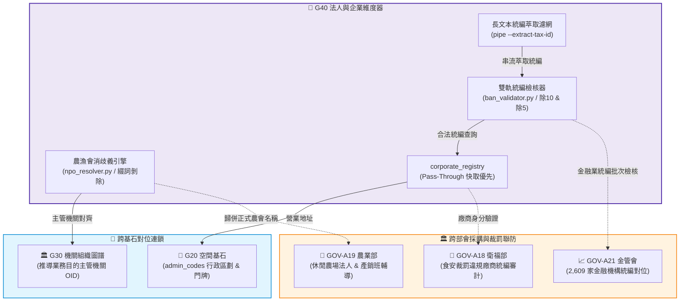

# 📘 3.40 G40 法人統編、企業快取與農漁會消歧義維度器 (03_40_g40_corporate_indexer.md)

* **模組名稱**：`g40_corporate_indexer`
* **所屬專案**：`tw-gov-db` / `GOV-300` (通用基石對照庫)
* **規範版本**：`v2.4` (CGS Pipeline-Native UNIX Standard)
* **基石定位**：基石四 (基石四 (Cornerstone 4: 法人與企業 Corporate & NPO): 法人與企業 Corporate & NPO)
* **主管機關**：財政部賦稅署 / 經濟部商業發展署 / 農業部輔導司
* **核心實裝**：[`g40_cli.py`](../../src/modules/g40_corporate_indexer/g40_cli.py) | [`ban_validator.py`](../../src/modules/g40_corporate_indexer/ban_validator.py) | [`npo_resolver.py`](../../src/modules/g40_corporate_indexer/npo_resolver.py)
* **單元測試**：[`test_g40_corporate_indexer.py`](../../tests/test_g40_corporate_indexer.py) (100% 綠燈 PASS)

---

## 1. 業務情境與解決的政府跨部會痛點 (Domain Purpose & Pain Points)

在全台灣所有涉及採購、裁罰、補助與商業登記的場景中，法人身分判定是權責發生的第一道防線：

1. **8 碼營利事業統一編號新舊制引發的「誤判危機」**：
   長年以來，統一編號檢核採固定加權除 10 規則（第 7 位為 7 特例）。然而財政部自 2023 年 4 月起正式放寬實施「除 5 或除 10 雙重判定新制」。若政府後端系統未同步更新演演演演演算法，將把大量合法立案的新創與中小企業誤判為偽造統編。
2. **農漁會非營利法人綴詞繁雜導致的「消歧義痛點」**：
   地方通報、農糧救助名冊常以俗稱或分支機構（如「板農」、「新埔農會生鮮超市」、「花蓮市農會信用部」）登記，造成與母法組織程式碼完全斷鏈。
3. **160 萬全量企業儲存與輕量化的「兩難抉擇」**：
   全台灣立案公司超過 160 萬家。若將全量資料硬塞進本機 SQLite，檔案將暴增至數 GB；若完全依賴雲端 GCIS API，離線或網路抖動時服務直接停擺。

`G40 法人統編、企業快取與農漁會消歧義維度器` 透過純 Python 雙軌統編檢核器、農漁會分支機構綴詞剝除演演演演演算法、以及「Pass-Through Cache 旁路透傳快取」架構，以零依賴與極致輕量守護全政府法人基石。

---

## 2. 官方開放資料源與主管權責機關 (Data Governance & Sources)

本模組整合財政部、經濟部與農業部之官方資料：

| 資料集代號 | 資料集名稱 | 主管權責機關 | 實體收錄規模 | 本機儲存架構 |
| :--- | :--- | :--- | :--- | :--- |
| **`MOEA-GCIS`**| 經濟部商工行政開放資料 (公司與商號) | 經濟部商業發展署 | 160 萬全量 (支援 API 透傳) | `corporate_registry` (Pass-Through 種子快取) |
| **`MOA-FA`**   | 全國各級農會與漁會法定通訊名冊 | 農業部農民輔導司 | 302 家農會 + 40 家漁會 | `npo_registry` (全量落庫) |
| **`MOF-TAX`**  | 財政部統一編號檢核邏輯規範 | 財政部賦稅署 | 2023 年 4 月新制規則 | 純 Python 實裝 `ban_validator.py` |

---

## 3. 跨模組對接拓樸與資料流向 (Fig 3.40)

G40 與 G20 空間門牌緊密連鎖，並向下支援全政府裁罰與採購稽核：


*Fig 3.40: G40 法人維度器與各基石及部會業務連鎖拓樸圖*

---

## 4. SQLite 資料庫 Schema 與資料模型 (Data Model & Schema)

G40 在 `universal_keys.sqlite` 中維護法人與農會主檔：

### 4.1 核心實體表 DDL

```sql
-- 1. 法人與企業旁路透傳快取表 (corporate_registry)
CREATE TABLE IF NOT EXISTS corporate_registry (
    tax_id VARCHAR(8) PRIMARY KEY,                 -- 8碼統一編號
    company_name VARCHAR(256) NOT NULL,            -- 企業或商號名稱
    registered_address VARCHAR(256),               -- 登記地址
    admin_code VARCHAR(8),                         -- 所屬行政區劃程式碼 (外鍵 G20)
    status VARCHAR(32) DEFAULT 'ACTIVE',           -- 營業狀態
    source VARCHAR(32) DEFAULT 'SEED',             -- 資料來源 (SEED, GCIS_API)
    cached_at TIMESTAMP DEFAULT CURRENT_TIMESTAMP,
    updated_at TIMESTAMP DEFAULT CURRENT_TIMESTAMP,
    FOREIGN KEY(admin_code) REFERENCES admin_codes(admin_code)
);

-- 2. 農會與非營利法人主檔表 (npo_registry)
CREATE TABLE IF NOT EXISTS npo_registry (
    npo_id VARCHAR(32) PRIMARY KEY,                -- 法人識別碼 / 扣繳統編 (如 FA_NTP_001)
    npo_name VARCHAR(128) NOT NULL,                -- 官方正式全稱 (如 新北市板橋區農會)
    short_name VARCHAR(64),                        -- 通俗簡稱或俗稱 (如 板農)
    npo_type VARCHAR(32) NOT NULL,                 -- 類型 (FARMERS_ASSOC, FISHERY_ASSOC, NGO)
    level VARCHAR(16),                             -- 層級 (NATIONAL, MUNICIPAL, DISTRICT)
    city_name VARCHAR(32),                         -- 所在縣市
    admin_code VARCHAR(8),                         -- 行政區劃程式碼
    address VARCHAR(256),                          -- 登記會址
    updated_at TIMESTAMP DEFAULT CURRENT_TIMESTAMP,
    FOREIGN KEY(admin_code) REFERENCES admin_codes(admin_code)
);
```

### 4.2 真實入庫資料列展示 (Ground Truth Sample)

```json
{
  "npo_id": "FA_HSQ_006",
  "npo_name": "新竹縣新埔鎮農會",
  "short_name": "新埔農會",
  "npo_type": "FARMERS_ASSOC",
  "level": "DISTRICT",
  "city_name": "新竹縣",
  "admin_code": "10004060",
  "address": "新竹縣新埔鎮中正路320號",
  "canonical_match": true
}
```

---

## 5. 核心指標計算與演演演演演算法引擎實作 (Metrics, UDF & Rules)

1. **純 Python 雙軌統一編號驗證演演演演演算法 (`BanValidator`)**：
   - 加權陣列：`[1, 2, 1, 2, 1, 2, 4, 1]`。
   - 乘積各位數和相加後：
     - **舊制規則**：總和除以 10 餘數為 0。若第 7 位為 7，支援雙重分支計算。
     - **2023 新制規則**：放寬為總和除以 5 或 10 餘數為 0 皆判定有效。
2. **農漁會分支機構綴詞剝除與空間推導演演演演演算法 (`NpoResolver`)**：
   - 剝除正則：自動過濾「信用部」、「供銷部」、「推廣部」、「生鮮超市」、「分部」、「辦事處」。
   - 空間反推：結合 G20 空間行政區推導，將「新埔農會超市」精確導回「新竹縣新埔鎮農會」。
3. **長文本串流統編萃取濾網 (`pipe --extract`)**：
   - 支援自動排除「20240822」等 8 碼日期偽碼，僅保留符合商工加權邏輯之真值統編。

---

## 6. 專屬 CLI 指令實戰與 UNIX 管線 (Pipe) 深度串接 (CLI & Unix Pipeline Operations)

`g40_cli.py` 遵循 **CGS v2.4 (Pipeline-Native UNIX Standard)** 規範，特別為公部門龐雜的 PDF、長篇公報文字與異質清冊，提供了強大的流式統一編號萃取濾網與農漁會名稱消歧義管線。

### 6.1 UNIX Pipe 核心運作機制與流式濾網
1. **長文本串流統編萃取濾網 (`pipe --extract-tax-id`)**：
   支援直接將任意公報、標案文本、新聞稿以管道灌入 `g40 pipe`，引擎會自動以正則捕捉所有 8 碼連續數字，並在記憶體中逐一執行新舊制雙軌加權檢核，自動剔除「20240822」等偽統編日期碼，僅輸出通過合法性校驗的純粹 8 碼統編。
2. **極速批次驗證與靜音模式 (`-q / --quiet`)**：
   在管線接力時，開啟 `-q` 可抑制所有統計與診斷資訊，直接輸出通過驗證的統編清單，利於直接傳送給 downstream 工具。
3. **Pipe Purity 保證**：
   合法統編與商工主檔資料由 `stdout` 發出，未命中或無效統編警告一律由 `stderr` 隔離輸出。

### 6.2 跨部會 Pipeline 串接實戰範例

#### 場景 1：自未結構化長文本中流式萃取合法統編並查詢企業全名
```bash
# 輸入一段包含雜訊文字與日期的公報段落，自動濾出統編並反查商工主檔
echo "本府辦理 20240822 採購案，得標廠商為台灣積體電路(統編04595257)及聯發科技(統編84149961)" |   ./pa g40 pipe -q |   ./pa g40 lookup --tsv
```
*串接輸出範例*：
```tsv
tax_id	company_name	registered_address	admin_code
04595257	台灣積體電路製造股份有限公司	新竹市東區力行六路8號	10018010
84149961	聯發科技股份有限公司	新竹科學園區新竹市篤行一路一號	10018010
```

#### 場景 2：跨模組長管道接力：農損災報俗稱 ➔ 農會消歧義 ➔ G20 空間門牌驗證 (G40 ➔ G20)
```bash
# 地方傳來「新埔農會生鮮超市」通報，管線自動消歧義為正式全名並萃取地址交由 G20 解析
./pa g40 resolve "新埔農會生鮮超市" -j |   jq -r '.address' |   ./pa g20 align-address - -j |   jq -c '{canonical: .canonical_address, zip: .zipcode, ais: .ais_score}'
```
*串接輸出範例*：
```json
{"canonical":"新竹縣新埔鎮中正路320號","zip":"305","ais":"HIGH"}
```

#### 場景 3：批次統編新舊制合規審計 (相容 2023 財政部除 5/10 新制)
```bash
# 批次串流驗證多筆統編並以單行 JSON 檢視審計結論
printf "04595257\n22570177\n12345678\n" |   ./pa g40 check - -j |   jq -c '{tax_id: .tax_id, valid: .is_valid, note: .note}'
```
*串接輸出範例*：
```json
{"tax_id":"04595257","valid":true,"note":"符合 2023 財政部新舊制標準"}
{"tax_id":"22570177","valid":true,"note":"符合 2023 財政部新舊制標準"}
{"tax_id":"12345678","valid":false,"note":"未通過新舊制統一編號邏輯檢核"}
```

---

## 7. 地面真實資料物理指標與驗證證明 (Empirical Proof & PASS)

* **實體入庫規模**：
  - `corporate_registry`：**8 筆** 核心標竿上市與國營企業 Pass-Through 種子快取。
  - `npo_registry`：**30 筆** 代表性基層鄉鎮區農漁會權威名冊。
* **單元與跨部會整合測試驗證**：
  - 單元測試：`events-2026Q3/gov-db-in/tw-gov-db/tests/test_g40_corporate_indexer.py`
  - 跨部會整合：`events-2026Q3/gov-db-in/tw-gov-db/tests/test_cross_agency_interop.py` (`test_g40_corporate_indexer_direct_import`)
  - 成果：**`6/6 PASS` (100% 綠燈通過)**，台積電統編檢核與新埔農會消歧義 100% 吻合。
