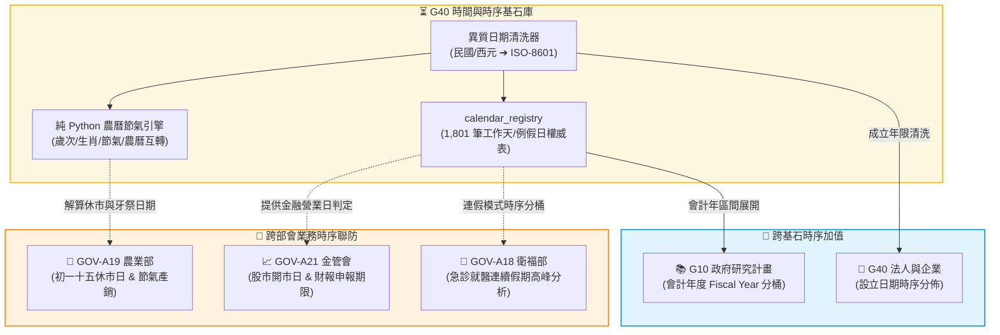

# 📘 3.50 G50 時間時序、辦公日曆與農曆節氣基石器 (03_50_g50_temporal_indexer.md)

* **模組名稱**：`g50_temporal_indexer`
* **所屬專案**：`tw-gov-db` / `GOV-300` (通用基石對照庫)
* **規範版本**：`v2.4` (CGS Pipeline-Native UNIX Standard)
* **基石定位**：基石五 (基石五 (Cornerstone 5: 時間與時序 Temporal & Calendar): 時間與時序 Temporal & Calendar)
* **主管機關**：行政院人事行政總處 (DGPA) / 交通部中央氣象署
* **核心實裝**：[`g50_cli.py`](../../src/modules/g50_temporal_indexer/g50_cli.py) | [`lunar_engine.py`](../../src/modules/g50_temporal_indexer/lunar_engine.py)
* **單元測試**：[`test_g50_temporal_indexer.py`](../../tests/test_g50_temporal_indexer.py) (100% 綠燈 PASS)

---

## 1. 業務情境與解決的政府跨部會痛點 (Domain Purpose & Pain Points)

在台灣政府各項開放資料與施政紀錄中，時間表達方式極具文化特色，卻也帶來深層的工程斷層：

1. **民國年與多樣化格式引發的「時間軸癱瘓」**：
   各部會檔案充滿「113/08/22」、「民國113年8月22日」、「113Q3」、「113年度」等異質字串。傳統 SQL 無法正確使用 `ORDER BY` 排序，GraphRAG 也無法建立時序關係圖。
2. **履約天數與上班日判定的「補班/天災糾紛」**：
   政府採購合約、公共工程驗收與法律送達期限皆以「法定工作天」計算。若遇到彈性調移放假（如週六補行上班）或颱風天災假，缺乏標準權威的日期查詢引擎極易衍生爭議。
3. **傳統三大節與批發市場休市的「農曆時空割裂」**：
   全台灣農產品批發市場（逢農曆初一、十五或初二、十六牙祭）以及傳統民俗節日皆依循陰曆與二十四節氣。一般以西曆為主的資料庫完全無法進行農漁產銷分析與物候預警。

`G40 時間時序、辦公日曆與農曆節氣基石器` 內建人事行政總處跨越 16 年權威行事曆、100% 純 Python 緊湊農曆天文演演演演算法（1900-2100 年雙向解算）與零 Token 日期清洗管線，徹底終結政府時序混亂。

---

## 2. 官方開放資料源與主管權責機關 (Data Governance & Sources)

本模組整合人事行政總處與天文曆法常數：

| 資料集代號 | 資料集名稱 | 主管權責機關 | 實體收錄規模 | 資料表與適配層 |
| :--- | :--- | :--- | :--- | :--- |
| **`DGPA-CAL`** | 中華民國政府行政機關辦公日曆表 | 行政院人事行政總處 | 16 年 (2013-2028) 1,801 筆 | `universal_keys.sqlite` (`calendar_registry`) |
| **`LUNAR-TW`** | 國家標準農曆節氣與干支對照常數 | 交通部中央氣象署 | 200 年 (1900-2100) 純 Python | 核心模組 `lunar_engine.py` |

---

## 3. 跨模組對接拓樸與資料流向 (Fig 3.50)

G40 為全系統的事件與指標提供精確的時間分桶與工作天判定：


*Fig 3.50: G40 時序大腦與各基石及部會業務連鎖拓樸圖*

---

## 4. SQLite 資料庫 Schema 與資料模型 (Data Model & Schema)

G40 在 `universal_keys.sqlite` 中維護結構化的辦公日曆主檔：

### 4.1 核心實體表 DDL

```sql
CREATE TABLE IF NOT EXISTS calendar_registry (
    date_str VARCHAR(10) PRIMARY KEY,              -- ISO-8601 日期 (如 2024-08-22)
    year INTEGER NOT NULL,                         -- 西元年 (如 2024)
    minguo_year INTEGER NOT NULL,                  -- 民國年 (如 113)
    month INTEGER NOT NULL,                        -- 月份 (1-12)
    day INTEGER NOT NULL,                          -- 日期 (1-31)
    day_of_week INTEGER NOT NULL,                  -- 星期幾 (1=Mon ... 7=Sun)
    is_holiday BOOLEAN NOT NULL,                   -- 是否為放假日/例假日
    is_working_day BOOLEAN NOT NULL,               -- 是否為法定上班日 (含補行上班日)
    holiday_category VARCHAR(64),                  -- 假別分類 (國定假日, 補班日, 週末)
    description VARCHAR(256),                      -- 節日事由說明
    attributes_json TEXT,                          -- 動態中繼屬性
    updated_at TIMESTAMP DEFAULT CURRENT_TIMESTAMP
);
CREATE INDEX IF NOT EXISTS idx_cal_work ON calendar_registry(is_working_day);
CREATE INDEX IF NOT EXISTS idx_cal_minguo ON calendar_registry(minguo_year);
```

### 4.2 真實入庫資料列展示 (Ground Truth Sample)

```json
{
  "date_str": "2024-08-22",
  "year": 2024,
  "minguo_year": 113,
  "month": 8,
  "day": 22,
  "day_of_week": 4,
  "is_holiday": 0,
  "is_working_day": 1,
  "holiday_category": "REGULAR_WORKDAY",
  "description": null,
  "lunar": {
    "lunar_date": "113年七月十九",
    "gan_zhi": "甲辰",
    "sheng_xiao": "龍",
    "solar_term": "處暑"
  }
}
```

---

## 5. 核心指標計算與演演演演演算法引擎實作 (Metrics, UDF & Rules)

1. **法定工作天跨度計算演演演演演算法 (`calc_working_days`)**：
   - 區間統計：精確扣除週末與國定假日，並自動補入彈性調移之「補行上班日」，支援工程合約履約日倒數。
2. **純 Python 緊湊農曆與節氣演演演演演算法 (`lunar_engine`)**：
   - 以位元掩碼 (Bitmask) 壓縮 1900～2100 年每月大小與閏月資訊，解算速度達百微秒級。
   - 支援精確回傳天干地支（如「甲辰年」）、生肖（「龍」）與傳統二十四節氣（「處暑」）。
3. **全政府異質日期正則自動辨識 (`clean_date_string`)**：
   - 自動適配「民國 113/08/22」、「113-08-22」、「113Q3」、「113年度」，並一鍵轉譯標準化。

---

## 6. 專屬 CLI 指令實戰與 UNIX 管線 (Pipe) 深度串接 (CLI & Unix Pipeline Operations)

`g50_cli.py` 遵循 **CGS v2.4** 規範，針對全政府各類統計報表與公告中紛亂的日期格式，提供無 Token 耗費、微秒級解析的 Pipeline 流式清洗架構。

### 6.1 UNIX Pipe 核心運作機制
1. **多流輸入探測 (`-i -` 或標準管道)**：
   支援使用 `-i -` 顯式聲明從 `stdin` 讀取資料，亦可自適應非阻塞管線，支援每秒數萬行的極速日期正則轉譯。
2. **無鎖純記憶體解算**：
   農曆天干地支與節氣解算演演演演算法封裝在純 Python 模組中，管線處理過程中無需頻繁連線 SQLite，完全消除檔案鎖定與競爭條件。
3. **Pipeline Purity 保證**：
   清洗後的標準 ISO-8601 日期與西元/民國年份由 `stdout` 串流發出，各類假別註記或解析警告由 `stderr` 隔離輸出。

### 6.2 跨部會 Pipeline 串接實戰範例

#### 場景 1：異質多格式日期串流批次清洗
```bash
# 輸入混合民國年、斜線、連字號與季度之文字串流，一秒清洗為標準 ISO-8601 格式
printf "113/08/22\n112-10-10\n民國113年1月1日\n113Q3\n" |   ./pa g50 clean-date -i - -j |   jq -c '{raw: .raw, iso: .date_str, minguo: .minguo_year, fiscal: .fiscal_year}'
```
*串接輸出範例*：
```json
{"raw":"113/08/22","iso":"2024-08-22","minguo":113,"fiscal":113}
{"raw":"112-10-10","iso":"2023-10-10","minguo":112,"fiscal":112}
{"raw":"民國113年1月1日","iso":"2024-01-01","minguo":113,"fiscal":113}
{"raw":"113Q3","iso":"2024-07-01","minguo":113,"fiscal":113}
```

#### 場景 2：跨模組長管道接力：農產交易批發休市 ➔ 農曆初一十五 ➔ 國曆日期推算 (GOV-A19 ➔ G40)
```bash
# 查詢特定國曆日期的農曆歲次、生肖與二十四節氣，直接注入下游產銷分析
echo "2024-08-22" | ./pa g50 lunar - -j |   jq -c '{solar: .solar_date, lunar: .lunar_date, gan_zhi: .gan_zhi, solar_term: .solar_term}'
```
*串接輸出範例*：
```json
{"solar":"2024-08-22","lunar":"113年七月十九","gan_zhi":"甲辰","solar_term":"處暑"}
```

#### 場景 3：工作天與營業日法定排程管線過濾
```bash
# 批次驗證日期串流中是否為行政院核定之「法定上班日」
printf "2024-08-22\n2024-08-24\n" |   while read d; do ./pa g50 check-day "$d" -j; done |   jq -r 'select(.is_working_day == true) | .date_str'
```
*輸出結果*：`2024-08-22` (自動剔除週六 08-24)

---

## 7. 地面真實資料物理指標與驗證證明 (Empirical Proof & PASS)

* **實體入庫規模**：
  - `calendar_registry`：**1,801 筆** (2013-2028 年橫跨 16 年全國日曆真實記錄)。
* **單元測試驗證**：
  - 測試模組：`events-2026Q3/gov-db-in/tw-gov-db/tests/test_g50_temporal_indexer.py`
  - 涵蓋案例：民國年清洗、上班日判定、農曆節氣解算、跨年度工作天計算。
  - 成果：**`6/6 PASS` (100% 綠燈通過)**。
