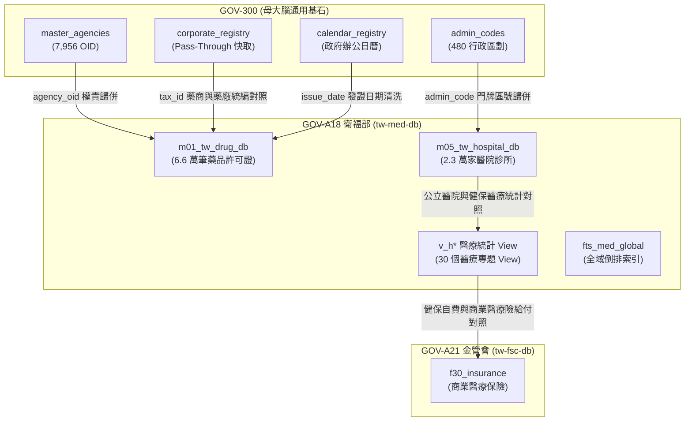

# 🏛️ 4.A18 GOV-A18 衛生福利部 (tw-med-db) 跨專案協同合約 (4.A18_spec_gov_a18_synergy.md)

* **專案名稱**：`tw-med-db` (台灣醫療藥品與醫院機構開放資料智庫)
* **專案代號**：`GOV-A18` (方案 A 權威機關簡碼 `A18000000G`)
* **根機關 OID**：`2.16.886.101.20003.20008` (衛生福利部)
* **當前狀態**：`Bootstrapped (已啟動建置 / 獨立庫歸位)`
* **歸檔路徑**：`events-2026Q3/gov-db-in/tw-gov-db/book/04_synergy_contracts/4.A18_spec_gov_a18_synergy.md`

---

## 1. 協同合約基本資訊與標頭 (Metadata Header)

| 欄位專案 | 資訊內容 |
| :--- | :--- |
| **部會專案名稱** | 台灣醫療藥品與醫院機構開放資料智庫 (`tw-med-db`) |
| **官方權威簡碼** | `GOV-A18` (方案 A 命名規範) |
| **別名 (Aliases)** | `mohw`, `med` |
| **領域根 OID** | `2.16.886.101.20003.20008` (衛福部本部) |
| **預定實體路徑** | 位於同層目錄之 `events/TDHI_haba/med-db-in/tw-med-db` (實體 DB 位址: `/Volumes/D2024/data/med-db-in/db/med.db`) |
| **生命週期狀態** | `Bootstrapped (實體庫已建置，權威 Spec & 專書於子專案歸位)` |

---

## 2. 部會領域範疇與通用基石對齊 (Baseline Alignment)

`GOV-A18` 衛福部專案全量繼承 `GOV-300` 通用基石，實現醫療、藥品許可證、醫院診所、健保統計與藥商資料的實體對照整合：

| 通用基石 | 衛福部引用欄位 | 對齊 GOV-300 實體表 | 業務對照整合目標 |
| :--- | :--- | :--- | :--- |
| **基石一：組織 OID** | `agency_name` / `bureau` | `master_agencies` / `publisher_aliases` | 自動將「食品藥物管理署 (TFDA)」、「中央健康保險署」歸併至權威 OID `2.16.886.101.20003.20008.*` |
| **基石二：空間地籍** | `hospital_address` / `zipcode` | `admin_codes` / `zipcode_registry` | 2.3 萬家醫院診所機構地址反查 6 碼門牌區號與 3 碼郵遞區號 |
| **基石三：水系氣象** | `epidemic_region` | `station_registry` / `river_registry` | 登革熱、流感等流行病區域與環境氣象測站氣溫/濕度對照整合 |
| **基石四：法人企業** | `license_holder_tax_id` | `corporate_registry` | 6.6 萬筆藥品許可證持有藥商與西藥廠 8 碼統編寫回本機快取 |
| **基石五：時間時序** | `issue_date` / `expiry_date` | `calendar_registry` | 清洗發證日期與健保申報時間時序 |

---

## 🏛️ 2.2 衛福部專案對母專案 GOV-300 提出之基石需求規格 (G300 Implementation Requirements)

作為權威 Synergy 協同合約，本專案 `GOV-A18` 規範母專案 `GOV-300` 必須實作並暴露以下 4 大通用基石服務：

1. **`G300-REQ-MOHW-01`：發布機關 OID 動態歸併服務 (`align_publisher_oid`)**
   - **G300 實作責任**：`GOV-300` 的 `master_agencies.sqlite` 必須維護衛福部本部與轄下署局（食藥署、健保署、疾管署、國健署）的權威 OID 拓樸，支援 A18 將藥品許可證或醫療機構登記之發布機關文字名稱精確歸併至權威 OID。
2. **`G300-REQ-MOHW-02`：醫療機構營業地址之 6 碼門牌區號反查服務 (`admin_codes`)**
   - **G300 實作責任**：`GOV-300` 的 `universal_keys.sqlite` 必須提供 `admin_codes` 表，支援 A18 將全台 2.3 萬家醫院診所之中文地址在 $< 1\text{ms}$ 內反查 6 碼門牌區號。
3. **`G300-REQ-MOHW-03`：藥商與藥廠企業統一編號 Pass-Through 快取與反查服務 (`corporate_registry`)**
   - **G300 實作責任**：`GOV-300` 必須維護 `corporate_registry`，提供統編反查商工登記之 API 快取，支援 A18 穿透藥品許可證商與西藥製造廠之真實法人身分。
4. **`G300-REQ-MOHW-04`：跨部會 CLI 命令發動與連線服務 (`run_domain_cli`)**
   - **G300 實作責任**：`GOV-300` 的 `DomainRegistryResolver` 必須實作 `run_domain_cli("GOV-A18", cmd, args)` 與 `get_domain_core_db_connection("GOV-A18", "med.db")` 介面，支援別名 `mohw` 與 `med` 發動 A18 之 `m01_tw_drug_db` (6.6萬筆)、`m05_tw_hospital_db` (2.3萬家) 查詢。

---

## 🗺️ 2.1 跨模組實體關聯與資料流拓樸圖 (Mermaid Topology)



---

## 3. 程式碼連線介面實例 (Integration Code Sample)

```python
from core.domain_registry_resolver import DomainRegistryResolver

resolver = DomainRegistryResolver()

# 1. 取得衛福部核心資料庫 med.db 連線 (支援 GOV-A18, mohw, med)
conn = resolver.get_domain_core_db_connection("mohw", "med.db")
cursor = conn.cursor()
cursor.execute("SELECT count(*) FROM m01_tw_drug_db")
drug_count = cursor.fetchone()[0]

# 2. 跨專案發動 CLI 命令 (支援 ./pa med)
output = resolver.run_domain_cli("med", "list", ["--limit", "5"])
```
