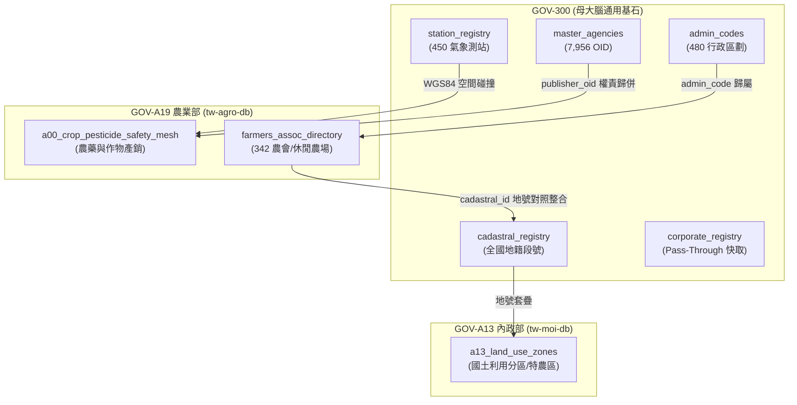
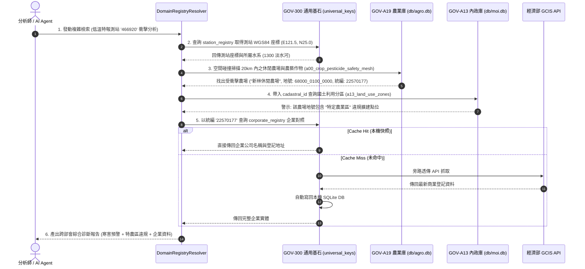

# 🏛️ 4.A19 GOV-A19 農業部 (tw-agro-db) 跨專案協同合約 (4.A19_spec_gov_a19_synergy.md)

* **專案名稱**：`tw-agro-db` (台灣農漁畜開放資料全景圖鑑庫)
* **專案代號**：`GOV-A19` (方案 A 權威機關簡碼 `380000000A`)
* **根機關 OID**：`2.16.886.101.20003.20064` (農業部)
* **當前狀態**：`Bootstrapped (已啟動建置 / 獨立庫歸位)`
* **歸檔路徑**：`events-2026Q3/gov-db-in/tw-gov-db/book/04_synergy_contracts/4.A19_spec_gov_a19_synergy.md`

---

## 1. 協同合約基本資訊與標頭 (Metadata Header)

| 欄位專案 | 資訊內容 |
| :--- | :--- |
| **部會專案名稱** | 台灣農漁畜開放資料全景圖鑑庫 (`tw-agro-db`) |
| **官方權威簡碼** | `GOV-A19` (方案 A 命名規範) |
| **領域根 OID** | `2.16.886.101.20003.20064` (農業部本部) |
| **預定實體路徑** | 位於同層目錄之 `tw-agro-db` (實體資料庫位址: `db/agro.db`) |
| **生命週期狀態** | `Bootstrapped (實體庫已建置，權威 Spec & 專書於子專案歸位)` |

---

## 2. 部會領域範疇與通用基石對齊 (Baseline Alignment)

`GOV-A19` 農業部專案全量繼承 `GOV-300` 通用基石，實現農糧、農藥、氣象與食安資料的實體對照整合：

| 通用基石 | 農業部引用欄位 | 對齊 GOV-300 實體表 | 業務對照整合目標 |
| :--- | :--- | :--- | :--- |
| **基石一：組織 OID** | `publisher_raw` | `master_agencies` / `publisher_aliases` | 自動將「農糧署中區分署」對齊至權威 OID `2.16.886.101.20003.20064.20070` |
| **基石二：空間地籍** | `farm_address` / `cadastral_id` | `admin_codes` / `zipcode_registry` | 休閒農場文字地址反查 6 碼門牌區號 (`100005`) 與地籍段號 |
| **基石三：水系氣象** | `station_id` / `river_id` | `station_registry` / `river_registry` | 450 個氣象測站寒害資料與農藝作物產區進行 WGS84 空間碰撞 |
| **基石四：法人企業** | `farmers_assoc_id` | `npo_registry` | 全台 342 家農漁會法人統編與信用部/推廣課對照整合 |
| **基石五：時間時序** | `harvest_date` | `calendar_registry` / `clean_datetime` | 清洗民國年 (`113/08/22` ➔ `2024-08-22`) 並對齊颱風假與農業天然災害救助 |

---

## 🗺️ 2.1 跨模組實體關聯與資料流拓樸圖 (Mermaid Topology)



---

## 3. 部會核心 Spec 規格摘要與設計框架 (Core Spec Abstract & Blueprint)

### 3.1 核心資料模型摘要 (`db/agro.db` 12 大領域庫)
`GOV-A19` 農業部專案建立三大事前融合分析模型與 12 大領域實體庫：
1. **`a00_crop_pesticide_safety_mesh` (農藥安全網表)**：融合農糧署作物產銷 (A10)、動植物防疫檢疫署農藥登記 (A11) 與食安殘留標準 (A12)。
2. **`farmers_assoc_directory` (農漁會實體目錄表)**：歸併 342 家農會信用部、推廣課與休閒農場輔導名錄。
3. **`agricultural_disaster_logs` (農業天然災害救助紀錄表)**：記錄極端氣候災損 (A40) 與救助金額。

### 3.2 權威 Spec 與專書檔案位置說明
* 📘 **子專案權威基礎業務 Spec**：位於同層專案 `tw-agro-db` 根目錄之 `A00_SPECIFICATION.md` *(100% 由子專案獨立維護)*
* 🔬 **子專案權威進階設計 Spec**：位於同層專案 `tw-agro-db` 根目錄之 `A00_ADVANCED_DESIGN_SPEC.md` *(跨多 DB 融合演演算法規格)*
* 📖 **子專案權威專書圖鑑**：位於同層專案 `tw-agro-db` 之 `book/FULL_BOOK_TAIWAN_AGRO_DB.md` *(已就位專書白皮書)*
* 📗 **母專案共享協同合約**：位於母專案 `GOV_A19_SYNERGY_SPEC.md` *(透過軟連結 Symlink 共享讀取)*

---

## 4. 部會 CLI 工具手冊摘要與說明 (CLI Manual Abstract & Guidance)

### 4.1 CLI 命令結構摘要 (`agro_cli.py`)
`GOV-A19` 提供專屬命令列工具，支援以下核心子命令：
- `agro_cli.py pesticide <crop_name>`：查詢特定作物之合法登記農藥與安全採收期。
- `agro_cli.py frost-alert --station <station_id>`：發動特定氣象站寒害預警與受害農場掃描。

### 4.2 權威 CLI 手冊位置說明
* 🛠️ **權威 CLI 工具手冊**：位於同層專案 `tw-agro-db` 之 `book/07_03_appendix_cli_reference.md` *(專書附錄 CLI 說明冊)*

---

## 5. 跨部會核心協同情境與資料鏈結 (Core Synergy Scenarios)

### 情境 1：氣象局低溫特報 ➔ 農業部寒害農藝衝擊 1 毫秒預警
- **資料鏈結**：`GOV-300` 氣象測站 (`station_registry`) ➜ `GOV-A19` 作物產銷表 (`a00_crop_pesticide_safety_mesh`) ➜ 6 碼門牌 (`zipcode_registry`)。
- **預期效果**：當台北氣象站 (`466920`) 測得低於 10°C 低溫時，自動掃描周邊 20 公里內之高風險休閒農場與作物產銷班，透過簡訊發送防寒警訊。

### ⏱️ 最複雜情境連鎖查詢時序圖 (Mermaid Sequence Diagram)
**複雜情境：當中央氣象署發布低溫特報時，AI Agent 如何發動跨 3 部會、4 個資料庫的連鎖防禦、國土違規稽查與企業統編快取？**



---

## 6. AI Agent 協同導航與工作流資訊 (AI & Agentic Workflow & Skill)

### 6.1 Agent Prompt 提示詞範例
```text
[System Prompt for GOV-A19 Query]
你是一個精通台灣農業部開放資料的 AI Agent。當使用者詢問農藥安全採收期或農會輔導資訊時：
1. 請先調用 GOV-300 的 BaseDomainAdapter.align_publisher_oid("農業部農糧署") 取得權威 OID。
2. 連線 GOV-A19 之 db/agro.db 資料庫，查詢 a00_crop_pesticide_safety_mesh 表。
3. 輸出符合 Schema.org/Observation 格式之 JSON-LD 結果。
```

### 6.2 Agent Skill 位置與導航說明
* 🧙‍♂️ **專屬 Agent Skill 指南**：由母專案 `GOV-300` 之 `.agent/skills/gov-db-wizard/SKILL.md` 統一提供跨部會連線與 `tw-agro-db` 導航。

---

## 7. 介面合約與工具鏈對接規範 (Interface Contracts)

透過 `DomainRegistryResolver` 進行跨專案程式碼與 DB 直連：
```python
from src.core.domain_registry_resolver import DomainRegistryResolver

resolver = DomainRegistryResolver()
# 1. 取得 GOV-A19 核心 DB 實體連線
conn = resolver.get_domain_core_db_connection("GOV-A19", "agro.db")

# 2. 跨專案發動 CLI 命令
output = resolver.run_domain_cli("GOV-A19", "pesticide", ["水稻"])
```

---

## 8. Spec 權責劃分與生命週期狀態 (Spec Ownership & Lifecycle)

* **權責歸屬**：`GOV-A19` 內部業務邏輯完全由 `tw-agro-db` 團隊維護；與母專案 `GOV-300` 的協同介面（OID、五大基石）由母專案權威控管。
* **生命週期狀態**：**`Bootstrapped (已啟動 / 獨立庫歸位)`**
