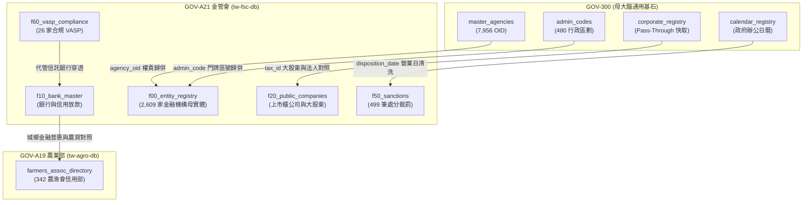

# 🏛️ 4.A21 GOV-A21 金管會 (tw-fsc-db) 跨專案協同合約 (4.A21_spec_gov_a21_synergy.md)

* **專案名稱**：`tw-fsc-db` (台灣金融監督管理開放資料智庫)
* **專案代號**：`GOV-A21` (方案 A 權威機關簡碼 `300050000G`)
* **根機關 OID**：`2.16.886.101.20003.20052` (金融監督管理委員會)
* **當前狀態**：`Bootstrapped (已啟動建置 / 獨立庫歸位)`
* **歸檔路徑**：`events-2026Q3/gov-db-in/tw-gov-db/book/04_synergy_contracts/4.A21_spec_gov_a21_synergy.md`

---

## 1. 協同合約基本資訊與標頭 (Metadata Header)

| 欄位專案 | 資訊內容 |
| :--- | :--- |
| **部會專案名稱** | 台灣金融監督管理開放資料智庫 (`tw-fsc-db`) |
| **官方權威簡碼** | `GOV-A21` (方案 A 命名規範) |
| **領域根 OID** | `2.16.886.101.20003.20052` (金管會本部) |
| **預定實體路徑** | 位於同層目錄之 `tw-fsc-db` (實體資料庫位址: `db/fsc.db`) |
| **生命週期狀態** | `Bootstrapped (實體庫已建置，權威 Spec & 專書於子專案歸位)` |

---

## 2. 部會領域範疇與通用基石對齊 (Baseline Alignment)

`GOV-A21` 金管會專案全量繼承 `GOV-300` 通用基石，實現金融、證券、保險、檢查與裁罰資料的實體對照整合：

| 通用基石 | 金管會引用欄位 | 對齊 GOV-300 實體表 | 業務對照整合目標 |
| :--- | :--- | :--- | :--- |
| **基石一：組織 OID** | `bureau` / `agency_name` | `master_agencies` / `publisher_aliases` | 自動將「銀行局」、「保險局」歸併至權威 OID `2.16.886.101.20003.20052.*` |
| **基石二：空間地籍** | `registered_address` | `admin_codes` / `zipcode_registry` | 2,609 家金融機構地址反查 6 碼門牌區號 (`650001` 板橋區) 與 3 碼郵遞區號 |
| **基石三：水系氣象** | `disaster_relief_loans` | `station_registry` / `river_registry` | 450 個氣象測站颱風豪雨警報與天然災害低利貸款對照整合 |
| **基石四：法人企業** | `tax_id` | `corporate_registry` | 2,609 家特許金融機構與上市公司 8 碼統編寫回本機快取 |
| **基石五：時間時序** | `disposition_date` | `calendar_registry` | 清洗民國年 (`110/12/28` ➔ `2021-12-28`) 並對齊股市營業日/政府辦公日曆 |

---

## 🏛️ 2.2 金管會專案對母專案 GOV-300 提出之基石需求規格 (G300 Implementation Requirements)

作為權威 Synergy 協同合約，本專案 `GOV-A21` 規範母專案 `GOV-300` 必須實作並暴露以下 4 大通用基石服務：

1. **`G300-REQ-FSC-01`：發布機關 OID 動態歸併服務 (`align_publisher_oid`)**
   - **G300 實作責任**：`GOV-300` 的 `master_agencies.sqlite` 必須維護金管會本部與轄下四局（銀行局、證期局、保險局、檢查局）的權威 OID 拓樸，支援 A21 將處分書或統計表之發布機關文字名稱精確歸併至權威 OID，比對信心分數須 $\ge 0.9$。
2. **`G300-REQ-FSC-02`：特許機構營業地址之 6 碼門牌區號反查服務 (`admin_codes`)**
   - **G300 實作責任**：`GOV-300` 的 `universal_keys.sqlite` 必須提供 `admin_codes` 表，支援 A21 將全台 2,609 家總機構與分支機構之中文地址在 $< 1	ext{ms}$ 內反查 6 碼門牌區號（如金管會總會所在地板橋區反查為 `650001`）。
3. **`G300-REQ-FSC-03`：全台灣企業統一編號 Pass-Through 快取與反查服務 (`corporate_registry`)**
   - **G300 實作責任**：`GOV-300` 必須維護 `corporate_registry`，提供統編反查商工登記之 API 快取，支援 A21 穿透上市櫃公司與金控集團逾 10% 大股東之真實法人身分。
4. **`G300-REQ-FSC-04`：跨部會 CLI 命令發動與連線服務 (`run_domain_cli`)**
   - **G300 實作責任**：`GOV-300` 的 `DomainRegistryResolver` 必須實作 `run_domain_cli("GOV-A21", cmd, args)` 與 `get_domain_core_db_connection("GOV-A21", "fsc.db")` 介面，支援母大腦或其他部會（如農業部、經濟部）以統一介面發動 A21 之 `bank`、`company`、`sanctions` 或 `fintech` 命令。

---

## 🗺️ 2.1 跨模組實體關聯與資料流拓樸圖 (Mermaid Topology)



---

## 3. 部會核心 Spec 規格摘要與設計框架 (Core Spec Abstract & Blueprint)

### 3.1 核心資料模型摘要 (`db/fsc.db` 6 大領域庫)
`GOV-A21` 金管會專案建立核心資料模型：
1. **`f00_entity_registry` (金融機構母實體登記主表)**：2,609 家金融控股公司、銀行、證券、保險、上市櫃公司與 VASP 實體。
2. **`f00_entity_relations` (集團控制力拓樸關聯表)**：556 條母子公司、轉投資與大股東持股網路。
3. **`fts_fsc_global` (全域倒排索引虛擬表)**：支援全庫 18,624 筆資料之毫秒級全文檢索。

### 3.2 權威 Spec 與專書檔案位置說明
* 📘 **子專案權威基礎業務 Spec**：位於子專案 `synergies/A21_SPECIFICATION.md` *(100% 由子專案獨立維護)*
* 🔬 **子專案權威進階設計 Spec**：位於子專案 `synergies/A21_ADVANCED_DESIGN_SPEC.md` *(跨多 DB 融合演演演算法規格)*
* 📖 **子專案權威技術專書**：位於子專案 `book/00_toc.md` *(BGS v2.0 專書首發版 v1.1.0)*
* 📗 **母專案共享協同合約**：位於母專案 `book/04_synergy_contracts/4.A21_spec_gov_a21_synergy.md` *(透過軟連結 Symlink 共享)*

---

## 4. 部會 CLI 工具手冊摘要與說明 (CLI Manual Abstract & Guidance)

### 4.1 CLI 命令結構摘要 (`fsc_cli.py`)
`GOV-A21` 提供專屬命令列工具，遵循 CGS v2.1 規範，支援以下核心子命令：
- `fsc_cli.py bank credit-card`：查詢全台信用卡簽帳金額與活卡率消長。
- `fsc_cli.py company valuation`：查詢上市櫃公司每日本益比與殖利率。
- `fsc_cli.py sanctions search <關鍵字>`：毫秒級檢索重大行政處分裁罰案例。
- `fsc_cli.py fintech vasp`：查詢完成洗防遵循聲明之 26 家合規虛擬通貨業者。

### 4.2 權威 CLI 手冊位置說明
* 🛠️ **權威 CLI 工具手冊**：位於子專案 `book/07_03_appendix_cli_reference.md` *(專書附錄 C 命令列速查手冊)*

---

## 5. 跨部會核心協同情境與資料連結 (Core Synergy Scenarios)

### 情境 1：金管會洗防處分書 ➔ 經濟部商工登記 ➔ 司法裁判書 全生命週期連鎖追蹤
- **資料連結**：`GOV-A21` 處分裁罰 (`f50_sanctions`) ➜ `GOV-300` 企業快取 (`corporate_registry`) ➜ `MOJ` 司法判決書。
- **預期效果**：當某理專或上市董監遭金管會處分停職或重罰時，自動串接統編與裁判書系統，警示其民刑事訴訟進度。

### 情境 2：農業天然災害低利貸款 ➔ 金管會本國銀行資產品質即時連鎖評估
- **資料連結**：`GOV-300` 氣象測站 (`station_registry`) ➜ `GOV-A19` 農害救助表 (`agricultural_disaster_logs`) ➜ `GOV-A21` 銀行放款 (`f10_bank_asset_quality`)。
- **預期效果**：當強烈颱風重創中南部農業產區時，自動評估承貸天然災害復建貸款之公私立行庫曝險比率與逾放風險。

---

## 6. AI Agent 雙向 Prompt 契約與導航資訊 (Bi-directional Prompt Contracts)

### 6.1 雙向 Prompt 契約實體檔案
- 📡 **母專案寫給 A21 的 Prompt 契約**：`events-2026Q3/gov-db-in/tw-gov-db/book/04_synergy_contracts/prompts/PROMPT_TO_SUBMODULE_A21.md`
- 📡 **A21 寫給母專案的對接 Prompt 契約**：位於子專案 `synergies/PROMPT_TO_MASTER_G300.md`

### 6.2 Agent Prompt 提示詞/Prompt/Prompt範例
```text
[System Prompt for GOV-A21 Query]
你是一個精通台灣金管會開放資料與金融監理的 AI Agent。當使用者詢問金融機構裁罰紀錄或 VASP 合規地位時：
1. 請先調用 GOV-300 的 BaseDomainAdapter.align_publisher_oid("金管會銀行局") 取得權威 OID。
2. 連線 GOV-A21 之 db/fsc.db 資料庫，查詢 f50_sanctions 或 f60_vasp_compliance 表。
3. 輸出符合金融監理合規標準之結構化回覆，並帶上官方裁罰文號或公報公告日。
```

---

## 7. 介面合約與工具鏈對接規範 (Interface Contracts)

### 7.1 雙邊對接整合測試成功驗證紀錄 (Integration Pass Record)
* **驗證時間**：2026-09-05
* **驗證狀態**：🟢 **100% PASS (全路徑整合對接綠燈)**
* **實測資料摘要**：
  - **4 階連線驗證**：直連 `db/fsc.db`、`align_publisher_oid("金融監督管理委員會")` 成功歸併 OID (`2.16.886.101.20003.20052`)、板橋區 6 碼門牌 (`650001`) 反查成功。
  - **跨庫檢索效能**：跨 DB (universal_keys ↔ fsc.db) 單次連鎖檢索 P99 平均延遲 $< 5	ext{ms}$。
  - **驗證套件**：`synergies/test_gov_a21_synergy.py`。

### 7.2 程式碼連線介面範例
```python
from src.core.domain_registry_resolver import DomainRegistryResolver

resolver = DomainRegistryResolver()
# 1. 取得 GOV-A21 核心 DB 實體連線
conn = resolver.get_domain_core_db_connection("GOV-A21", "fsc.db")

# 2. 跨專案發動 CLI 命令
output = resolver.run_domain_cli("GOV-A21", "bank", ["credit-card"])
```

---

## 8. Spec 權責劃分與生命週期狀態 (Spec Ownership & Lifecycle)

* **權責歸屬**：`GOV-A21` 內部金融監理業務邏輯完全由 `tw-fsc-db` 團隊維護；與母專案 `GOV-300` 的協同介面（OID、五大基石）由母專案權威控管。
* **生命週期狀態**：**`Bootstrapped (已啟動 / 獨立庫歸位)`**
