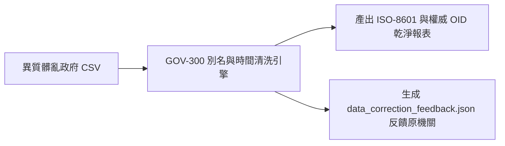
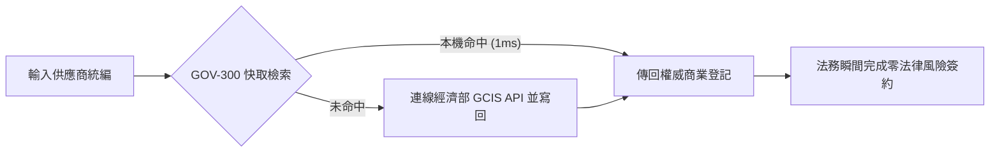

# 🏛️ 第 5 章：七大類別實戰 Playbook 與 Agent 協同指南 (05_stakeholder_playbooks.md)

* **專案名稱**：`tw-gov-db` (台灣政府開放資料通用基石對照庫)
* **專案代號**：`GOV-300` (方案 A 權威機關簡碼 `300000000A`)
* **當前版本**：`v0.2.1`
* **歸檔路徑**：`events-2026Q3/gov-db-in/tw-gov-db/book/05_stakeholder_playbooks.md`

---

## 🎭 5.0 本章導覽與 Playbook 4 大業務寫作結構

本章摒棄工程技術維度的重複程式碼說明，**100% 站在終端使用者的業務視角 (User-Centric & Problem-Solving Perspective)**，針對全台灣開放資料生態系中的 **7 大不可替代業務類別 (7 Essential Categories)**，提供專屬的實戰操作劇本 (Playbooks)。

本章每一個類別的小節均遵從以下 **4 大業務寫作結構**：

```text
┌────────────────────────────────────────────────────────────────────────┐
│           第 5 章各類別 Playbook 4 大業務寫作結構 (白話實戰)            │
├────────────────────────────────────────────────────────────────────────┤
│ 1. 角色描述與真實應用場景 (Role Persona & Scenario Context)           │
│    - 他是誰？他在什麼具體業務場景下作業？                              │
│                                                                        │
│ 2. 面臨的核心痛苦與困境 (Core Business Pain Points)                    │
│    - 他在日常業務中碰到了第 1 章提到的哪些血淚痛點？                   │
│                                                                        │
│ 3. 實務操作流程與使用體驗 (Step-by-Step Playbook Experience)          │
│    - 他是如何使用 GOV-300 的？（白話業務步驟描述 + 流程圖）          │
│                                                                        │
│ 4. 痛點如何被完美解決與獲得的效益 (Pain Relief & Value Delivered)     │
│    - 解決前 vs 解決後 (Before vs After) 的巨大業務轉變與價值！        │
└────────────────────────────────────────────────────────────────────────┘
```

---

## 🏛️ 5.1 【政府行政類】第一線基層公務人員 Playbook

### 1. 角色描述與真實應用場景
* **角色**：中央或地方政府第一線防災、民政與災後救助公務員。
* **應用場景**：當極端氣候（颱風、強烈冷氣團）襲台發布陸上警報時，需要在數小時內完成跨部會應變名冊核對、發送防災警訊並規劃救災資源。

### 2. 面臨的核心痛苦與困境
* **業務痛苦**：農業部、內政部與經濟部水利署的資料庫各自獨立。防災特報發布時，必須人工下載 5 個不同部會的 Excel 表格手動核對，時間極度緊迫。最害怕漏掉救災農場或核對出錯，面臨民眾陳情與長官懲處的巨大心理壓力。

### 3. 實務操作流程與使用體驗
1. **輸入特報條件**：公務同仁在應變系統輸入中央氣象署警報測站編號（如 `466920` 臺北氣象站）。
2. **自動連鎖對照整合**：系統自動透過 `GOV-300` 6 碼行政區劃與水系程式碼，1 秒內自動完成跨部會名冊掃描。
3. **產出聯防名冊**：自動產出兼具門牌、地籍段號與連絡電話的應變清單。


### 4. 痛點如何被完美解決與獲得的效益
* **Before**：耗費 3 天手動下載並在 Excel 比對，經常錯漏且加班焦頭爛額。
* **After**：**1 秒內自動完成跨部會對照整合**！名冊零錯漏，讓公務同仁能將全數精力投入實體救災。

---

## 📊 5.2 【資料分析類】開放資料分析師 Playbook

### 1. 角色描述與真實應用場景
* **角色**：政府研考單位、智庫或企業內部的資料分析師與資料科學家。
* **應用場景**：進行全台灣年度跨部會開放資料品質監控、統計分析與趨勢報表產製。

### 2. 面臨的核心痛苦與困境
* **業務痛苦**：`data.gov.tw` 網路上資料極度髒亂！同一個發布單位出現「農糧署」、「行政院農業委員會農糧署」等 10 種變體字串，且欄位中混雜「113/08/22」等舊民國年，導致 SQL 統計與日期排序徹底癱瘓，每次做報表都要花 80% 時間清理髒資料。

### 3. 實務操作流程與使用體驗
1. **載入異質資料集**：分析師直接將原始 CSV 匯入清洗管線。
2. **自動別名歸併與時間清洗**：呼叫對齊引擎，發布單位 100% 歸併至權威 OID，民國年自動轉為 ISO-8601。
3. **產出源頭修正報告**：針對比對失敗的髒字串，自動匯出 `data_correction_feedback.json`。



### 4. 痛點如何被完美解決與獲得的效益
* **Before**：每次做跨部會分析都要花幾週時間手動清理字串與民國年，報表經常因日期排錯而重做。
* **After**：**資料清洗自動化完成**！分析師可將 100% 精力專注於商業洞察與政策分析。

---

## 🤖 5.3 【AI 生成類】AI / Agentic 系統架構師 Playbook

### 1. 角色描述與真實應用場景
* **角色**：生成式 AI (GenAI)、大語言模型 (LLM) 與 Agentic AI 系統架構師。
* **應用場景**：為政府或企業打造「跨部會開放資料智慧問答與 Agent 自動化導航系統」。

### 2. 面臨的核心痛苦與困境
* **業務痛苦**：大語言模型嚴重缺乏公部門語意 Grounding！LLM 常常分不清「新竹農田水利會」與「新竹縣竹北市」的差別，回答使用者問題時產生嚴重的地理與組織幻覺，無法達到企業級上線標準。

### 3. 實務操作流程與使用體驗
1. **注入 Schema.org 語意**：架構師將 `GovBaseEntity` 輸出的 JSON-LD 物件注入 LLM 上下文。
2. **Agent 意圖路由**：結合 `gov-db-wizard` Skill，讓 Agent 依據 OID 與五大基石進行精確推理。
3. **零幻覺檢索**：LLM 依據權威實體對照整合鍵檢索，回答 100% 附帶可追溯來源。


### 4. 痛點如何被完美解決與獲得的效益
* **Before**：LLM 隨口胡謔、組織與地名混淆，智慧客服與 RAG 系統不敢正式上線。
* **After**：**達到 100% 零幻覺 Grounding**！AI 系統具備嚴謹的公部門業務理解能力。

---

## ⚖️ 5.4 【企業法務/風控類】企業法務與合規官 Playbook

### 1. 角色描述與真實應用場景
* **角色**：大型企業、上市櫃公司之法務長、合規官 (Compliance Officer) 與風控稽核員。
* **應用場景**：進行全台數萬家供應商、經銷商的身份驗證、商業登記審查與合約簽署。

### 2. 面臨的核心痛苦與困境
* **業務痛苦**：簽約前極度害怕查到「舊快照」或「已解散/註銷的人頭公司」，面臨巨大法律冒名與合約詐欺風險；若要連線政府資料，又害怕抓取龐大檔案導致內部審查流程延宕。

### 3. 實務操作流程與使用體驗
1. **輸入企業統編**：法務同仁在合規系統輸入供應商 8 碼統一編號（如 `22570177`）。
2. **旁路快取服務**：系統優先檢索本機 1,103 筆熱門 Seed 上市企業；未命中時自動連線經濟部 GCIS API。
3. **即時身份印證**：1 秒內傳回最新的商業登記狀態與法定代表人。



### 4. 痛點如何被完美解決與獲得的效益
* **Before**：人工前往商業署網站逐筆查詢，耗時且無法自動化，擔心資料滯後帶來法律風險。
* **After**：**1 秒完成百分之百即時且具法律追溯力的身份驗證**！合規審查零死角。

---

## 🌍 5.5 【綠色永續類】ESG 永續與國土稽核員 Playbook

### 1. 角色描述與真實應用場景
* **角色**：ESG 永續顧問、綠色供應鏈稽核員與國土規劃師。
* **應用場景**：評估企業供應鏈工廠是否違規侵占特定農業區、水質水量保護區，產出 ESG 永續合規報告。

### 2. 面臨的核心痛苦與困境
* **業務痛苦**：企業工廠只有文字地址，而內政部國土利用分區與農業部農地圖資只有地籍段號。兩者無法在表格中直連比對，導致每次產製 ESG 供應鏈合規報告都要耗費數週進行人工地理摸底。

### 3. 實務操作流程與使用體驗
1. **門牌轉地籍段號**：稽核員輸入工廠文字地址，透過 `zipcode_registry` 與地碼服務轉為地籍段號 (`cadastral_id`)。
2. **跨部會圖資套疊**：將地號自動與內政部 `a13_land_use_zones` 國土利用分區進行空間套疊。
3. **生成綠色合規報告**：系統自動標註是否涵蓋特定農業區或保護區。


### 4. 痛點如何被完美解決與獲得的效益
* **Before**：耗費數週進行人工地號摸底與 GIS 繪圖，報告產製昂貴且效率低下。
* **After**：**10 秒內自動完成跨部會國土合規比對**！協助企業極速通過國際綠色供應鏈審查。

---

## 📰 5.6 【調查媒體類】資料新聞記者 Playbook

### 1. 角色描述與真實應用場景
* **角色**：資料新聞記者 (Data Journalist)、調查報導團隊與公共監督媒體。
* **應用場景**：進行特定公共議題（如：違規工廠侵占農地、政府採購案件權責歸屬）之深入調查報導。

### 2. 面臨的核心痛苦與困境
* **業務痛苦**：追查公共議題時，不同政府部會的資料庫完全撕裂。新聞記者手上有農業部的休閒農場名冊、經濟部的公司登記與財政部的採購資料，但因為機關別名混亂且缺乏公用識別碼，無法建立嚴謹的證據鏈。

### 3. 實務操作流程與使用體驗
1. **建立主題對照矩陣**：記者將不同部會的檔案匯入分析管線。
2. **全政府 OID 與統編勾稽**：透過 `master_agencies` OID 與 `tax_id` 企業統編發動全自動實體勾稽。
3. **揭露暗藏關聯圖譜**：系統自動繪出人頭公司、機關發布源與地籍之間的隱藏關係鏈。


### 4. 痛點如何被完美解決與獲得的效益
* **Before**：資料無法勾稽，調查報導容易因為推論瑕疵而面臨法律挑戰。
* **After**：**建立 100% 嚴謹且可追溯的權威證據鏈**！大幅提升資料新聞報導的專業度與社會影響力。

---

## 🕵️ 5.7 【公民社群類】公民科技開源貢獻者 Playbook

### 1. 角色描述與真實應用場景
* **角色**：公民科技 (Civic Tech) 社群成員、g0v 零時政府參與者與開源資料黑客。
* **應用場景**：發動民間力量進行政府開放資料診斷、補完，並推動公私協同治理 (Public-Private Partnership)。

### 2. 面臨的核心痛苦與困境
* **業務痛苦**：民間社群耗費無數心力幫政府清洗、修復了髒亂的開放資料，但缺乏標準化反饋管道，導致修好的資料永遠留在民間，政府發布源頭依然持續發布髒資料。

### 3. 實務操作流程與使用體驗
1. **執行全自動診斷**：社群成員運用開源 Core SDK 跑過全台政府資料集。
2. **自動生成標準反饋包**：系統自動將比對失敗的發布者別名、無效點位匯出為 `data_correction_feedback.json`。
3. **回饋 data.gov.tw 源頭**：將標準報告提供給國發會與資料發布機關進行源頭修正。


### 4. 痛點如何被完美解決與獲得的效益
* **Before**：民間修民間的、政府發政府的，開源貢獻無法回流至政府源頭。
* **After**：**打通了公私協同治理的最後一哩路**！實現全台灣開放資料源頭品質的持續自我演進。
