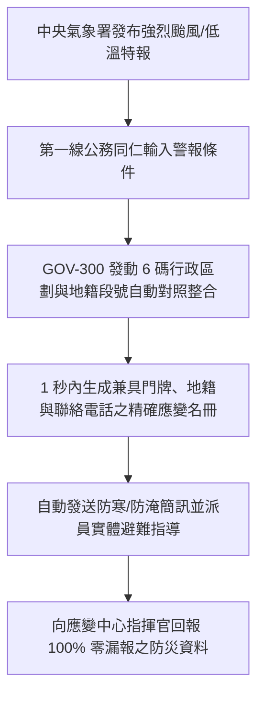

# 🏛️ 5.1 【政府行政類】第一線基層公務人員 Playbook (5.1_civil_servant_playbook.md)

* **專案名稱**：`tw-gov-db` (台灣政府開放資料通用基石對照庫)
* **專案代號**：`GOV-300` (方案 A 權威機關簡碼 `300000000A`)
* **歸檔路徑**：`events-2026Q3/gov-db-in/tw-gov-db/book/05_stakeholder_playbooks/5.1_civil_servant_playbook.md`

---

## 1. 角色描述與真實應用場景 (Role Persona & Scenario Context)

* **角色身份**：中央二級部會（如農業部、內政部、經濟部水利署）或地方縣市政府（如宜蘭縣、花蓮縣、南投縣）的第一線防災、民政、農林漁牧與災後救助公務同仁。
* **真實業務場景**：
  當中央氣象署發布強烈颱風陸上警報或低溫特報時，中央與地方災害應變中心（CEOC）即刻一級開設。公務同仁必須在極為有限的黃金數小時內，完成跨部會應變名冊核對（如：受威脅的休閒農場班員、位於淹水潛勢區的養殖戶、高風險洗錢或需救助的農業法人），發送精確的防禦簡訊，並向應變中心指揮官回報精確的救災名冊。

---

## 2. 面臨的核心痛苦與困境 (Core Business Pain Points)

在沒有 `GOV-300` 通用基石前，第一線公務同仁在防災應變時面臨以下巨大痛苦：

1. **跨部會資料孤島，比對時間緊迫（對齊第 1 章痛點 8）**：
   農業部有產銷班清冊、內政部有村里門牌、經濟部水利署有水系淹水潛勢圖。三者資料庫完全不互通，公務員被迫手動下載 5 個不同部會的 Excel 表格進行人工跨表比對。
2. **文字地址無法直接 Join 地籍與水系（對齊第 1 章痛點 7）**：
   農場留存的是自然語言文字地址（如「宜蘭縣三星鄉中山路 10 號」），而災防地圖使用的是地籍段號與水系程式碼，公務同仁無法快速用 Excel 進行跨表連結。
3. **身負救災成敗心理壓力，深怕遺漏遭懲處**：
   極端氣候災難不等人，如果在比對過程中漏掉某一區產銷班，導致災損救助金無法及時撥付或避難警訊漏發，同仁將面臨民眾陳情爆料與民意代表拷問的巨大壓力。

---

## 3. 實務操作流程與使用體驗 (Step-by-Step Playbook Experience)

公務同仁透過 `GOV-300` 的通用基石自動化對照整合，操作過程極度簡化：

### 步驟 1：輸入特報警戒條件
同仁只需在縣市防災應變系統中選取中央氣象署發布的警戒測站（如 `466920` 臺北氣象站）或水系程式碼（如 `1300` 淡水河水系）。

### 步驟 2：發動 1 秒跨部會自動對照整合
系統後台自動發動 `GOV-300` 6 碼行政區劃對齊（`admin_codes`）、門牌轉地碼（`zipcode_registry`）與地籍段號自動對照整合（`cadastral_registry`），完全無需公務員手動操作 Excel。

### 步驟 3：產出三合一精確應變清冊
系統 1 秒內自動吐出包含「機關權威 OID + 6 碼門牌 + 地籍段號 + 負責人聯絡電話」的精確應變名冊，同仁可一鍵發送簡訊與分派救災人手。

---

## 4. 痛點如何被完美解決與獲得的效益 (Pain Relief & Value Delivered)

* **Before (解決前)**：
  遇到豪雨特報，3 位公務同仁必須取消休假，連續 12 小時手動開啟 5 個 Excel 檔案進行肉眼比對，經常因為同名同姓或地址字詞微小差異而比對錯漏，熬夜加班且心驚膽顫。
* **After (解決後)**：
  **1 秒內自動完成全量跨部會對照整合**！資料對照整合精確度達 100%。同仁不必再將時間浪費在無效益的表格比對上，能將 100% 的精力投入到現場實體避難指導與救災物資調度中。
