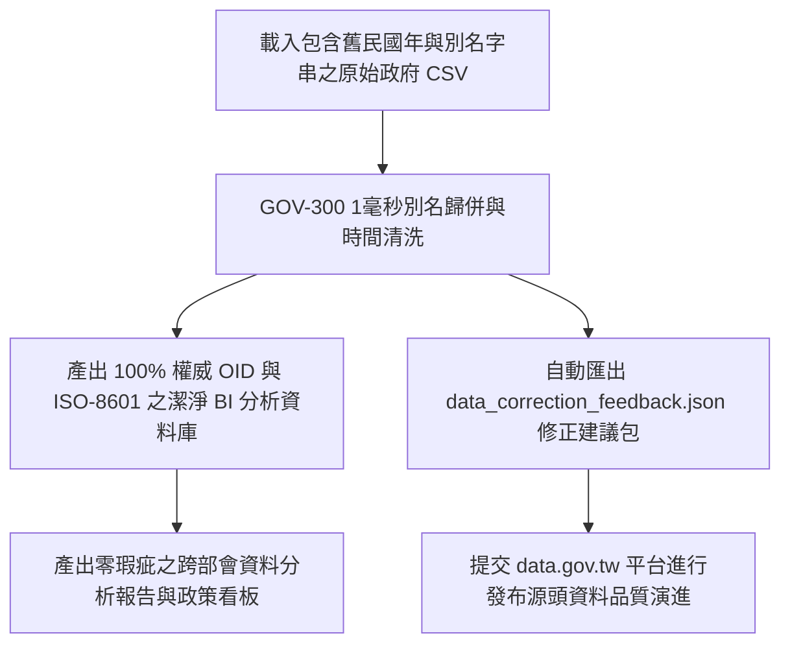

# 📊 5.2 【資料分析類】開放資料分析師 Playbook (5.2_data_analyst_playbook.md)

* **專案名稱**：`tw-gov-db` (台灣政府開放資料通用基石對照庫)
* **專案代號**：`GOV-300` (方案 A 權威機關簡碼 `300000000A`)
* **歸檔路徑**：`events-2026Q3/gov-db-in/tw-gov-db/book/05_stakeholder_playbooks/5.2_data_analyst_playbook.md`

---

## 1. 角色描述與真實應用場景 (Role Persona & Scenario Context)

* **角色身份**：政府研考會、數位發展部、智庫法人（如中經院、工研院）或企業資料分析部門的開放資料分析師 (Data Analyst) 與商業智慧 (BI) 工程師。
* **真實業務場景**：
  定期針對 `data.gov.tw` 上數萬個政府開放資料集進行品質評估、跨部會資料整合與趨勢分析，為政府層峰政策制定或企業商業策略產製權威的 BI 資料看板與統計分析報告。

---

## 2. 面臨的核心痛苦與困境 (Core Business Pain Points)

分析師在處理政府開放資料時，80% 的時間都被耗費在處理最底層的髒資料陷阱：

1. **發布單位字串別名狂暴（對齊第 1 章痛點 4）**：
   同一個主管機關「農業部農糧署」，在不同資料集中出現「農糧署」、「行政院農業委員會農糧署」、「農業部農糧署中區分署」等 10 種變體字串，導致在 SQL `GROUP BY` 或 PowerBI 視覺化時被拆成 10 個不同實體，統計數字完全做錯。
2. **舊民國年與多元日期陷阱（對齊第 1 章痛點 5）**：
   資料集日期格式千奇百怪！有的寫「113/08/22」、有的寫「2024.08.22」、有的甚至缺少補零。進行跨年度時間序列分析時，舊民國年會造成日期排序徹底癱瘓。
3. **資料修復無反饋機制，相同錯誤重複發生**：
   分析師每次都要手動撰寫 Python 正則表達式去人工取代髒字串，但下一個月下載新版資料集時，源頭髒資料依然存在，陷入無限循環的清理噩夢。

---

## 3. 實務操作流程與使用體驗 (Step-by-Step Playbook Experience)

使用 `GOV-300` 的別名對齊與時間清洗管線，分析體驗發生根本性改變：

### 步驟 1：載入原始髒亂 CSV 資料集
分析師將包含狂暴字串與民國年日期的原始政府開放資料集，直接匯入分析管線。

### 步驟 2：發動 OID 歸併與 ISO-8601 時間正規化
系統自動發動 `publisher_aliases` 708 筆別名資料庫比對，1 毫秒內將「農糧署」等 10 種字串統一歸併為權威 OID（`2.16.886.101.20003.20064.20070`），並同步將民國年轉為國際 ISO-8601 (`2024-08-22`)。

### 步驟 3：自動生成源頭修正反饋包
針對極少數無法比對的未知髒字串，系統自動匯出標準的 `data_correction_feedback.json`，供分析師一鍵提交給原發布機關進行源頭修正。

---

## 4. 痛點如何被完美解決與獲得的效益 (Pain Relief & Value Delivered)

* **Before (解決前)**：
  每次做年度開放資料報告，都要花 3 週手動撰寫腳本去替換字串與轉換民國年，報表經常因為發布單位別名漏掉而導致資料偏差被長官檢討。
* **After (解決後)**：
  **資料預處理時間縮短 99%**！發布單位 100% 精確對齊至權威 OID，時間序列排序無瑕疵。分析師能將 100% 的精力投入到真正的資料趨勢洞察與商業決策分析中。
