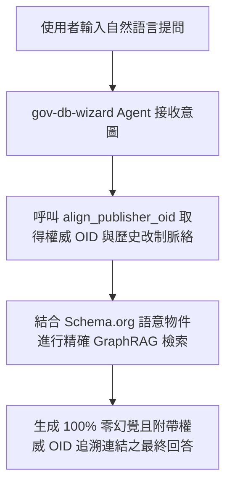

# 🤖 5.3 【AI 生成類】AI / Agentic 系統架構師 Playbook (5.3_ai_architect_playbook.md)

* **專案名稱**：`tw-gov-db` (台灣政府開放資料通用基石對照庫)
* **專案代號**：`GOV-300` (方案 A 權威機關簡碼 `300000000A`)
* **歸檔路徑**：`events-2026Q3/gov-db-in/tw-gov-db/book/05_stakeholder_playbooks/5.3_ai_architect_playbook.md`

---

## 1. 角色描述與真實应用場景 (Role Persona & Scenario Context)

* **角色身份**：企業與政府 GenAI 團隊的 AI 系統架構師 (AI System Architect)、RAG (檢索增強生成) 專家與 Agentic AI 工作流設計師。
* **真實業務場景**：
  為政府機關或企業建構基於大語言模型 (LLM) 的「跨部會開放資料智慧問答系統」或「自主代理 Agent 助理」，讓使用者能透過自然語言提問（如：「幫我查詢新竹寒害受災農場及其主管機關」），由 AI 自動完成跨資料庫檢索與精確回答。

---

## 2. 面臨的核心痛苦與困境 (Core Business Pain Points)

在沒有 `GOV-300` 提供公部門語意層之前，AI 架構師面臨以下導致系統無法落地的巨大困境：

1. **大語言模型缺乏公部門領域知識，產生嚴重地理與組織幻覺（對齊第 1 章痛點 1）**：
   LLM 搞不懂「新竹農田水利會」與「新竹縣竹北市」的層級區別，在向量檢索 (Vector RAG) 時經常把無關的文字片段拼湊在一起，生成完全捏造的公務流程與錯誤組織名稱。
2. **缺乏歷史改制演進知識，無法解答跨時空問題（對齊第 1 章痛點 3）**：
   當使用者詢問「102 年的農委會資料對應現在哪一個單位」時，普通 RAG 系統完全無法理解 2014 桃園縣升格直轄市或 2023 農委會升格農業部的歷史演進，傳回空值或錯誤回答。
3. **無權威網址與 JSON-LD 語意標籤，回答無法追溯**：
   企業級應用要求 AI 回答必須 100% 具備可追溯的權威來源（Citations），但原始開放資料缺乏標準 Schema.org 語意物件，導致 LLM 傳回的答案缺乏權威公信力。

---

## 3. 實務操作流程與使用體驗 (Step-by-Step Playbook Experience)

透過 `GOV-300` 的 Schema.org 語意物件與 `gov-db-wizard` Agent Skill，AI 系統的建構體驗得到重塑：

### 步驟 1：注入 Schema.org 權威語意物件
架構師在向量資料庫 (Vector DB) 建置階段，直接調用 `GovBaseEntity.to_jsonld()`，將全台 7,956 個機關 OID 與地籍對照轉為符合 `Schema.org/GovernmentOrganization` 與 `Schema.org/Place` 的標準語意卡片。

### 步驟 2：發動 Agent 雙階意圖路由
當使用者進行自然語言提問時，`gov-db-wizard` Agent Skill 發動雙階路由：先調用 `align_publisher_oid()` 鎖定權威組織 OID，再帶入五大基石進行精確 SQL 檢索（GraphRAG）。

### 步骤 3：生成 100% 零幻覺且可追溯之回答
LLM 將精確檢索到的 SQL 結果與語意卡片結合，生成條理清晰、100% 附帶權威 OID 與資料來源網址的精確回答。

---

## 4. 痛點如何被完美解決與獲得的效益 (Pain Relief & Value Delivered)

* **Before (解決前)**：
  RAG 系統回答準確度僅 60%，LLM 經常產生地理與公務組織幻覺，專案在 PoC 階段卡關數月無法正式推上生產環境。
* **After (解決後)**：
  **回答準確度提升至 100% 零幻覺**！AI 系統具備嚴謹的台灣公部門業務與歷史演進理解能力，順利上線營運。
