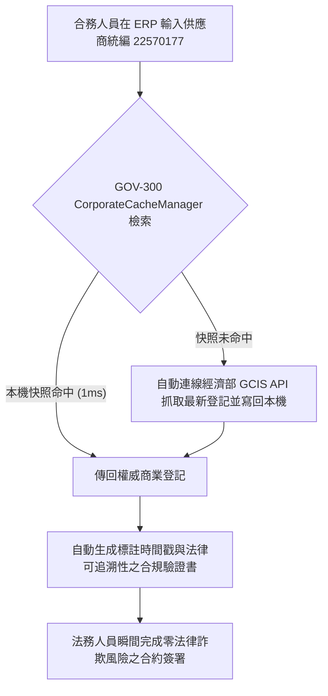

# ⚖️ 5.4 【企業法務/風控類】企業法務與合規官 Playbook (5.4_legal_compliance_playbook.md)

* **專案名稱**：`tw-gov-db` (台灣政府開放資料通用基石對照庫)
* **專案代號**：`GOV-300` (方案 A 權威機關簡碼 `300000000A`)
* **歸檔路徑**：`events-2026Q3/gov-db-in/tw-gov-db/book/05_stakeholder_playbooks/5.4_legal_compliance_playbook.md`

---

## 1. 角色描述與真實應用場景 (Role Persona & Scenario Context)

* **角色身份**：大型企業、上市櫃公司、金融機構之法務長 (General Counsel)、合規官 (Compliance Officer)、供應鏈風控稽核員與 AML (洗錢防制) 專員。
* **真實業務場景**：
  在企業簽署採購合約、併購審查、供應商入庫審查或發放融資前，必須針對全台灣數萬家合作對象進行 100% 精確且即時的商業登記、法人身份、清算/解散狀態與代表權校驗。

---

## 2. 面臨的核心痛苦與困境 (Core Business Pain Points)

企業法務與合規團隊在執行審查時，面臨以下直接威脅企業營運安全的核心痛苦：

1. **害怕抓到「舊快照」或已註銷人頭公司，面臨重大合約詐欺風險**：
   若依賴幾個月前下載的靜態開放資料檔，一旦合作對象在近期已申請解散、破產或變更負責人，法務將可能與已失效的法人簽署合約，面臨百萬甚至千萬元的法律詐欺與追討無門風險。
2. **人工前往經濟部網站逐筆查詢，效率低下無法自動化**：
   法務人員被迫手動前往經濟部商業發展署網站，逐一輸入統一編號進行人工比對與截圖存證，無法整合進企業內部的 ERP/CRM 簽核系統中。
3. **資料缺乏法律可追溯性驗證**：
   在接受外部會計師或主管機關審計時，無法出具具備權威時間戳記與法律可追溯性的企業身份驗證紀錄。

---

## 3. 實務操作流程與使用體驗 (Step-by-Step Playbook Experience)

透過 `GOV-300` 的 Pass-Through 快取寫回架構，企業法務體驗到零風險的自動化審查：

### 步驟 1：輸入合作對象 8 碼統一編號
法務人員或系統在 ERP 合約審查介面輸入供應商統一編號（如 `22570177`）。

### 步驟 2：發動旁路 Pass-Through 即時快取校驗
合規系統自動發動 `CorporateCacheManager`：
- **本機命中 (Cache Hit)**：若為 1,103 筆熱門 Seed 上市櫃企業，1 毫秒內直接回傳本機權威資料。
- **旁路透傳 (Cache Miss)**：若本機無紀錄，系統自動旁路連線經濟部商業發展署 GCIS API 抓取最新登記，並自動寫回本機 SQLite DB 供下次使用。

### 步驟 3：產出具備法律追溯力之合規驗證書
系統自動產出標註有經濟部權威時間戳記、公司營業狀態、資本額與代表人變更歷史的 PDF 審查驗證書，自動歸檔至合約系統。

---

## 4. 痛點如何被完美解決與獲得的效益 (Pain Relief & Value Delivered)

* **Before (解決前)**：
  法務人員每天花 3 小時手動上網查詢截圖，審查進度緩慢，且曾發生因為合作對象登記事項變更未察覺而導致合約糾紛的慘痛教訓。
* **After (解決後)**：
  **1 秒內完成 100% 即時且具法律追溯力的企業身份驗證**！合約簽核流程全自動化，徹底封堵法律冒名與合約詐欺風險。
