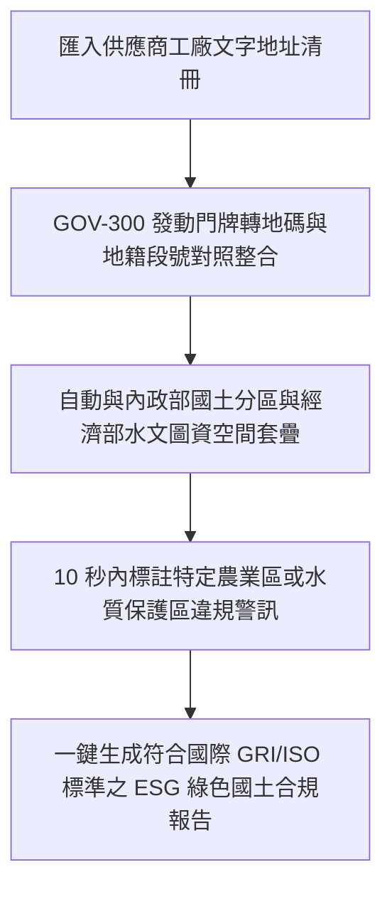

# 🌍 5.5 【綠色永續類】ESG 永續與國土稽核員 Playbook (5.5_esg_consultant_playbook.md)

* **專案名稱**：`tw-gov-db` (台灣政府開放資料通用基石對照庫)
* **專案代號**：`GOV-300` (方案 A 權威機關簡碼 `300000000A`)
* **歸檔路徑**：`events-2026Q3/gov-db-in/tw-gov-db/book/05_stakeholder_playbooks/5.5_esg_consultant_playbook.md`

---

## 1. 角色描述與真實應用場景 (Role Persona & Scenario Context)

* **角色身份**：ESG 永續發展顧問、企業碳盤查師、綠色供應鏈稽核員與國土利用規劃師。
* **真實業務場景**：
  協助大型企業進行綠色供應鏈實地稽核，評估全台數百家供應商工廠是否違規佔用「特定農業區」、建在「水質水量保護區」或存在環境污染裁罰紀錄，產出符合國際 ISO 14064 與 GRI 永續報導標準的國土合規報告。

---

## 2. 面臨的核心痛苦與困境 (Core Business Pain Points)

ESG 稽核員在評估供應鏈土地合規時，經常卡在跨部會圖資無法空間連線的硬傷：

1. **工廠只有文字地址，國土與農地圖資只有地籍段號（對齊第 1 章痛點 7）**：
   企業提供的供應商清冊只有門牌地址（如「彰化縣和美鎮彰美路六段 100 號」），而內政部的國土利用分區與農業部的農地劃分全是地籍段號 (`cadastral_id`)。兩者無法在試算表中 `JOIN`，導致稽核員無法判斷該工廠是否合法。
2. **人工前往地政機關與 GIS 系統摸底，昂貴且耗時數週**：
   為了確認數百家工廠的土地分區，稽核員必須人工逐筆申請謄本或開啟專業 GIS 軟體手動描繪點位，一份合規報告光是土地稽核就要花費數週時間與高額規費。
3. **無法應對國際供應鏈客戶的突擊綠色稽核**：
   當歐美國際大廠要求在 48 小時內出具全體台灣供應商的綠色國土合規證明時，傳統的人工摸底流程完全無法滿足即時回應需求。

---

## 3. 實務操作流程與使用體驗 (Step-by-Step Playbook Experience)

透過 `GOV-300` 的基石二門牌地碼與地籍段號自動對照整合，稽核體驗實現自動化：

### 步驟 1：輸入供應商工廠文字地址清冊
稽核員將包含全台供應商工廠文字地址的清冊 Excel，一次性匯入 ESG 稽核系統。

### 步驟 2：門牌地碼與地籍段號 1 秒自動轉換
系統發動 `zipcode_registry` 與門牌轉換服務，1 秒內將文字地址精確轉為 EPSG:4326 經緯度座標與正則化地籍段號 (`cadastral_id`)。

### 步驟 3：跨部會國土分區與保護區空間套疊
系統自動帶入地號與內政部 `a13_land_use_zones`（國土利用分區）及經濟部水利署集水區圖資進行 1 毫秒空間對對，自動標註「特定農業區違規點位」與「水質保護區警訊」。

---

## 4. 痛點如何被完美解決與獲得的效益 (Pain Relief & Value Delivered)

* **Before (解決前)**：
  每次進行供應鏈綠色稽核，都要花 3 週時間與數萬元規費去申請謄本與比對 GIS 圖資，報告產製昂貴且經常錯過客戶審核期限。
* **After (解決後)**：
  **10 秒內自動完成全全台供應商的國土合規比對**！協助企業極速通過歐美國際大廠的突擊式綠色供應鏈審查，鎖定永續商業訂單。
