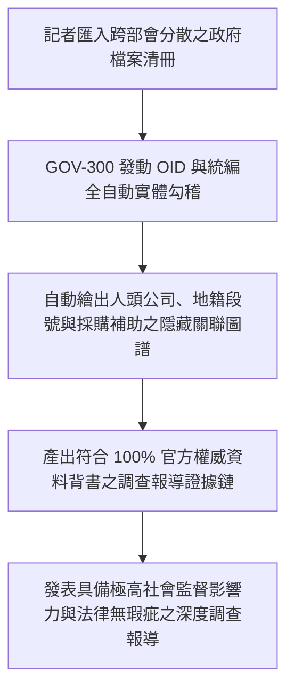

# 📰 5.6 【調查媒體類】資料新聞記者 Playbook (5.6_data_journalist_playbook.md)

* **專案名稱**：`tw-gov-db` (台灣政府開放資料通用基石對照庫)
* **專案代號**：`GOV-300` (方案 A 權威機關簡碼 `300000000A`)
* **歸檔路徑**：`events-2026Q3/gov-db-in/tw-gov-db/book/05_stakeholder_playbooks/5.6_data_journalist_playbook.md`

---

## 1. 角色描述與真實應用場景 (Role Persona & Scenario Context)

* **角色身份**：資料新聞記者 (Data Journalist)、調查報導團隊（如報導者、鏡週刊調查組）、非營利監督媒體與公共政策研究員。
* **真實業務場景**：
  針對社會關心的重大公共議題（如：違規休閒農場侵占國有地、特定企業反複違規裁罰卻持續獲得政府採購補助、跨部會公務採購權責歸屬）進行基於資料的深入調查報導。

---

## 2. 面臨的核心痛苦與困境 (Core Business Pain Points)

調查記者在透過資料挖掘社會真相時，面臨資料庫被嚴重撕裂的現實痛苦：

1. **不同部會資料庫完全撕裂，無法建立可追溯的證據鏈（對齊第 1 章痛點 8）**：
   記者手上有農業部的休閒農場名冊、經濟部的公司登記、內政部的地籍圖與財政部的採購標案。因為各部會資料庫格式不一，且缺乏統一的鍵值，記者無法在表格中發動跨部會實體勾稽。
2. **機關別名混亂導致報導事實出現瑕疵（對齊第 1 章痛點 4）**：
   在追查公務採購與裁罰權責時，發布機關名稱字串混亂（如「農糧署」與「農業部農糧署」），若記者未精確歸併，容易在報導中寫錯主導機關，面臨被報導單位更正或提告的法律風險。
3. **缺乏客觀權威資料背書，調查報導權威性受質疑**：
   若報導中的資料比對過程缺乏嚴謹的系統性驗證，容易被質疑是新聞媒體的自行推測，削弱了調查報導的社會監督力。

---

## 3. 實務操作流程與使用體驗 (Step-by-Step Playbook Experience)

利用 `GOV-300` 的全政府 OID 組織樹與實體對照整合鍵，記者能輕鬆挖出資料背後的真相：

### 步驟 1：建立跨部會調查主題對照清冊
記者將收集到的農業部農場名冊、經濟部統編與採購標案 CSV 匯入調查分析工具。

### 步驟 2：發動 OID 組織樹與企業統編全自動勾稽
系統自動透過 `master_agencies` OID 歸並行布機關，並帶入 8 碼企業統編（`tax_id`）與地籍段號（`cadastral_id`）進行跨部會資料連鎖 `JOIN`。

### 步驟 3：產出具備權威證據力之關聯圖譜與資料鏈
系統自動繪出「違規農場 ➔ 控股公司統編 ➔ 地籍特定農業區 ➔ 政府採購補助」的完整關聯圖譜，並自動標註可追溯的官方資料來源網址。

---

## 4. 痛點如何被完美解決與獲得的效益 (Pain Relief & Value Delivered)

* **Before (解決前)**：
  記者花費數月時間在各種 Excel 表格中人工比對，經常因為機關別名看錯或地號對不起來而放棄調查，或因為報導細節瑕疵而被指控不實。
* **After (解決後)**：
  **10 秒內建立 100% 嚴謹且可追溯的跨部會權威證據鏈**！大幅降低調查報導的門檻與法律風險，讓資料新聞成為監督社會公義的利器。
