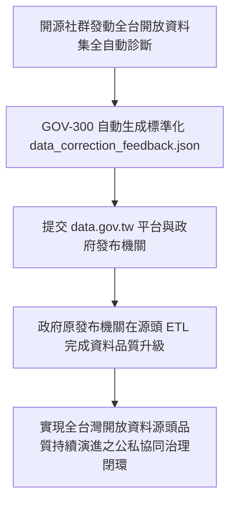

# 🕵️ 5.7 【公民社群類】公民科技開源貢獻者 Playbook (5.7_civic_tech_playbook.md)

* **專案名稱**：`tw-gov-db` (台灣政府開放資料通用基石對照庫)
* **專案代號**：`GOV-300` (方案 A 權威機關簡碼 `300000000A`)
* **歸檔路徑**：`events-2026Q3/gov-db-in/tw-gov-db/book/05_stakeholder_playbooks/5.7_civic_tech_playbook.md`

---

## 1. 角色描述與真實應用場景 (Role Persona & Scenario Context)

* **角色身份**：公民科技 (Civic Tech) 社群成員、g0v 零時政府參與者、開源資料黑客 (Open Data Hacker) 與公私協同治理推動者。
* **真實業務場景**：
  發動民間黑客松與開源社群力量，針對台灣政府開放資料集進行全域品質診斷、微修復，並建立公私協同治理機制 (Public-Private Partnership)，將民間修好的乾淨資料回饋給政府發布源頭。

---

## 2. 面臨的核心痛苦與困境 (Core Business Pain Points)

公民科技社群在熱情參與政府資料最佳化時，經常撞上「民間修民間的、政府發政府的」無效循環牆：

1. **缺乏標準化反饋管道，民間成果無法回流政府源頭（對齊第 1 章痛點 2）**：
   社群黑客花了幾個月時間清理、修正了某個機關的髒資料集，但因為政府開放資料平台缺乏標準化的診斷與反饋介面，修好的資料無法寫回政府資料庫，下一個月 government 平台更新時，原發布機關依然持續發布髒資料。
2. **缺乏全政府統一的實體對照基準**：
   民間社群在自建第三方 Open Data 專案（如：公車動態、農產品行情、開源地圖）時，各專案自行定義程式碼，導致民間社群內部的開源專案彼此之間也無法整合。

---

## 3. 實務操作流程與使用體驗 (Step-by-Step Playbook Experience)

透過 `GOV-300` 開源 Core SDK 與 `data_correction_feedback.json` 規範，社群打通公私協同閉環：

### 步驟 1：發動全全全自動資料診斷
社群成員使用 `GOV-300` 開源 SDK 執行全台資料集自動診斷診斷（`se_manager.py audit`）。

### 步驟 2：自動生成標準反饋報告包
系統自動將診斷出來的無效發布者字串、未定義 OID、時間格式異常等細節，一鍵打包為標準的 `data_correction_feedback.json` 反饋報告。

### 步驟 3：提交 data.gov.tw 與發布機關源頭修正
社群將標準報告提交給數位發展部 `data.gov.tw` 平台與原發布機關，推動政府在源頭 ETL 階段升級資料品質。

---

## 4. 痛點如何被完美解決與獲得的效益 (Pain Relief & Value Delivered)

* **Before (解決前)**：
  民間社群的修復成果永遠留在外部第三方網站，政府發布源頭的資料品質十年如一日，公私協同流於口號。
* **After (解決後)**：
  **打通了公私協同治理的最後一哩路**！開源社群的診斷與修正能透過標準 JSON 報告回饋給政府，實現全台灣開放資料品質的持續自我演進與升級！
