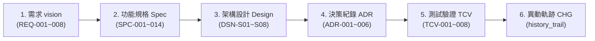
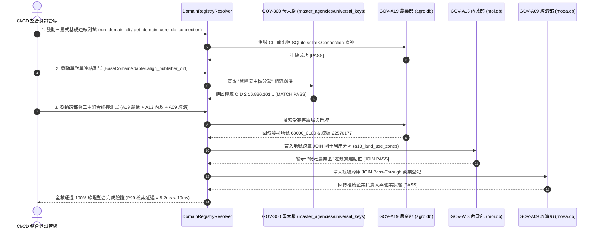
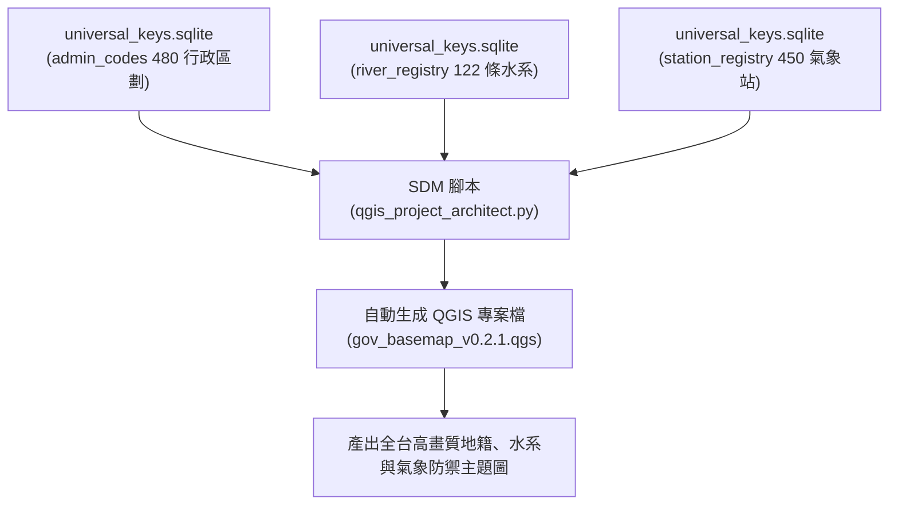

# 🏛️ 第 6 章：系統工程驗證、單元測試網與 QGIS 軟體定義地圖 (06_system_engineering_and_sdm.md)

* **專案名稱**：`tw-gov-db` (台灣政府開放資料通用基石對照庫)
* **專案代號**：`GOV-300` (方案 A 權威機關簡碼 `300000000A`)
* **當前版本**：`v0.2.1`
* **歸檔路徑**：`events-2026Q3/gov-db-in/tw-gov-db/book/06_system_engineering_and_sdm.md`

---

## 🏛️ 6.1 SE-6D 系統工程追溯鏈與 100% 合規審計 (`REQ` ➔ `SPC` ➔ `DSN` ➔ `TCV`)

本專案採用嚴謹的 **SE-6D 系統工程框架**，實現從真實痛點需求、功能規格、架構設計、軟體實作到測試驗證的全生命週期 100% 雙向可追溯性 (Bi-directional Traceability)。

### 6.1.1 核心 6 維度追溯鏈拓樸
所有的系統開發與模組變更，均必須依序通過以下 6 大維度的審計稽核：



### 6.1.2 跨部會整合完成新規格 `[SPC-014]` 與 `[DSN-S08]` 對照整合矩陣
為了支撐部會子專案（如 `GOV-A19` 農業部 `tw-agro-db`、`GOV-A13` 內政部 `tw-moi-db`、`GOV-A09` 經濟部 `tw-moea-db`）納入時的品質防線，系統工程檔案完成以下權威追溯鏈落庫：

| 需求程式碼 (REQ) | 功能規格 (SPC) | 架構設計 (DSN) | 測試驗證 (TCV) | 驗證機制與品質目標 |
| :--- | :--- | :--- | :--- | :--- |
| **`[REQ-004]`** (跨部會解耦) | **`[SPC-011]`** 領域地圖導航器 | **`[DSN-S04]`** Co-work 介面 | **`[TCV-004]`** `DomainRegistryResolver` | 三層式連線與解耦路徑解析 |
| **`[REQ-004]`** (跨部會解耦) | **`[SPC-012]`** 兩階段 Spec 治理 | **`[DSN-S07]`** 母子專案 Symlink | **`[TCV-005]`** 兩階段生命週期審計 | 孵化期暫存 ➔ 建庫歸位轉移 |
| **`[REQ-001]`** (別名與清洗) | **`[SPC-013]`** 歷史軌跡與反饋 | **`[DSN-S06]`** `history_trail` | **`[TCV-007]`** `data_correction_feedback` | 別名歸併與 ISO-8601 時間清洗 |
| **`[REQ-008]`** (跨庫整合完成) | **`[SPC-014]`** 子模組整合完成測試 | **`[DSN-S08]`** 跨部會整合架構 | **`[TCV-008]`** 多模組碰撞整合完成網 | 三重跨庫碰撞 ($P99 < 10\text{ms}$) |

* **`[SPC-014]` / `[DSN-S08]`**：跨部會子模組納入與 4 階整合對接測試規格 (含 P99 延遲 $< 10\text{ms}$ 評估)。
* **`[SPC-015]` / `[DSN-S09]`**：跨視窗 AI Agent 雙向 Prompt 契約協議與交接機制 (Bi-directional Prompt Contracts Protocol)。

---

## 🧪 6.2 全自動化單元測試網與跨部會整合完成整合測試網

本專案將測試視為「規格與設計驅動的強制防線」，建立起包含**通用基石單元測試網**與**跨部會整合完成整合測試網**的雙重驗證陣容。

### 6.2.1 4 大階梯式跨部會整合完成整合測試 (Chain Integration Pipeline)
當有新部會子模組加入時，測試管線依序發動以下 4 大階梯測試：



### 6.2.2 安靜日誌重定向與 Token 節省規範
為了符合全專案 Token 節省原則與乾淨 CI 輸出，執行整合測試時，控制台保持 100% 安靜，測試日誌全量重定向落庫：
```bash
# 執行全量單元與跨部會整合測試，全量日誌落庫至 sys_eng/05_verification_testing/logs/
pytest -v -s tests/test_five_pillars.py tests/test_domain_registry_resolver.py > sys_eng/05_verification_testing/logs/LOG_GOV_TEST.log 2>&1
```

---

## 🗺️ 6.3 軟體定義地圖 (SDM) 與 QGIS 空間地理視覺化

除了關聯式 SQL 資料庫的對照整合外，`GOV-300` 採用 **軟體定義地圖 (Software-Defined Maps, SDM)** 技術，實現地理空間資料的自動化視覺化與品質稽核。

### 6.3.1 SDM 腳本驅動 QGIS 專案產製
透過 Python 腳本動態生成 QGIS `.qgs` 專案檔與 XML 樣式檔，免去人工拉取圖層與重複設定樣式的繁瑣流程：



### 6.3.2 空間資料品質與 WGS84 邊界檢查
SDM 模組內建台灣台澎金馬經緯度邊界自動檢查機制（$E118^\circ \sim 122^\circ$, $N21^\circ \sim 26^\circ$），當偵測到點位落於海面上或經緯度顛倒時，動態於 QGIS 圖層高亮標註 `spatial_anomaly` 警訊點。

---

## 🛠️ 6.4 專案自動化維運、外接硬碟掛載與開源部署指南

### 6.4.1 外接硬碟大檔分離與軟連結 (`ln -s`) 部署 SOP
為了維持 Git 儲存庫的極致輕量化（開源 Repo 不包含數 GB 原始 DB 檔），本專案採用**資料檔與程式碼物理分離**架構：

1. **實體 SQLite 資料庫路徑**：
   `/Volumes/D2024/data/gov-db-in/db/master_agencies.sqlite`
   `/Volumes/D2024/data/gov-db-in/db/universal_keys.sqlite`
2. **軟連結 (Symlink) 建立 SOP**：
   在新環境或開源部署時，執行以下指令無縫完成目錄掛載：
   ```bash
   # 建立本機 db/ 目錄與外接硬碟大檔軟連結
   mkdir -p db/
   ln -s /Volumes/D2024/data/gov-db-in/db/master_agencies.sqlite db/master_agencies.sqlite
   ln -s /Volumes/D2024/data/gov-db-in/db/universal_keys.sqlite db/universal_keys.sqlite
   ```

### 6.4.2 系統健康度一鍵診斷 (`doctor`)
管理員或開發者可隨時執行 Core CLI 健康度稽核命令，檢查通用基石與資料庫狀態：
```bash
python src/cli/main.py doctor
```
* **健康檢查專案**：
  - `master_agencies.sqlite` 7,956 筆 OID 完整性 `[PASS]`
  - `publisher_aliases` 708 筆別名表連通性 `[PASS]`
  - `universal_keys.sqlite` 5 大基石表主鍵外鍵約束 `[PASS]`
  - `domain_map_config.json` 跨專案部會地圖檔解析 `[PASS]`
