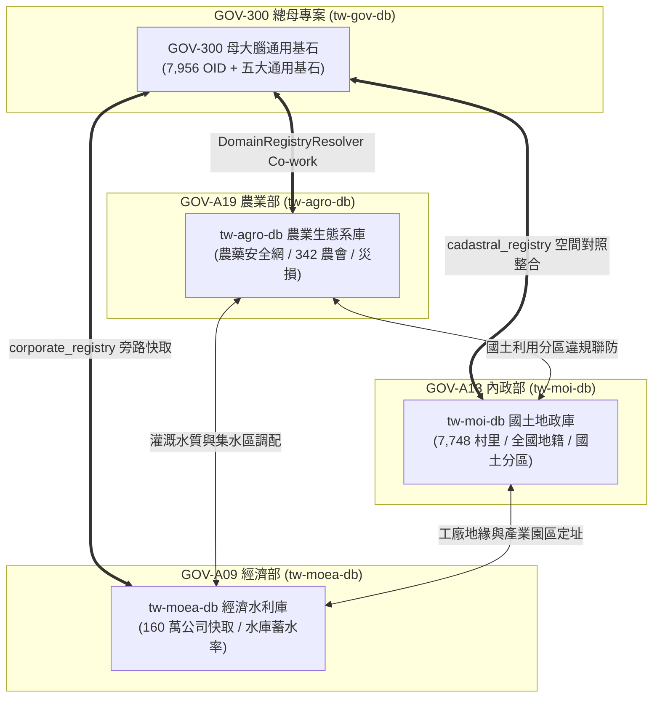

# 🏛️ 第 7 章：結語與跨部會生態系展望 (07_conclusion.md)

* **專案名稱**：`tw-gov-db` (台灣政府開放資料通用基石對照庫)
* **專案代號**：`GOV-300` (方案 A 權威機關簡碼 `300000000A`)
* **當前版本**：`v0.2.1`
* **歸檔路徑**：`events-2026Q3/gov-db-in/tw-gov-db/book/07_conclusion.md`

---

## 7.1 結語：打破跨部會資料孤島的通用基石底座

`GOV-300` (台灣政府開放資料通用基石對照庫) 的誕生，標誌著台灣政府開放資料從「單點散落的二維試算表 (CSV/JSON)」走向「跨部會語意互通與 Agentic AI 智慧對照整合」的關鍵里程碑。

透過成功建置全台灣 **7,956 個官方權威機關 OID 組織樹**、**708 筆別名自動對齊庫**，以及包含 **「組織 OID、空間地籍、水系氣象、法人企業、時間時序」** 在內的 **五大通用基石 (5 Baseline Cornerstones)**，`GOV-300` 徹底攻克了第 1 章提出的 8 大真實血淚痛點。

這不僅大幅降低了政府第一線公務員、資料分析師與企業合規團隊的資料預處理成本，更為全台灣生成式 AI (GenAI) 與 GraphRAG 應用提供了 100% 零幻覺的權威 Grounding 基石。

---

## 7.2 延伸展望：從 `GOV-300` 到全台大資料黃金三角生態系系

`GOV-300` 作為總母大腦，並非孤立運作的資料庫，而是全台灣跨部會資料生態系系的核心樞紐。

未來將持續深化與 **`GOV-A19` (農業部 `tw-agro-db`)**、**`GOV-A13` (內政部 `tw-moi-db`)**、**`GOV-A09` (經濟部 `tw-moea-db`)** 等部會子專案的分散式協同，構建「全台灣開放資料黃金三角大聯盟」：

透過這種開源、分散式且兼具單一真實來源 (Single Source of Truth) 的軟體架構，台灣將邁向資料驅動、公私協同治理與 Agentic AI 輔助決策的新時代！
