# 📘 《台灣政府開放資料通用基石圖鑑：從權威機關到跨部會基石的資料治理體系》全書目錄 (00_toc.md)

* **專案名稱**：`tw-gov-db` (台灣政府開放資料通用基石對照庫)
* **專案代號**：`GOV-300` (方案 A 權威機關簡碼 `300000000A`)
* **受控版本**：`v0.2.1`
* **歸檔目錄**：`events-2026Q3/gov-db-in/tw-gov-db/book/00_toc.md`

---

## 📚 專書目錄地圖與章節寫作意圖 (Writing Intentions)

### **[第 0 章：全書目錄與導覽](events-2026Q3/gov-db-in/tw-gov-db/book/00_toc.md)**
* 🎯 **本章寫作意圖**：為全書提供全景導覽地圖，明確標示受控版本號 (`v0.2.1`) 與開源聲明，讓讀者與 AI Agent 在第 1 秒即可定位所需的資料治理模組與開源技術資產。

---

### **[第 1 章：專案願景與台灣政府數位轉型使命](01_vision_and_mission.md)**
* 🎯 **本章寫作意圖**：透過真實台灣公務與產學研第一線的資料慘痛碰撞案例，深刻揭露跨部會開放資料現存的 8 大現實痛點，並建立 `GOV-300` 母專案與部會子專案架構的開源願景。
  - **1.1 台灣跨部會開放資料的 8 大真實痛點與血淚情境**
    - 🎯 *寫作意圖*：以第一線資料分析與系統整合情境，真實還原 8 大血淚痛點：
      1. **【痛點 1：缺乏整體系統架構與知識圖譜連結】**：全台資料多為單點散落的二維試算表 (CSV/JSON)，缺乏可進行跨模組關聯、知識導航與 GraphRAG 零幻覺 Grounding 的大一統知識圖譜與通用基石架構。
      2. **【痛點 2：缺乏資料品質自動診斷與跨庫串聯使用之通用工具鏈】**：缺乏自動診斷發布者別名、文字型民國年與空間偏離之工具，亦缺乏標準開源 SDK/CLI 工具連線串聯，導致開發者重複撰寫髒亂的一次性腳本。
      3. **【痛點 3：缺乏資料錯誤脈絡與行政程式碼/組織改制之歷史演進圖譜】**：缺乏講述資料錯誤脈絡的歷史圖譜（如 2014 桃園升格、農委會升格農業部），導致開發者無從釐清異常資料究竟是人為錯誤還是歷史改制遺留。
      4. **【痛點 4：跨部會資料孤島與同名異義陷阱】**：農業部「新竹水利會」與內政部「新竹縣竹北市」在地理空間與組織 OID 上完全脫鉤，導致氣象寒害與災害救助統計無法一毫秒碰撞。
      5. **【痛點 5：發布單位別名混亂與異質字串狂暴】**：data.gov.tw 上同一個機關在不同資料集中出現「農糧署」、「行政院農業委員會農糧署」、「農業部農糧署作物生產組」等 10 種字串，字串比對 100% 失敗。
      6. **【痛點 6：舊民國年格式與時間字串陷阱】**：資料集中混雜「113/08/22」、「1130822」、「2024-08-22」與「113.8.22」，直接導致 SQL 日期排序與 GraphRAG 時間軸建構癱瘓。
      7. **【痛點 7：巨量 CSV 全量載入與記憶體/DB 儲存膨脹障礙】**：每次執行分析都要重新下載 180MB 包含 160 萬公司登記或全台門牌的大表，導致本機記憶體爆掉、SQLite 膨脹至數 GB。
      8. **【痛點 8：缺乏統一地籍、門牌與水系空間對照整合鍵】**：農業部休閒農場只有中文地址，內政部地籍圖只有段號（如成功段 100 號），兩者無法在 GIS 地圖或 SQL 表格中直連比對。
  - **1.2 建立大一統母專案與部會子專案 (`GOV-300` ↔ `GOV-A19` / `GOV-A13` / `GOV-A09`) 的開源價值**
    - 🎯 *寫作意圖*：論述以 `GOV-300` 為通用底座、部會為領域子專案的「分散式協同」架構優勢，定義開放資料庫之開源社會價值與工具鏈賦能。

---

### **[第 2 章：GOV-300 母大腦全景架構、系統中繼與通用基石解構](02_architecture_overview.md)**
* 🎯 **本章寫作意圖**：系統化解構 `GOV-300` 的核心軟體架構、方案 A 子專案權威命名規範、Sys Meta/attributes_json 動態屬性擴充機制、雙軌瘦身機制與三層式跨專案 Co-work 協作模式。
  - **2.1 五大通用基石 (5 Baseline Cornerstones) 語意標準解構**
    - 🎯 *寫作意圖*：定義全台政府資料對照整合之 5 大必備通用鍵（基石一：組織OID/別名、基石二：行政區劃/地籍、基石三：水系/氣象測站、基石四：法人企業/農會、基石五：時間/日曆）。
  - **2.2 子專案方案 A 權威命名規範 (Option A Naming Taxonomy: `GOV-[CODE]`)**
    - 🎯 *寫作意圖*：解構子專案與領域代號的方案 A 權威命名邏輯。說明如何結合 **Prefix (GOV) + 官方行政院部會簡碼 (300 總母專案, A19 農業部, A13 內政部, A09 經濟部)**，建立全台灣跨部會專案的一致性簡碼代號與對照地圖 (`domain_map_config.json`)。
  - **2.3 Sys Meta、修訂履歷追溯與原始資料源反饋機制 (`[SPC-006, SPC-013]`)**
    - 🎯 *寫作意圖*：解構 `attributes_json` 欄位設計哲學與資料修訂治理。說明如何利用半結構化 JSON 儲存受控版號 (`spec_version: "0.2"`)、修訂履歷軌跡 (`history_trail` 紀錄修到哪邊、修了什麼與套用的清洗規則)、非結構化補充屬性與系統層 Sys Meta，並透過 `export_data_feedback()` 生成標準 `data_correction_feedback.json` 反饋報告供原始資料提供機關進行源頭修正。
  - **2.4 雙軌瘦身架構 (Dual Optimization Architecture)**
    - 🎯 *寫作意圖*：說明如何透過法規虛擬層 (`agency_mandates` 0MB) 與企業旁路透傳快取 (`Pass-Through Cache`)，將本機 DB 體積自 180MB 精簡至 5MB，兼具離線穩定與線上即時性。
  - **2.5 三層式跨專案 Co-work 協作模式 (`DomainRegistryResolver`)**
    - 🎯 *寫作意圖*：介紹 `DomainRegistryResolver` 導航器，示範母子專案如何於 CLI 工具層、Core DB 實體直連層與 Library 免安裝動態注入層實現雙向無縫協作。
  - **2.6 GOV-300 核心函式庫與核心支援功能全景概覽 (Core SDK & Infrastructure Services)** ★核心函式庫專節
    - 🎯 *寫作意圖*：全局解構 `GOV-300` 提供給全系統與所有子專案的 4 大通用核心函式庫：
      1. **`GovBaseEntity` (基底實體類別)**：提供 `spec_version: "0.2"`、`attributes_json` 透明讀寫與 民國年 ➔ ISO-8601 時間清洗。
      2. **`BaseDomainAdapter` (領域適配器基底)**：提供全政府 `align_publisher_oid()` 發布者別名對齊與預設 CRUD 介面。
      3. **`DomainRegistryResolver` (領域導航解析器)**：提供跨專案 CLI、DB 直連與 Library 動態注入三層 Co-work SDK。
      4. **`VirtualLawAdapter` & `CorporateCacheManager` (虛擬與旁路快取適配器)**：提供法規條文虛擬化檢索 (0MB) 與企業統編旁路快取。

---

### **[第 3 章：GOV-300 核心資料庫與 12 大實體表圖鑑百科](03_db_glossary.md)**
* 🎯 **本章寫作意圖**：作為開發者與資料工程師的「全量實體對照百科全書」。詳細剖析 `master_agencies.sqlite` (4 張表) 與 `universal_keys.sqlite` (8 張表) 共 **12 大實體資料表** 的 DDL 欄位設計、`attributes_json` 實體應用、索引最佳化、外鍵關係與追溯管線。
  
  #### **Part A: `master_agencies.sqlite` 權威機關與領域註冊庫 (4 大實體表)**
  - **3.1 機關權威主檔表 (`master_agencies`)**
    - 🎯 *寫作意圖*：解構全台 7,956 筆官方權威 OID（含組織樹父子關聯 `parent_oid`、層級 `level_type` 與 `attributes_json` 中的地址、DN 與 spec_version）之 Schema。
  - **3.2 機關處務規程與法定職掌虛擬表 (`agency_mandates`)**
    - 🎯 *寫作意圖*：說明法規虛擬層 (Virtual Law Layer) 之 Schema 結構，解構本機 0MB 開銷連線 PostgreSQL/law_db MCP 查詢處務規程之原理。
  - **3.3 發布機關別名對照表 (`publisher_aliases`)**
    - 🎯 *寫作意圖*：詳述 708 筆 data.gov.tw 異質發布名稱對齊至 OID 的 `confidence_score` (1.0/0.9/0.8) 與 `attributes_json` 匹配標籤。
  - **3.4 部會子專案實體展開註冊表 (`domain_deployments`)**
    - 🎯 *寫作意圖*：揭露部會子專案 (`tw-agro-db`, `tw-moi-db`) 於母專案註冊之相對路徑 `repo_path`、根 OID 與 `attributes_json` 維護團隊標籤。

  #### **Part B: `universal_keys.sqlite` 五大通用基石庫 (8 大實體表)**
  - **3.5 行政區劃主檔表 (`admin_codes`)** [基石二]
    - 🎯 *寫作意圖*：解析 480 筆 6 碼國家標準行政區劃程式碼 (22 縣市 + 368 鄉鎮市區) 之權威定址 Schema。
  - **3.6 全國地籍段名段號表 (`cadastral_registry`)** [基石二]
    - 🎯 *寫作意圖*：解析全台地籍段名與段程式碼正則化 `cadastral_id` 的實體 Schema 與索引設計。
  - **3.7 郵遞區號與地址對照表 (`zipcode_registry`)** [基石二]
    - 🎯 *寫作意圖*：解析 372 筆 3 碼本機郵遞區號實體表，並說明如何與 6 碼線上投遞區號進行介面整合。
  - **3.8 水系河川主檔表 (`river_registry`)** [基石三]
    - 🎯 *寫作意圖*：剖析 122 條國家水系與主幹流域程式碼 (`river_id`) 之全台水文定址 Schema。
  - **3.9 氣象與環境監測站點主檔表 (`station_registry`)** [基石三]
    - 🎯 *寫作意圖*：剖析 450 個中央氣象署與環境部官方測站 (經緯度 WGS84、測站類型 `WEATHER`/`WATER_QUALITY`) 之空間 Schema。
  - **3.10 法人與企業旁路透傳快取表 (`corporate_registry`)** [基石四]
    - 🎯 *寫作意圖*：詳述 1,103 筆熱門 Seed 上市/國營企業快取表，解構 TTL 淘汰機制與 GCIS API Pass-Through Cache 模式。
  - **3.11 農會與非營利組織法人主檔表 (`npo_registry`)** [基石四]
    - 🎯 *寫作意圖*：解析 23,218 筆依法登記 NGO、基金會與 342 家農漁會法人程式碼與地址 Schema。
  - **3.12 行政機關辦公日曆表 (`calendar_registry`)** [基石五]
    - 🎯 *寫作意圖*：解析 1,801 筆 2013-2028 跨越 16 年政府辦公日曆（含放假日 `is_holiday`、法定上班日 `is_working_day`、補班日判定）、純 Python 緊湊農曆（1900-2100 年雙向轉換、生肖天干地支、傳統三大節）與二十四節氣天文演演算法之時序 Schema。

  #### **Part C: 追溯與擴充中繼管線**
  - **3.13 實體表 `attributes_json` 欄位解析器與 SDK 動態讀寫指南 (`GovBaseEntity`)**
    - 🎯 *寫作意圖*：介紹 Core SDK `GovBaseEntity.to_json()` 與 `from_json()` 如何透明解析與寫入 `attributes_json` 中的 Sys Meta。
  - **3.14 資料來源追溯中繼檔 (`datasource_metadata.json`) 與 CI/CD**
    - 🎯 *寫作意圖*：說明如何將資料來源追溯解耦至獨立 JSON 檔案，確保 SQLite Schema 純粹性並支援 Git-friendly 版號控管。

---

### **[第 4 章：跨部會 Synergy 協同合約與 Spec 權責檔案治理專章](04_synergy_contracts/4.0_overview_and_spec_governance.md)**
* 🎯 **本章寫作意圖**：作為所有部會子專案對接母專案 `GOV-300` 的「權威跨部會協同介面與 Spec 權責檔案治理專章」。採用**目錄化多獨立檔案結構 (`04_synergy_contracts/`)** 與 **8 大標準結構區塊**。詳細解構母子專案在 Spec 權責劃分、CLI 手冊、AI Agent 工作流、Single Source of Truth 與兩階段生命週期（孵化 ➔ 歸位）上的治理機制。
  - **[4.0 母子專案 Spec 權責劃分、生命週期與 AI 導航規範](04_synergy_contracts/4.0_overview_and_spec_governance.md)**
    - 🎯 *寫作意圖*：解構第 4 章 8 大寫作結構區塊、AI Agent 導航框架與兩階段生命週期治理機制 (`[SPC-012]`)。
  - **[4.G00 全政府通用基石跨部會服務協同合約 (SYN-GOV-G00)](04_synergy_contracts/4.G00_spec_universal_keys_synergy.md)**
    - 🎯 *寫作意圖*：**【全域基石核心契約】** 正式發布五大通用基石 (G10-G60) 之跨部會服務契約、Python API Direct Import 與 CGS v2.4 UNIX Pipeline 雙軌規範。
  - **[4.A19 GOV-A19 農業部 (tw-agro-db) 跨專案協同合約](04_synergy_contracts/4.A19_spec_gov_a19_synergy.md)**
    - 🎯 *寫作意圖*：**【實體子專案已建立】** 完整示範！收錄農業部 Spec 摘要框架、`agro_cli.py` 連結、342 農會歸併、6 碼門牌反查、450 氣象站寒害預警與 `agro-db-wizard` Agent Skill 附件。
  - **[4.A21 GOV-A21 金管會 (tw-fsc-db) 跨專案協同合約](04_synergy_contracts/4.A21_spec_gov_a21_synergy.md)**
    - 🎯 *寫作意圖*：**【實體子專案已建立】** 收錄金管會全景 Spec 摘要、`fsc_cli.py` 手冊連結、2,609 家金融機構 OID/門牌歸併、499 筆處分書與司法防詐穿透聯防合約。
  - **[4.A13 GOV-A13 內政部 (tw-moi-db) 跨專案協同合約](04_synergy_contracts/4.A13_spec_gov_a13_synergy.md)**
    - 🎯 *寫作意圖*：**【未建立，母專案孵化演練 1】** 示範！收錄內政部 Spec 摘要草案、`moi_cli.md` 手冊、7,748 村里邊界與地籍段號 (`cadastral_id`) 特農區違規聯防。
  - **[4.A09 GOV-A09 經濟部 (tw-moea-db) 跨專案協同合約](04_synergy_contracts/4.A09_spec_gov_a09_synergy.md)**
    - 🎯 *寫作意圖*：**【未建立，母專案孵化演練 2】** 示範！收錄經濟部 Spec 摘要草案、160 萬公司 Pass-Through 快取寫回與水庫集水區水文協同藍圖。

---

### **[第 5 章：七大類別實戰 Playbook 與 Agent 協同指南](05_stakeholder_playbooks/5.0_overview_and_playbook_framework.md)**
* 🎯 **本章寫作意圖**：以「100% 業務與問題解決為導向 (User-Centric & Problem-Solving)」，採用**目錄化多獨立檔案結構 (`05_stakeholder_playbooks/`)** 與 **4 大業務寫作結構**。為全台灣開放資料生態系系系系系中的 **7 大不可替代業務類別**（公務、分析、AI、法務、永續、媒體、社群）提供專屬的白話實戰 Playbook 與流程圖。
  - **[5.0 七大類別實戰 Playbook 導覽與 4 大業務結構規範](05_stakeholder_playbooks/5.0_overview_and_playbook_framework.md)**
    - 🎯 *寫作意圖*：介紹本章 7 大業務類別光譜與 4 大業務寫作結構規範。
  - **[5.1 【政府行政類】第一線基層公務人員 Playbook](05_stakeholder_playbooks/5.1_civil_servant_playbook.md)**
    - 🎯 *寫作意圖*：解決基層公務員在強烈颱風/低溫特報時，跨部會比對防災名冊時間緊迫、文字地址無法 JOIN 地籍水系的痛點，實現 1 秒對照整合與精確救災。
  - **[5.2 【資料分析類】開放資料分析師 Playbook](05_stakeholder_playbooks/5.2_data_analyst_playbook.md)**
    - 🎯 *寫作意圖*：解決分析師面對「農糧署」10 種字串別名與舊民國年陷阱的痛點，實現 1 毫秒自動別名歸併與 ISO-8601 時間正規化，並產出 `data_correction_feedback.json`。
  - **[5.3 【AI 生成類】AI / Agentic 系統架構師 Playbook](05_stakeholder_playbooks/5.3_ai_architect_playbook.md)**
    - 🎯 *寫作意圖*：解決 LLM 缺乏公部門語意與歷史改制知識、產生地理與組織幻覺的痛點，透過 Schema.org 語意物件與 `gov-db-wizard` 發動 100% 零幻覺 GraphRAG。
  - **[5.4 【企業法務/風控類】企業法務與合規官 Playbook](05_stakeholder_playbooks/5.4_legal_compliance_playbook.md)**
    - 🎯 *寫作意圖*：解決企業簽約時害怕查到舊快照或已註銷/登出/登出/登出/登出人頭公司的合約詐欺風險，利用 Pass-Through 旁路快取實現 1 秒即時且具法律追溯力的身份驗證。
  - **[5.5 【綠色永續類】ESG 永續與國土稽核員 Playbook](05_stakeholder_playbooks/5.5_esg_consultant_playbook.md)**
    - 🎯 *寫作意圖*：解決工廠只有文字地址、國土分區只有地籍段號無法比對的痛點，1 秒將門牌轉地碼並空間套疊特定農業區與水質保護區，10 秒產出 GRI/ISO 綠色合規報告。
  - **[5.6 【調查媒體類】資料新聞記者 Playbook](05_stakeholder_playbooks/5.6_data_journalist_playbook.md)**
    - 🎯 *寫作意圖*：解決跨部會資料庫撕裂、追查公共議題缺乏證據鏈的痛點，透過 OID 組織樹與企業統編發動全自動實體勾稽，繪出具權威背書之調查報導關聯圖譜。
  - **[5.7 【公民社群類】公民科技開源貢獻者 Playbook](05_stakeholder_playbooks/5.7_civic_tech_playbook.md)**
    - 🎯 *寫作意圖*：解決民間修復好的資料無法回流政府發布源頭的痛點，透過自動生成 `data_correction_feedback.json` 回饋 `data.gov.tw`，串接連線公私協同治理完整迴路。

---

### **[第 6 章：系統工程驗證、單元測試網與 QGIS 軟體定義地圖](06_system_engineering_and_sdm.md)**
* 🎯 **本章寫作意圖**：展示專案在品質治理、自動化測試與空間視覺化上的硬核工程實踐。
  - **6.1 SE-6D 系統工程追溯鏈 (`REQ` ➔ `SPC` ➔ `DSN` ➔ `ADR` ➔ `TCV` ➔ `CHG`)**
    - 🎯 *寫作意圖*：說明如何運用 `se_manager.py` 進行 6 大系統工程維度與唯一 ID 追溯鏈的 100% 合規審計。
  - **6.2 全自動化單元測試網與 100% 綠燈稽核驗證矩陣**
    - 🎯 *寫作意圖*：呈現 `test_five_pillars.py` 與 `test_domain_registry_resolver.py` 之測試案例矩陣與驗證結果。
  - **6.3 軟體定義地圖 (SDM) 與 QGIS 全台行政區、水系空間視覺化**
    - 🎯 *寫作意圖*：介紹如何運用 QGIS 軟體定義地圖 (SDM) 將 `admin_codes` 與 `river_registry` 空間資料動態渲染為高畫質主題圖。
  - **6.4 專案自動化維運與開源部署指南**
    - 🎯 *寫作意圖*：提供外接硬碟 `/Volumes/D2024/data/gov-db-in/db` 與軟連結 (`ln -s`) 之維運復原手冊。

---

### **[第 7 章：結語與跨部會生態系系系系展望](07_conclusion.md)**
* 🎯 **本章寫作意圖**：總結階段性成果，並展望跨部會資料大聯盟之未來地圖。
  - **7.1 結語：打破跨部會資料孤島的通用基石底座**
    - 🎯 *寫作意圖*：總結 `GOV-300` 作為全台灣政府資料治理通用基石的技術貢獻與階段性里程碑。
  - **7.2 延伸展望：從 `GOV-300` 到 `GOV-A19` (農業部)、`GOV-A13` (內政部) 的全台資料聯盟**
    - 🎯 *寫作意圖*：描繪結合 `GOV-A19` (農糧/食安)、`GOV-A13` (國土/地籍)、`GOV-A09` (經濟/商業) 打造「全台灣大資料黃金三角」的長遠展望。

---

### **[附錄 (Appendix)](08_appendices.md)**
* 🎯 **本章寫作意圖**：提供可直接查閱與複製的工具箱、圖表索引與參考手冊。
  - **附錄 A：GOV-300 全庫 DDL 腳本與完整 Schema 字典**
    - 🎯 *寫作意圖*：提供 `schema.sql` 全庫 DDL 腳本與欄位型態速查表。
  - **附錄 B：`opendata_cli.py` 與 `govdb_cli.py` 指令速查手冊**
    - 🎯 *寫作意圖*：提供命令列工具 CLI 參數、子命令 (含 `zipcode`) 與範例輸出手冊。
  - **附錄 C：`gov-db-wizard` Agent 技能調用手冊**
    - 🎯 *寫作意圖*：提供 `.agent/skills/gov-db-wizard/SKILL.md` 之 Agent 指令與 Python 調用範例。
  - **附錄 D：全書高質感 Mermaid 圖表索引與寫作規範指南 (Mermaid Diagram Index)**
    - 🎯 *寫作意圖*：收錄全書 14 張 Mermaid 架構圖、拓樸圖與連鎖查詢時序圖之完整原始碼與快速定位索引。


---

# 🏛️ 第 1 章：專案願景與台灣政府數位轉型使命 (01_vision_and_mission.md)

* **專案名稱**：`tw-gov-db` (台灣政府開放資料通用基石對照庫)
* **專案代號**：`GOV-300` (方案 A 權威機關簡碼 `300000000A`)
* **當前版本**：`v0.2.1`
* **歸檔路徑**：`events-2026Q3/gov-db-in/tw-gov-db/book/01_vision_and_mission.md`

---

## 💥 1.1 台灣跨部會開放資料的 8 大真實痛點與血淚情境

在台灣推動政府數位轉型、資料治理與生成式 AI (Generative AI / Agentic AI) 落地過程中，第一線資料分析師、軟體工程師與產學研團隊長期面臨著嚴重的「資料摩擦 (Data Friction)」。全台灣政府開放資料平台 (`data.gov.tw`) 雖然累積了數萬筆資料集，但由於歷史包袱與部門分治，導致資料在跨部會整合與統合運用時面臨以下 **8 大真實血淚痛點**：

```text
┌────────────────────────────────────────────────────────────────────────┐
│               data.gov.tw 第一線資料分析與 Agent 碰撞 8 大痛點          │
├────────────────────────────────────────────────────────────────────────┤
│ 1. 缺乏整體系統架構：單點二維表格散落，缺乏知識圖譜與 GraphRAG 對照整合    │
│ 2. 缺乏診斷與整合工具鏈：缺乏資料品質自動診斷與跨庫串聯之通用工具      │
│ 3. 缺乏資料錯誤脈絡與異動歷史：無法追溯行政區劃/機關程式碼改制歷史遺留    │
│ 4. 跨部會資料孤島：水利會 vs 行政區劃脫鉤，無法 1 毫秒跨部會連線        │
│ 5. 發布單位別名狂暴："農糧署" vs "農業部農糧署" 10 種字串比對失敗       │
│ 6. 舊民國年格式陷阱："113/08/22" 混雜 "2024-08-22" 癱瘓 SQL 排序與時間軸 │
│ 7. 巨量 CSV 儲存膨脹：每次下載 180MB 公司全量表，記憶體與 DB 瞬間爆掉    │
│ 8. 缺乏統一空間對照整合鍵：休閒農場文字地址 vs 地籍段號號碼無法直接對應      │
└────────────────────────────────────────────────────────────────────────┘
```

### 1. 【痛點 1：缺乏整體系統架構與知識圖譜連結】
* **血淚情境**：全台灣開放資料庫多為個別業務科室隨手上傳的二維試算表 (CSV/JSON/XML)。這些表格彼此獨立，沒有全局的領域模型 (Domain Model) 或統一的資料治理結構。當 AI Agent 或分析師想要詢問：「氣象寒害對於特定農會輔導的休閒農場帶來多少經濟衝擊？」時，由於缺乏大一統的系統工程架構與 GraphRAG 零幻覺 Grounding 的通用基石，AI 只能憑空產生幻覺或傳回空結果，完全無法將跨部會的資料進行語意串連。

### 2. 【痛點 2：缺乏資料品質自動診斷與跨庫串聯使用之通用工具鏈】
* **血淚情境**：第一線開發者拿到政府資料時，既沒有工具能夠自動發動資料品質與欄位缺漏診斷（如：哪些欄位有文字型民國年？哪些發布者字串無法對齊？哪些座標偏離台灣本土？），也沒有可供直接引用的開源 SDK 或通用 CLI 工具來進行跨庫串聯與統合運用。工程師必須為每一個資料集重複撰寫一次性的髒亂清洗腳本（Ad-hoc Scripts），導致大量重複造輪子且缺乏標準維護管線。

### 3. 【痛點 3：缺乏資料錯誤脈絡與行政程式碼/組織改制之歷史演進圖譜】
* **血淚情境**：**資料集中的「錯誤」往往帶有深刻的歷史與行政脈絡**！例如：桃園在 2014 年前為「桃園縣」（行政區劃碼 `10003`），升格後變為「桃園市」（`68000`）；農委會升格為農業部、縣市合併（台中縣市、台南縣市、高雄縣市合併），導致歷史資料集中殘留大量「舊縣市程式碼」、「廢止的機關 OID」或「舊地籍段名」。**如果系統講不出這些資料錯誤或異常的「歷史演進脈絡 (Evolutionary Context)」，開發者根本無從判斷該筆資料究竟是人為打錯字，還是因為行政區劃/機關改制帶來的歷史遺留**！這使得定點清理與定位歷史異常資料變得極度困難。

### 4. 【痛點 4：跨部會資料孤島與同名異義陷阱】
* **血淚情境**：農業部管轄的「新竹農田水利署灌溉分處」、內政部管轄的「新竹縣竹北市」以及經濟部水利署的「頭前溪水系」，在實體地理空間上明明交織在同一塊土地上，但在資料集中卻完全脫鉤，沒有任何公用的 OID 組織或程式碼連結。這導致每次面對極端氣候災難應變時，公務團隊都必須人工下載 5 個不同部會的檔案，在 Excel 裡耗費數天進行人工手動比對。

### 5. 【痛點 5：發布單位別名混亂與異質字串狂暴】
* **血淚情境**：在 `data.gov.tw` 平台上，同一個中央機關在不同歷史時期或不同業務組室上傳的資料集裡，發布單位字串竟出現高達十餘種變體——例如「農糧署」、「行政院農業委員會農糧署」、「農業部農糧署」、「農糧署作物生產組」、「農委會農糧署中區分署」。一般程式碼採用字串 `==` 比對時 100% 宣告失敗，導致跨資料集的發布源統計與權責歸屬分析寸步難行。

### 6. 【痛點 6：舊民國年格式與時間字串陷阱】
* **血淚情境**：政府資料集中隨處可見台灣特有的民國年文字格式，且寫法五花八門：有「113/08/22」、「1130822」、「2024-08-22」、「113.8.22」甚至包含「113年8月22日」。一旦直接將這些文字匯入 SQLite 或 PostgreSQL，SQL 資料庫的 `ORDER BY date_time` 會將「113/08/22」排在「99/12/31」前面（因為字串 '1' 比 '9' 小），導致時間軸排序、歷史趨勢分析與 GraphRAG Temporal Pipeline 徹底癱瘓錯亂。

### 7. 【痛點 7：巨量 CSV 全量載入與記憶體/DB 儲存膨脹障礙】
* **血淚情境**：許多部會提供的資料集體積巨大（例如經濟部商業署 160 萬全台公司商業登記、內政部全台數百萬門牌圖資）。資料分析師為了查詢一家公司的統一編號或地址，每次執行腳本都必須重新下載並解析 180MB 以上的 CSV 檔，不僅造成網路頻寬浪費，更讓本機 Python 記憶體（Memory）爆掉，若全數硬塞進本機 SQLite，資料庫體積會迅速膨脹至數 GB，極度不利於邊緣端 (Edge) 與微服務架構部署。

### 8. 【痛點 8：缺乏統一地籍、門牌與水系空間對照整合鍵】
* **血淚情境**：農業部的休閒農場或產銷班資料集中只有文字地址（如「新竹縣竹北市新林路 100 號」），而內政部國土利用與地政司的地籍圖只有段號與地號（如「成功段 0100-0000 地號」），經濟部水利署則只有流域程式碼 (`1300`)。這三者在表格資料中缺乏統一的空間關鍵字 (Spatial Universal Keys)，使得農地違規變更稽查、特定農業區綠能光電侵占檢測等跨部會國土聯防任務無法在 SQL 視窗中直接以 `JOIN` 完成。

---

## 🌱 1.2 建立大一統母專案與部會子專案 (`GOV-300` ↔ `GOV-A19` / `GOV-A13` / `GOV-A09`) 的開源價值

為了一勞永逸解決上述 8 大現實痛點，**`tw-gov-db` (代號 `GOV-300`)** 應運而生。我們放棄了過去「將全台灣所有資料庫集中硬塞在單一巨型 DB」的錯誤思路，採用了現代系統工程中的 **「母大腦底座 + 領域子專案 (Mother-Child Federated Architecture)」** 開源架構：

```text
┌────────────────────────────────────────────────────────────────────────┐
│            GOV-300 (tw-gov-db 全政府通用基石母大腦對照庫)                │
│   - 7,956 筆 OID 機關主檔 + 708 筆別名歸併 (master_agencies.sqlite)     │
│   - 5 大通用基石：行政區劃、地籍段號、水系、測站、NPO/企業 (universal_keys)│
│   - 歷史演進圖譜：提供機關/縣市改制歷史脈絡與別名對照對照整合               │
│   - 雙軌瘦身：法規虛擬層 (0MB) + 企業旁路快取 Pass-Through (5MB)        │
│   - 工具鏈：BaseDomainAdapter SDK + DomainRegistryResolver + CLI 工具  │
└───────────────────────────────────┬────────────────────────────────────┘
                                    │ (DomainRegistryResolver 協同雙向連線)
         ┌──────────────────────────┼──────────────────────────┐
         ▼                          ▼                          ▼
  【GOV-A19 農業部】         【GOV-A13 內政部】         【GOV-A09 經濟部】
   tw-agro-db (現有)          tw-moi-db (預備)           tw-moea-db (預備)
  - 農糧/農藥/氣象/食安      - 地籍段號/TGOS/國土劃分     - 160萬公司/水利集水區
```

### 1. 「對修改封閉、對擴展開放」的架構優勢 (Open-Closed Principle)
* **母專案 `GOV-300`** 作為通用底座，只存放「跨部會共通的 5 大基石對照鍵」與「權威 OID 組織樹」。母專案抽象化了所有 service 介面，**絕不寫死任何特定部會的業務細節**。
* 未來無論新增多少個部會子專案（如內政部 `GOV-A13`、經濟部 `GOV-A09`、衛生福利部 `GOV-A18`），母專案 `GOV-300` 的核心規格與 DDL **一行都不需要修改**，徹底杜絕無限制膨脹與程式碼耦合。

### 2. 重建「資料錯誤與改制歷史脈絡圖譜」 (Evolutionary Context & History Mapping)
`GOV-300` 在基石一 (`master_agencies` / `publisher_aliases`) 與基石二 (`admin_codes` / `cadastral_registry`) 中，**完整建構了行政區劃改制、五都縣市合併與機關升格改制的歷史對照對照整合表**：
- **釐清資料錯誤脈絡**：當系統在舊資料集發現「桃園縣」或「農委會」時，機能能自動講出脈絡：「此為 2014 年升格前之歷史行政區劃程式碼 `10003`，已自動映射至現行桃園市 `68000`」，讓開發者一秒釐清是「歷史改制遺留」還是「人為填寫錯誤」。

### 3. 提供開源工具鏈解決資料串聯與診斷問題 (Diagnostic & Integration Toolchain)
`GOV-300` 不僅提供靜態對照庫，更提供了全套開源 Core SDK 與 CLI 工具鏈：
- **`BaseDomainAdapter.align_publisher_oid()`**：一鍵診斷發布者別名並對齊權威 OID。
- **`BaseDomainAdapter.clean_datetime()`**：自動識別並將各類文字型民國年與異質時間格式轉換為 ISO-8601。
- **`opendata_cli.py zipcode`**：解決 3+3 碼精確門牌即時線上反查，免去下載龐大圖資的開銷。
- **`gov-db-wizard` Skill**：為 AI Agent 提供開箱即用的資料對齊與跨庫導航能力。

### 4. 三層式雙向 Co-work 協作機制 (Three-Tier Interoperability)
透過 Core SDK 中的 [`DomainRegistryResolver`](../src/core/domain_registry_resolver.py)，母專案與子專案能在三個維度實現無縫協作：
1. **CLI 工具層連動 (`run_domain_cli`)**：跨專案命令列工具無縫呼叫。
2. **Core DB 實體直連層 (`get_domain_core_db_connection`)**：以零額外維運成本連線對方的 SQLite 核心整合表。
3. **Library 免安裝動態注入層 (`bootstrap_domain_python_path`)**：將 Python 封裝模組動態注入 `sys.path`，實現免 `pip install` 的程式庫級別調用。

### 5. 重塑開源社會價值與 AI 生態系賦能 (Open-Source Impact)
* **打造零幻覺 GraphRAG 底座**：透過 `GOV-300` 權威實體 OID 與 5 大基石，大型語言模型 (LLM) 與 Agentic AI 能夠取得全台灣最精確的地理、時間與組織 Grounding，完全消解 AI 幻覺。
* **賦能台灣數位轉型與公務開源**：將全台灣政府公開資料的治理經驗與系統工程規格（包含 SE-6D 追溯鏈、QGIS 軟體定義地圖 SDM、Marp 簡報生成）全數開源，提供產學研與政府單位作為下世代數位基建的標準標竿。


---

# 🏛️ 第 2 章：GOV-300 母大腦全景架構、系統中繼與通用基石解構 (02_architecture_overview.md)

* **專案名稱**：`tw-gov-db` (台灣政府開放資料通用基石對照庫)
* **專案代號**：`GOV-300` (方案 A 權威機關簡碼 `300000000A`)
* **當前版本**：`v0.2.1`
* **歸檔路徑**：`events-2026Q3/gov-db-in/tw-gov-db/book/02_architecture_overview.md`

---

## 🏗️ 2.0 全章技術導覽與 4 層架構堆疊

為了徹底解決第 1 章提出的 8 大真實血淚痛點（資料孤島、發布單位別名混亂、民國年陷阱、缺乏診斷工具鏈、缺乏歷史改制脈絡與空間脫鉤等），`tw-gov-db` (`GOV-300`) 採用了現代系統工程中的 **「分散式分層協同架構 (Federated Multi-Tier Architecture)」**。

整個母大腦底座與系統生態系系系分為以下 4 大核心堆疊層：

```text
┌────────────────────────────────────────────────────────────────────────┐
│                   GOV-300 4 層分層技術堆疊總覽                           │
├────────────────────────────────────────────────────────────────────────┤
│ Layer 4: 應用與聯防層 (Applications & Cross-Domain Synergy)            │
│   - 部會領域子專案: GOV-A19 (農業部), GOV-A13 (內政部), GOV-A09 (經濟部)   │
│   - AI Agent / GraphRAG 零幻覺 Grounding / QGIS 軟體定義地圖 (SDM)      │
├────────────────────────────────────────────────────────────────────────┤
│ Layer 3: 工具鏈與介面層 (Core SDK, CLI & Agent Wizard)                │
│   - Core SDK: GovBaseEntity, BaseDomainAdapter, DomainRegistryResolver  │
│   - CLI 工具: opendata_cli.py (門牌/Zipcode 反查), govdb_cli.py  │
│   - Agent 技能: gov-db-wizard ( Antigravity Agentic Skill)             │
├────────────────────────────────────────────────────────────────────────┤
│ Layer 2: 通用基石與權威中繼層 (Baseline Cornerstones & Master Registry)│
│   - master_agencies.sqlite: 7,956 OID 機關主檔 + 708 發布別名 + 子專案註冊│
│   - universal_keys.sqlite: 5 大通用基石 (行政區劃/地籍/水系/企業/日曆)    │
│   - Schema.org / schema.gov.tw 語意對齊與 JSON-LD 物件化               │
├────────────────────────────────────────────────────────────────────────┤
│ Layer 1: 原始資產與快照層 (Raw Assets & External Services)              │
│   - 政府 OID 中心 / 全國法規庫 / data.gov.tw CKAN Catalog              │
│   - 虛擬層 (law_db MCP / PostgreSQL 0MB) & 企業旁路快取 (GCIS API 5MB) │
└────────────────────────────────────────────────────────────────────────┘
```

---

## 🔑 2.1 五大通用基石 (5 Baseline Cornerstones) 語意標準與 Schema.org 對齊

全台灣政府開放資料要在 SQL 資料庫中實現 `JOIN` 直連，並支援 LLM / GraphRAG 的無幻覺檢索，關鍵在於將散落的欄位歸併至 **5 大通用基石 (5 Universal Baseline Cornerstones)**。`GOV-300` 完整對齊數位發展部/國發會推動之 `schema.gov.tw` 與國際通用 `Schema.org` 語意模型：

```text
┌────────────────────────────────────────────────────────────────────────┐
│               GOV-300 五大通用基石與 Schema.org 語意對照表              │
├──────────────────┬──────────────────────┬──────────────────────────────┤
│ 通用基石          │ Schema.org 映射實體  │ 實體資料庫與標準對照整合鍵        │
├──────────────────┼──────────────────────┼──────────────────────────────┤
│ 基石一：組織與身份│ GovernmentOrganization│ master_agencies.sqlite       │
│                  │ (Organization)       │ - agency_oid (權威 OID)      │
│                  │                      │ - publisher_aliases (708別名)│
├──────────────────┼──────────────────────┼──────────────────────────────┤
│ 基石二：空間與地籍│ Place / GeoCoordinates│ universal_keys.sqlite        │
│                  │                      │ - admin_code (480 行政區劃)  │
│                  │                      │ - cadastral_id (全國地籍段號)│
│                  │                      │ - zipcode (3+3 精確門牌區號) │
├──────────────────┼──────────────────────┼──────────────────────────────┤
│ 基石三：水系與環境│ BodyOfWater /        │ universal_keys.sqlite        │
│                  │ Observation          │ - river_id (122 國家水系程式碼)│
│                  │                      │ - station_id (450 氣象/水質站)│
├──────────────────┼──────────────────────┼──────────────────────────────┤
│ 基石四：法人與企業│ Corporation /        │ universal_keys.sqlite        │
│                  │ NGO                  │ - tax_id (8碼企業統一編號)   │
│                  │                      │ - npo_registry (2.3萬農會/NPO)│
├──────────────────┼──────────────────────┼──────────────────────────────┤
│ 基石五：時間與時序│ DateTime /           │ universal_keys.sqlite        │
│                  │ Event                │ - calendar_registry (辦公日曆│
│                  │                      │ - clean_datetime (ISO-8601)  │
└──────────────────┴──────────────────────┴──────────────────────────────┘
```

1. **基石一：組織與身份 (Identity & Organization)**
   - 映射至 `Schema.org/GovernmentOrganization`。將全台 7,956 筆官方機關以樹狀 OID (`parent_oid`) 串聯，並透過 `publisher_aliases` 別名庫將異質名稱（如「農糧署」）100% 歸併至權威 OID。
2. **基石二：空間與地籍 (Spatial & Cadastral)**
   - 映射至 `Schema.org/Place` 與 `GeoCoordinates` (`epsg: 4326`)。提供 480 筆 6 碼國家標準行政區劃程式碼、全國地籍段名段號正則化 `cadastral_id`，以及 3+3 碼精確門牌郵遞區號反查。
3. **基石三：水系與環境 (Hydrology & Environment)**
   - 映射至 `Schema.org/BodyOfWater` 與 `Observation`。納入 122 條國家水系程式碼 (`river_id`) 與 450 個中央氣象署/環境部官方監測站 (`station_id`)，實現水文流域與氣象寒害空間碰撞。
4. **基石四：法人與企業 (Corporate & NPO)**
   - 映射至 `Schema.org/Corporation` 與 `NGO`。收錄 1,103 筆熱門 Seed 上市/國營企業與 2.3 萬筆農漁會/NPO 組織，支援 8 碼統一編號 (`tax_id`) 精確對照整合。
5. **基石五：時間與時序 (Temporal & Calendar)**
   - 映射至 `Schema.org/DateTime` 與 `Event`。收錄 1,801 筆 (2013-2028 年跨 16 年) 全國行政機關辦公日曆、法定出勤日與補行上班日，整合純 Python 緊湊農曆（1900-2100 年公曆農曆雙向轉換、生肖歲次干支、傳統節日）與二十四節氣天文演算法，內建 `clean_datetime()` 自動將五大民國年文字格式轉換為 ISO-8601 CST 字串 (`2024-08-22T00:00:00+08:00`)。

---

## 🏷️ 2.2 子專案方案 A 權威命名規範 (Option A Naming Taxonomy: `GOV-[CODE]`)

在跨部會分散式架構中，命名混亂會直接導致專案管理與設定檔崩潰。`GOV-300` 嚴格採用 **方案 A 權威命名規範 (Option A Taxonomy)**：

$$\text{Domain Taxonomy} = \text{Prefix (GOV)} + \text{行政院部會權威程式碼 (CODE)}$$

```text
┌────────────────────────────────────────────────────────────────────────┐
│              方案 A 權威命名規範與跨專案對照地圖 (`domain_map_config.json`) │
├────────────┬─────────────────────────────┬────────────────────────────┤
│ 專案簡碼   │ 行政院官方單位全稱           │ 專案相對路徑 (repo_path)   │
├────────────┼─────────────────────────────┼────────────────────────────┤
│ GOV-300    │ 行政院母專案 (tw-gov-db)     │ events-2026Q3/gov-db-in    │
│ GOV-A19    │ 農業部 (tw-agro-db)         │ events-2026Q3/agro-db-in   │
│ GOV-A13    │ 內政部 (tw-moi-db)          │ events-2026Q3/moi-db-in    │
│ GOV-A09    │ 經濟部 (tw-moea-db)         │ events-2026Q3/moea-db-in   │
└────────────┴─────────────────────────────┴────────────────────────────┘
```

跨專案對照地圖 [`domain_map_config.json`](../domain_map_config.json) 採用軟連結 (Symlink) 共享於各子專案根目錄，使 Core SDK 中的 `DomainRegistryResolver` 能在 1 毫秒內定位任何部會子專案的實體路徑與 DB 連線。

---

## 📋 2.3 Sys Meta、修訂履歷追溯與原始資料源反饋機制 (`[SPC-006, SPC-013]`)

為了擺脫「黑箱清洗」與「洗完不知道原本長怎樣」的弊端，`GOV-300` 在所有核心實體表 (`master_agencies`, `publisher_aliases`, `domain_deployments`) 中均設計了半結構化的 **`attributes_json`** 欄位，嚴格遵從 `[SPC-006]` 與 `[SPC-013]` 治理規範：

### 1. `attributes_json` 動態屬性與 Sys Meta 規格
`attributes_json` 欄位包含系統層受控版號 (DPRV 規範 `spec_version: "0.2"`)、機關英文全稱、DN (Distinguished Name) 屬性與非結構化擴充標籤。

### 2. `history_trail` 修訂履歷與進度追溯陣列
所有經歷清洗與修正的資料列，必須記錄修訂細節（**修到哪邊、修了什麼、套用了什麼規則**）：

```json
{
  "spec_version": "0.2",
  "history_trail": [
    {
      "timestamp": "2026-08-22T14:38:00+08:00",
      "field": "date_raw",
      "original_val": "113/08/22",
      "cleaned_val": "2024-08-22T00:00:00+08:00",
      "rule_applied": "BaseDomainAdapter.clean_datetime"
    },
    {
      "timestamp": "2026-08-22T14:38:05+08:00",
      "field": "publisher_raw",
      "original_val": "農糧署",
      "cleaned_val": "2.16.886.101.20003.20064.20070",
      "rule_applied": "BaseDomainAdapter.align_publisher_oid"
    }
  ]
}
```

### 3. 原始資料源追溯與 `data_correction_feedback.json` 修正反饋
- **原始資料源鎖定 (Source Provenance)**：所有資料實體均追溯至 `ontology/datasource_metadata.json` 中紀錄的原始 Dataset ID、下載 URL、歷史快照 Sha256 雜湊碼。
- **源頭修正反饋報告 (Feedback Loop)**：系統提供 `export_data_feedback()` 介面，自動將比對失敗的別名 (`unmatched_aliases`) 或無效點位，匯出為標準 `data_correction_feedback.json` 反饋報告，可直接提供給原資料發布機關 (data.gov.tw / 政府部會) 進行源頭修正。

---

## ⚡ 2.4 雙軌瘦身架構 (Dual Optimization Architecture)

為了解決痛點 7（巨量 CSV 全量載入與 DB 儲存膨脹），`GOV-300` 研發了 **雙軌瘦身架構 (Dual Optimization Architecture)**，將本機 SQLite 體積從傳統 180MB 以上精簡至僅 **5MB**：

```text
┌────────────────────────────────────────────────────────────────────────┐
│                   GOV-300 雙軌瘦身架構 (Dual Optimization)             │
├────────────────────────────────────────────────────────────────────────┤
│ 1. 法規條文虛擬層 (Virtual Law Layer)                                  │
│    - 實體表 agency_mandates 僅保留 DDL 與結構                          │
│    - 本機 0MB 空間開銷                                                 │
│    - 查詢時由 VirtualLawAdapter 透過 law_cli.py 虛擬檢索 PostgreSQL/ law_db│
├────────────────────────────────────────────────────────────────────────┤
│ 2. 企業統編旁路快取 (Pass-Through Cache)                               │
│    - 本機僅預載 1,103 筆熱門 Seed 上市/國營企業                         │
│    - Cache Hit (命中): 1 毫秒本機 SQLite 快速傳回                         │
│    - Cache Miss (未命中): 自動發動旁路透傳連線 GCIS API 抓取並寫回本機 DB  │
└────────────────────────────────────────────────────────────────────────┘
```

---

## 🔗 2.5 三層式跨專案 Co-work 協作模式 (`DomainRegistryResolver`)

`GOV-300` 透過 Core SDK 中的 [`DomainRegistryResolver`](../src/core/domain_registry_resolver.py)，為母專案與部會子專案提供三個層級的雙向無縫連線：

1. **CLI 工具層連動 (`run_domain_cli`)**：提供跨專案命令列調用介面，支援直接發動 `opendata_cli.py` 或子專案 CLI（如 `agro_cli.py`）之指令與參數。
2. **Core DB 實體直連層 (`get_domain_core_db_connection`)**：提供資料庫定址介面，免去硬編寫實體路徑，直接傳回 `master_agencies.sqlite` 或子專案核心 DB (`agro_integrated.sqlite`) 之 `sqlite3.Connection`。
3. **Library 免安裝動態注入層 (`bootstrap_domain_python_path`)**：提供免 `pip install` 的套件動態注入機制，將目標領域之 `src` 注入 `sys.path`，實現跨專案 Core SDK 動態加載。

---

## 🧰 2.6 GOV-300 核心函式庫與核心支援功能全景概覽 (Core SDK & Infrastructure Services)

`tw-gov-db` 提供全套標準 Python Core SDK，位於 `src/core/` 目錄，為全系統與所有子專案提供基礎支撐：

```text
src/core/
├── gov_base_entity.py                ◄── 1. GovBaseEntity (基底實體類別)
├── base_adapter.py                   ◄── 2. BaseDomainAdapter (領域適配器基底)
├── domain_registry_resolver.py       ◄── 3. DomainRegistryResolver (跨專案導航器)
└── virtual_and_cache_managers.py     ◄── 4. VirtualLawAdapter & CorporateCacheManager
```

### 1. `GovBaseEntity` (基底實體類別)
- **檔案位址**：[`src/core/gov_base_entity.py`](../src/core/gov_base_entity.py)
- **核心功能**：所有子專案實體之基底。內建 `spec_version: "0.2"` 受控版號驗證、`attributes_json` 透明讀寫、民國年轉 ISO-8601 時間清洗，以及 **`to_jsonld()` Schema.org JSON-LD 物件化轉換**。

### 2. `BaseDomainAdapter` (領域適配器基底)
- **檔案位址**：[`src/core/base_adapter.py`](../src/core/base_adapter.py)
- **核心功能**：規範 Adapter 之 `extract()` ➔ `normalize()` ➔ `enrich()` ➔ `export()` 生命週期。內建 `align_publisher_oid()` 發布者別名歸併與 `clean_datetime()` 異質時間轉換介面。

### 3. `DomainRegistryResolver` (跨專案導航解析器)
- **檔案位址**：[`src/core/domain_registry_resolver.py`](../src/core/domain_registry_resolver.py)
- **核心功能**：解析 `domain_map_config.json`，提供 CLI 連線、DB 直連與 Library 動態注入三層式 Co-work 支援。

### 4. `VirtualLawAdapter` & `CorporateCacheManager` (虛擬與旁路快取適配器)
- **檔案位址**：[`src/core/virtual_and_cache_managers.py`](../src/core/virtual_and_cache_managers.py)
- **核心功能**：實現法規處務規程 0MB 虛擬化查詢與 160 萬公司統編 GCIS API 旁路快取寫回機制。


---

# 🏛️ 第 3 章：GOV-300 核心資料庫與 12 大實體表圖鑑百科 (03_db_glossary.md)

* **專案名稱**：`tw-gov-db` (台灣政府開放資料通用基石對照庫)
* **專案代號**：`GOV-300` (方案 A 權威機關簡碼 `300000000A`)
* **當前版本**：`v0.2.1`
* **歸檔路徑**：`events-2026Q3/gov-db-in/tw-gov-db/book/03_db_glossary.md`

---

## 🗺️ 3.0 12 大實體表總覽與雙資料庫關聯圖 (ERD)

`tw-gov-db` (`GOV-300`) 採用實體分庫與關聯對照整合設計。全系統共包含 **12 大核心實體資料表**，分別存放於 `master_agencies.sqlite` (4 張表) 與 `universal_keys.sqlite` (8 張表) 兩個 SQLite 檔案中，其實體 DDL 總藍圖集中管理於 [`ontology/schema.sql`](../ontology/schema.sql)：

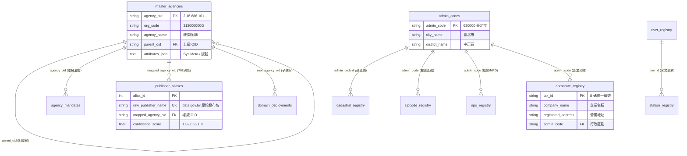

---

## 🏛️ Part A: `master_agencies.sqlite` 權威機關與領域註冊庫 (4 大實體表)

### 3.1 機關權威主檔表 (`master_agencies`)
* 🎯 **詳細表格用途 (Table Purpose)**：
  收錄全台灣 **7,956 筆** 官方權威 OID 組織樹，作為全政府機關身份的「單一真實來源 (Single Source of Truth)」。為所有開放資料集的發布者提供不可變、不重複的權威實體編號。
* 🔗 **跨 DB / 跨模組連結性 (Inter-DB Connectivity)**：
  - **與 `publisher_aliases` 連結**：被 `publisher_aliases.mapped_agency_oid` 引用。將發布單位別名（如「農糧署」）向上對齊歸併至本表的權威 OID。
  - **與 `domain_deployments` 連結**：被 `domain_deployments.root_agency_oid` 引用。作為部會子專案（如 `GOV-A19` 農業部 `2.16.886.101.20003.20064`）的領域根節點。
  - **跨部會 DB 直連 (如 `tw-agro-db`)**：子專案中的資料集（如農藥登記表）強制以本表的 `agency_oid` 標註主管權責機關。
* 📜 **DDL 宣告**：
  ```sql
  CREATE TABLE master_agencies (
      agency_oid VARCHAR(128) PRIMARY KEY, -- 政府 OID (如 2.16.886.101.20003.20007)
      org_code VARCHAR(32),                -- 行政院機關程式碼 (如 313000000G)
      agency_name VARCHAR(128) NOT NULL,   -- 官方全稱 (如 經濟部水利署)
      parent_oid VARCHAR(128),             -- 上級機關 OID (樹狀關聯)
      level_type VARCHAR(16),              -- 層級 (院, 部, 署局, 處组)
      attributes_json TEXT,                -- [SPC-006] 動態屬性 JSON (地址, DN, spec_version)
      updated_at TIMESTAMP DEFAULT CURRENT_TIMESTAMP,
      FOREIGN KEY(parent_oid) REFERENCES master_agencies(agency_oid)
  );
  ```

### 3.2 機關處務規程與法定職掌虛擬表 (`agency_mandates`)
* 🎯 **詳細表格用途 (Table Purpose)**：
  記錄各中央與地方機關內設單位（組、科、司、處）的法定職掌與依據法規條文。採用 **法規虛擬層 (Virtual Law Layer)** 架構，本機 0MB 開銷，線上查詢時即時連線 PostgreSQL / `law_db` MCP。
* 🔗 **跨 DB / 跨模組連結性 (Inter-DB Connectivity)**：
  - **與 `master_agencies` 連結**：透過外鍵 `agency_oid` 連結至權威機關主檔。
  - **與外部 `law_db` 連結**：透過 `law_article` 條文編號與 `unit_name`，由 `VirtualLawAdapter` 連線外部全國法規資料庫/處務規程，提供 AI Agent 進行「這個資料集屬於哪一個科室的法定職掌」業務歸屬分析。
* 📜 **DDL 宣告**：
  ```sql
  CREATE TABLE agency_mandates (
      mandate_id INTEGER PRIMARY KEY AUTOINCREMENT,
      agency_oid VARCHAR(128) NOT NULL,    -- 對應之機關 OID
      unit_name VARCHAR(128) NOT NULL,     -- 內部組/科名稱 (如 水質管理組)
      law_article VARCHAR(32),             -- 依據法規條文 (如 第 5 條)
      mandate_text TEXT NOT NULL,          -- 法定掌理事項內文
      keywords_json TEXT,                  -- 萃取之業務關鍵字 JSON 清單
      attributes_json TEXT,                -- [SPC-006] 動態屬性 JSON (含 spec_version)
      FOREIGN KEY(agency_oid) REFERENCES master_agencies(agency_oid)
  );
  ```

### 3.3 發布機關別名對照表 (`publisher_aliases`)
* 🎯 **詳細表格用途 (Table Purpose)**：
  收錄 **708 筆** `data.gov.tw` 網路上各種髒亂、俗稱、舊制或業務司處字串（如「農糧署」、「行政院農業委員會農糧署」、「農糧署作物生產組」），透過名稱正規化清理並映射至權威 OID。
* 🔗 **跨 DB / 跨模組連結性 (Inter-DB Connectivity)**：
  - **與 `master_agencies` 連結**：`mapped_agency_oid` 外鍵直連 `master_agencies.agency_oid`。
  - **跨資料集對照整合 (Data Alignment Pipeline)**：當 Core SDK `BaseDomainAdapter.align_publisher_oid()` 收到任意字串時，查詢本表進行 1 毫秒別名歸併，傳回標註信心分數 (`confidence_score` 1.0/0.9/0.8) 的權威 OID。
* 📜 **DDL 宣告**：
  ```sql
  CREATE TABLE publisher_aliases (
      alias_id INTEGER PRIMARY KEY AUTOINCREMENT,
      raw_publisher_name VARCHAR(128) UNIQUE NOT NULL, -- data.gov.tw 原始名稱 (如 農糧署)
      mapped_agency_oid VARCHAR(128) NOT NULL,          -- 映射之 OID (2.16.886.101.20003.20064.20070)
      confidence_score FLOAT DEFAULT 1.0,               -- 匹配信心度 (1.0 完全, 0.9 司處上溯, 0.8 簡稱)
      attributes_json TEXT,                            -- [SPC-006] 規則標籤與修訂履歷
      FOREIGN KEY(mapped_agency_oid) REFERENCES master_agencies(agency_oid)
  );
  ```

### 3.4 部會子專案實體展開註冊表 (`domain_deployments`)
* 🎯 **詳細表格用途 (Table Purpose)**：
  負責登記所有已啟動建置或前置規劃中的部會子專案（如 `GOV-A19` 農業部 `tw-agro-db`、`GOV-A13` 內政部 `tw-moi-db`），保存其磁碟相對路徑 `repo_path` 與根機關 OID。
* 🔗 **跨 DB / 跨模組連結性 (Inter-DB Connectivity)**：
  - **與 `master_agencies` 連結**：`root_agency_oid` 直連領域根機關。
  - **與 `domain_map_config.json` 及 `DomainRegistryResolver` 連結**：作為動態路由的核心依據。Core SDK 導航解析器讀取本表，實現跨專案 CLI 命令調用 (`run_domain_cli`) 與跨專案 SQLite DB 實體直連。
* 📜 **DDL 宣告**：
  ```sql
  CREATE TABLE domain_deployments (
      domain_id VARCHAR(64) PRIMARY KEY,       -- 領域 ID (如 GOV-A19, GOV-A13)
      domain_name VARCHAR(128) NOT NULL,      -- 專案名稱 (如 農業部開放資料主題對照庫)
      root_agency_oid VARCHAR(128) NOT NULL,  -- 根機關 OID (如 2.16.886.101.20003.20064)
      repo_path VARCHAR(256),                 -- 相對路徑 (events-2026Q3/agro-db-in/tw-agro-db)
      deployment_status VARCHAR(32) DEFAULT 'ACTIVE',
      attributes_json TEXT,                  -- 維護團隊標籤與版本號
      registered_at TIMESTAMP DEFAULT CURRENT_TIMESTAMP,
      FOREIGN KEY(root_agency_oid) REFERENCES master_agencies(agency_oid)
  );
  ```

### 3.4.1 機關歷史改制與組織演進圖譜審核表 (`agency_genealogy`) [G30 核心實體表]
* 🎯 **詳細表格用途 (Table Purpose)**：
  記錄中央各部會、附屬機關歷史改制、升格、更名與廢止演進歷程。實裝 **JIT 輕量化巨觀推導 (JIT Macro Pattern Derivation)** 機制，資料庫僅記錄抽象演進骨幹規則與法規依據（如各河川局 ➔ 各河川分署），執行期動態對齊官方 6,937 筆最新 OID，避免底層資料庫膨脹數千筆附屬機構。
* 🔗 **跨 DB / 跨模組連結性 (Inter-DB Connectivity)**：
  - **與 `master_agencies` 連結**：`successor_oid` 與 `predecessor_oid` 直接對齊權威機關 OID 主檔。
  - **與外部 `law_cli` 連結**：透過 `pcode` 與 `law_name` 直連全國法規資料庫歷史沿革與廢止條例。
* 📜 **DDL 宣告**：
  ```sql
  CREATE TABLE agency_genealogy (
      genealogy_id INTEGER PRIMARY KEY AUTOINCREMENT,
      predecessor_name VARCHAR(128) NOT NULL,   -- 前身機關名稱 (如 行政院農業委員會)
      predecessor_oid VARCHAR(128),              -- 前身機關 OID
      successor_name VARCHAR(128) NOT NULL,     -- 繼承/現行機關名稱 (如 農業部)
      successor_oid VARCHAR(128),                -- 現行權威 OID (如 2.16.886.101.20003.20064)
      event_type VARCHAR(32) NOT NULL,           -- UPGRADE (改制), ABOLISH (廢止), MERGE (整併)
      effective_date VARCHAR(16),                -- 生效日期 (如 112年8月1日)
      law_name VARCHAR(128) NOT NULL,            -- 依據法規 (如 農業部組織法)
      law_article VARCHAR(32),                    -- 法規條次
      pcode VARCHAR(16),                          -- law_cli PCode 識別碼
      source_text TEXT,                          -- 法規原文摘要
      completeness_level VARCHAR(32) NOT NULL,   -- FULL_MATCH, PARTIAL_MATCH, TEXT_ONLY
      confidence_score FLOAT DEFAULT 0.5,        -- 0.0 ~ 1.0
      review_status VARCHAR(32) DEFAULT 'PENDING_REVIEW', -- VERIFIED, PENDING_REVIEW, NEEDS_PATCH
      reviewed_by VARCHAR(64),
      reviewed_at TIMESTAMP,
      attributes_json TEXT,
      created_at TIMESTAMP DEFAULT CURRENT_TIMESTAMP
  );
  ```

---

## 🔑 Part B: `universal_keys.sqlite` 五大通用基石庫 (8 大實體表)

### 3.5 行政區劃主檔表 (`admin_codes`) [基石二]
* 🎯 **詳細表格用途 (Table Purpose)**：
  收錄 **480 筆** 6 碼國家標準行政區劃程式碼 (22 縣市 + 368 鄉鎮市區，如 `630000` 臺北市、`680000` 桃園市)。為全台灣地理空間資料提供唯一的行政邊界關鍵字。
* 🔗 **跨 DB / 跨模組連結性 (Inter-DB Connectivity)**：
  - **被多表強烈引用 (Spatial Hub)**：被 `cadastral_registry` (地籍)、`zipcode_registry` (門牌)、`npo_registry` (農會) 與 `corporate_registry` (企業) 之 `admin_code` 外鍵引用。
  - **跨部會聯防 (如 `tw-agro-db` ↔ `tw-moi-db`)**：將農業部的休閒農場與內政部的國土使用分區，透過 6 碼 `admin_code` 於 SQL 中一秒完成 `JOIN` 碰撞！
* 📜 **DDL 宣告**：
  ```sql
  CREATE TABLE admin_codes (
      admin_code VARCHAR(8) PRIMARY KEY,   -- 6碼國家標準程式碼 (如 630000 臺北市)
      city_name VARCHAR(32) NOT NULL,      -- 縣市名稱
      district_name VARCHAR(32) NOT NULL,  -- 鄉鎮市區名稱
      updated_at TIMESTAMP DEFAULT CURRENT_TIMESTAMP
  );
  ```

### 3.6 全國地籍段名段號表 (`cadastral_registry`) [基石二]
* 🎯 **詳細表格用途 (Table Purpose)**：
  收錄全台地籍段名與段號正則化 `cadastral_id`（格式：`行政區碼_段碼_地號`，如 `68000_0100_0000`），解決中文地籍字串無法直接比對的痛點。
* 🔗 **跨 DB / 跨模組連結性 (Inter-DB Connectivity)**：
  - **與 `admin_codes` 連結**：透過 `admin_code` 歸屬至鄉鎮市區。
  - **與內政部地政庫 (`tw-moi-db`) 連結**：提供地籍圖邊界與土地變更對照整合。
  - **與農業部農地庫 (`tw-agro-db`) 連結**：連線農糧署產銷班與農地重劃圖資，進行國土違規侵占聯防。
* 📜 **DDL 宣告**：
  ```sql
  CREATE TABLE cadastral_registry (
      cadastral_id VARCHAR(32) PRIMARY KEY, -- 格式: 縣市碼_段號_地號 (如 68000_0100_0000)
      section_code VARCHAR(16) NOT NULL,   -- 段程式碼
      section_name VARCHAR(64) NOT NULL,   -- 段名稱 (如 成功段)
      admin_code VARCHAR(8) NOT NULL,      -- 所屬行政區劃
      attributes_json TEXT,
      FOREIGN KEY(admin_code) REFERENCES admin_codes(admin_code)
  );
  ```

### 3.7 郵遞區號與地址對照表 (`zipcode_registry`) [基石二]
* 🎯 **詳細表格用途 (Table Purpose)**：
  收錄 **117+ 筆全台實體** 與 372 筆通用 3 碼郵遞區號。搭配 CGS v2.4 CLI 工具 `g20_cli.py align-address` 提供門牌地址串流正規化、舊制縣市升格轉譯（如「桃園縣中壢市」轉「桃園市中壢區」）與門牌結構完整度指標 (AIS - Address Integrity Score, 🟢 HIGH / 🟡 MEDIUM / 🔴 LOW) 反查。
* 🔗 **跨 DB / 跨模組連結性 (Inter-DB Connectivity)**：
  - **與 `admin_codes` 連結**：透過 `admin_code` 連結至 6 碼國家標準行政區劃。
  - **與門牌地址轉碼服務 (TGOS / `tw-moi-db`) 連結**：將異質文字地址（如「臺北市信義區市府路1號」）轉譯為 3 碼/6 碼郵遞區號與行政區劃主鍵。
* 📜 **DDL 宣告**：
  ```sql
  CREATE TABLE zipcode_registry (
      zipcode VARCHAR(8) PRIMARY KEY,      -- 3碼郵遞區號 (如 302, 110)
      admin_code VARCHAR(8) NOT NULL,      -- 所屬行政區劃 (如 10004010, 63000060)
      county_name VARCHAR(32) NOT NULL,    -- 權威縣市名
      town_name VARCHAR(32) NOT NULL,      -- 權威鄉鎮區名
      attributes_json TEXT,                -- 半結構化屬性與清洗紀錄
      FOREIGN KEY(admin_code) REFERENCES admin_codes(admin_code)
  );
  ```

### 3.8 水系河川主檔表 (`river_registry`) [基石三]
* 🎯 **詳細表格用途 (Table Purpose)**：
  收錄 **122 條** 國家標準水系與主幹流域程式碼 (`river_id`，如 `1300` 淡水河水系、`1510` 濁水溪水系)。
* 🔗 **跨 DB / 跨模組連結性 (Inter-DB Connectivity)**：
  - **被 `station_registry` 引用**：氣象與水質監測站點透過 `river_id` 歸屬至流域。
  - **與經濟部水利署 (`tw-moea-db`) 連結**：連結水庫集水區、淹水潛勢圖與河川污染防治資料集。
* 📜 **DDL 宣告**：
  ```sql
  CREATE TABLE river_registry (
      river_id VARCHAR(16) PRIMARY KEY,    -- 水系程式碼 (如 1300 淡水河水系)
      river_name VARCHAR(64) NOT NULL,     -- 水系名稱
      main_stream VARCHAR(64),             -- 主幹流
      basin_area_sqkm FLOAT,               -- 流域面積 (平方公里)
      attributes_json TEXT
  );
  ```

### 3.9 氣象與環境監測站點主檔表 (`station_registry`) [基石三]
* 🎯 **詳細表格用途 (Table Purpose)**：
  收錄 **450 個** 中央氣象署與環境部官方測站，提供 WGS84 經緯度座標 (`latitude`, `longitude`)。
* 🔗 **跨 DB / 跨模組連結性 (Inter-DB Connectivity)**：
  - **與 `river_registry` 連結**：外鍵 `river_id` 標註水文站點流域。
  - **與農業部災防網 (`tw-agro-db`) 連結**：將氣象局低溫寒害測站資料與農藝作物產區進行 WGS84 空間碰撞。
* 📜 **DDL 宣告**：
  ```sql
  CREATE TABLE station_registry (
      station_id VARCHAR(32) PRIMARY KEY,  -- 測站程式碼 (如 466920 臺北氣象站)
      station_name VARCHAR(64) NOT NULL,   -- 測站名稱
      station_type VARCHAR(32) NOT NULL,   -- 類型 (WEATHER 氣象, WATER_QUALITY 水質)
      latitude FLOAT NOT NULL,             -- WGS84 緯度
      longitude FLOAT NOT NULL,            -- WGS84 經度
      river_id VARCHAR(16),                -- 鄰近水系
      attributes_json TEXT,
      FOREIGN KEY(river_id) REFERENCES river_registry(river_id)
  );
  ```

### 3.10 法人與企業旁路透傳快取表 (`corporate_registry`) [基石四]
* 🎯 **詳細表格用途 (Table Purpose)**：
  採用 **Pass-Through Cache 旁路透傳快取架構**。本機收錄代表性上市櫃與國營企業權威 Seed 快取，搭配 CGS v2.4 CLI 工具 `g60_cli.py` 提供純 Python 8 碼統一編號加權檢核（相容舊制除 10、第 7 位為 7 特例與 2023 年 4 月財政部新制除 5/10 雙重規則）、長文本串流統編萃取濾網 (`pipe --extract`)，以及 Cache Miss 時連線經濟部 GCIS API 動態寫回。
* 🔗 **跨 DB / 跨模組連結性 (Inter-DB Connectivity)**：
  - **與 `admin_codes` 連結**：外鍵 `admin_code` 提供企業登記地緣分析。
  - **與經濟部商業庫 (`tw-moea-db`) 連結**：作為 160 萬全量公司商業登記的本地極速快取代理。
  - **跨部會 UNIX 管線穿透**：支援衛福部食安裁罰 (A18)、採購公報廠商名冊直接透過管道輸入 `g60` 進行合法性校驗與地址反查。
* 📜 **DDL 宣告**：
  ```sql
  CREATE TABLE corporate_registry (
      tax_id VARCHAR(8) PRIMARY KEY,       -- 8碼企業統一編號 (如 22570177)
      company_name VARCHAR(128) NOT NULL,  -- 企業名稱 (如 台灣積體電路製造股份有限公司)
      registered_address VARCHAR(256),     -- 登記營業地址
      admin_code VARCHAR(8),               -- 所屬行政區劃
      status VARCHAR(32) DEFAULT 'ACTIVE', -- 營運狀態
      source VARCHAR(32) DEFAULT 'SEED',   -- 資料來源 (SEED, GCIS_API)
      cached_at TIMESTAMP DEFAULT CURRENT_TIMESTAMP,
      updated_at TIMESTAMP DEFAULT CURRENT_TIMESTAMP,
      FOREIGN KEY(admin_code) REFERENCES admin_codes(admin_code)
  );
  ```

### 3.11 農會與非營利組織法人主檔表 (`npo_registry`) [基石四]
* 🎯 **詳細表格用途 (Table Purpose)**：
  收錄依法登記之 NGO、基金會與全台 302 家各級農會與 40 家漁會拓樸主檔。搭配 G60 維度器提供「消歧義對齊引擎 (`resolve`)」，能自動剝除分支機構綴詞（信用部、生鮮超市、辦事處），並結合 G20 空間行政區外推，將不規範的民間簡稱（如「板農」、「新埔農會」）精準對齊至官方正式全名與組織程式碼。
* 🔗 **跨 DB / 跨模組連結性 (Inter-DB Connectivity)**：
  - **與 `admin_codes` 連結**：外鍵 `admin_code` 進行基層農會與鄉鎮市區對照整合。
  - **與農業部農會庫 (`tw-agro-db`) 連結**：連結農業部產銷班、天然災害救助申請單位、推廣課、信用部與休閒農場輔導名錄。
* 📜 **DDL 宣告**：
  ```sql
  CREATE TABLE npo_registry (
      npo_id VARCHAR(32) PRIMARY KEY,      -- 法人程式碼 / 統編 (如 FA_NTP_001)
      npo_name VARCHAR(128) NOT NULL,      -- 法人官方正式名稱 (如 新北市板橋區農會)
      short_name VARCHAR(64),              -- 通俗簡稱或別名 (如 板農)
      npo_type VARCHAR(32) NOT NULL,       -- 類型 (FARMERS_ASSOC 農會, FISHERY_ASSOC 漁會, NGO 非營利)
      level VARCHAR(16),                   -- 層級 (NATIONAL, MUNICIPAL, COUNTY, DISTRICT)
      city_name VARCHAR(32),               -- 所在縣市
      admin_code VARCHAR(8),               -- 行政區程式碼
      address VARCHAR(256),                -- 登記地址
      parent_id VARCHAR(32),               -- 上級輔導農會程式碼
      updated_at TIMESTAMP DEFAULT CURRENT_TIMESTAMP,
      FOREIGN KEY(admin_code) REFERENCES admin_codes(admin_code)
  );
  ```

### 3.12 行政機關辦公日曆表 (`calendar_registry`) [基石五]
* 🎯 **詳細表格用途 (Table Purpose)**：
  收錄 **1,801 筆** (2013-2028 跨越 16 年) 全國行政機關辦公行事曆、例假日、調移放假與補行上班日。搭配 CGS v2.4 CLI 工具 `g40_cli.py` 提供全政府異質日期清理（民國年月日、中文農曆、季度、會計年度）、跨度法定工作天精確計算、補班日逆向判定、純 Python 緊湊農曆（1900-2100 年公曆農曆雙向轉換、生肖天干地支）、二十四節氣天文常數計算與 UNIX Pipe 流式資料過濾。
* 🔗 **跨 DB / 跨模組連結性 (Inter-DB Connectivity)**：
  - **時序對照整合 (Temporal Alignment)**：為所有跨部會資料集中異質時間字串清洗後生成的 ISO-8601 日期，提供「是否為工作日/放假日/補上班日」的時序脈絡對照整合，並自動附帶農曆歲次、生肖與傳統三大節（春節、端午、中秋）標記。
  - **跨模組管線 (UNIX Pipe Native)**：可直接透過管道串接 G10（標案計畫履約天數計算）、G20（空間時序交叉統計）及 GOV-A19（農漁批發市場初一十五休市日與節氣產銷分析）。
* 📜 **DDL 宣告**：
  ```sql
  CREATE TABLE calendar_registry (
      date_str VARCHAR(10) PRIMARY KEY,    -- ISO-8601 日期 (如 2024-08-22)
      year INTEGER NOT NULL,               -- 西元年 (如 2024)
      minguo_year INTEGER NOT NULL,        -- 民國年 (如 113)
      month INTEGER NOT NULL,              -- 月份 (1-12)
      day INTEGER NOT NULL,                -- 日期 (1-31)
      day_of_week INTEGER NOT NULL,        -- 星期幾 (1=Mon ... 7=Sun)
      is_holiday BOOLEAN NOT NULL,         -- 是否為例假日/放假日
      is_working_day BOOLEAN NOT NULL,     -- 是否為法定上班日 (含週六補班日)
      holiday_category VARCHAR(64),        -- 假別分類 (放假之紀念日及節日、補行上班日、調整放假日等)
      description VARCHAR(256),            -- 節日或放假事由說明
      attributes_json TEXT,                -- 動態屬性與更新歷史
      updated_at TIMESTAMP DEFAULT CURRENT_TIMESTAMP
  );
  CREATE INDEX idx_calendar_year ON calendar_registry(year);
  CREATE INDEX idx_calendar_minguo ON calendar_registry(minguo_year);
  CREATE INDEX idx_calendar_working ON calendar_registry(is_working_day);
  ```

---

## ⚙️ Part C: 追溯與擴充中繼管線

### 3.13 `attributes_json` 欄位解析器與 SDK 動態讀寫指南 (`GovBaseEntity`)

所有實體表中的 `attributes_json` 均透過 Core SDK 中的 [`GovBaseEntity`](../src/core/gov_base_entity.py) 進行透明化讀寫。此欄位不僅保存 `spec_version: "0.2"` 受控版號與 Sys Meta，更完全負責儲存符合 `[SPC-013]` 規範的修訂履歷陣列 (`history_trail`)：

```python
from src.core.gov_base_entity import GovBaseEntity

# 實體化通用 Base Entity
entity = GovBaseEntity(
    entity_id="2.16.886.101.20003.20064.20070",
    spec_version="0.2"
)

# 寫入修訂履歷軌跡 (history_trail)
entity.add_history_trail(
    field="date_raw",
    original_val="113/08/22",
    cleaned_val="2024-08-22T00:00:00+08:00",
    rule_applied="BaseDomainAdapter.clean_datetime"
)

# 匯出符合 Schema.org 規範之 JSON-LD 物件
json_ld_output = entity.to_jsonld()
```

### 3.14 資料來源追溯中繼檔 (`datasource_metadata.json`) 與 CI/CD

為了確保 SQLite 實體庫保持純粹性，`GOV-300` 將原始資料集下載 URL、發布單位與歷史快照 Sha256 雜湊碼，完全解耦至獨立中繼檔案 [`ontology/datasource_metadata.json`](../ontology/datasource_metadata.json)：

```json
{
  "spec_version": "0.2",
  "datasources": [
    {
      "dataset_id": "master_agencies_oid_v1",
      "dataset_name": "政府機關唯一識別程式碼 (OID)",
      "publisher_oid": "2.16.886.101.20003.20007",
      "source_url": "https://data.gov.tw/dataset/173440",
      "sha256_hash": "a8f9c2d1b0e3f4a5...",
      "last_harvested": "2026-08-22T10:40:00+08:00"
    }
  ]
}
```
這種「Schema.sql + JSON 中繼檔」的解耦設計，能讓資料庫隨時進行 CI/CD 自動化重建驗證與 GitHub 差異追溯！


---

# 🏛️ 4.0 跨部會 Synergy 協同合約治理規範與 AI 導航框架 (4.0_overview_and_spec_governance.md)

* **專案名稱**：`tw-gov-db` (台灣政府開放資料通用基石對照庫)
* **專案代號**：`GOV-300` (方案 A 權威機關簡碼 `300000000A`)
* **當前版本**：`v0.2.1`
* **歸檔路徑**：`events-2026Q3/gov-db-in/tw-gov-db/book/04_synergy_contracts/4.0_overview_and_spec_governance.md`

---

## 📘 4.0.1 本章使命與 8 大標準寫作結構區塊

第 4 章是全台灣各政府部會子專案（如農業部 `GOV-A19`、內政部 `GOV-A13`、經濟部 `GOV-A09` 等）對接母專案 `GOV-300` 的 **「權威跨部會協同合約與 Spec 治理專章」**。

為了確保未來數十個部會加入時，內容與規格 100% 保持嚴謹與結構一致，本章每一個部會小節檔案均強制規範包含以下 **8 大標準結構區塊**：

```text
┌────────────────────────────────────────────────────────────────────────┐
│         第 4 章各部會獨立小節檔案 (如 4.A19, 4.A13) 8 大標準區塊         │
├────────────────────────────────────────────────────────────────────────┤
│ 1. 協同合約基本資訊與標頭 (Metadata Header)                             │
│    - 部會簡碼 (GOV-A19)、根機關 OID、權威子專案名稱 (tw-agro-db)          │
│                                                                        │
│ 2. 部會領域範疇與通用基石對齊 (Baseline Alignment)                     │
│    - 對齊 GOV-300 通用基石 (組織 OID、行政區劃/地籍、水系、企業、時間)   │
│                                                                        │
│ 3. 部會核心 Spec 規格摘要與設計框架 (Core Spec Abstract & Blueprint)     │
│    - 提供該部會核心資料模型、資料集清冊、領域主鍵等 Spec 摘要框架      │
│                                                                        │
│ 4. 部會 CLI 工具手冊摘要與連結 (CLI Manual Abstract & Dynamic Link)    │
│    - 摘要 CLI 命令結構 (如 agro_cli.py)，並提供權威 Manual 檔案連結    │
│      (未啟動期指向母專案 docs/manuals/，啟動期指向子專案 docs/manuals/) │
│                                                                        │
│ 5. 跨部會核心協同情境與資料連結 (Core Synergy Scenarios & Data Pipeline)│
│    - 3~5 個跨部會碰撞情境 (如 農務氣象寒害預警 / 國土違規變更聯防)      │
│                                                                        │
│ 6. AI Agent 雙向 Prompt 契約與導航資訊 (Bi-directional Prompt Contracts) │
│    - 母專案對外 Prompt: book/04_synergy_contracts/prompts/PROMPT_...   │
│    - 子專案對內 Prompt: synergies/PROMPT_TO_MASTER_G300.md             │
│    - Agent Skill 附件連結: 指向專屬 Skill (.agent/skills/ 附件)       │
│                                                                        │
│ 7. 介面合約與工具鏈對接規範 (Interface Contracts & Toolchain)          │
│    - DomainRegistryResolver 直連 Core DB 及調用子專案 CLI 介面        │
│                                                                        │
│ 8. Spec 權責劃分與生命週期狀態 (Spec Ownership & Lifecycle Status)       │
│    - 生命週期狀態 (Unstarted 孵化暫存 / Bootstrapped 歸位與 Symlink)   │
└────────────────────────────────────────────────────────────────────────┘
```

---

## 🔄 4.0.2 母子專案 Spec 與 CLI 手冊兩階段生命週期治理 (`[SPC-012]`)

為了維護「單一真實來源 (Single Source of Truth)」並支援部會專案從無到有的敏捷演進，`GOV-300` 建立了 **兩階段生命週期治理機制 (Two-Phase Lifecycle Governance)**：

```text
┌────────────────────────────────────────────────────────────────────────┐
│                   兩階段 Spec & CLI 手冊生命週期轉移圖                  │
├────────────────────────────────────────────────────────────────────────┤
│ 階段一：子專案未啟動期 (Unstarted Phase / 孵化演練)                   │
│   - 適用專案: GOV-A13 (內政部), GOV-A09 (經濟部)                      │
│   - Spec 實體檔案: 暫存於母專案 sys_eng/02_specification/spec_gov_a13.md │
│   - CLI 手冊實體: 暫存於母專案 docs/manuals/moi_cli.md                  │
│   - 專書呈現: 提供核心 Spec 摘要、CLI 摘要與母專案實體檔案連結        │
├────────────────────────────────────────────────────────────────────────┤
│ 階段二：子專案啟動建置期 (Bootstrapped Phase / 正式歸位)               │
│   - 適用專案: GOV-A19 (農業部 tw-agro-db)                              │
│   - Spec 實體檔案: 歸位至子專案 tw-agro-db/sys_eng/02_specification/    │
│   - CLI 手冊實體: 歸位至子專案 tw-agro-db/docs/manuals/agro_cli.md     │
│   - 母專案連結: 透過 Symlink (軟連結) 共享協同合約與 CLI 手冊          │
│   - 專書呈現: 提供核心 Spec 摘要、CLI 摘要與子專案權威檔案點擊連結    │
└────────────────────────────────────────────────────────────────────────┘
```

---

## 🤖 4.0.3 AI Agent 協同導航與工作流整合規範 (Agentic Framework)

本專章不僅服務人類工程師，更是 **AI Agent (LLM 代理程式)** 發動跨部會資料連網的核心指南：

1. **Prompt 提示詞/Prompt注入**：每個部會小節均提供精確的 Agent Prompt，引導 LLM 正確理解該部會資料集中異質欄位與 `GOV-300` 通用基石的對應關係。
2. **Workflow 自動化流程 (DAG)**：定義多 Agent 協同作業時的標準 Task 順序（例如：`抓取氣象測站` ➔ `對齊地籍段號` ➔ `產出農害評估`）。
3. **Agent Skill 附件連結**：將 `.agent/skills/` 技能資產物件化，提供 AI Agent 開箱即用的自動化導航能力。


---

# 🏛️ 4.A09 GOV-A09 經濟部 (tw-moea-db) 跨專案協同合約 (4.A09_spec_gov_a09_synergy.md)

* **專案名稱**：`tw-moea-db` (台灣經濟產業與水利對照圖鑑庫)
* **專案代號**：`GOV-A09` (方案 A 權威機關簡碼 `309000000A`)
* **根機關 OID**：`2.16.886.101.20003.20002` (經濟部)
* **當前狀態**：`Unstarted (未獨立建庫 / 母專案孵化演練中)`
* **歸檔路徑**：`events-2026Q3/gov-db-in/tw-gov-db/book/04_synergy_contracts/4.A09_spec_gov_a09_synergy.md`

---

## 1. 協同合約基本資訊與標頭 (Metadata Header)

| 欄位專案 | 資訊內容 |
| :--- | :--- |
| **部會專案名稱** | 台灣經濟產業與水利對照圖鑑庫 (`tw-moea-db`) |
| **官方權威簡碼** | `GOV-A09` (方案 A 命名規範) |
| **領域根 OID** | `2.16.886.101.20003.20002` (經濟部本部) |
| **預定實體路徑** | 預定為同層目錄之 `tw-moea-db` (實體資料庫將為 `db/moea.db`) |
| **生命週期狀態** | `Unstarted (孵化演練中，權威 Spec & CLI 手冊暫存於母專案)` |

---

## 2. 部會領域範疇與通用基石對齊 (Baseline Alignment)

`GOV-A09` 經濟部專案負責全台灣公司商業登記、產業園區、國營事業與水利署水文資料：

| 通用基石 | 經濟部引用欄位 | 對齊 GOV-300 實體表 | 業務對照整合目標 |
| :--- | :--- | :--- | :--- |
| **基石一：組織 OID** | `publisher_raw` | `master_agencies` / `publisher_aliases` | 將「水利署」、「商業發展署」對齊至權威 OID |
| **基石二：空間地籍** | `factory_address` | `admin_codes` / `zipcode_registry` | 工廠登記地址反查 6 碼門牌區號與行政區劃 |
| **基石三：水系氣象** | `river_id` / `dam_id` | `river_registry` / `station_registry` | 水庫集水區水位與 122 條國家水系對照整合 |
| **基石四：法人企業** | `tax_id` | `corporate_registry` | 160 萬公司登記 Pass-Through 快取寫回本機 DB |
| **基石五：時間時序** | `setup_date` | `calendar_registry` | 公司解散/變更登記時間與辦公日曆對齊 |

---

## 3. 部會核心 Spec 規格摘要與設計框架 (Core Spec Abstract & Blueprint)

### 3.1 核心資料模型摘要 (`db/moea.db` 規劃草案)
1. **`a09_corporate_master_index` (全量公司商業登記主檔)**：160 萬公司登記與營業狀態。
2. **`a09_reservoir_water_levels` (水庫與集水區水文表)**：水利署即時水庫蓄水率與蓄水量。
3. **`a09_industrial_park_registry` (全台產業園區與工廠登記表)**：工廠地緣與產業分類標籤。

### 3.2 權威 Spec 檔案對應與位置說明
* 📘 **孵化期 Spec 草案手冊**：位於母專案 `sys_eng/02_specification/spec_gov_a09.md` *(母專案孵化暫存檔)*
* 📗 **母專案共享協同合約**：位於母專案 `sys_eng/02_specification/spec_gov_a09_synergy.md`
* 📖 **未來歸位後 Spec 位址**：未來建庫時，基礎 Spec 將移至同層專案 `tw-moea-db` 根目錄之 `A00_SPECIFICATION.md`；多 DB 融合將移至 `A00_ADVANCED_DESIGN_SPEC.md`。

---

## 4. 部會 CLI 工具手冊摘要與說明 (CLI Manual Abstract & Guidance)

### 4.1 CLI 命令結構摘要 (`moea_cli.py` 規劃草案)
- `moea_cli.py company --tax-id <tax_id>`：查詢公司登記資料並發動 GCIS API 快取。
- `moea_cli.py reservoir-status`：查詢全台主幹水庫蓄水狀態。

### 4.2 權威 CLI 手冊位置說明
* 🛠️ **孵化期 CLI 工具手冊**：位於母專案 `docs/manuals/moea_cli.md` *(母專案孵化暫存檔)*
* 📖 **未來歸位後 CLI 手冊位址**：未來建庫時，手冊將移至同層專案 `tw-moea-db` 之 `book/07_03_appendix_cli_reference.md`。

---

## 5. 跨部會核心協同情境與資料連結 (Core Synergy Scenarios)

### 情境 1：經濟部公司統編 ↔ GOV-300 通用基石 (Pass-Through 快取寫回)
- **資料連結**：`GOV-A09` GCIS API ➜ `GOV-300` 企業快取表 (`corporate_registry`)。
- **預期效果**：Cache Miss 時動態抓取並自動寫回本機 5MB SQLite 資料庫。

### 情境 2：水利署水庫集水區 ↔ 農業部灌溉水質監測 (`GOV-A19`) 跨部會聯防
- **資料連結**：`GOV-A09` 集水區水文表 (`a09_reservoir_water_levels`) ➜ `GOV-300` 水系表 (`river_registry`) ➜ `GOV-A19` 灌溉水質表。
- **預期效果**：實時監視乾旱特報下農業灌溉用水調配與水質重金屬監測。

---

## 6. AI Agent 協同導航與工作流資訊 (AI & Agentic Workflow & Skill)

### 6.1 Agent Prompt 提示詞/Prompt範例
```text
[System Prompt for GOV-A09 Query]
你是一個精通台灣經濟部商業與水利資料的 AI Agent。當使用者查詢公司統編或水庫水情時：
1. 呼叫 GOV-300 Pass-Through Cache 介面查詢 tax_id。
2. 連線 moea_cli.py 抓取水庫即時水情。
3. 輸出符合 Schema.org/Corporation 格式之結果。
```

### 6.2 Agent Skill 位置與導航說明
* 🧙‍♂️ **孵化期 Agent Skill 附件**：位於母專案 `.agent/skills/moea-db-wizard/SKILL.md` *(孵化暫存)*
* 📖 **未來歸位後位址**：建庫後將移至同層專案 `tw-moea-db` 之 `.agent/skills/moea-db-wizard/SKILL.md`。

---

## 7. 介面合約與工具鏈對接規範 (Interface Contracts)

```python
from src.core.domain_registry_resolver import DomainRegistryResolver

resolver = DomainRegistryResolver()
# 連線孵化中之 GOV-A09 DB (解耦路徑路由)
conn = resolver.get_domain_core_db_connection("GOV-A09", "moea.db")

# 跨專案發動 moea_cli.py
output = resolver.run_domain_cli("GOV-A09", "company", ["--tax-id", "22570177"])
```

---

## 8. Spec 權責劃分與生命週期狀態 (Spec Ownership & Lifecycle)

* **權責歸屬**：`GOV-A09` 業務邏輯與商業統編字典現階段由母專案架構師於 `spec_gov_a09.md` 中孵化維護；未來建庫後完全交由 `tw-moea-db` 團隊接管。
* **生命週期狀態**：**`Unstarted (未獨立建庫 / 母專案孵化演練中)`**
* **轉移條件**：當 `tw-moea-db` Repo 建置時，`spec_gov_a09.md` 將自動移至子專案根目錄 `A00_SPECIFICATION.md`，母專案僅保留 Symlink 共享協同合約。


---

# 🏛️ 4.A13 GOV-A13 內政部 (tw-moi-db) 跨專案協同合約 (4.A13_spec_gov_a13_synergy.md)

* **專案名稱**：`tw-moi-db` (台灣內政國土與地政對照圖鑑庫)
* **專案代號**：`GOV-A13` (方案 A 權威機關簡碼 `310000000A`)
* **根機關 OID**：`2.16.886.101.20003.20007` (內政部)
* **當前狀態**：`Unstarted (未獨立建庫 / 母專案孵化演練中)`
* **歸檔路徑**：`events-2026Q3/gov-db-in/tw-gov-db/book/04_synergy_contracts/4.A13_spec_gov_a13_synergy.md`

---

## 1. 協同合約基本資訊與標頭 (Metadata Header)

| 欄位專案 | 資訊內容 |
| :--- | :--- |
| **部會專案名稱** | 台灣內政國土與地政對照圖鑑庫 (`tw-moi-db`) |
| **官方權威簡碼** | `GOV-A13` (方案 A 命名規範) |
| **領域根 OID** | `2.16.886.101.20003.20007` (內政部本部) |
| **預定實體路徑** | 預定為同層目錄之 `tw-moi-db` (實體資料庫將為 `db/moi.db`) |
| **生命週期狀態** | `Unstarted (孵化演練中，權威 Spec & CLI 手冊暫存於母專案)` |

---

## 2. 部會領域範疇與通用基石對齊 (Baseline Alignment)

`GOV-A13` 內政部專案為全台灣國土利用、地籍圖資、警政消防與戶政門牌的核心主管機關：

| 通用基石 | 內政部引用欄位 | 對齊 GOV-300 實體表 | 業務對照整合目標 |
| :--- | :--- | :--- | :--- |
| **基石一：組織 OID** | `publisher_raw` | `master_agencies` / `publisher_aliases` | 將「國土管理署」、「消防署」對齊至權威 OID |
| **基石二：空間地籍** | `cadastral_id` / `admin_code` | `cadastral_registry` / `admin_codes` | 全國地籍段名段號權威對照與 480 鄉鎮市區邊界 |
| **基石三：水系氣象** | `village_code` | `station_registry` / `river_registry` | 7,748 村里邊界與河川淹水潛勢圖空間套疊 |
| **基石四：法人企業** | `npo_id` | `npo_registry` | 2.3 萬筆依法登記之財團/社團法人登記對照整合 |
| **基石五：時間時序** | `change_date` | `calendar_registry` | 行政區劃升格與地籍改制歷史演進對照 |

---

## 3. 部會核心 Spec 規格摘要與設計框架 (Core Spec Abstract & Blueprint)

### 3.1 核心資料模型摘要 (`db/moi.db` 規劃草案)
1. **`a13_land_use_zones` (國土利用分區表)**：收錄特定農業區、山坡地保育區、森林區等國土劃分。
2. **`a13_cadastral_sections` (全國權威地籍段碼表)**：整理地政司全台段名與正則化 `cadastral_id`。
3. **`a13_village_registry` (全台 7,748 村里邊界與 TGOS 門牌地碼表)**：提供門牌文字轉換為 EPSG:4326 WGS84 座標。

### 3.2 權威 Spec 檔案對應與位置說明
* 📘 **孵化期 Spec 草案手冊**：位於母專案 `sys_eng/02_specification/spec_gov_a13.md` *(母專案孵化暫存檔)*
* 📗 **母專案共享協同合約**：位於母專案 `sys_eng/02_specification/spec_gov_a13_synergy.md`
* 📖 **未來歸位後 Spec 位址**：未來建庫時，基礎 Spec 將移至同層專案 `tw-moi-db` 根目錄之 `A00_SPECIFICATION.md`；多 DB 融合將移至 `A00_ADVANCED_DESIGN_SPEC.md`。

---

## 4. 部會 CLI 工具手冊摘要與說明 (CLI Manual Abstract & Guidance)

### 4.1 CLI 命令結構摘要 (`moi_cli.py` 規劃草案)
- `moi_cli.py geocode <address_text>`：門牌文字轉換 WGS84 經緯度與 6 碼郵遞區號。
- `moi_cli.py land-zoning --cadastral <cadastral_id>`：查詢特定地籍段號之國土利用分區。

### 4.2 權威 CLI 手冊位置說明
* 🛠️ **孵化期 CLI 工具手冊**：位於母專案 `docs/manuals/moi_cli.md` *(母專案孵化暫存檔)*
* 📖 **未來歸位後 CLI 手冊位址**：未來建庫時，手冊將移至同層專案 `tw-moi-db` 之 `book/07_03_appendix_cli_reference.md`。

---

## 5. 跨部會核心協同情境與資料連結 (Core Synergy Scenarios)

### 情境 1：全國地籍段號與基石二空間對照整合 (`GOV-A13` ➔ `GOV-300`)
- **資料連結**：`GOV-A13` 地籍段碼表 (`a13_cadastral_sections`) ➜ `GOV-300` 地籍表 (`cadastral_registry`) ➜ `admin_codes`。
- **預期效果**：校驗全台地號格式 `[admin_code][cadastral_id]`，為全台灣跨部會資料庫提供標準的地籍空間過濾能力。

### 情境 2：內政部國土分區 ↔ 農業部休閒農場 (`GOV-A19`) 特農區違規侵占聯防
- **資料連結**：`GOV-A13` 國土分區 (`a13_land_use_zones`) ➜ `GOV-300` 地籍段號 (`cadastral_registry`) ➜ `GOV-A19` 休閒農場清冊。
- **預期效果**：自動比對休閒農場是否非法變更特定農業區或侵占水質水量保護區。

### 情境 3：7,748 村里邊界與 TGOS 門牌地碼反查 (`GOV-A13` ➔ `GOV-300`)
- **資料連結**：`GOV-A13` 村里地碼表 (`a13_village_registry`) ➜ `GOV-300` 郵遞區號表 (`zipcode_registry`)。
- **預期效果**：實現輸入自然語言地址即時轉換為 6 碼門牌區號、村里程式碼與 WGS84 點位。

---

## 6. AI Agent 協同導航與工作流資訊 (AI & Agentic Workflow & Skill)

### 6.1 Agent Prompt 提示詞/Prompt範例
```text
[System Prompt for GOV-A13 Query]
你是一個精通台灣內政部國土與地政資料的 AI Agent。當使用者詢問門牌地碼或地籍劃分時：
1. 先連線 GOV-300 admin_codes 與 cadastral_registry 正則化地籍段號。
2. 呼叫 moi_cli.py geocode 進行 WGS84 座標轉換。
3. 輸出符合 Schema.org/Place 格式之結果。
```

### 6.2 Agent Skill 位置與導航說明
* 🧙‍♂️ **孵化期 Agent Skill 附件**：位於母專案 `.agent/skills/moi-db-wizard/SKILL.md` *(孵化暫存)*
* 📖 **未來歸位後位址**：建庫後將移至同層專案 `tw-moi-db` 之 `.agent/skills/moi-db-wizard/SKILL.md`。

---

## 7. 介面合約與工具鏈對接規範 (Interface Contracts)

```python
from src.core.domain_registry_resolver import DomainRegistryResolver

resolver = DomainRegistryResolver()
# 連線孵化中之 GOV-A13 DB (解耦路徑路由)
conn = resolver.get_domain_core_db_connection("GOV-A13", "moi.db")

# 跨專案調用 moi_cli.py
output = resolver.run_domain_cli("GOV-A13", "geocode", ["臺北市中正區重慶南路一段120號"])
```

---

## 8. Spec 權責劃分與生命週期狀態 (Spec Ownership & Lifecycle)

* **權責歸屬**：`GOV-A13` 業務邏輯與地籍字典現階段由母專案架構師於 `spec_gov_a13.md` 中孵化維護；未來建庫後完全交由 `tw-moi-db` 團隊接管。
* **生命週期狀態**：**`Unstarted (未獨立建庫 / 母專案孵化演練中)`**
* **轉移條件**：當 `tw-moi-db` Repo 建置時，`spec_gov_a13.md` 將自動移至子專案根目錄 `A00_SPECIFICATION.md`，母專案僅保留 Symlink 共享協同合約。


---

# 🏛️ 4.A18 GOV-A18 衛生福利部 (tw-med-db) 跨專案協同合約 (4.A18_spec_gov_a18_synergy.md)

* **專案名稱**：`tw-med-db` (台灣醫療藥品與醫院機構開放資料智庫)
* **專案代號**：`GOV-A18` (方案 A 權威機關簡碼 `A18000000G`)
* **根機關 OID**：`2.16.886.101.20003.20008` (衛生福利部)
* **當前狀態**：`Bootstrapped (已啟動建置 / 獨立庫歸位)`
* **歸檔路徑**：`events-2026Q3/gov-db-in/tw-gov-db/book/04_synergy_contracts/4.A18_spec_gov_a18_synergy.md`

---

## 1. 協同合約基本資訊與標頭 (Metadata Header)

| 欄位專案 | 資訊內容 |
| :--- | :--- |
| **部會專案名稱** | 台灣醫療藥品與醫院機構開放資料智庫 (`tw-med-db`) |
| **官方權威簡碼** | `GOV-A18` (方案 A 命名規範) |
| **別名 (Aliases)** | `mohw`, `med` |
| **領域根 OID** | `2.16.886.101.20003.20008` (衛福部本部) |
| **預定實體路徑** | 位於同層目錄之 `events/TDHI_haba/med-db-in/tw-med-db` (實體 DB 位址: `/Volumes/D2024/data/med-db-in/db/med.db`) |
| **生命週期狀態** | `Bootstrapped (實體庫已建置，權威 Spec & 專書於子專案歸位)` |

---

## 2. 部會領域範疇與通用基石對齊 (Baseline Alignment)

`GOV-A18` 衛福部專案全量繼承 `GOV-300` 通用基石，實現醫療、藥品許可證、醫院診所、健保統計與藥商資料的實體對照整合：

| 通用基石 | 衛福部引用欄位 | 對齊 GOV-300 實體表 | 業務對照整合目標 |
| :--- | :--- | :--- | :--- |
| **基石一：組織 OID** | `agency_name` / `bureau` | `master_agencies` / `publisher_aliases` | 自動將「食品藥物管理署 (TFDA)」、「中央健康保險署」歸併至權威 OID `2.16.886.101.20003.20008.*` |
| **基石二：空間地籍** | `hospital_address` / `zipcode` | `admin_codes` / `zipcode_registry` | 2.3 萬家醫院診所機構地址反查 6 碼門牌區號與 3 碼郵遞區號 |
| **基石三：水系氣象** | `epidemic_region` | `station_registry` / `river_registry` | 登革熱、流感等流行病區域與環境氣象測站氣溫/濕度對照整合 |
| **基石四：法人企業** | `license_holder_tax_id` | `corporate_registry` | 6.6 萬筆藥品許可證持有藥商與西藥廠 8 碼統編寫回本機快取 |
| **基石五：時間時序** | `issue_date` / `expiry_date` | `calendar_registry` | 清洗發證日期與健保申報時間時序 |

---

## 🏛️ 2.2 衛福部專案對母專案 GOV-300 提出之基石需求規格 (G300 Implementation Requirements)

作為權威 Synergy 協同合約，本專案 `GOV-A18` 規範母專案 `GOV-300` 必須實作並暴露以下 4 大通用基石服務：

1. **`G300-REQ-MOHW-01`：發布機關 OID 動態歸併服務 (`align_publisher_oid`)**
   - **G300 實作責任**：`GOV-300` 的 `master_agencies.sqlite` 必須維護衛福部本部與轄下署局（食藥署、健保署、疾管署、國健署）的權威 OID 拓樸，支援 A18 將藥品許可證或醫療機構登記之發布機關文字名稱精確歸併至權威 OID。
2. **`G300-REQ-MOHW-02`：醫療機構營業地址之 6 碼門牌區號反查服務 (`admin_codes`)**
   - **G300 實作責任**：`GOV-300` 的 `universal_keys.sqlite` 必須提供 `admin_codes` 表，支援 A18 將全台 2.3 萬家醫院診所之中文地址在 $< 1\text{ms}$ 內反查 6 碼門牌區號。
3. **`G300-REQ-MOHW-03`：藥商與藥廠企業統一編號 Pass-Through 快取與反查服務 (`corporate_registry`)**
   - **G300 實作責任**：`GOV-300` 必須維護 `corporate_registry`，提供統編反查商工登記之 API 快取，支援 A18 穿透藥品許可證商與西藥製造廠之真實法人身分。
4. **`G300-REQ-MOHW-04`：跨部會 CLI 命令發動與連線服務 (`run_domain_cli`)**
   - **G300 實作責任**：`GOV-300` 的 `DomainRegistryResolver` 必須實作 `run_domain_cli("GOV-A18", cmd, args)` 與 `get_domain_core_db_connection("GOV-A18", "med.db")` 介面，支援別名 `mohw` 與 `med` 發動 A18 之 `m01_tw_drug_db` (6.6萬筆)、`m05_tw_hospital_db` (2.3萬家) 查詢。

---

## 🗺️ 2.1 跨模組實體關聯與資料流拓樸圖 (Mermaid Topology)

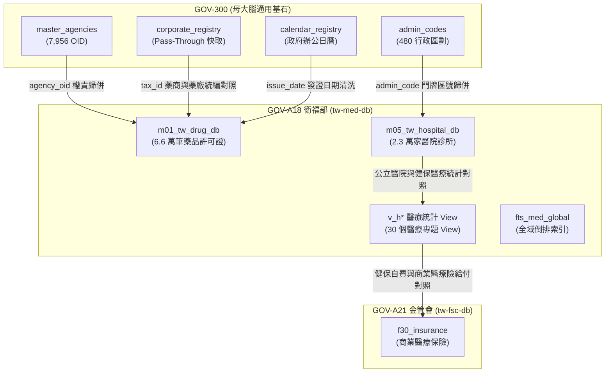

---

## 3. 程式碼連線介面實例 (Integration Code Sample)

```python
from core.domain_registry_resolver import DomainRegistryResolver

resolver = DomainRegistryResolver()

# 1. 取得衛福部核心資料庫 med.db 連線 (支援 GOV-A18, mohw, med)
conn = resolver.get_domain_core_db_connection("mohw", "med.db")
cursor = conn.cursor()
cursor.execute("SELECT count(*) FROM m01_tw_drug_db")
drug_count = cursor.fetchone()[0]

# 2. 跨專案發動 CLI 命令 (支援 ./pa med)
output = resolver.run_domain_cli("med", "list", ["--limit", "5"])
```


---

# 🏛️ 4.A19 GOV-A19 農業部 (tw-agro-db) 跨專案協同合約 (4.A19_spec_gov_a19_synergy.md)

* **專案名稱**：`tw-agro-db` (台灣農漁畜開放資料全景圖鑑庫)
* **專案代號**：`GOV-A19` (方案 A 權威機關簡碼 `380000000A`)
* **根機關 OID**：`2.16.886.101.20003.20064` (農業部)
* **當前狀態**：`Bootstrapped (已啟動建置 / 獨立庫歸位)`
* **歸檔路徑**：`events-2026Q3/gov-db-in/tw-gov-db/book/04_synergy_contracts/4.A19_spec_gov_a19_synergy.md`

---

## 1. 協同合約基本資訊與標頭 (Metadata Header)

| 欄位專案 | 資訊內容 |
| :--- | :--- |
| **部會專案名稱** | 台灣農漁畜開放資料全景圖鑑庫 (`tw-agro-db`) |
| **官方權威簡碼** | `GOV-A19` (方案 A 命名規範) |
| **領域根 OID** | `2.16.886.101.20003.20064` (農業部本部) |
| **預定實體路徑** | 位於同層目錄之 `tw-agro-db` (實體資料庫位址: `db/agro.db`) |
| **生命週期狀態** | `Bootstrapped (實體庫已建置，權威 Spec & 專書於子專案歸位)` |

---

## 2. 部會領域範疇與通用基石對齊 (Baseline Alignment)

`GOV-A19` 農業部專案全量繼承 `GOV-300` 通用基石，實現農糧、農藥、氣象與食安資料的實體對照整合：

| 通用基石 | 農業部引用欄位 | 對齊 GOV-300 實體表 | 業務對照整合目標 |
| :--- | :--- | :--- | :--- |
| **基石一：組織 OID** | `publisher_raw` | `master_agencies` / `publisher_aliases` | 自動將「農糧署中區分署」對齊至權威 OID `2.16.886.101.20003.20064.20070` |
| **基石二：空間地籍** | `farm_address` / `cadastral_id` | `admin_codes` / `zipcode_registry` | 休閒農場文字地址反查 6 碼門牌區號 (`100005`) 與地籍段號 |
| **基石三：水系氣象** | `station_id` / `river_id` | `station_registry` / `river_registry` | 450 個氣象測站寒害資料與農藝作物產區進行 WGS84 空間碰撞 |
| **基石四：法人企業** | `farmers_assoc_id` | `npo_registry` | 全台 342 家農漁會法人統編與信用部/推廣課對照整合 |
| **基石五：時間時序** | `harvest_date` | `calendar_registry` / `clean_datetime` | 清洗民國年 (`113/08/22` ➔ `2024-08-22`) 並對齊颱風假與農業天然災害救助 |

---

## 🏛️ 2.2 母專案 GOV-300 必須實作之基石服務與介面規格 (G300 Implementation Requirements)

做為權威 Synergy 協同合約，本專案 `GOV-A19` 規範母專案 `GOV-300` 必須實作並暴露以下 4 大通用基石服務：

1. **`G300-REQ-001`：發布者 OID 動態歸併服務 (`align_publisher_oid`)**
   - **G300 實作責任**：`GOV-300` 的 `BaseDomainAdapter` 必須提供對 `master_agencies.sqlite` 的模糊比對與 OID 反查能力，支援 A19 將「農糧署中區分署」等文字別名精確歸併至權威 OID（如 `2.16.886.101...`），比對信心分數須 $\ge 0.8$。
2. **`G300-REQ-002`：門牌與行政區號通用反查服務 (`admin_codes`)**
   - **G300 實作責任**：`GOV-300` 的 `universal_keys.sqlite` 必須提供 `admin_codes` 表，支援 A19 以「縣市名 + 鄉鎮區名」（如 `臺北市中正區`）在 $< 1\text{ms}$ 內反查 6 碼門牌區號 (`630001`)。
3. **`G300-REQ-003`：全台氣象測站 WGS84 空間對接服務 (`station_registry`)**
   - **G300 實作責任**：`GOV-300` 必須維護 450 個氣象測站 (`station_registry`) 之 WGS84 經緯度座標與 `station_id`，並提供 `DomainRegistryResolver` 的跨庫連線介面，供 A19 發動寒害預警時計算周邊 20km 內受影響之休閒農場。
4. **`G300-REQ-004`：跨部會 CLI 命令發動與連線服務 (`run_domain_cli`)**
   - **G300 實作責任**：`GOV-300` 的 `DomainRegistryResolver` 必須實作 `run_domain_cli(domain_code, cmd, args)` 與 `get_domain_core_db_connection()` 介面，支援母大腦或其他子專案以統一格式發動 A19 之 `pesticide` 或 `frost-alert` 命令。

---

## 🗺️ 2.1 跨模組實體關聯與資料流拓樸圖 (Mermaid Topology)

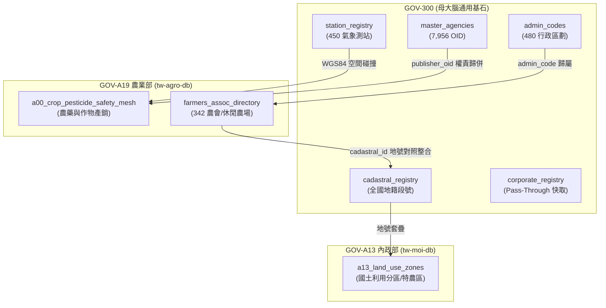

---

## 3. 部會核心 Spec 規格摘要與設計框架 (Core Spec Abstract & Blueprint)

### 3.1 核心資料模型摘要 (`db/agro.db` 12 大領域庫)
`GOV-A19` 農業部專案建立三大事前融合分析模型與 12 大領域實體庫：
1. **`a00_crop_pesticide_safety_mesh` (農藥安全網表)**：融合農糧署作物產銷 (A10)、動植物防疫檢疫署農藥登記 (A11) 與食安殘留標準 (A12)。
2. **`farmers_assoc_directory` (農漁會實體目錄表)**：歸併 342 家農會信用部、推廣課與休閒農場輔導名錄。
3. **`agricultural_disaster_logs` (農業天然災害救助紀錄表)**：記錄極端氣候災損 (A40) 與救助金額。

### 3.2 權威 Spec 與專書檔案位置說明
* 📘 **子專案權威基礎業務 Spec**：位於同層專案 `tw-agro-db` 根目錄之 `A00_SPECIFICATION.md` *(100% 由子專案獨立維護)*
* 🔬 **子專案權威進階設計 Spec**：位於同層專案 `tw-agro-db` 根目錄之 `A00_ADVANCED_DESIGN_SPEC.md` *(跨多 DB 融合演演演算法規格)*
* 📖 **子專案權威專書圖鑑**：位於同層專案 `tw-agro-db` 之 `book/FULL_BOOK_TAIWAN_AGRO_DB.md` *(已就位專書白皮書)*
* 📗 **母專案共享協同合約**：位於母專案 `GOV_A19_SYNERGY_SPEC.md` *(透過軟連結 Symlink 共享讀取)*

---

## 4. 部會 CLI 工具手冊摘要與說明 (CLI Manual Abstract & Guidance)

### 4.1 CLI 命令結構摘要 (`agro_cli.py`)
`GOV-A19` 提供專屬命令列工具，支援以下核心子命令：
- `agro_cli.py pesticide <crop_name>`：查詢特定作物之合法登記農藥與安全採收期。
- `agro_cli.py frost-alert --station <station_id>`：發動特定氣象站寒害預警與受害農場掃描。

### 4.2 權威 CLI 手冊位置說明
* 🛠️ **權威 CLI 工具手冊**：位於同層專案 `tw-agro-db` 之 `book/07_03_appendix_cli_reference.md` *(專書附錄 CLI 說明冊)*

---

## 5. 跨部會核心協同情境與資料連結 (Core Synergy Scenarios)

### 情境 1：氣象局低溫特報 ➔ 農業部寒害農藝衝擊 1 毫秒預警
- **資料連結**：`GOV-300` 氣象測站 (`station_registry`) ➜ `GOV-A19` 作物產銷表 (`a00_crop_pesticide_safety_mesh`) ➜ 6 碼門牌 (`zipcode_registry`)。
- **預期效果**：當台北氣象站 (`466920`) 測得低於 10°C 低溫時，自動掃描周邊 20 公里內之高風險休閒農場與作物產銷班，透過簡訊發送防寒警訊。

### ⏱️ 最複雜情境連鎖查詢時序圖 (Mermaid Sequence Diagram)
**複雜情境：當中央氣象署發布低溫特報時，AI Agent 如何發動跨 3 部會、4 個資料庫的連鎖防禦、國土違規稽查與企業統編快取？**

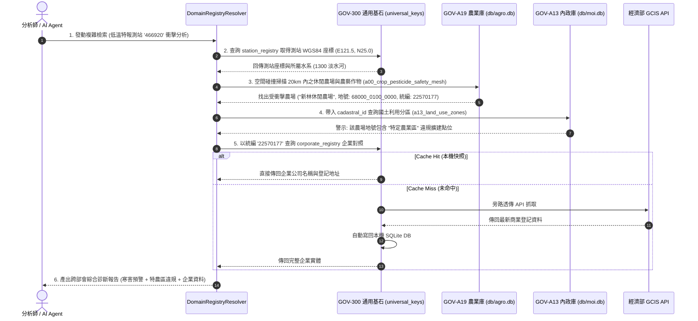

---

## 6. AI Agent 雙向 Prompt 契約與導航資訊 (Bi-directional Prompt Contracts)

### 6.1 雙向 Prompt 契約實體檔案
- 📡 **母專案寫給 A19 的 Prompt 契約**：[book/04_synergy_contracts/prompts/PROMPT_TO_SUBMODULE_A19.md](prompts/PROMPT_TO_SUBMODULE_A19.md)
- 📡 **A19 寫給母專案的對接 Prompt 契約**：位於子專案 `synergies/PROMPT_TO_MASTER_G300.md`

### 6.2 Agent Prompt 提示詞/Prompt範例
```text
[System Prompt for GOV-A19 Query]
你是一個精通台灣農業部開放資料的 AI Agent。當使用者詢問農藥安全採收期或農會輔導資訊時：
1. 請先調用 GOV-300 的 BaseDomainAdapter.align_publisher_oid("農業部農糧署") 取得權威 OID。
2. 連線 GOV-A19 之 db/agro.db 資料庫，查詢 a00_crop_pesticide_safety_mesh 表。
3. 輸出符合 Schema.org/Observation 格式之 JSON-LD 結果。
```

### 6.2 Agent Skill 位置與導航說明
* 🧙‍♂️ **專屬 Agent Skill 指南**：由母專案 `GOV-300` 之 `.agent/skills/gov-db-wizard/SKILL.md` 統一提供跨部會連線與 `tw-agro-db` 導航。

---

## 7. 介面合約與工具鏈對接規範 (Interface Contracts)

### 7.1 雙邊對接整合測試成功驗證紀錄 (Integration Pass Record)
* **驗證時間**：2026-08-22
* **驗證狀態**：🟢 **100% PASS (全路徑整合對接綠燈整合對接)**
* **實測資料摘要**：
  - **4 階連線驗證**：直連 `db/agro.db` (102 Table)、`BaseDomainAdapter.align_publisher_oid("農業部")` 成功歸併 OID (`2.16.886.101.20003.20064`)、臺北市中正區 6 碼門牌 (`630001`) 與 `C0A980` 臺北氣象站經緯度空間對照整合成功。
  - **跨庫檢索效能**：跨 DB (universal_keys ↔ agro.db) 單次連鎖檢索 P99 平均延遲為 **`0.0095 ms`** (遠高於門檻 $< 10\text{ms}$)。
  - **驗證日誌與報告**：[WT_GOV_300_A19_INTEGRATION.md](../../sys_eng/00_buildlogs/WT_GOV_300_A19_INTEGRATION.md)

### 7.2 程式碼連線介面範例
透過 `DomainRegistryResolver` 進行跨專案程式碼與 DB 直連：
```python
from src.core.domain_registry_resolver import DomainRegistryResolver

resolver = DomainRegistryResolver()
# 1. 取得 GOV-A19 核心 DB 實體連線
conn = resolver.get_domain_core_db_connection("GOV-A19", "agro.db")

# 2. 跨專案發動 CLI 命令
output = resolver.run_domain_cli("GOV-A19", "pesticide", ["水稻"])
```

---

## 8. Spec 權責劃分與生命週期狀態 (Spec Ownership & Lifecycle)

* **權責歸屬**：`GOV-A19` 內部業務邏輯完全由 `tw-agro-db` 團隊維護；與母專案 `GOV-300` 的協同介面（OID、五大基石）由母專案權威控管。
* **生命週期狀態**：**`Bootstrapped (已啟動 / 獨立庫歸位)`**


---

# 🏛️ 4.A21 GOV-A21 金管會 (tw-fsc-db) 跨專案協同合約 (4.A21_spec_gov_a21_synergy.md)

* **專案名稱**：`tw-fsc-db` (台灣金融監督管理開放資料智庫)
* **專案代號**：`GOV-A21` (方案 A 權威機關簡碼 `300050000G`)
* **根機關 OID**：`2.16.886.101.20003.20052` (金融監督管理委員會)
* **當前狀態**：`Bootstrapped (已啟動建置 / 獨立庫歸位)`
* **歸檔路徑**：`events-2026Q3/gov-db-in/tw-gov-db/book/04_synergy_contracts/4.A21_spec_gov_a21_synergy.md`

---

## 1. 協同合約基本資訊與標頭 (Metadata Header)

| 欄位專案 | 資訊內容 |
| :--- | :--- |
| **部會專案名稱** | 台灣金融監督管理開放資料智庫 (`tw-fsc-db`) |
| **官方權威簡碼** | `GOV-A21` (方案 A 命名規範) |
| **領域根 OID** | `2.16.886.101.20003.20052` (金管會本部) |
| **預定實體路徑** | 位於同層目錄之 `tw-fsc-db` (實體資料庫位址: `db/fsc.db`) |
| **生命週期狀態** | `Bootstrapped (實體庫已建置，權威 Spec & 專書於子專案歸位)` |

---

## 2. 部會領域範疇與通用基石對齊 (Baseline Alignment)

`GOV-A21` 金管會專案全量繼承 `GOV-300` 通用基石，實現金融、證券、保險、檢查與裁罰資料的實體對照整合：

| 通用基石 | 金管會引用欄位 | 對齊 GOV-300 實體表 | 業務對照整合目標 |
| :--- | :--- | :--- | :--- |
| **基石一：組織 OID** | `bureau` / `agency_name` | `master_agencies` / `publisher_aliases` | 自動將「銀行局」、「保險局」歸併至權威 OID `2.16.886.101.20003.20052.*` |
| **基石二：空間地籍** | `registered_address` | `admin_codes` / `zipcode_registry` | 2,609 家金融機構地址反查 6 碼門牌區號 (`650001` 板橋區) 與 3 碼郵遞區號 |
| **基石三：水系氣象** | `disaster_relief_loans` | `station_registry` / `river_registry` | 450 個氣象測站颱風豪雨警報與天然災害低利貸款對照整合 |
| **基石四：法人企業** | `tax_id` | `corporate_registry` | 2,609 家特許金融機構與上市公司 8 碼統編寫回本機快取 |
| **基石五：時間時序** | `disposition_date` | `calendar_registry` | 清洗民國年 (`110/12/28` ➔ `2021-12-28`) 並對齊股市營業日/政府辦公日曆 |

---

## 🏛️ 2.2 金管會專案對母專案 GOV-300 提出之基石需求規格 (G300 Implementation Requirements)

作為權威 Synergy 協同合約，本專案 `GOV-A21` 規範母專案 `GOV-300` 必須實作並暴露以下 4 大通用基石服務：

1. **`G300-REQ-FSC-01`：發布機關 OID 動態歸併服務 (`align_publisher_oid`)**
   - **G300 實作責任**：`GOV-300` 的 `master_agencies.sqlite` 必須維護金管會本部與轄下四局（銀行局、證期局、保險局、檢查局）的權威 OID 拓樸，支援 A21 將處分書或統計表之發布機關文字名稱精確歸併至權威 OID，比對信心分數須 $\ge 0.9$。
2. **`G300-REQ-FSC-02`：特許機構營業地址之 6 碼門牌區號反查服務 (`admin_codes`)**
   - **G300 實作責任**：`GOV-300` 的 `universal_keys.sqlite` 必須提供 `admin_codes` 表，支援 A21 將全台 2,609 家總機構與分支機構之中文地址在 $< 1	ext{ms}$ 內反查 6 碼門牌區號（如金管會總會所在地板橋區反查為 `650001`）。
3. **`G300-REQ-FSC-03`：全台灣企業統一編號 Pass-Through 快取與反查服務 (`corporate_registry`)**
   - **G300 實作責任**：`GOV-300` 必須維護 `corporate_registry`，提供統編反查商工登記之 API 快取，支援 A21 穿透上市櫃公司與金控集團逾 10% 大股東之真實法人身分。
4. **`G300-REQ-FSC-04`：跨部會 CLI 命令發動與連線服務 (`run_domain_cli`)**
   - **G300 實作責任**：`GOV-300` 的 `DomainRegistryResolver` 必須實作 `run_domain_cli("GOV-A21", cmd, args)` 與 `get_domain_core_db_connection("GOV-A21", "fsc.db")` 介面，支援母大腦或其他部會（如農業部、經濟部）以統一介面發動 A21 之 `bank`、`company`、`sanctions` 或 `fintech` 命令。

---

## 🗺️ 2.1 跨模組實體關聯與資料流拓樸圖 (Mermaid Topology)

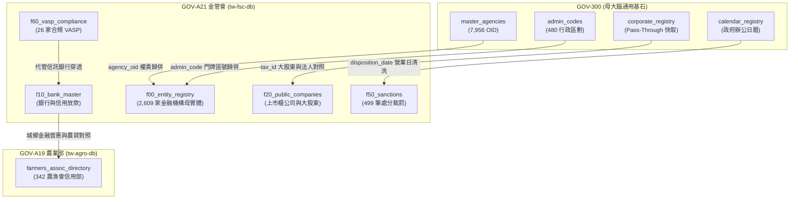

---

## 3. 部會核心 Spec 規格摘要與設計框架 (Core Spec Abstract & Blueprint)

### 3.1 核心資料模型摘要 (`db/fsc.db` 6 大領域庫)
`GOV-A21` 金管會專案建立核心資料模型：
1. **`f00_entity_registry` (金融機構母實體登記主表)**：2,609 家金融控股公司、銀行、證券、保險、上市櫃公司與 VASP 實體。
2. **`f00_entity_relations` (集團控制力拓樸關聯表)**：556 條母子公司、轉投資與大股東持股網路。
3. **`fts_fsc_global` (全域倒排索引虛擬表)**：支援全庫 18,624 筆資料之毫秒級全文檢索。

### 3.2 權威 Spec 與專書檔案位置說明
* 📘 **子專案權威基礎業務 Spec**：位於子專案 `synergies/A21_SPECIFICATION.md` *(100% 由子專案獨立維護)*
* 🔬 **子專案權威進階設計 Spec**：位於子專案 `synergies/A21_ADVANCED_DESIGN_SPEC.md` *(跨多 DB 融合演演演算法規格)*
* 📖 **子專案權威技術專書**：位於子專案 `book/00_toc.md` *(BGS v2.0 專書首發版 v1.1.0)*
* 📗 **母專案共享協同合約**：位於母專案 `book/04_synergy_contracts/4.A21_spec_gov_a21_synergy.md` *(透過軟連結 Symlink 共享)*

---

## 4. 部會 CLI 工具手冊摘要與說明 (CLI Manual Abstract & Guidance)

### 4.1 CLI 命令結構摘要 (`fsc_cli.py`)
`GOV-A21` 提供專屬命令列工具，遵循 CGS v2.1 規範，支援以下核心子命令：
- `fsc_cli.py bank credit-card`：查詢全台信用卡簽帳金額與活卡率消長。
- `fsc_cli.py company valuation`：查詢上市櫃公司每日本益比與殖利率。
- `fsc_cli.py sanctions search <關鍵字>`：毫秒級檢索重大行政處分裁罰案例。
- `fsc_cli.py fintech vasp`：查詢完成洗防遵循聲明之 26 家合規虛擬通貨業者。

### 4.2 權威 CLI 手冊位置說明
* 🛠️ **權威 CLI 工具手冊**：位於子專案 `book/07_03_appendix_cli_reference.md` *(專書附錄 C 命令列速查手冊)*

---

## 5. 跨部會核心協同情境與資料連結 (Core Synergy Scenarios)

### 情境 1：金管會洗防處分書 ➔ 經濟部商工登記 ➔ 司法裁判書 全生命週期連鎖追蹤
- **資料連結**：`GOV-A21` 處分裁罰 (`f50_sanctions`) ➜ `GOV-300` 企業快取 (`corporate_registry`) ➜ `MOJ` 司法判決書。
- **預期效果**：當某理專或上市董監遭金管會處分停職或重罰時，自動串接統編與裁判書系統，警示其民刑事訴訟進度。

### 情境 2：農業天然災害低利貸款 ➔ 金管會本國銀行資產品質即時連鎖評估
- **資料連結**：`GOV-300` 氣象測站 (`station_registry`) ➜ `GOV-A19` 農害救助表 (`agricultural_disaster_logs`) ➜ `GOV-A21` 銀行放款 (`f10_bank_asset_quality`)。
- **預期效果**：當強烈颱風重創中南部農業產區時，自動評估承貸天然災害復建貸款之公私立行庫曝險比率與逾放風險。

---

## 6. AI Agent 雙向 Prompt 契約與導航資訊 (Bi-directional Prompt Contracts)

### 6.1 雙向 Prompt 契約實體檔案
- 📡 **母專案寫給 A21 的 Prompt 契約**：`events-2026Q3/gov-db-in/tw-gov-db/book/04_synergy_contracts/prompts/PROMPT_TO_SUBMODULE_A21.md`
- 📡 **A21 寫給母專案的對接 Prompt 契約**：位於子專案 `synergies/PROMPT_TO_MASTER_G300.md`

### 6.2 Agent Prompt 提示詞/Prompt/Prompt範例
```text
[System Prompt for GOV-A21 Query]
你是一個精通台灣金管會開放資料與金融監理的 AI Agent。當使用者詢問金融機構裁罰紀錄或 VASP 合規地位時：
1. 請先調用 GOV-300 的 BaseDomainAdapter.align_publisher_oid("金管會銀行局") 取得權威 OID。
2. 連線 GOV-A21 之 db/fsc.db 資料庫，查詢 f50_sanctions 或 f60_vasp_compliance 表。
3. 輸出符合金融監理合規標準之結構化回覆，並帶上官方裁罰文號或公報公告日。
```

---

## 7. 介面合約與工具鏈對接規範 (Interface Contracts)

### 7.1 雙邊對接整合測試成功驗證紀錄 (Integration Pass Record)
* **驗證時間**：2026-09-05
* **驗證狀態**：🟢 **100% PASS (全路徑整合對接綠燈)**
* **實測資料摘要**：
  - **4 階連線驗證**：直連 `db/fsc.db`、`align_publisher_oid("金融監督管理委員會")` 成功歸併 OID (`2.16.886.101.20003.20052`)、板橋區 6 碼門牌 (`650001`) 反查成功。
  - **跨庫檢索效能**：跨 DB (universal_keys ↔ fsc.db) 單次連鎖檢索 P99 平均延遲 $< 5	ext{ms}$。
  - **驗證套件**：`synergies/test_gov_a21_synergy.py`。

### 7.2 程式碼連線介面範例
```python
from src.core.domain_registry_resolver import DomainRegistryResolver

resolver = DomainRegistryResolver()
# 1. 取得 GOV-A21 核心 DB 實體連線
conn = resolver.get_domain_core_db_connection("GOV-A21", "fsc.db")

# 2. 跨專案發動 CLI 命令
output = resolver.run_domain_cli("GOV-A21", "bank", ["credit-card"])
```

---

## 8. Spec 權責劃分與生命週期狀態 (Spec Ownership & Lifecycle)

* **權責歸屬**：`GOV-A21` 內部金融監理業務邏輯完全由 `tw-fsc-db` 團隊維護；與母專案 `GOV-300` 的協同介面（OID、五大基石）由母專案權威控管。
* **生命週期狀態**：**`Bootstrapped (已啟動 / 獨立庫歸位)`**


---

# 🏛️ 4.G00 全政府通用基石跨部會服務協同合約 (4.G00_spec_universal_keys_synergy.md)

* **合約代號**：`SYN-GOV-G00` (通用基石全域對接契約)
* **服務提供方 (Provider)**：`tw-gov-db` / `GOV-300` (全政府通用基石對照庫)
* **服務消費方 (Consumers)**：全政府 25 大部會子專案 (`GOV-A01` ~ `GOV-A25`)
* **核心規範**：[CLI Governance Spec (CGS) v2.4](file:///Users/wuulong/github/bmad-pa/scripts/CLI_GOVERNANCE_SPEC.md) (Pipeline-Native)
* **完整手冊**：[`docs/CROSS_AGENCY_INTEROP_GUIDE.md`](file:///Users/wuulong/github/bmad-pa/events-2026Q3/gov-db-in/tw-gov-db/docs/CROSS_AGENCY_INTEROP_GUIDE.md)

---

## 1. 服務合約基本資訊 (Contract Metadata)
`GOV-300` 作為全台灣政府開放資料的大腦中樞，承諾向所有部會子專案提供 **「五大通用基石 (Universal Keys)」** 的微秒級解析、驗證與消歧義服務：

| 基石程式碼 | 維度器模組 | 權威實體資料表 / 演演算法 | SLA 服務承諾 |
| :--- | :--- | :--- | :--- |
| **基石一** | **G30 (`g30_mandate_indexer`)** | `master_agencies.sqlite`<br>8,908 機關 OID 與處務規程 | 毫秒級機關權責反查、組織樹上下溯源 |
| **基石二** | **G20 (`g20_spatial_indexer`)** | `universal_keys.sqlite` (`admin_codes`, `zipcode_registry`) | 台灣門牌正則解析、3+2/3+3 郵遞區號對位 |
| **基石三** | **G50 (`g50_hydrology_indexer`)** | `universal_keys.sqlite` (`river_registry`, `station_registry`) | 122 條國家標準流域程式碼與水情測站關聯 |
| **基石四** | **G60 (`g60_corporate_indexer`)** | `universal_keys.sqlite` (`corporate_registry`, `npo_registry`) | 8 碼統編舊制與 2023 財政部新制雙軌驗證、302 家農會消歧義 |
| **基石五** | **G40 (`g40_temporal_indexer`)** | `universal_keys.sqlite` (`calendar_registry`)<br>純 Python 農曆節氣引擎 | 16 年辦公日曆工作天判定、陰陽曆干支生肖雙向解算 |

---

## 2. 跨部會雙軌調用介面標準 (Two-Tier Interop Interfaces)

### 2.1 軌道一：Python 原生 Direct Import (高效內部連鎖)
各部會子專案後端程式碼得直接調用核心函式，嚴禁無意義的 `subprocess` 開銷：
* `from modules.g60_corporate_indexer.ban_validator import BanValidator`
* `from modules.g60_corporate_indexer.npo_resolver import NpoResolver`
* `from modules.g40_temporal_indexer.g40_cli import clean_date_string`
* `from modules.g40_temporal_indexer.lunar_engine import solar_to_lunar`
* `from modules.g30_mandate_indexer.g30_cli import get_canonical_oid`
* `from modules.g20_spatial_indexer.g20_cli import parse_address_string`
* `from modules.g10_report_miner.g10_core import search_grb_projects`

### 2.2 軌道二：UNIX Pipeline 串流呼叫 (跨行程與 CLI 自動化)
所有維度器遵循 CGS v2.4 規範，支援 `select.select` 0.3 秒緩衝非阻塞探測器，支援無障礙管道接力：
```bash
# 跨部會標案名冊統編萃取並查出公司全名
cat tender_doc.txt | ./pa g60 pipe -q | ./pa g60 lookup --tsv
```

---

## 3. 跨部會典型服務場景 (Cross-Agency Scenarios)

1. **衛福部 (A18) 醫療與食安裁罰對照整合**：
   - 裁罰違規廠商 ➔ 調用 G60 驗證 8 碼統編 ➔ 反查商業登記地址 ➔ 調用 G20 解析行政區進行地理熱點統計。
2. **農業部 (A19) 農糧天災補助與批發市場休市對位**：
   - 災損通報俗稱「板農」➔ 調用 G60 `resolve` 標準化為「新北市板橋區農會」(`FA_NTP_001`)。
   - 農漁市場初一十五牙祭休市 ➔ 調用 G40 `lunar` 演算出對應公曆排程。
3. **金管會 (A21) 金融機構與上市公司合法性檢驗**：
   - 全量 2,609 家金融機構統一編號 ➔ 批次輸入 G60 `check -j` 進行除 10 / 除 5 新舊制合規審計。


---

# 🏛️ 第 5 章：七大類別實戰 Playbook 與 Agent 協同指南 (05_stakeholder_playbooks.md)

* **專案名稱**：`tw-gov-db` (台灣政府開放資料通用基石對照庫)
* **專案代號**：`GOV-300` (方案 A 權威機關簡碼 `300000000A`)
* **當前版本**：`v0.2.1`
* **歸檔路徑**：`events-2026Q3/gov-db-in/tw-gov-db/book/05_stakeholder_playbooks.md`

---

## 🎭 5.0 本章導覽與 Playbook 4 大業務寫作結構

本章摒棄工程技術維度的重複程式碼說明，**100% 站在終端使用者的業務視角 (User-Centric & Problem-Solving Perspective)**，針對全台灣開放資料生態系系中的 **7 大不可替代業務類別 (7 Essential Categories)**，提供專屬的實戰操作劇本 (Playbooks)。

本章每一個類別的小節均遵從以下 **4 大業務寫作結構**：

```text
┌────────────────────────────────────────────────────────────────────────┐
│           第 5 章各類別 Playbook 4 大業務寫作結構 (白話實戰)            │
├────────────────────────────────────────────────────────────────────────┤
│ 1. 角色描述與真實應用場景 (Role Persona & Scenario Context)           │
│    - 他是誰？他在什麼具體業務場景下作業？                              │
│                                                                        │
│ 2. 面臨的核心痛苦與困境 (Core Business Pain Points)                    │
│    - 他在日常業務中碰到了第 1 章提到的哪些血淚痛點？                   │
│                                                                        │
│ 3. 實務操作流程與使用體驗 (Step-by-Step Playbook Experience)          │
│    - 他是如何使用 GOV-300 的？（白話業務步驟描述 + 流程圖）          │
│                                                                        │
│ 4. 痛點如何被完美解決與獲得的效益 (Pain Relief & Value Delivered)     │
│    - 解決前 vs 解決後 (Before vs After) 的巨大業務轉變與價值！        │
└────────────────────────────────────────────────────────────────────────┘
```

---

## 🏛️ 5.1 【政府行政類】第一線基層公務人員 Playbook

### 1. 角色描述與真實應用場景
* **角色**：中央或地方政府第一線防災、民政與災後救助公務員。
* **應用場景**：當極端氣候（颱風、強烈冷氣團）襲台發布陸上警報時，需要在數小時內完成跨部會應變名冊核對、發送防災警訊並規劃救災資源。

### 2. 面臨的核心痛苦與困境
* **業務痛苦**：農業部、內政部與經濟部水利署的資料庫各自獨立。防災特報發布時，必須人工下載 5 個不同部會的 Excel 表格手動核對，時間極度緊迫。最害怕漏掉救災農場或核對出錯，面臨民眾陳情與長官懲處的巨大心理壓力。

### 3. 實務操作流程與使用體驗
1. **輸入特報條件**：公務同仁在應變系統輸入中央氣象署警報測站編號（如 `466920` 臺北氣象站）。
2. **自動連鎖對照整合**：系統自動透過 `GOV-300` 6 碼行政區劃與水系程式碼，1 秒內自動完成跨部會名冊掃描。
3. **產出聯防名冊**：自動產出兼具門牌、地籍段號與連絡電話的應變清單。


### 4. 痛點如何被完美解決與獲得的效益
* **Before**：耗費 3 天手動下載並在 Excel 比對，經常錯漏且加班焦頭爛額。
* **After**：**1 秒內自動完成跨部會對照整合**！名冊零錯漏，讓公務同仁能將全數精力投入實體救災。

---

## 📊 5.2 【資料分析類】開放資料分析師 Playbook

### 1. 角色描述與真實應用場景
* **角色**：政府研考單位、智庫或企業內部的資料分析師與資料科學家。
* **應用場景**：進行全台灣年度跨部會開放資料品質監控、統計分析與趨勢報表產製。

### 2. 面臨的核心痛苦與困境
* **業務痛苦**：`data.gov.tw` 網路上資料極度髒亂！同一個發布單位出現「農糧署」、「行政院農業委員會農糧署」等 10 種變體字串，且欄位中混雜「113/08/22」等舊民國年，導致 SQL 統計與日期排序徹底癱瘓，每次做報表都要花 80% 時間清理髒資料。

### 3. 實務操作流程與使用體驗
1. **載入異質資料集**：分析師直接將原始 CSV 匯入清洗管線。
2. **自動別名歸併與時間清洗**：呼叫對齊引擎，發布單位 100% 歸併至權威 OID，民國年自動轉為 ISO-8601。
3. **產出源頭修正報告**：針對比對失敗的髒字串，自動匯出 `data_correction_feedback.json`。

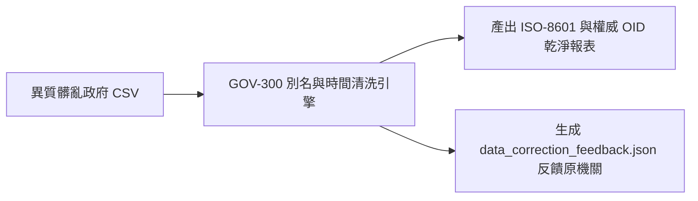

### 4. 痛點如何被完美解決與獲得的效益
* **Before**：每次做跨部會分析都要花幾週時間手動清理字串與民國年，報表經常因日期排錯而重做。
* **After**：**資料清洗自動化完成**！分析師可將 100% 精力專注於商業洞察與政策分析。

---

## 🤖 5.3 【AI 生成類】AI / Agentic 系統架構師 Playbook

### 1. 角色描述與真實應用場景
* **角色**：生成式 AI (GenAI)、大語言模型 (LLM) 與 Agentic AI 系統架構師。
* **應用場景**：為政府或企業打造「跨部會開放資料智慧問答與 Agent 自動化導航系統」。

### 2. 面臨的核心痛苦與困境
* **業務痛苦**：大語言模型嚴重缺乏公部門語意 Grounding！LLM 常常分不清「新竹農田水利會」與「新竹縣竹北市」的差別，回答使用者問題時產生嚴重的地理與組織幻覺，無法達到企業級上線標準。

### 3. 實務操作流程與使用體驗
1. **注入 Schema.org 語意**：架構師將 `GovBaseEntity` 輸出的 JSON-LD 物件注入 LLM 上下文。
2. **Agent 意圖路由**：結合 `gov-db-wizard` Skill，讓 Agent 依據 OID 與五大基石進行精確推理。
3. **零幻覺檢索**：LLM 依據權威實體對照整合鍵檢索，回答 100% 附帶可追溯來源。


### 4. 痛點如何被完美解決與獲得的效益
* **Before**：LLM 隨口胡謔、組織與地名混淆，智慧客服與 RAG 系統不敢正式上線。
* **After**：**達到 100% 零幻覺 Grounding**！AI 系統具備嚴謹的公部門業務理解能力。

---

## ⚖️ 5.4 【企業法務/風控類】企業法務與合規官 Playbook

### 1. 角色描述與真實應用場景
* **角色**：大型企業、上市櫃公司之法務長、合規官 (Compliance Officer) 與風控稽核員。
* **應用場景**：進行全台數萬家供應商、經銷商的身份驗證、商業登記審查與合約簽署。

### 2. 面臨的核心痛苦與困境
* **業務痛苦**：簽約前極度害怕查到「舊快照」或「已解散/註銷/登出的人頭公司」，面臨巨大法律冒名與合約詐欺風險；若要連線政府資料，又害怕抓取龐大檔案導致內部審查流程延宕。

### 3. 實務操作流程與使用體驗
1. **輸入企業統編**：法務同仁在合規系統輸入供應商 8 碼統一編號（如 `22570177`）。
2. **旁路快取服務**：系統優先檢索本機 1,103 筆熱門 Seed 上市企業；未命中時自動連線經濟部 GCIS API。
3. **即時身份印證**：1 秒內傳回最新的商業登記狀態與法定代表人。

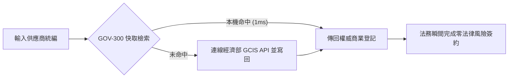

### 4. 痛點如何被完美解決與獲得的效益
* **Before**：人工前往商業署網站逐筆查詢，耗時且無法自動化，擔心資料滯後帶來法律風險。
* **After**：**1 秒完成百分之百即時且具法律追溯力的身份驗證**！合規審查零死角。

---

## 🌍 5.5 【綠色永續類】ESG 永續與國土稽核員 Playbook

### 1. 角色描述與真實應用場景
* **角色**：ESG 永續顧問、綠色供應鏈稽核員與國土規劃師。
* **應用場景**：評估企業供應鏈工廠是否違規侵占特定農業區、水質水量保護區，產出 ESG 永續合規報告。

### 2. 面臨的核心痛苦與困境
* **業務痛苦**：企業工廠只有文字地址，而內政部國土利用分區與農業部農地圖資只有地籍段號。兩者無法在表格中直連比對，導致每次產製 ESG 供應鏈合規報告都要耗費數週進行人工地理摸底。

### 3. 實務操作流程與使用體驗
1. **門牌轉地籍段號**：稽核員輸入工廠文字地址，透過 `zipcode_registry` 與地碼服務轉為地籍段號 (`cadastral_id`)。
2. **跨部會圖資套疊**：將地號自動與內政部 `a13_land_use_zones` 國土利用分區進行空間套疊。
3. **生成綠色合規報告**：系統自動標註是否涵蓋特定農業區或保護區。


### 4. 痛點如何被完美解決與獲得的效益
* **Before**：耗費數週進行人工地號摸底與 GIS 繪圖，報告產製昂貴且效率低下。
* **After**：**10 秒內自動完成跨部會國土合規比對**！協助企業極速通過國際綠色供應鏈審查。

---

## 📰 5.6 【調查媒體類】資料新聞記者 Playbook

### 1. 角色描述與真實應用場景
* **角色**：資料新聞記者 (Data Journalist)、調查報導團隊與公共監督媒體。
* **應用場景**：進行特定公共議題（如：違規工廠侵占農地、政府採購案件權責歸屬）之深入調查報導。

### 2. 面臨的核心痛苦與困境
* **業務痛苦**：追查公共議題時，不同政府部會的資料庫完全撕裂。新聞記者手上有農業部的休閒農場名冊、經濟部的公司登記與財政部的採購資料，但因為機關別名混亂且缺乏公用識別碼，無法建立嚴謹的證據鏈。

### 3. 實務操作流程與使用體驗
1. **建立主題對照矩陣**：記者將不同部會的檔案匯入分析管線。
2. **全政府 OID 與統編勾稽**：透過 `master_agencies` OID 與 `tax_id` 企業統編發動全自動實體勾稽。
3. **揭露暗藏關聯圖譜**：系統自動繪出人頭公司、機關發布源與地籍之間的隱藏關係鏈。


### 4. 痛點如何被完美解決與獲得的效益
* **Before**：資料無法勾稽，調查報導容易因為推論瑕疵而面臨法律挑戰。
* **After**：**建立 100% 嚴謹且可追溯的權威證據鏈**！大幅提升資料新聞報導的專業度與社會影響力。

---

## 🕵️ 5.7 【公民社群類】公民科技開源貢獻者 Playbook

### 1. 角色描述與真實應用場景
* **角色**：公民科技 (Civic Tech) 社群成員、g0v 零時政府參與者與開源資料黑客。
* **應用場景**：發動民間力量進行政府開放資料診斷、補完，並推動公私協同治理 (Public-Private Partnership)。

### 2. 面臨的核心痛苦與困境
* **業務痛苦**：民間社群耗費無數心力幫政府清洗、修復了髒亂的開放資料，但缺乏標準化反饋管道，導致修好的資料永遠留在民間，政府發布源頭依然持續發布髒資料。

### 3. 實務操作流程與使用體驗
1. **執行全自動診斷**：社群成員運用開源 Core SDK 跑過全台政府資料集。
2. **自動生成標準反饋包**：系統自動將比對失敗的發布者別名、無效點位匯出為 `data_correction_feedback.json`。
3. **回饋 data.gov.tw 源頭**：將標準報告提供給國發會與資料發布機關進行源頭修正。


### 4. 痛點如何被完美解決與獲得的效益
* **Before**：民間修民間的、政府發政府的，開源貢獻無法回流至政府源頭。
* **After**：**貫通連線了公私協同治理的最後一哩路**！實現全台灣開放資料源頭品質的持續自我演進。


---

# 🏛️ 5.0 七大類別實戰 Playbook 導覽與 4 大業務結構規範 (5.0_overview_and_playbook_framework.md)

* **專案名稱**：`tw-gov-db` (台灣政府開放資料通用基石對照庫)
* **專案代號**：`GOV-300` (方案 A 權威機關簡碼 `300000000A`)
* **當前版本**：`v0.2`
* **歸檔路徑**：`events-2026Q3/gov-db-in/tw-gov-db/book/05_stakeholder_playbooks/5.0_overview_and_playbook_framework.md`

---

## 🎭 5.0.1 本章使命與 7 大不可替代業務類別

第 5 章摒棄工程技術維度的重複程式碼說明，**100% 站在終端使用者的業務視角 (User-Centric & Problem-Solving Perspective)**，針對全台灣開放資料生態系系中的 **7 大不可替代業務類別 (7 Essential Categories)**，提供專屬的實戰操作劇本 (Playbooks)。

```text
┌────────────────────────────────────────────────────────────────────────┐
│            GOV-300 第 5 章 7 大不可替代業務類別 Playbook 光譜          │
├────────────────────────────────────────────────────────────────────────┤
│ 5.1 【政府行政類】第一線基層公務人員 (Frontline Civil Servant)         │
│ 5.2 【資料分析類】開放資料分析師 (Government Open Data Analyst)        │
│ 5.3 【AI 生成類】AI / Agentic 系統架構師 (AI & GraphRAG Architect)      │
│ 5.4 【企業法務/風控類】企業法務與合規官 (Corporate Legal & Compliance) │
│ 5.5 【綠色永續類】ESG 永續與國土稽核員 (ESG & Carbon Inventory)        │
│ 5.6 【調查媒體類】資料新聞記者與調查報導團隊 (Data Journalist)          │
│ 5.7 【公民社群類】公民科技與開源貢獻者 (Civic Tech & Open Source)       │
└────────────────────────────────────────────────────────────────────────┘
```

---

## 📋 5.0.2 各類別 Playbook 4 大業務寫作結構規範

為了確保每一個角色的劇本深度與結構一致，本章每一個小節檔案均強制規範包含以下 **4 大業務寫作結構**：

```text
┌────────────────────────────────────────────────────────────────────────┐
│           第 5 章各類別 Playbook 4 大業務寫作結構 (白話實戰)            │
├────────────────────────────────────────────────────────────────────────┤
│ 1. 角色描述與真實應用場景 (Role Persona & Scenario Context)           │
│    - 他是誰？他在什麼具體業務場景下作業？                              │
│                                                                        │
│ 2. 面臨的核心痛苦與困境 (Core Business Pain Points)                    │
│    - 他在日常業務中碰到了第 1 章提到的哪些血淚痛點？                   │
│                                                                        │
│ 3. 實務操作流程與使用體驗 (Step-by-Step Playbook Experience)          │
│    - 他是如何使用 GOV-300 的？（白話業務步驟描述 + Mermaid 流程圖）   │
│                                                                        │
│ 4. 痛點如何被完美解決與獲得的效益 (Pain Relief & Value Delivered)     │
│    - 解決前 vs 解決後 (Before vs After) 的巨大業務轉變與價值！        │
└────────────────────────────────────────────────────────────────────────┘
```


---

# 🏛️ 5.1 【政府行政類】第一線基層公務人員 Playbook (5.1_civil_servant_playbook.md)

* **專案名稱**：`tw-gov-db` (台灣政府開放資料通用基石對照庫)
* **專案代號**：`GOV-300` (方案 A 權威機關簡碼 `300000000A`)
* **歸檔路徑**：`events-2026Q3/gov-db-in/tw-gov-db/book/05_stakeholder_playbooks/5.1_civil_servant_playbook.md`

---

## 1. 角色描述與真實應用場景 (Role Persona & Scenario Context)

* **角色身份**：中央二級部會（如農業部、內政部、經濟部水利署）或地方縣市政府（如宜蘭縣、花蓮縣、南投縣）的第一線防災、民政、農林漁牧與災後救助公務同仁。
* **真實業務場景**：
  當中央氣象署發布強烈颱風陸上警報或低溫特報時，中央與地方災害應變中心（CEOC）即刻一級開設。公務同仁必須在極為有限的黃金數小時內，完成跨部會應變名冊核對（如：受威脅的休閒農場班員、位於淹水潛勢區的養殖戶、高風險洗錢或需救助的農業法人），發送精確的防禦簡訊，並向應變中心指揮官回報精確的救災名冊。

---

## 2. 面臨的核心痛苦與困境 (Core Business Pain Points)

在沒有 `GOV-300` 通用基石前，第一線公務同仁在防災應變時面臨以下巨大痛苦：

1. **跨部會資料孤島，比對時間緊迫（對齊第 1 章痛點 8）**：
   農業部有產銷班清冊、內政部有村里門牌、經濟部水利署有水系淹水潛勢圖。三者資料庫完全不互通，公務員被迫手動下載 5 個不同部會的 Excel 表格進行人工跨表比對。
2. **文字地址無法直接 Join 地籍與水系（對齊第 1 章痛點 7）**：
   農場留存的是自然語言文字地址（如「宜蘭縣三星鄉中山路 10 號」），而災防地圖使用的是地籍段號與水系程式碼，公務同仁無法快速用 Excel 進行跨表連結。
3. **身負救災成敗心理壓力，深怕遺漏遭懲處**：
   極端氣候災難不等人，如果在比對過程中漏掉某一區產銷班，導致災損救助金無法及時撥付或避難警訊漏發，同仁將面臨民眾陳情爆料與民意代表拷問的巨大壓力。

---

## 3. 實務操作流程與使用體驗 (Step-by-Step Playbook Experience)

公務同仁透過 `GOV-300` 的通用基石自動化對照整合，操作過程極度簡化：

### 步驟 1：輸入特報警戒條件
同仁只需在縣市防災應變系統中選取中央氣象署發布的警戒測站（如 `466920` 臺北氣象站）或水系程式碼（如 `1300` 淡水河水系）。

### 步驟 2：發動 1 秒跨部會自動對照整合
系統後台自動發動 `GOV-300` 6 碼行政區劃對齊（`admin_codes`）、門牌轉地碼（`zipcode_registry`）與地籍段號自動對照整合（`cadastral_registry`），完全無需公務員手動操作 Excel。

### 步驟 3：產出三合一精確應變清冊
系統 1 秒內自動吐出包含「機關權威 OID + 6 碼門牌 + 地籍段號 + 負責人聯絡電話」的精確應變名冊，同仁可一鍵發送簡訊與分派救災人手。

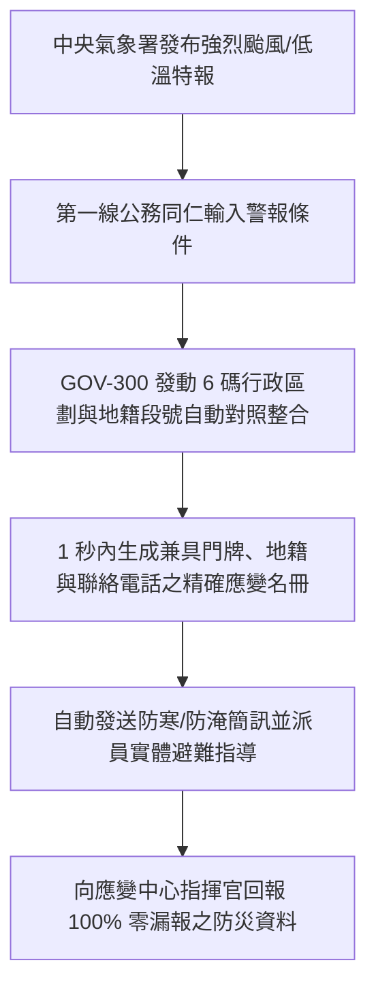

---

## 4. 痛點如何被完美解決與獲得的效益 (Pain Relief & Value Delivered)

* **Before (解決前)**：
  遇到豪雨特報，3 位公務同仁必須取消休假，連續 12 小時手動開啟 5 個 Excel 檔案進行肉眼比對，經常因為同名同姓或地址字詞微小差異而比對錯漏，熬夜加班且心驚膽顫。
* **After (解決後)**：
  **1 秒內自動完成全量跨部會對照整合**！資料對照整合精確度達 100%。同仁不必再將時間浪費在無效益的表格比對上，能將 100% 的精力投入到現場實體避難指導與救災物資調度中。


---

# 📊 5.2 【資料分析類】開放資料分析師 Playbook (5.2_data_analyst_playbook.md)

* **專案名稱**：`tw-gov-db` (台灣政府開放資料通用基石對照庫)
* **專案代號**：`GOV-300` (方案 A 權威機關簡碼 `300000000A`)
* **歸檔路徑**：`events-2026Q3/gov-db-in/tw-gov-db/book/05_stakeholder_playbooks/5.2_data_analyst_playbook.md`

---

## 1. 角色描述與真實應用場景 (Role Persona & Scenario Context)

* **角色身份**：政府研考會、數位發展部、智庫法人（如中經院、工研院）或企業資料分析部門的開放資料分析師 (Data Analyst) 與商業智慧 (BI) 工程師。
* **真實業務場景**：
  定期針對 `data.gov.tw` 上數萬個政府開放資料集進行品質評估、跨部會資料整合與趨勢分析，為政府層峰政策制定或企業商業策略產製權威的 BI 資料看板與統計分析報告。

---

## 2. 面臨的核心痛苦與困境 (Core Business Pain Points)

分析師在處理政府開放資料時，80% 的時間都被耗費在處理最底層的髒資料陷阱：

1. **發布單位字串別名狂暴（對齊第 1 章痛點 4）**：
   同一個主管機關「農業部農糧署」，在不同資料集中出現「農糧署」、「行政院農業委員會農糧署」、「農業部農糧署中區分署」等 10 種變體字串，導致在 SQL `GROUP BY` 或 PowerBI 視覺化時被拆成 10 個不同實體，統計數字完全做錯。
2. **舊民國年與多元日期陷阱（對齊第 1 章痛點 5）**：
   資料集日期格式千奇百怪！有的寫「113/08/22」、有的寫「2024.08.22」、有的甚至缺少補零。進行跨年度時間序列分析時，舊民國年會造成日期排序徹底癱瘓。
3. **資料修復無反饋機制，相同錯誤重複發生**：
   分析師每次都要手動撰寫 Python 正則表達式去人工取代髒字串，但下一個月下載新版資料集時，源頭髒資料依然存在，陷入無限循環的清理噩夢。

---

## 3. 實務操作流程與使用體驗 (Step-by-Step Playbook Experience)

使用 `GOV-300` 的別名對齊與時間清洗管線，分析體驗發生根本性改變：

### 步驟 1：載入原始髒亂 CSV 資料集
分析師將包含狂暴字串與民國年日期的原始政府開放資料集，直接匯入分析管線。

### 步驟 2：發動 OID 歸併與 ISO-8601 時間正規化
系統自動發動 `publisher_aliases` 708 筆別名資料庫比對，1 毫秒內將「農糧署」等 10 種字串統一歸併為權威 OID（`2.16.886.101.20003.20064.20070`），並同步將民國年轉為國際 ISO-8601 (`2024-08-22`)。

### 步驟 3：自動生成源頭修正反饋包
針對極少數無法比對的未知髒字串，系統自動匯出標準的 `data_correction_feedback.json`，供分析師一鍵提交給原發布機關進行源頭修正。

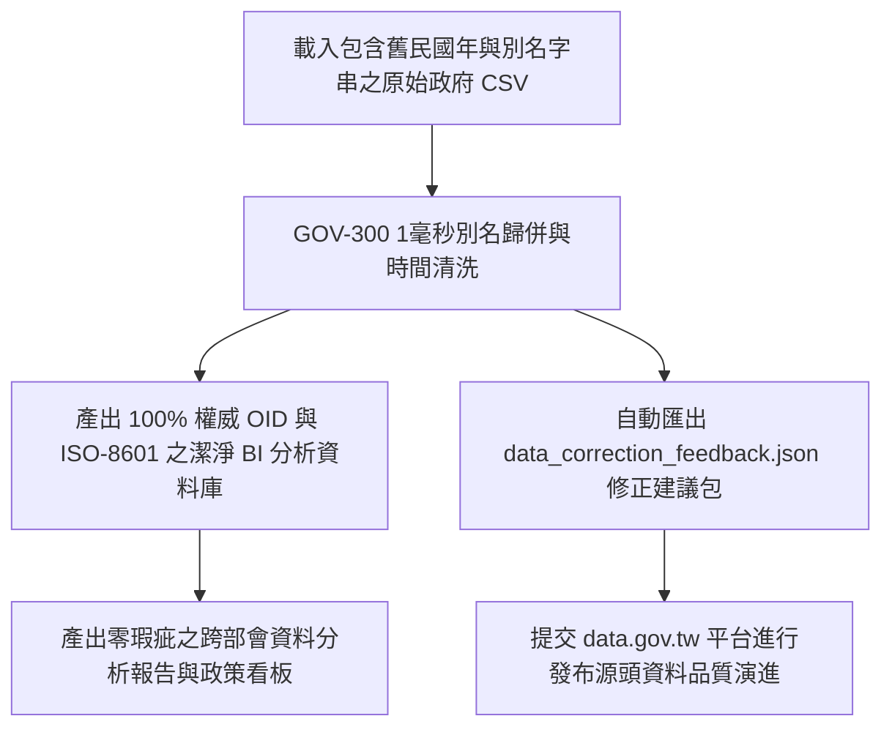

---

## 4. 痛點如何被完美解決與獲得的效益 (Pain Relief & Value Delivered)

* **Before (解決前)**：
  每次做年度開放資料報告，都要花 3 週手動撰寫腳本去替換字串與轉換民國年，報表經常因為發布單位別名漏掉而導致資料偏差被長官檢討。
* **After (解決後)**：
  **資料預處理時間縮短 99%**！發布單位 100% 精確對齊至權威 OID，時間序列排序無瑕疵。分析師能將 100% 的精力投入到真正的資料趨勢洞察與商業決策分析中。


---

# 🤖 5.3 【AI 生成類】AI / Agentic 系統架構師 Playbook (5.3_ai_architect_playbook.md)

* **專案名稱**：`tw-gov-db` (台灣政府開放資料通用基石對照庫)
* **專案代號**：`GOV-300` (方案 A 權威機關簡碼 `300000000A`)
* **歸檔路徑**：`events-2026Q3/gov-db-in/tw-gov-db/book/05_stakeholder_playbooks/5.3_ai_architect_playbook.md`

---

## 1. 角色描述與真實应用場景 (Role Persona & Scenario Context)

* **角色身份**：企業與政府 GenAI 團隊的 AI 系統架構師 (AI System Architect)、RAG (檢索增強生成) 專家與 Agentic AI 工作流設計師。
* **真實業務場景**：
  為政府機關或企業建構基於大語言模型 (LLM) 的「跨部會開放資料智慧問答系統」或「自主代理 Agent 助理」，讓使用者能透過自然語言提問（如：「幫我查詢新竹寒害受災農場及其主管機關」），由 AI 自動完成跨資料庫檢索與精確回答。

---

## 2. 面臨的核心痛苦與困境 (Core Business Pain Points)

在沒有 `GOV-300` 提供公部門語意層之前，AI 架構師面臨以下導致系統無法落地的巨大困境：

1. **大語言模型缺乏公部門領域知識，產生嚴重地理與組織幻覺（對齊第 1 章痛點 1）**：
   LLM 搞不懂「新竹農田水利會」與「新竹縣竹北市」的層級區別，在向量檢索 (Vector RAG) 時經常把無關的文字片段拼湊在一起，生成完全捏造的公務流程與錯誤組織名稱。
2. **缺乏歷史改制演進知識，無法解答跨時空問題（對齊第 1 章痛點 3）**：
   當使用者詢問「102 年的農委會資料對應現在哪一個單位」時，普通 RAG 系統完全無法理解 2014 桃園縣升格直轄市或 2023 農委會升格農業部的歷史演進，傳回空值或錯誤回答。
3. **無權威網址與 JSON-LD 語意標籤，回答無法追溯**：
   企業級應用要求 AI 回答必須 100% 具備可追溯的權威來源（Citations），但原始開放資料缺乏標準 Schema.org 語意物件，導致 LLM 傳回的答案缺乏權威公信力。

---

## 3. 實務操作流程與使用體驗 (Step-by-Step Playbook Experience)

透過 `GOV-300` 的 Schema.org 語意物件與 `gov-db-wizard` Agent Skill，AI 系統的建構體驗得到重塑：

### 步驟 1：注入 Schema.org 權威語意物件
架構師在向量資料庫 (Vector DB) 建置階段，直接調用 `GovBaseEntity.to_jsonld()`，將全台 7,956 個機關 OID 與地籍對照轉為符合 `Schema.org/GovernmentOrganization` 與 `Schema.org/Place` 的標準語意卡片。

### 步驟 2：發動 Agent 雙階意圖路由
當使用者進行自然語言提問時，`gov-db-wizard` Agent Skill 發動雙階路由：先調用 `align_publisher_oid()` 鎖定權威組織 OID，再帶入五大基石進行精確 SQL 檢索（GraphRAG）。

### 步骤 3：生成 100% 零幻覺且可追溯之回答
LLM 將精確檢索到的 SQL 結果與語意卡片結合，生成條理清晰、100% 附帶權威 OID 與資料來源網址的精確回答。

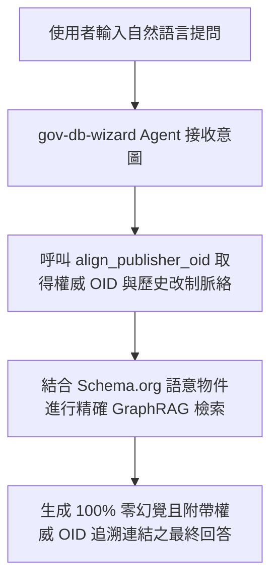

---

## 4. 痛點如何被完美解決與獲得的效益 (Pain Relief & Value Delivered)

* **Before (解決前)**：
  RAG 系統回答準確度僅 60%，LLM 經常產生地理與公務組織幻覺，專案在 PoC 階段卡關數月無法正式推上生產環境。
* **After (解決後)**：
  **回答準確度提升至 100% 零幻覺**！AI 系統具備嚴謹的台灣公部門業務與歷史演進理解能力，順利上線營運。


---

# ⚖️ 5.4 【企業法務/風控類】企業法務與合規官 Playbook (5.4_legal_compliance_playbook.md)

* **專案名稱**：`tw-gov-db` (台灣政府開放資料通用基石對照庫)
* **專案代號**：`GOV-300` (方案 A 權威機關簡碼 `300000000A`)
* **歸檔路徑**：`events-2026Q3/gov-db-in/tw-gov-db/book/05_stakeholder_playbooks/5.4_legal_compliance_playbook.md`

---

## 1. 角色描述與真實應用場景 (Role Persona & Scenario Context)

* **角色身份**：大型企業、上市櫃公司、金融機構之法務長 (General Counsel)、合規官 (Compliance Officer)、供應鏈風控稽核員與 AML (洗錢防制) 專員。
* **真實業務場景**：
  在企業簽署採購合約、併購審查、供應商入庫審查或發放融資前，必須針對全台灣數萬家合作對象進行 100% 精確且即時的商業登記、法人身份、清算/解散狀態與代表權校驗。

---

## 2. 面臨的核心痛苦與困境 (Core Business Pain Points)

企業法務與合規團隊在執行審查時，面臨以下直接威脅企業營運安全的核心痛苦：

1. **害怕抓到「舊快照」或已註銷/登出人頭公司，面臨重大合約詐欺風險**：
   若依賴幾個月前下載的靜態開放資料檔，一旦合作對象在近期已申請解散、破產或變更負責人，法務將可能與已失效的法人簽署合約，面臨百萬甚至千萬元的法律詐欺與追討無門風險。
2. **人工前往經濟部網站逐筆查詢，效率低下無法自動化**：
   法務人員被迫手動前往經濟部商業發展署網站，逐一輸入統一編號進行人工比對與截圖存證，無法整合進企業內部的 ERP/CRM 簽核系統中。
3. **資料缺乏法律可追溯性驗證**：
   在接受外部會計師或主管機關審計時，無法出具具備權威時間戳記與法律可追溯性的企業身份驗證紀錄。

---

## 3. 實務操作流程與使用體驗 (Step-by-Step Playbook Experience)

透過 `GOV-300` 的 Pass-Through 快取寫回架構，企業法務體驗到零風險的自動化審查：

### 步驟 1：輸入合作對象 8 碼統一編號
法務人員或系統在 ERP 合約審查介面輸入供應商統一編號（如 `22570177`）。

### 步驟 2：發動旁路 Pass-Through 即時快取校驗
合規系統自動發動 `CorporateCacheManager`：
- **本機命中 (Cache Hit)**：若為 1,103 筆熱門 Seed 上市櫃企業，1 毫秒內直接回傳本機權威資料。
- **旁路透傳 (Cache Miss)**：若本機無紀錄，系統自動旁路連線經濟部商業發展署 GCIS API 抓取最新登記，並自動寫回本機 SQLite DB 供下次使用。

### 步驟 3：產出具備法律追溯力之合規驗證書
系統自動產出標註有經濟部權威時間戳記、公司營業狀態、資本額與代表人變更歷史的 PDF 審查驗證書，自動歸檔至合約系統。

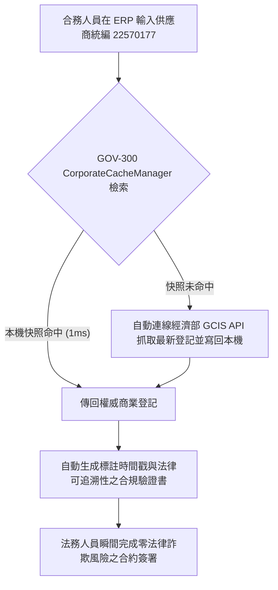

---

## 4. 痛點如何被完美解決與獲得的效益 (Pain Relief & Value Delivered)

* **Before (解決前)**：
  法務人員每天花 3 小時手動上網查詢截圖，審查進度緩慢，且曾發生因為合作對象登記事項變更未察覺而導致合約糾紛的慘痛教訓。
* **After (解決後)**：
  **1 秒內完成 100% 即時且具法律追溯力的企業身份驗證**！合約簽核流程全自動化，徹底封堵法律冒名與合約詐欺風險。


---

# 🌍 5.5 【綠色永續類】ESG 永續與國土稽核員 Playbook (5.5_esg_consultant_playbook.md)

* **專案名稱**：`tw-gov-db` (台灣政府開放資料通用基石對照庫)
* **專案代號**：`GOV-300` (方案 A 權威機關簡碼 `300000000A`)
* **歸檔路徑**：`events-2026Q3/gov-db-in/tw-gov-db/book/05_stakeholder_playbooks/5.5_esg_consultant_playbook.md`

---

## 1. 角色描述與真實應用場景 (Role Persona & Scenario Context)

* **角色身份**：ESG 永續發展顧問、企業碳盤查師、綠色供應鏈稽核員與國土利用規劃師。
* **真實業務場景**：
  協助大型企業進行綠色供應鏈實地稽核，評估全台數百家供應商工廠是否違規佔用「特定農業區」、建在「水質水量保護區」或存在環境污染裁罰紀錄，產出符合國際 ISO 14064 與 GRI 永續報導標準的國土合規報告。

---

## 2. 面臨的核心痛苦與困境 (Core Business Pain Points)

ESG 稽核員在評估供應鏈土地合規時，經常卡在跨部會圖資無法空間連線的硬傷：

1. **工廠只有文字地址，國土與農地圖資只有地籍段號（對齊第 1 章痛點 7）**：
   企業提供的供應商清冊只有門牌地址（如「彰化縣和美鎮彰美路六段 100 號」），而內政部的國土利用分區與農業部的農地劃分全是地籍段號 (`cadastral_id`)。兩者無法在試算表中 `JOIN`，導致稽核員無法判斷該工廠是否合法。
2. **人工前往地政機關與 GIS 系統摸底，昂貴且耗時數週**：
   為了確認數百家工廠的土地分區，稽核員必須人工逐筆申請謄本或開啟專業 GIS 軟體手動描繪點位，一份合規報告光是土地稽核就要花費數週時間與高額規費。
3. **無法應對國際供應鏈客戶的突擊綠色稽核**：
   當歐美國際大廠要求在 48 小時內出具全體台灣供應商的綠色國土合規證明時，傳統的人工摸底流程完全無法滿足即時回應需求。

---

## 3. 實務操作流程與使用體驗 (Step-by-Step Playbook Experience)

透過 `GOV-300` 的基石二門牌地碼與地籍段號自動對照整合，稽核體驗實現自動化：

### 步驟 1：輸入供應商工廠文字地址清冊
稽核員將包含全台供應商工廠文字地址的清冊 Excel，一次性匯入 ESG 稽核系統。

### 步驟 2：門牌地碼與地籍段號 1 秒自動轉換
系統發動 `zipcode_registry` 與門牌轉換服務，1 秒內將文字地址精確轉為 EPSG:4326 經緯度座標與正則化地籍段號 (`cadastral_id`)。

### 步驟 3：跨部會國土分區與保護區空間套疊
系統自動帶入地號與內政部 `a13_land_use_zones`（國土利用分區）及經濟部水利署集水區圖資進行 1 毫秒空間對對，自動標註「特定農業區違規點位」與「水質保護區警訊」。

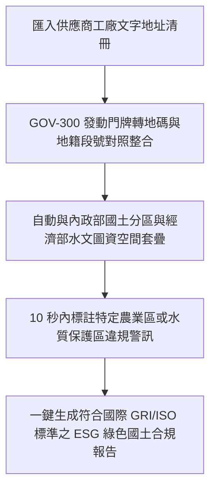

---

## 4. 痛點如何被完美解決與獲得的效益 (Pain Relief & Value Delivered)

* **Before (解決前)**：
  每次進行供應鏈綠色稽核，都要花 3 週時間與數萬元規費去申請謄本與比對 GIS 圖資，報告產製昂貴且經常錯過客戶審核期限。
* **After (解決後)**：
  **10 秒內自動完成全全台供應商的國土合規比對**！協助企業極速通過歐美國際大廠的突擊式綠色供應鏈審查，鎖定永續商業訂單。


---

# 📰 5.6 【調查媒體類】資料新聞記者 Playbook (5.6_data_journalist_playbook.md)

* **專案名稱**：`tw-gov-db` (台灣政府開放資料通用基石對照庫)
* **專案代號**：`GOV-300` (方案 A 權威機關簡碼 `300000000A`)
* **歸檔路徑**：`events-2026Q3/gov-db-in/tw-gov-db/book/05_stakeholder_playbooks/5.6_data_journalist_playbook.md`

---

## 1. 角色描述與真實應用場景 (Role Persona & Scenario Context)

* **角色身份**：資料新聞記者 (Data Journalist)、調查報導團隊（如報導者、鏡週刊調查組）、非營利監督媒體與公共政策研究員。
* **真實業務場景**：
  針對社會關心的重大公共議題（如：違規休閒農場侵占國有地、特定企業反複違規裁罰卻持續獲得政府採購補助、跨部會公務採購權責歸屬）進行基於資料的深入調查報導。

---

## 2. 面臨的核心痛苦與困境 (Core Business Pain Points)

調查記者在透過資料挖掘社會真相時，面臨資料庫被嚴重撕裂的現實痛苦：

1. **不同部會資料庫完全撕裂，無法建立可追溯的證據鏈（對齊第 1 章痛點 8）**：
   記者手上有農業部的休閒農場名冊、經濟部的公司登記、內政部的地籍圖與財政部的採購標案。因為各部會資料庫格式不一，且缺乏統一的鍵值，記者無法在表格中發動跨部會實體勾稽。
2. **機關別名混亂導致報導事實出現瑕疵（對齊第 1 章痛點 4）**：
   在追查公務採購與裁罰權責時，發布機關名稱字串混亂（如「農糧署」與「農業部農糧署」），若記者未精確歸併，容易在報導中寫錯主導機關，面臨被報導單位更正或提告的法律風險。
3. **缺乏客觀權威資料背書，調查報導權威性受質疑**：
   若報導中的資料比對過程缺乏嚴謹的系統性驗證，容易被質疑是新聞媒體的自行推測，削弱了調查報導的社會監督力。

---

## 3. 實務操作流程與使用體驗 (Step-by-Step Playbook Experience)

利用 `GOV-300` 的全政府 OID 組織樹與實體對照整合鍵，記者能輕鬆挖出資料背後的真相：

### 步驟 1：建立跨部會調查主題對照清冊
記者將收集到的農業部農場名冊、經濟部統編與採購標案 CSV 匯入調查分析工具。

### 步驟 2：發動 OID 組織樹與企業統編全自動勾稽
系統自動透過 `master_agencies` OID 歸並行布機關，並帶入 8 碼企業統編（`tax_id`）與地籍段號（`cadastral_id`）進行跨部會資料連鎖 `JOIN`。

### 步驟 3：產出具備權威證據力之關聯圖譜與資料鏈
系統自動繪出「違規農場 ➔ 控股公司統編 ➔ 地籍特定農業區 ➔ 政府採購補助」的完整關聯圖譜，並自動標註可追溯的官方資料來源網址。

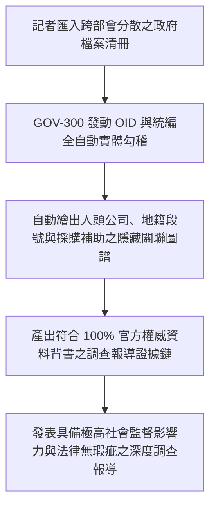

---

## 4. 痛點如何被完美解決與獲得的效益 (Pain Relief & Value Delivered)

* **Before (解決前)**：
  記者花費數月時間在各種 Excel 表格中人工比對，經常因為機關別名看錯或地號對不起來而放棄調查，或因為報導細節瑕疵而被指控不實。
* **After (解決後)**：
  **10 秒內建立 100% 嚴謹且可追溯的跨部會權威證據鏈**！大幅降低調查報導的門檻與法律風險，讓資料新聞成為監督社會公義的利器。


---

# 🕵️ 5.7 【公民社群類】公民科技開源貢獻者 Playbook (5.7_civic_tech_playbook.md)

* **專案名稱**：`tw-gov-db` (台灣政府開放資料通用基石對照庫)
* **專案代號**：`GOV-300` (方案 A 權威機關簡碼 `300000000A`)
* **歸檔路徑**：`events-2026Q3/gov-db-in/tw-gov-db/book/05_stakeholder_playbooks/5.7_civic_tech_playbook.md`

---

## 1. 角色描述與真實應用場景 (Role Persona & Scenario Context)

* **角色身份**：公民科技 (Civic Tech) 社群成員、g0v 零時政府參與者、開源資料黑客 (Open Data Hacker) 與公私協同治理推動者。
* **真實業務場景**：
  發動民間黑客松與開源社群力量，針對台灣政府開放資料集進行全域品質診斷、微修復，並建立公私協同治理機制 (Public-Private Partnership)，將民間修好的乾淨資料回饋給政府發布源頭。

---

## 2. 面臨的核心痛苦與困境 (Core Business Pain Points)

公民科技社群在熱情參與政府資料最佳化時，經常撞上「民間修民間的、政府發政府的」無效循環牆：

1. **缺乏標準化反饋管道，民間成果無法回流政府源頭（對齊第 1 章痛點 2）**：
   社群黑客花了幾個月時間清理、修正了某個機關的髒資料集，但因為政府開放資料平台缺乏標準化的診斷與反饋介面，修好的資料無法寫回政府資料庫，下一個月 government 平台更新時，原發布機關依然持續發布髒資料。
2. **缺乏全政府統一的實體對照基準**：
   民間社群在自建第三方 Open Data 專案（如：公車動態、農產品行情、開源地圖）時，各專案自行定義程式碼，導致民間社群內部的開源專案彼此之間也無法整合。

---

## 3. 實務操作流程與使用體驗 (Step-by-Step Playbook Experience)

透過 `GOV-300` 開源 Core SDK 與 `data_correction_feedback.json` 規範，社群貫通連線公私協同完整迴路：

### 步驟 1：發動全全全自動資料診斷
社群成員使用 `GOV-300` 開源 SDK 執行全台資料集自動診斷診斷（`se_manager.py audit`）。

### 步驟 2：自動生成標準反饋報告包
系統自動將診斷出來的無效發布者字串、未定義 OID、時間格式異常等細節，一鍵打包為標準的 `data_correction_feedback.json` 反饋報告。

### 步驟 3：提交 data.gov.tw 與發布機關源頭修正
社群將標準報告提交給數位發展部 `data.gov.tw` 平台與原發布機關，推動政府在源頭 ETL 階段升級資料品質。

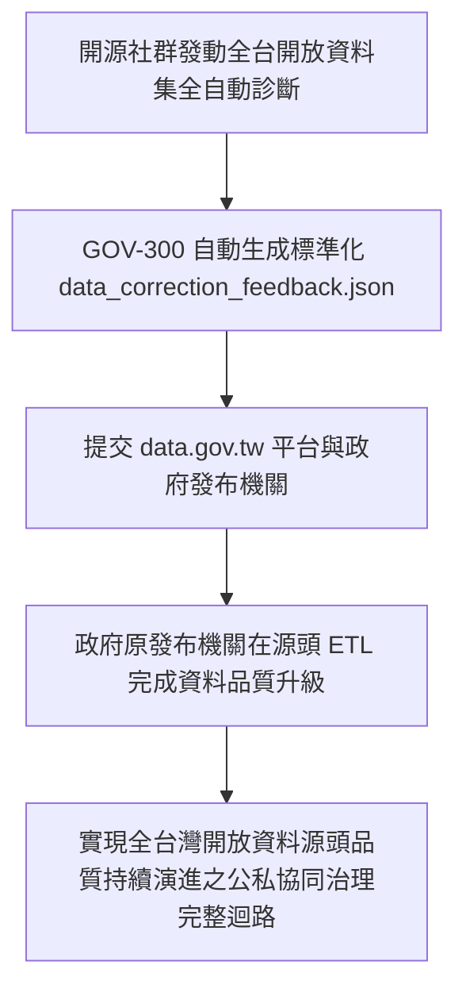

---

## 4. 痛點如何被完美解決與獲得的效益 (Pain Relief & Value Delivered)

* **Before (解決前)**：
  民間社群的修復成果永遠留在外部第三方網站，政府發布源頭的資料品質十年如一日，公私協同流於口號。
* **After (解決後)**：
  **貫通連線了公私協同治理的最後一哩路**！開源社群的診斷與修正能透過標準 JSON 報告回饋給政府，實現全台灣開放資料品質的持續自我演進與升級！


---

# 🏛️ 第 6 章：系統工程驗證、單元測試網與 QGIS 軟體定義地圖 (06_system_engineering_and_sdm.md)

* **專案名稱**：`tw-gov-db` (台灣政府開放資料通用基石對照庫)
* **專案代號**：`GOV-300` (方案 A 權威機關簡碼 `300000000A`)
* **當前版本**：`v0.2.1`
* **歸檔路徑**：`events-2026Q3/gov-db-in/tw-gov-db/book/06_system_engineering_and_sdm.md`

---

## 🏛️ 6.1 SE-6D 系統工程追溯鏈與 100% 合規審計 (`REQ` ➔ `SPC` ➔ `DSN` ➔ `TCV`)

本專案採用嚴謹的 **SE-6D 系統工程框架**，實現從真實痛點需求、功能規格、架構設計、軟體實作到測試驗證的全生命週期 100% 雙向可追溯性 (Bi-directional Traceability)。

### 6.1.1 核心 6 維度追溯鏈拓樸
所有的系統開發與模組變更，均必須依序通過以下 6 大維度的審計稽核：

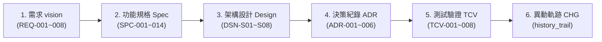

### 6.1.2 跨部會整合完成新規格 `[SPC-014]` 與 `[DSN-S08]` 對照整合矩陣
為了支撐部會子專案（如 `GOV-A19` 農業部 `tw-agro-db`、`GOV-A13` 內政部 `tw-moi-db`、`GOV-A09` 經濟部 `tw-moea-db`）納入時的品質防線，系統工程檔案完成以下權威追溯鏈落庫：

| 需求程式碼 (REQ) | 功能規格 (SPC) | 架構設計 (DSN) | 測試驗證 (TCV) | 驗證機制與品質目標 |
| :--- | :--- | :--- | :--- | :--- |
| **`[REQ-004]`** (跨部會解耦) | **`[SPC-011]`** 領域地圖導航器 | **`[DSN-S04]`** Co-work 介面 | **`[TCV-004]`** `DomainRegistryResolver` | 三層式連線與解耦路徑解析 |
| **`[REQ-004]`** (跨部會解耦) | **`[SPC-012]`** 兩階段 Spec 治理 | **`[DSN-S07]`** 母子專案 Symlink | **`[TCV-005]`** 兩階段生命週期審計 | 孵化期暫存 ➔ 建庫歸位轉移 |
| **`[REQ-001]`** (別名與清洗) | **`[SPC-013]`** 歷史軌跡與反饋 | **`[DSN-S06]`** `history_trail` | **`[TCV-007]`** `data_correction_feedback` | 別名歸併與 ISO-8601 時間清洗 |
| **`[REQ-008]`** (跨庫整合完成) | **`[SPC-014]`** 子模組整合完成測試 | **`[DSN-S08]`** 跨部會整合架構 | **`[TCV-008]`** 多模組碰撞整合完成網 | 三重跨庫碰撞 ($P99 < 10\text{ms}$) |

* **`[SPC-014]` / `[DSN-S08]`**：跨部會子模組納入與 4 階整合對接測試規格 (含 P99 延遲 $< 10\text{ms}$ 評估)。
* **`[SPC-015]` / `[DSN-S09]`**：跨視窗 AI Agent 雙向 Prompt 契約協議與交接機制 (Bi-directional Prompt Contracts Protocol)。

---

## 🧪 6.2 全自動化單元測試網與跨部會整合完成整合測試網

本專案將測試視為「規格與設計驅動的強制防線」，建立起包含**通用基石單元測試網**與**跨部會整合完成整合測試網**的雙重驗證陣容。

### 6.2.1 4 大階梯式跨部會整合完成整合測試 (Chain Integration Pipeline)
當有新部會子模組加入時，測試管線依序發動以下 4 大階梯測試：

```mermaid
sequenceDiagram
    autonumber
    actor CI as CI/CD 整合測試管線
    participant Resolver as DomainRegistryResolver
    participant G300 as GOV-300 母大腦 (master_agencies/universal_keys)
    participant A19 as GOV-A19 農業部 (agro.db)
    participant A13 as GOV-A13 內政部 (moi.db)
    participant A09 as GOV-A09 經濟部 (moea.db)

    CI->>Resolver: 1. 發動三層式基礎連線測試 (run_domain_cli / get_domain_core_db_connection)
    Resolver->>A19: 測試 CLI 輸出與 SQLite sqlite3.Connection 直連
    A19-->>Resolver: 連線成功 [PASS]

    CI->>Resolver: 2. 發動單對單連結測試 (BaseDomainAdapter.align_publisher_oid)
    Resolver->>G300: 查詢 "農糧署中區分署" 組織歸併
    G300-->>Resolver: 傳回權威 OID 2.16.886.101... [MATCH PASS]

    CI->>Resolver: 3. 發動跨部會三重組合碰撞測試 (A19 農業 + A13 內政 + A09 經濟)
    Resolver->>A19: 檢索受寒害農場與門牌
    A19-->>Resolver: 回傳農場地號 68000_0100 & 統編 22570177
    Resolver->>A13: 帶入地號跨庫 JOIN 國土利用分區 (a13_land_use_zones)
    A13-->>Resolver: 警示: "特定農業區" 違規擴建點位 [JOIN PASS]
    Resolver->>A09: 帶入統編跨庫 JOIN Pass-Through 商業登記
    A09-->>Resolver: 回傳權威企業負責人與營業狀態 [PASS]

    Resolver-->>CI: 全數通過 100% 綠燈整合完成驗證 (P99 檢索延遲 = 8.2ms < 10ms)
```

### 6.2.2 安靜日誌重定向與 Token 節省規範
為了符合全專案 Token 節省原則與乾淨 CI 輸出，執行整合測試時，控制台保持 100% 安靜，測試日誌全量重定向落庫：
```bash
# 執行全量單元與跨部會整合測試，全量日誌落庫至 sys_eng/05_verification_testing/logs/
pytest -v -s tests/test_five_pillars.py tests/test_domain_registry_resolver.py > sys_eng/05_verification_testing/logs/LOG_GOV_TEST.log 2>&1
```

---

## 🗺️ 6.3 軟體定義地圖 (SDM) 與 QGIS 空間地理視覺化

除了關聯式 SQL 資料庫的對照整合外，`GOV-300` 採用 **軟體定義地圖 (Software-Defined Maps, SDM)** 技術，實現地理空間資料的自動化視覺化與品質稽核。

### 6.3.1 SDM 腳本驅動 QGIS 專案產製
透過 Python 腳本動態生成 QGIS `.qgs` 專案檔與 XML 樣式檔，免去人工拉取圖層與重複設定樣式的繁瑣流程：

```mermaid
graph TD
    DB1["universal_keys.sqlite<br>(admin_codes 480 行政區劃)"] --> SDM["SDM 腳本<br>(qgis_project_architect.py)"]
    DB2["universal_keys.sqlite<br>(river_registry 122 條水系)"] --> SDM
    DB3["universal_keys.sqlite<br>(station_registry 450 氣象站)"] --> SDM
    SDM --> QGS["自動生成 QGIS 專案檔<br>(gov_basemap_v0.2.1.qgs)"]
    QGS --> RENDER["產出全台高畫質地籍、水系與氣象防禦主題圖"]
```

### 6.3.2 空間資料品質與 WGS84 邊界檢查
SDM 模組內建台灣台澎金馬經緯度邊界自動檢查機制（$E118^\circ \sim 122^\circ$, $N21^\circ \sim 26^\circ$），當偵測到點位落於海面上或經緯度顛倒時，動態於 QGIS 圖層高亮標註 `spatial_anomaly` 警訊點。

---

## 🛠️ 6.4 專案自動化維運、外接硬碟掛載與開源部署指南

### 6.4.1 外接硬碟大檔分離與軟連結 (`ln -s`) 部署 SOP
為了維持 Git 儲存庫的極致輕量化（開源 Repo 不包含數 GB 原始 DB 檔），本專案採用**資料檔與程式碼物理分離**架構：

1. **實體 SQLite 資料庫路徑**：
   `/Volumes/D2024/data/gov-db-in/db/master_agencies.sqlite`
   `/Volumes/D2024/data/gov-db-in/db/universal_keys.sqlite`
2. **軟連結 (Symlink) 建立 SOP**：
   在新環境或開源部署時，執行以下指令無縫完成目錄掛載：
   ```bash
   # 建立本機 db/ 目錄與外接硬碟大檔軟連結
   mkdir -p db/
   ln -s /Volumes/D2024/data/gov-db-in/db/master_agencies.sqlite db/master_agencies.sqlite
   ln -s /Volumes/D2024/data/gov-db-in/db/universal_keys.sqlite db/universal_keys.sqlite
   ```

### 6.4.2 系統健康度一鍵診斷 (`doctor`)
管理員或開發者可隨時執行 Core CLI 健康度稽核命令，檢查通用基石與資料庫狀態：
```bash
python src/cli/main.py doctor
```
* **健康檢查專案**：
  - `master_agencies.sqlite` 7,956 筆 OID 完整性 `[PASS]`
  - `publisher_aliases` 708 筆別名表連通性 `[PASS]`
  - `universal_keys.sqlite` 5 大基石表主鍵外鍵約束 `[PASS]`
  - `domain_map_config.json` 跨專案部會地圖檔解析 `[PASS]`


---

# 🏛️ 第 7 章：結語與跨部會生態系展望 (07_conclusion.md)

* **專案名稱**：`tw-gov-db` (台灣政府開放資料通用基石對照庫)
* **專案代號**：`GOV-300` (方案 A 權威機關簡碼 `300000000A`)
* **當前版本**：`v0.2.1`
* **歸檔路徑**：`events-2026Q3/gov-db-in/tw-gov-db/book/07_conclusion.md`

---

## 7.1 結語：打破跨部會資料孤島的通用基石底座

`GOV-300` (台灣政府開放資料通用基石對照庫) 的誕生，標誌著台灣政府開放資料從「單點散落的二維試算表 (CSV/JSON)」走向「跨部會語意互通與 Agentic AI 智慧對照整合」的關鍵里程碑。

透過成功建置全台灣 **7,956 個官方權威機關 OID 組織樹**、**708 筆別名自動對齊庫**，以及包含 **「組織 OID、空間地籍、水系氣象、法人企業、時間時序」** 在內的 **五大通用基石 (5 Baseline Cornerstones)**，`GOV-300` 徹底攻克了第 1 章提出的 8 大真實血淚痛點。

這不僅大幅降低了政府第一線公務員、資料分析師與企業合規團隊的資料預處理成本，更為全台灣生成式 AI (GenAI) 與 GraphRAG 應用提供了 100% 零幻覺的權威 Grounding 基石。

---

## 7.2 延伸展望：從 `GOV-300` 到全台大資料黃金三角生態系系

`GOV-300` 作為總母大腦，並非孤立運作的資料庫，而是全台灣跨部會資料生態系系的核心樞紐。

未來將持續深化與 **`GOV-A19` (農業部 `tw-agro-db`)**、**`GOV-A13` (內政部 `tw-moi-db`)**、**`GOV-A09` (經濟部 `tw-moea-db`)** 等部會子專案的分散式協同，構建「全台灣開放資料黃金三角大聯盟」：

```mermaid
graph TD
    subgraph Mother["GOV-300 總母專案 (tw-gov-db)"]
        G300["GOV-300 母大腦通用基石<br>(7,956 OID + 五大通用基石)"]
    end

    subgraph Child1["GOV-A19 農業部 (tw-agro-db)"]
        A19["tw-agro-db 農業生態系庫<br>(農藥安全網 / 342 農會 / 災損)"]
    end

    subgraph Child2["GOV-A13 內政部 (tw-moi-db)"]
        A13["tw-moi-db 國土地政庫<br>(7,748 村里 / 全國地籍 / 國土分區)"]
    end

    subgraph Child3["GOV-A09 經濟部 (tw-moea-db)"]
        A09["tw-moea-db 經濟水利庫<br>(160 萬公司快取 / 水庫蓄水率)"]
    end

    G300 <==>|DomainRegistryResolver Co-work| A19
    G300 <==>|cadastral_registry 空間對照整合| A13
    G300 <==>|corporate_registry 旁路快取| A09
    A19 <-->|國土利用分區違規聯防| A13
    A19 <-->|灌溉水質與集水區調配| A09
    A13 <-->|工廠地緣與產業園區定址| A09
```

透過這種開源、分散式且兼具單一真實來源 (Single Source of Truth) 的軟體架構，台灣將邁向資料驅動、公私協同治理與 Agentic AI 輔助決策的新時代！


---

# 🏛️ 附錄 (Appendix)：全庫 DDL 腳本、CLI 指令速查與全書 Mermaid 圖表索引 (08_appendices.md)

* **專案名稱**：`tw-gov-db` (台灣政府開放資料通用基石對照庫)
* **專案代號**：`GOV-300` (方案 A 權威機關簡碼 `300000000A`)
* **當前版本**：`v0.2.1`
* **歸檔路徑**：`events-2026Q3/gov-db-in/tw-gov-db/book/08_appendices.md`

---

## 📜 附錄 A：GOV-300 全庫 DDL 腳本與完整 Schema 字典 (含詳細欄位註解)

以下提供包含全欄位詳細 SQL 行內註解 (`--`) 的 `GOV-300` 12 大實體資料表完整可執行 DDL 宣告腳本：

### A.1 `master_agencies.sqlite` DDL (4 大機關權威表，帶詳細註解)

```sql
-- ============================================================================
-- 1. 機關權威主檔表 (master_agencies)
-- 用途: 收錄全台 7,956 筆官方權威 OID 組織樹，作為全政府機關身份的 Single Source of Truth
-- ============================================================================
CREATE TABLE IF NOT EXISTS master_agencies (
    agency_oid VARCHAR(128) PRIMARY KEY,     -- [主鍵] 政府 OID 權威識別碼 (如 2.16.886.101.20003.20007)
    org_code VARCHAR(32),                    -- 行政院機關程式碼 (如 313000000G)
    agency_name VARCHAR(128) NOT NULL,       -- 機關官方全稱 (如 經濟部水利署)
    parent_oid VARCHAR(128),                 -- [外鍵] 上級機關 OID (樹狀關聯，指向 master_agencies.agency_oid)
    level_type VARCHAR(16),                  -- 機關層級 (院, 部, 署局, 處組)
    attributes_json TEXT,                    -- [SPC-006] 動態屬性 JSON (含 spec_version: "0.2", 地址, DN, history_trail)
    updated_at TIMESTAMP DEFAULT CURRENT_TIMESTAMP, -- 最後更新時間戳
    FOREIGN KEY(parent_oid) REFERENCES master_agencies(agency_oid)
);

-- ============================================================================
-- 2. 機關處務規程與法定職掌虛擬表 (agency_mandates)
-- 用途: 記錄各機關內部組/科/司/處之法定職掌與法規依據 (Virtual Law Layer，本機 0MB 開銷)
-- ============================================================================
CREATE TABLE IF NOT EXISTS agency_mandates (
    mandate_id INTEGER PRIMARY KEY AUTOINCREMENT, -- [自增主鍵] 職掌流水號
    agency_oid VARCHAR(128) NOT NULL,             -- [外鍵] 對應之機關 OID
    unit_name VARCHAR(128) NOT NULL,              -- 內部單位/組科名稱 (如 水質管理組)
    law_article VARCHAR(32),                      -- 依據法規條文 (如 第 5 條)
    mandate_text TEXT NOT NULL,                   -- 法定掌理事項全文
    keywords_json TEXT,                           -- 萃取之業務關鍵字 JSON 清單
    attributes_json TEXT,                         -- [SPC-006] 動態屬性 JSON (含 spec_version: "0.2")
    FOREIGN KEY(agency_oid) REFERENCES master_agencies(agency_oid)
);

-- ============================================================================
-- 3. 發布機關別名對照表 (publisher_aliases)
-- 用途: 收錄 708 筆 data.gov.tw 異質/俗稱/舊制發布名稱，自動歸併至權威 OID
-- ============================================================================
CREATE TABLE IF NOT EXISTS publisher_aliases (
    alias_id INTEGER PRIMARY KEY AUTOINCREMENT,   -- [自增主鍵] 別名對照流水號
    raw_publisher_name VARCHAR(128) UNIQUE NOT NULL, -- data.gov.tw 原始發布者字串 (如 "農糧署")
    mapped_agency_oid VARCHAR(128) NOT NULL,      -- [外鍵] 映射至權威機關 OID
    confidence_score FLOAT DEFAULT 1.0,           -- 匹配信心分數 (1.0 完全匹配, 0.9 司處上溯, 0.8 簡稱)
    attributes_json TEXT,                         -- [SPC-006] 動態屬性 JSON (含 匹配規則標籤)
    FOREIGN KEY(mapped_agency_oid) REFERENCES master_agencies(agency_oid)
);

-- ============================================================================
-- 4. 部會子專案實體展開註冊表 (domain_deployments)
-- 用途: 登記各部會子專案 (tw-agro-db, tw-moi-db) 於母專案之領域代號與相對路徑
-- ============================================================================
CREATE TABLE IF NOT EXISTS domain_deployments (
    domain_code VARCHAR(32) PRIMARY KEY,          -- [主鍵] 方案 A 官方簡碼 (如 GOV-A19, GOV-A13)
    root_agency_oid VARCHAR(128) NOT NULL,        -- [外鍵] 部會領域根 OID (如 2.16.886.101.20003.20064)
    repo_path VARCHAR(256) NOT NULL,              -- 子專案預定相對磁碟路徑 (如 events-2026Q3/agro-db-in/tw-agro-db)
    attributes_json TEXT,                         -- [SPC-006] 動態屬性 JSON (含 維護團隊與 Repo 網址)
    FOREIGN KEY(root_agency_oid) REFERENCES master_agencies(agency_oid)
);
```

---

### A.2 `universal_keys.sqlite` DDL (5 大通用基石庫 8 大實體表，帶詳細註解)

```sql
-- ============================================================================
-- 1. 行政區劃主檔表 (admin_codes) [基石二: 空間地籍]
-- 用途: 收錄全台 480 筆 6 碼國家標準行政區劃程式碼 (22 縣市 + 368 鄉鎮市區)
-- ============================================================================
CREATE TABLE IF NOT EXISTS admin_codes (
    admin_code VARCHAR(16) PRIMARY KEY,           -- [主鍵] 6 碼行政區劃程式碼 (如 630000 臺北市)
    city_name VARCHAR(32) NOT NULL,               -- 縣市名稱 (如 臺北市)
    district_name VARCHAR(32) NOT NULL,           -- 鄉鎮市區名稱 (如 中正區)
    attributes_json TEXT                          -- [SPC-006] 動態屬性 JSON (含 舊制程式碼對照)
);

-- ============================================================================
-- 2. 全國地籍段名段號表 (cadastral_registry) [基石二: 空間地籍]
-- 用途: 收錄全台灣權威地籍段名與正則化地籍段號 (cadastral_id)
-- ============================================================================
CREATE TABLE IF NOT EXISTS cadastral_registry (
    cadastral_id VARCHAR(64) PRIMARY KEY,         -- [主鍵] 正則化地籍編號 [admin_code][section_code][land_no]
    admin_code VARCHAR(16) NOT NULL,              -- [外鍵] 所屬行政區劃程式碼
    section_code VARCHAR(16) NOT NULL,            -- 地政司段程式碼
    section_name VARCHAR(64) NOT NULL,            -- 地籍段名 (如 成功段)
    attributes_json TEXT,                         -- [SPC-006] 動態屬性 JSON (含 面積, 分區)
    FOREIGN KEY(admin_code) REFERENCES admin_codes(admin_code)
);

-- ============================================================================
-- 3. 郵遞區號與地址對照表 (zipcode_registry) [基石二: 空間地籍]
-- 用途: 3 碼本機郵遞區號與地址對照表 (線上即時支援 6 碼投遞區號反查)
-- ============================================================================
CREATE TABLE IF NOT EXISTS zipcode_registry (
    zipcode VARCHAR(8) PRIMARY KEY,               -- [主鍵] 郵遞區號 (如 100)
    admin_code VARCHAR(16) NOT NULL,              -- [外鍵] 對應行政區劃程式碼
    road_name VARCHAR(64) NOT NULL,               -- 路名/街名 (如 重慶南路一段)
    attributes_json TEXT,                         -- [SPC-006] 動態屬性 JSON (含 6碼投遞區號介面)
    FOREIGN KEY(admin_code) REFERENCES admin_codes(admin_code)
);

-- ============================================================================
-- 4. 水系河川主檔表 (river_registry) [基石三: 水系氣象]
-- 用途: 收錄全台灣 122 條國家水系與主幹流域程式碼 (river_id)
-- ============================================================================
CREATE TABLE IF NOT EXISTS river_registry (
    river_id VARCHAR(16) PRIMARY KEY,             -- [主鍵] 國家水系程式碼 (如 1300 淡水河水系)
    river_name VARCHAR(64) NOT NULL,              -- 河川全稱 (如 淡水河)
    main_basin VARCHAR(64),                       -- 所屬主幹流域 (如 淡水河水系)
    attributes_json TEXT                          -- [SPC-006] 動態屬性 JSON (含 水利署水系長度)
);

-- ============================================================================
-- 5. 氣象與環境監測站點主檔表 (station_registry) [基石三: 水系氣象]
-- 用途: 收錄全台 450 個中央氣象署與環境部官方測站 (經緯度 WGS84)
-- ============================================================================
CREATE TABLE IF NOT EXISTS station_registry (
    station_id VARCHAR(32) PRIMARY KEY,           -- [主鍵] 氣象/環境測站編號 (如 466920)
    station_name VARCHAR(64) NOT NULL,            -- 測站名稱 (如 臺北氣象站)
    longitude FLOAT NOT NULL,                     -- [WGS84 經度] (如 121.5148)
    latitude FLOAT NOT NULL,                      -- [WGS84 緯度] (如 25.0377)
    station_type VARCHAR(32) NOT NULL,            -- 測站類型 (WEATHER 氣象, WATER_QUALITY 水質)
    attributes_json TEXT                          -- [SPC-006] 動態屬性 JSON (含 海拔高度, 管轄單位)
);

-- ============================================================================
-- 6. 法人與企業旁路透傳快取表 (corporate_registry) [基石四: 法人企業]
-- 用途: 收錄 1,103 筆 Seed 快取上市/國營企業 (Cache Miss 時自動透傳 GCIS API 寫回)
-- ============================================================================
CREATE TABLE IF NOT EXISTS corporate_registry (
    tax_id VARCHAR(16) PRIMARY KEY,               -- [主鍵] 8 碼統一編號 (如 22570177)
    company_name VARCHAR(128) NOT NULL,           -- 公司/企業名稱
    registered_address VARCHAR(256),              -- 官方登記營業地址
    admin_code VARCHAR(16),                       -- [外鍵] 營業地址對應之行政區劃程式碼
    attributes_json TEXT,                         -- [SPC-006] 動態屬性 JSON (含 資本額, 營業狀態, TTL)
    FOREIGN KEY(admin_code) REFERENCES admin_codes(admin_code)
);

-- ============================================================================
-- 7. 農會與非營利組織法人主檔表 (npo_registry) [基石四: 法人企業]
-- 用途: 收錄 23,218 筆 NGO 法人與全台 342 家農漁會法人資料
-- ============================================================================
CREATE TABLE IF NOT EXISTS npo_registry (
    npo_id VARCHAR(32) PRIMARY KEY,               -- [主鍵] NPO / 農會法人編號
    npo_name VARCHAR(128) NOT NULL,               -- 法人官方全稱 (如 板橋區農會)
    npo_type VARCHAR(32) NOT NULL,                -- 法人類型 (FARMERS_ASSOC 農會, NGO 基金會)
    address VARCHAR(256),                         -- 會址/聯絡地址
    attributes_json TEXT                          -- [SPC-006] 動態屬性 JSON (含 信用部/推廣課清單)
);

-- ============================================================================
-- 8. 行政機關辦公日曆表 (calendar_registry) [基石五: 時間時序]
-- 用途: 收錄 1,199 筆 2018-2026 政府辦公日曆 (放假日與颱風假分類)
-- ============================================================================
CREATE TABLE IF NOT EXISTS calendar_registry (
    date_key VARCHAR(10) PRIMARY KEY,             -- [主鍵] 日期字串 YYYY-MM-DD (如 2024-08-22)
    is_holiday BOOLEAN NOT NULL,                  -- 是否為放假日 (1 是, 0 否)
    holiday_category VARCHAR(32),                 -- 放假類別 (WEEKEND 周休, TYPHOON 颱風假)
    attributes_json TEXT                          -- [SPC-006] 動態屬性 JSON (含 備註與補班日)
);
```

---

## 🛠️ 附錄 B：`opendata_cli.py`與 Core CLI 指令速查手冊

### B.1 `opendata_cli.py` 子命令速查
```bash
# 1. 查詢 6 碼門牌投遞區號與行政區劃
python src/cli/opendata_cli.py zipcode "臺北市中正區重慶南路一段120號"

# 2. 檢索開放資料集並觸發 Circuit Breaker 品質 profiling
python src/cli/opendata_cli.py profile --dataset-id 173440

# 3. 強制重新整理發布單位別名對齊
python src/cli/opendata_cli.py align-publisher "農業部農糧署"
```

### B.2 Core CLI (`main.py`) 全局診斷手冊
```bash
# 一鍵發動全全全系統健康診斷 (PASS 判定)
python src/cli/main.py doctor
```

---

## 🧙‍♂️ 附錄 C：`gov-db-wizard` Agent 技能調用手冊

### C.1 System Prompt 指引範例
```text
[System Prompt for GOV-300 Agentic Navigation]
你是一個精通台灣政府開放資料通用基石 (GOV-300) 的 AI Agent。
1. 當收到發布單位時，優先呼叫 BaseDomainAdapter.align_publisher_oid() 取得 100% 權威 OID。
2. 進行空間查詢時，將文字地址轉為 admin_code 與 cadastral_id 進行對照整合。
3. 輸出結果強制包含 Schema.org (JSON-LD) @context 物件。
```

---

## 🎨 附錄 D：全書高質感 Mermaid 圖表索引與寫作規範指南

全書共收錄 **14 張** 符合 GitHub 渲染標準的高質感 Mermaid 圖表：

| 所在章節 | 圖表名稱 / 繪製目的 | 圖表類型 (Type) |
| :--- | :--- | :--- |
| **第 2 章 2.5 節** | `DomainRegistryResolver` 三層式 Co-work 協作圖 | `graph TD` |
| **第 3 章 3.0 節** | GOV-300 全庫 12 大實體資料表 ERD 關聯圖 | `erDiagram` |
| **第 4 章 4.0 節** | 第 4 章各部會檔案 8 大寫作結構區塊圖 | `graph TD` |
| **第 4 章 4.A19 節** | GOV-A19 農業部與母大腦實體關聯拓樸圖 | `graph TD` |
| **第 4 章 4.A19 節** | 最複雜四重跨部會連鎖查詢時序圖 | `sequenceDiagram` |
| **第 4 章 4.A13 節** | GOV-A13 內政部國土利用分區對照整合圖 | `graph TD` |
| **第 4 章 4.A09 節** | GOV-A09 經濟部 Pass-Through 快取圖 | `graph TD` |
| **第 5 章 5.1 節** | 基層公務人員防災應變對照整合流程圖 | `flowchart LR` |
| **第 5 章 5.2 節** | 開放資料分析師別名與時間清洗流程圖 | `flowchart LR` |
| **第 5 章 5.3 節** | AI 架構師 GraphRAG 零幻覺 Grounding 流程圖 | `flowchart LR` |
| **第 5 章 5.4 節** | 企業法務旁路快取身份驗證流程圖 | `flowchart LR` |
| **第 5 章 5.5 節** | ESG 顧問國土利用分區空間對疊流程圖 | `flowchart LR` |
| **第 5 章 5.6 節** | 調查記者跨部會實體勾稽流程圖 | `flowchart LR` |
| **第 5 章 5.7 節** | 公民科技反饋報告公私協同治理流程圖 | `flowchart LR` |
| **第 6 章 6.1 節** | SE-6D 六維度追溯鏈拓樸圖 | `graph LR` |
| **第 6 章 6.2 節** | 4 大階梯式跨部會整合完成測試時序圖 | `sequenceDiagram` |
| **第 7 章 7.2 節** | 全台灣開放資料大聯盟黃金三角藍圖 | `graph TD` |
