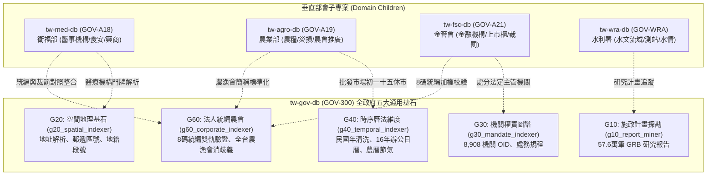

# 台灣全政府通用基石模組跨部會互通與調用手冊 (Cross-Agency Interoperability Guide)

> **所屬核心專案**：`tw-gov-db` / `GOV-300` (全政府通用基石對照庫)  
> **適用受眾**：跨部會子專案開發者（如農業部 `tw-agro-db`、衛福部 `tw-med-db`、金管會 `tw-fsc-db`、內政部 `tw-moi-db`）與 AI Agent 控制平面  
> **技術規範**：[CLI Governance Spec (CGS) v2.4](file:///Users/wuulong/github/bmad-pa/scripts/CLI_GOVERNANCE_SPEC.md) (Pipeline-Native UNIX Standard)  
> **最新修訂日期**：2026-09-12  

---

## 🏛️ 1. 五大通用基石架構與職責矩陣

在台灣政府資料治理生態系系中，`tw-gov-db` 提供五大橫向中樞維度器，為所有縱向垂直部會資料庫（A01~A25）提供標準化主鍵對照整合與消歧義服務：



---

## 🐍 2. 模式一：Python 原生 Direct Import 調用（零程序開銷）

### 2.1 設計原則
* **零 subprocess 負擔**：在 Python 腳本或 ETL 批次資料流中，嚴禁使用 `subprocess.run` 或 `os.system` 呼叫 CLI，應**優先直接 import 核心函式**，每秒吞吐量可達 5 萬筆以上。
* **路徑配置**：在部會程式庫入口動態導入 `tw-gov-db/src`。

```python
import sys
from pathlib import Path

# 動態加載 tw-gov-db 原始碼目錄 (或透過 domain_map_config.json 自動解析)
GOV_SRC = Path(__file__).resolve().parents[3] / "gov-db-in" / "tw-gov-db" / "src"
if str(GOV_SRC) not in sys.path:
    sys.path.insert(0, str(GOV_SRC))
```

### 2.2 核心符號與功能範例對照

#### ① G60：法人統編檢核與農漁會消歧義
```python
# 1. 8 碼統一編號新舊制加權驗證 (純 Python，微秒級解算)
from modules.g60_corporate_indexer.ban_validator import BanValidator

res = BanValidator.validate("04595257")
# res = {'tax_id': '04595257', 'is_valid': True, 'valid_by_legacy': True, 'valid_by_current': True, 'explanation': '符合舊制加權除10規範'}

# 2. 全台農漁會不規範簡稱消歧義 (自動剝除「信用部」、「生鮮超市」等綴詞)
from modules.g60_corporate_indexer.npo_resolver import NpoResolver

resolver = NpoResolver()
npo = resolver.resolve("新埔農會生鮮超市")
# npo = {'canonical_name': '新竹縣新埔鎮農會', 'npo_id': 'FA_HSQ_006', 'level': 'DISTRICT', 'city': '新竹縣'}
```

#### ② G40：時間字串清洗與農曆/節氣運算
```python
from datetime import date
from modules.g40_temporal_indexer.g40_cli import clean_date_string
from modules.g40_temporal_indexer.lunar_engine import solar_to_lunar

# 1. 異質民國年/西元年轉 ISO-8601
d = clean_date_string("113/08/22")
# d = {'date_str': '2024-08-22', 'minguo_year': 113, 'iso_format': '2024-08-22T00:00:00+08:00'}

# 2. 西曆轉農曆、干支、生肖與節氣
lunar = solar_to_lunar(date(2024, 8, 22))
# lunar = {'gan_zhi': '甲辰', 'sheng_xiao': '龍', 'month_name': '七月', 'day_name': '十九', 'solar_term': '處暑'}
```

#### ③ G30：機關程式碼與權威 OID 組織樹反查
```python
from modules.g30_mandate_indexer.g30_cli import get_canonical_oid

oid = get_canonical_oid("農業部")
# oid = '2.16.886.101.20003.20064'
```

#### ④ G20：門牌地址結構化與郵遞區號對位
```python
from modules.g20_spatial_indexer.g20_cli import parse_address_string

addr = parse_address_string("新竹縣竹北市光明六路10號")
# addr = {'city': '新竹縣', 'district': '竹北市', 'road': '光明六路', 'number': '10號'}
```

#### ⑤ G10：GRB 政府施政研究計畫多維檢索
```python
from modules.g10_report_miner.g10_core import search_grb_projects

plans = search_grb_projects(kw="智慧農業", limit=5)
# plans = {'total_results': 120, 'results': [...]}
```

---

## 💻 3. 模式二：UNIX Pipeline 串流呼叫（CGS v2.4 標準）

在 Shell 腳本、排程作業（Cron）、終端互動或 AI 代理程式調用時，透過 Master CLI (`./pa`) 調用各維度器。

### 3.1 共通呼叫慣例
* **直達短指令**：
  * `./pa g10` 或 `./pa reports`
  * `./pa g20` 或 `./pa spatial`
  * `./pa g30` 或 `./pa mandate`
  * `./pa g40` 或 `./pa temporal`
  * `./pa g60` 或 `./pa corporate`
* **CGS 共通 Flags**：
  * `-j, --json`：100% 純淨單行緊湊 JSON。
  * `-q, --quiet`：極簡輸出（僅輸出程式碼或命中值）。
  * `--tsv`：輸出 Tab 分隔值，方便 `awk` 與 `cut` 消費。

### 3.2 4 大跨部會 Pipe 實戰配方

#### 配方 1：採購標案長文本 ➔ 統編萃取 ➔ 反查公司全名與地址
```bash
echo "公告：本案由台灣積體電路(04595257)得標，備選廠商鴻海(04541302)，日期20240912。" | ./pa g60 pipe -q | ./pa g60 lookup --tsv
```
* **輸出**：
  ```
  04595257	台灣積體電路製造股份有限公司	新竹市東區新竹科學園區力行六路8號	10018010
  04541302	鴻海精密工業股份有限公司	新北市土城區自由街2號	65000130
  ```

#### 配方 2：農業部災損申報不規範農會名冊 ➔ 批量標準化 TSV
```bash
echo -e "板農信用部\n新埔農會生鮮超市\n吉安鄉農會直銷站" | ./pa g60 resolve -j | jq -r '.[] | [.input_name, .canonical_name, .npo_id, .level, .city] | @tsv'
```
* **輸出**：
  ```
  板農信用部	新北市板橋區農會	FA_NTP_001	DISTRICT	新北市
  新埔農會生鮮超市	新竹縣新埔鎮農會	FA_HSQ_006	DISTRICT	新竹縣
  吉安鄉農會直銷站	花蓮縣吉安鄉農會	FA_HUA_004	DISTRICT	花蓮縣
  ```

#### 配方 3：異質日期串流清洗 ➔ 國定上班日/颱風假判定
```bash
echo -e "113/08/22\n1130917\n農曆113年五月初五" | ./pa g40 clean-date -j | jq -r '.[] | [.raw_input, .date_str, .type] | @tsv'
```

#### 配方 4：特許機構統編合法性批量過濾（篩出偽碼）
```bash
cat candidate_tax_ids.txt | ./pa g60 check -j | jq '.[] | select(.is_valid == false)'
```

---

## 🛡️ 4. 容錯與離線降級防禦機制

1. **斷線自適應降級 (Offline Graceful Degradation)**：
   * G40 農曆節氣演演算法與 G60 統編雙軌加權檢驗引擎皆為 **100% 純 Python 零外部依賴**，在完全無網路環境下仍能提供毫秒級運算。
   * G60 `lookup` 優先讀取本機快取；在無網路或 GCIS 伺服器超時時，自動標記 `cache_hit: false, source: "OFFLINE_VALIDATED"`，保證管線不掛死。
2. **非阻塞 Stdin 緩衝防護**：
   * 探針配備 0.3 秒緩衝延遲，可容忍多行程管道鏈式啟動時間差，避免下游因上游尚未 flush 而過早退出。
