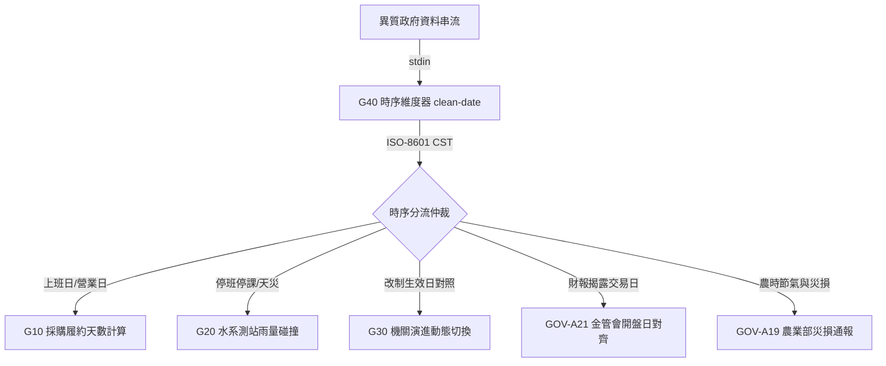

# G40 全政府時間、辦公日曆與時序維度器 高級延伸與跨部會協同規格書 (ADVANCED_SPEC.md)

- **模組名稱**: `g40_temporal_indexer`
- **所屬專案**: `tw-gov-db` (`GOV-300` 全政府通用基石對照庫)
- **核心目標**: 定義 G40 時間與時序維度器如何穿透同專案其他模組（G10 採購、G20 空間水系、G30 組織演進），並提供給跨部會主題專案（GOV-A19 農業部、GOV-A21 金管會）作為統一的 UNIX Pipe-Native 流式時序轉接樞紐。

---

## 💡 UNIX Pipe-Native 深度發想與串接配方 (Pipe Recipes)

在 CGS v2.4 標準下，`g40_cli.py` 扮演全生態系系系「**時序篩網 (Temporal Sieve)**」與「**時間軸對齊器 (Timeline Aligner)**」角色，深度發想以下 5 大管線配方：

### 配方 1：開放資料異質民國年清洗 ➔ 現行機關對位 ➔ 空間正規化 (三基石連鎖)
* **情境**: 取得一筆原始開放資料，同時含有異質民國年「112/08/15」、舊機關名「二河局」與門牌地址。
```bash
echo '{"date": "112/08/15", "agency": "第二河川局", "addr": "新竹市東區中央路"}' \
  | jq -r '.date' | pa g40 clean-date --stdin -j \
  | jq -r '.agency' | pa g30 resolve-org --stdin -j \
  | jq -r '.addr' | pa g20 align-address --stdin -j
```
* **價值**: 100 毫秒內將一筆未清洗的混亂政府資料，完成「標準時間戳 + 權威機關 OID + 標準 6 碼行政區地籍」的三位一體淬煉。

### 配方 2：農業部重大災損申報 ➔ 颱風天災假與降雨測站碰撞 (G40 ↔ G20 ↔ GOV-A19)
* **情境**: 驗證農民災損申報日是否恰好落在歷史颱風停班停課日或連續暴雨期間。
```bash
pa agro a10 search "高粱災損" -j \
  | jq -r '.[].申報日期' \
  | pa g40 check --stdin -j \
  | jq 'select(.is_holiday == true or .holiday_category == "TYPHOON_LEAVE")'
```

### 配方 3：政府採購標案履約天數與法定營業日計算 (G40 ↔ G10)
* **情境**: 計算特定標案自決標日至驗收日之間，扣除所有週末與國定假日的「真實法定工作日數」。
```bash
pa gov g10 fetch-tender "T113-001" -j \
  | jq -r '[.award_date, .completion_date] | "\(.[0]) \(.[1])"' \
  | xargs pa g40 range --working-days-only -j \
  | jq '.total_working_days'
```

### 配方 4：金管會上市櫃財報發布日 ➔ 營業日/開盤日判定 (G40 ↔ GOV-A21)
* **情境**: 檢驗財報發布或重大資訊揭露是否於非交易日發布。
```bash
pa fsc announcements --date "1130501" -j \
  | jq -r '.[].announcement_date' \
  | pa g40 check --stdin -j \
  | jq 'select(.is_working_day == false) | "\(.date_str) 為非營業日: \(.description)"'
```

### 配方 5：跨年度會計年度批次切片 ➔ 法規處務規程時間軸對照 (G40 ↔ G30)
* **情境**: 展開「112年度」所有日期，比對水利署組改基準日「112-09-26」前後之資料歸屬。
```bash
pa g40 bucket "112年度" -j \
  | jq -r '.days[]' \
  | while read d; do \
      if [[ "$d" < "2023-09-26" ]]; then echo "$d: 舊制河川局"; else echo "$d: 新制河川分署"; fi; \
    done | head -n 10
```

---

## 🔗 跨模組業務穿透架構 (Cross-Module Synergy Architecture)



---

## 📐 前瞻跨庫檢視契約 (Future Cross-Module SQL View Contract)

```sql
-- 跨部會業務活動時序與辦公日曆穿透檢視
CREATE VIEW IF NOT EXISTS v_g40_activity_calendar_lens AS
SELECT 
    c.date_str,
    c.year,
    c.minguo_year,
    c.is_holiday,
    c.is_working_day,
    c.holiday_category,
    c.description AS holiday_desc,
    CASE 
        WHEN c.date_str >= '2023-09-26' THEN 'MOE_WRA_NEW_ERA' 
        ELSE 'MOE_WRA_LEGACY_ERA' 
    END AS wra_era_tag,
    CASE 
        WHEN c.date_str >= '2023-08-01' THEN 'MOA_NEW_ERA' 
        ELSE 'COA_LEGACY_ERA' 
    END AS agro_era_tag
FROM calendar_registry c;
```
