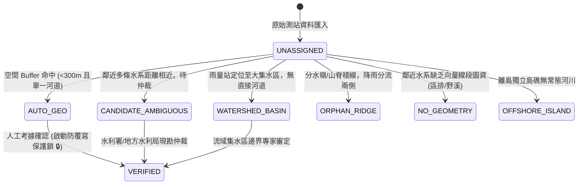
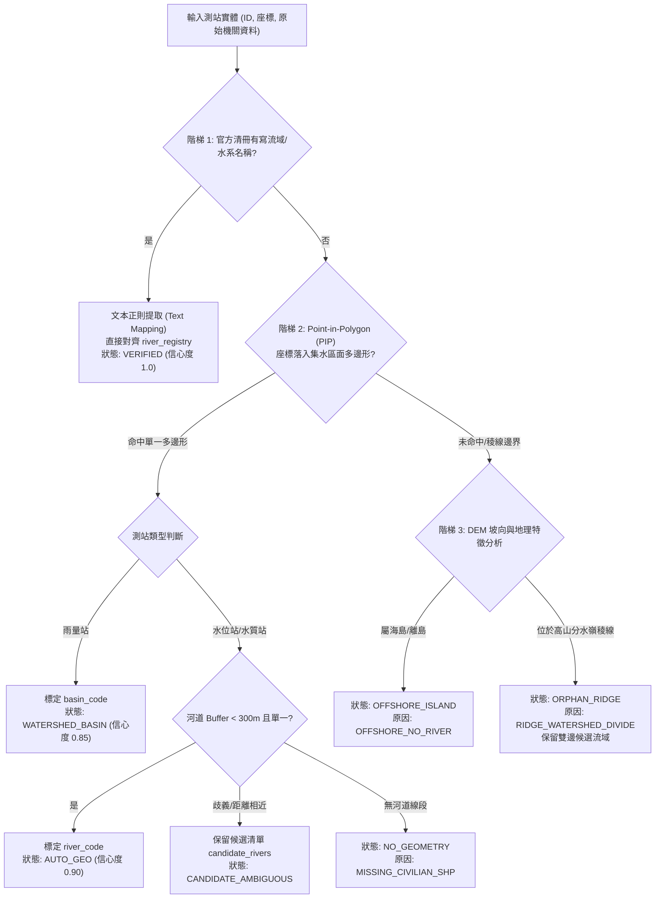

# 📡 氣象與跨部會水文測站水系歸位狀態機與未歸位原因治理規格書 (SPEC_STATION_RIVER_ALIGNMENT_GOVERNANCE.md)

* **規格代號**：`SPEC-GOV-G30-STA-001`
* **受控版本**：`v1.2.0` (新增三階流域與水系空間歸位演演算法規格)
* **所屬模組**：`tw-gov-db` / `g30_hydrology_indexer` (通用基石三)
* **相關資料表**：`universal_keys.sqlite` ➔ `station_registry`
* **相容標準**：WRA-Civ Spec v2.4, CGS v2.4, CWA 氣象署, WRA 水利署, MOENV 環境部, 地方政府水利局, `[SPC-006, SPC-013]`

---

## 1. 核心水理哲學：水位站 vs 雨量站的物理本質差異 (Physical Hydrology Principles)

在水理學與地理空間工程中，感測站與河川水系的物理關係存在根本性差異，**嚴禁將所有測站混為一談並強行做直線歐幾里得距離歸位**：

```text
       【集水區 / 山脊雨量站】 (雲雨落下的地方，不在河道上)
               ☁️ 🌧️ 🌧️ 🌧️
               /           \
              / (地表逕流)   \ (地表逕流)
             ▼               ▼
   ================ 河道 / 溪流 ================
          [水位站 A]              [水位站 B]
   (真正接觸河水的水位計，100% 在河道物理線上)
```

1. **水位站 (`WATER_LEVEL`) / 水質站 (`WATER_QUALITY`) ➔ 「身在何河」 (Located ON River)**：
   * **物理本質**：感測器（雷達波、超音波或壓力計）**物理位置 100% 位於河道上方、橋墩旁、消波塊或水閘門內**。
   * **空間關係**：**點對線 (Point ON Line)**。它必定直接隸屬於特定河川或野溪，其 `river_code` 必須對齊實體河道（若暫時無法確認則標註為待查）。
2. **雨量站 (`RAINFALL`) ➔ 「雨落何區」 (Drains INTO Catchment Basin)**：
   * **物理本質**：感測器（承雨筒）通常架設於山頂氣象站、學校操場、水庫大壩邊坡、森林瞭望台或建物屋頂，**絕大多數根本不在河床內**。
   * **空間關係**：**點對面 (Point IN Catchment Polygon)**。雨量站不是在河川「上」，而是在該河川的**「集水區（Catchment Basin）」**內，其降雨藉由地表逕流匯入該水系。
   * **歸位原則**：雨量站優先對齊宏觀**「集水區程式碼 (`basin_code`)」**；僅在其位於封閉且明確之單一野溪集水支面時，才於 `attributes_json` 標註匯流之支流野溪代號。

---

## 2. 涵蓋跨部會與地方政府感測網路 (Universal Sensor Coverage)

本系統不應僅侷限於單一中央機關，應一體化容納全台灣與水利防汛直接相關之 5 大管轄來源（全島約 2,500 ~ 3,000 座站點）：

| 管轄機關來源 | 機關層級 (`authority_level`) | 核心測站類型 (`station_type`) | 典型數量 | 與水系拓樸的關係 |
| :--- | :---: | :--- | :---: | :--- |
| **中央氣象署 (CWA)** | 中央 (`CENTRAL`) | `RAINFALL`, `WEATHER` | ~550 站 | 宏觀氣象與山區雨量網，多屬面降雨量監測 |
| **經濟部水利署 (WRA)** | 中央 (`CENTRAL`) | `WATER_LEVEL`, `RAINFALL` | ~700 站 | 中央管河川、幹流與水庫專屬防汛水位/雨量站 |
| **地方政府水利/工務局 (LOCAL_GOV)** | 地方 (`LOCAL_GOV`) | `WATER_LEVEL`, `INUNDATION`, `RAINFALL` | ~800 站 | 縣管河川、區域排水 (區排)、抽水站、市區滯洪池感測器 |
| **環境部 (MOENV)** | 中央 (`CENTRAL`) | `WATER_QUALITY` | ~300 站 | 重要河川水質監測站，100% 位於特定河道橋樑 |
| **農村水保署 (ARDTC)** | 中央 (`CENTRAL`) | `RAINFALL`, `DEBRIS_FLOW` | ~150 站 | 深山野溪與土石流潛勢溪流保全戶專用雨量站 |

---

## 3. 狀態機架構與保護鎖 (Alignment Lifecycle FSM & Protection Lock)

測站生命週期由 7 個明確狀態構成，並設有嚴格的**防覆寫保護鎖（Protection Lock）**：



### 3.1 狀態程式碼清單 (`alignment_status`)

| 狀態程式碼 (`alignment_status`) | 中文名稱 | 定義與適用條件 | 信心度 | 是否關聯具體 `river_code` | 演演算法覆寫保護 |
| :--- | :--- | :--- | :---: | :---: | :---: |
| **`VERIFIED`** | 人工考據確認 | 經水利分署公報、地方水利局清冊、現勘或專書確認之 Ground Truth | `1.0` | **是** | 🔒 **絕對保護 (禁止演演算法覆寫)** |
| **`AUTO_GEO`** | 空間自動推導 | 測站位於單一河道 Buffer (<300m) 內且坡向一致 | `0.70 ~ 0.95` | **是** | 🔓 允許演演算法重算覆寫 |
| **`CANDIDATE_AMBIGUOUS`** | 多重候選歧義 | 距離兩條以上水系小於 500m 且落差 <100m，無法自動仲裁 | `0.40 ~ 0.65` | **否 (暫留空)** | 🔓 允許演演算法重算覆寫 |
| **`WATERSHED_BASIN`** | 集水區宏觀關聯 | 雨量站明確位於某大流域集水區內，但未緊貼特定小溪 | `0.50` | **否 (僅填 basin_code)** | 🔓 允許演演算法重算覆寫 |
| **`ORPHAN_RIDGE`** | 分水嶺稜線孤點 | 位於主要山脊線/稜線（如合歡山、玉山），雨水向兩側分流 | `0.00` | **否** | 🔓 允許演演算法重算覆寫 |
| **`NO_GEOMETRY`** | 缺乏向量圖資 | 地方區排或深山野溪僅有程式碼/名稱，尚無 GIS Polyline 圖資 | `0.00` | **否** | 🔓 允許演演算法重算覆寫 |
| **`OFFSHORE_ISLAND`** | 離島獨立島礁 | 澎湖、金門、馬祖、綠島、蘭嶼等無常態河流之獨立島嶼 | `0.00` | **否** | 🔓 允許演演算法重算覆寫 |
| **`UNASSIGNED`** | 初始未處理 | 原始匯入測站，尚未發動運算 | `0.00` | **否** | 🔓 待發動計算 |

---

## 4. 三階流域與水系歸位演演算法規格 (Three-Tier Alignment Algorithms)

為科學推導各測站之 `basin_code` 與 `river_code`，系統定義標準的三階推進演演算法管線：



### 4.1 演演算法階梯 1：官方權威清冊文本解析 (Authoritative Text Extraction)
* **適用對象**：水利署（WRA）雨量/水位站、環境部（MOENV）水質站、水保署（ARDTC）土石流站。
* **輸入**：測站原始屬性中的 `basin_name`、`river_name`、`location_description`。
* **邏輯**：
  1. 使用前綴字典比對 `river_registry` 之 `river_name` 與 `basin_name`。
  2. 若完全匹配（如「秀朗橋水質站 ➔ 新店溪 ➔ 114020」），直接賦予權威 `river_code` 與 `basin_code`。
  3. 設定 `alignment_status = 'VERIFIED'`，`confidence_score = 1.0`，寫入 `history_trail`。

### 4.2 演演算法階梯 2：Point-in-Polygon (PIP) 集水區面幾何交集運算
* **適用對象**：中央氣象署（CWA）雨量站、無河川標籤之一般測站。
* **幾何資料源**：全台 122 條主要水系官方集水區多邊形（Catchment Polygons，WGS84 投影）。
* **計算公式**：
  $$\text{Station}(lon, lat) \cap \text{Polygon}_{basin\_code} \neq \emptyset \implies \text{basin\_code} = \text{Matched Basin}$$
* **運算規則**：
  1. **射線法判定 (Ray Casting Algorithm)**：判定測站點落於哪一個流域多邊形內。
  2. **雨量站處理**：只要落入集水區面多邊形內，即確認宏觀所屬 `basin_code`，標記 `alignment_status = 'WATERSHED_BASIN'`。
  3. **水位站處理**：落入面多邊形後，進一步計算距內部水系線（Polylines）之正交距離：
     - 若距最近水脈 $< 300\text{m}$，且次近水脈距離比 $> 2.0$ ➔ 判定為單一水脈，標記 `AUTO_GEO`。
     - 若距多條水脈均 $< 500\text{m}$ 且落差 $< 100\text{m}$ ➔ 標記 `CANDIDATE_AMBIGUOUS`，將距離前 3 名寫入 `candidate_rivers`。

### 4.3 演演算法階梯 3：DEM 坡向分析與分水嶺仲裁 (DEM Aspect & Watershed Divide)
* **適用對象**：位於多邊形邊界緩衝區（$Buffer < 200\text{m}$）、離島、或未命中任何集水區之高山測站。
* **計算邏輯**：
  1. **離島判斷**：檢查座標是否落入澎湖、金門、馬祖、綠島、蘭嶼 ➔ 標記 `OFFSHORE_ISLAND`，終止計算。
  2. **坡向運算 (Slope Aspect)**：
     - 讀取 20m 數值高程模型 (DEM)，計算測站點周圍 8 鄰域之高程坡降向量（D8 演演算法）：
       $$\vec{V}_{flow} = -\nabla \text{DEM}(x, y)$$
     - 若流向明確朝向某單一流域傾斜 ➔ 歸入該流域，`confidence_score = 0.70`。
     - 若測站位於山脊頂點且兩側坡度對稱（$\Delta \theta \approx 180^\circ$） ➔ 判定為分水嶺孤點，標記 `alignment_status = 'ORPHAN_RIDGE'`，原因填入 `RIDGE_WATERSHED_DIVIDE`，並將兩側流域程式碼記錄於 `attributes_json.candidate_rivers`。

---

## 5. 未歸位原因程式碼標準 (`unassigned_reason`)

當 `alignment_status` 未能精確對齊至特定河道時，必須於 **`attributes_json.unassigned_reason`** 標記標準原因程式碼：

| 原因程式碼 (`unassigned_reason`) | 說明 | 典型案例 | 後續改善行動 (Next Action) |
| :--- | :--- | :--- | :--- |
| **`RIDGE_WATERSHED_DIVIDE`** | 測站位於主要山脈分水嶺稜線上 | 玉山北峰站、合歡山頂站 | 維持孤點標註，或降級關聯雙邊大集水區 |
| **`OFFSHORE_NO_RIVER`** | 離島或無固定常態河川區域 | 澎湖東吉嶼、金門烈嶼 | 標註為海島測站，結案免對齊 |
| **`MULTI_RIVER_CONFLUENCE`** | 位於兩水系匯流口三角地帶，空間距離難以判定歸屬 | 新竹頭前溪與油羅溪匯流處 | 調閱水利署河川分署巡防責任區人工仲裁 |
| **`MISSING_CIVILIAN_SHP`** | 該區域僅有 WRA-Civ 野溪或地方區排編碼，尚無 GIS 線段 | 深山一級/二級野溪流域 | WRA-Civ 社群或地方水利局補齊河道圖資 |
| **`DISTANCE_OVER_1KM`** | 測站距離最近的已知河道大於 1,000 公尺 | 沿海平原高架建物站、台地平原站 | 評估是否納入都市灌排雨水下水道系統 |
| **`URBAN_DRAINAGE_NO_RIVER`** | 設於市區地下道、箱涵或抽水站之淹水感測器 | 新北市板橋市區淹水感測點 | 標記為都市下水道系統，不強求自然河流 |

---

## 6. SQLite 資料表實體欄位與 `attributes_json` 結構規範

遵循專案架構規範 `[SPC-006, SPC-013]`，實體資料表**僅擴充三個核心實體索引欄位**，細部治理資訊 100% 收斂於 **`attributes_json` (複數)**：

```sql
-- 1. 所屬宏觀集水流域程式碼 (雨量站、水位站均可標記，如 130000 頭前溪流域)
ALTER TABLE station_registry ADD COLUMN basin_code VARCHAR(32);

-- 2. 狀態標籤：專供高頻 SQL 查詢與統計索引
ALTER TABLE station_registry ADD COLUMN alignment_status VARCHAR(24) DEFAULT 'UNASSIGNED';

-- 3. 治理擴充與履歷本體 (遵循全系統 attributes_json 規範)
ALTER TABLE station_registry ADD COLUMN attributes_json TEXT DEFAULT '{}';

-- 索引最佳化
CREATE INDEX IF NOT EXISTS idx_station_align_status ON station_registry(alignment_status);
CREATE INDEX IF NOT EXISTS idx_station_basin ON station_registry(basin_code);
```

### 6.1 `attributes_json` 結構範例

#### 範例 A：水位站（河道實體點 `LOCATED_ON_RIVER` / `VERIFIED`）
```json
{
  "spec_version": "0.3.0",
  "authority_level": "CENTRAL",
  "relation_type": "LOCATED_ON_RIVER",
  "confidence_score": 1.0,
  "nearest_distance_m": 0.0,
  "unassigned_reason": null,
  "history_trail": [
    {
      "timestamp": "2026-09-13T07:45:00+08:00",
      "action": "MANUAL_VERIFY",
      "operator": "WRA_2nd_Branch",
      "notes": "水利署官方公告水位站，位處新店溪秀朗橋墩"
    }
  ]
}
```

#### 範例 B：高山稜線雨量站（分水嶺 `ORPHAN_RIDGE`，保留雙邊候選流域）
```json
{
  "spec_version": "0.3.0",
  "authority_level": "CENTRAL",
  "relation_type": "DRAINS_INTO_BASIN",
  "confidence_score": 0.0,
  "nearest_distance_m": 2450.0,
  "unassigned_reason": "RIDGE_WATERSHED_DIVIDE",
  "candidate_rivers": [
    { "river_code": "130000", "river_name": "頭前溪流域", "aspect_slope": "WEST" },
    { "river_code": "120000", "river_name": "鳳山溪流域", "aspect_slope": "EAST" }
  ],
  "history_trail": [
    {
      "timestamp": "2026-09-13T07:50:00+08:00",
      "action": "AUTO_DEM_ANALYSIS",
      "rule_applied": "Tier3_DEM_Ridge_Detection",
      "notes": "測站位於分水嶺山脊線，雨量逕流分流兩側水系"
    }
  ]
}
```

---

## 7. 外掛協同規格對齊 (`plugins.gov_db.g30_sensor_network`)

在對外發布的 [SPEC_WRA_CIV_PLUGIN_GOV_DB.md](file:///Users/wuulong/github/bmad-pa/events-2026Q3/gov-db-in/tw-gov-db/docs/specs/SPEC_WRA_CIV_PLUGIN_GOV_DB.md) 中，測站物件同步更新為包含物理關係與管轄層級之規格：

```json
{
  "station_id": "C0A980",
  "station_name": "芎林雨量站",
  "station_type": "RAINFALL",
  "agency_name": "中央氣象署",
  "authority_level": "CENTRAL",
  "relation_type": "DRAINS_INTO_BASIN",
  "latitude": 24.7744,
  "longitude": 121.0772,
  "alignment_status": "VERIFIED",
  "confidence_score": 1.0,
  "unassigned_reason": null
}
```

---

## 8. CLI 指令與審計報告規範 (CLI Specifications)

後續實裝的 `g30_cli.py` 需支援以下治理子命令與選項：

```bash
# 1. 輸出測站歸位審計統計摘要 (Audit Summary)
python src/modules/g30_hydrology_indexer/g30_cli.py stations --audit

# 2. 篩選特定未歸位原因之測站清單 (依原因過濾)
python src/modules/g30_hydrology_indexer/g30_cli.py stations --status ORPHAN_RIDGE -j

# 3. 人工仲裁標註指定測站 (Manual Verification - 啟動 VERIFIED 防覆寫保護鎖)
python src/modules/g30_hydrology_indexer/g30_cli.py verify-station "C0A980" --river "130000-C04" --notes "分署現勘名冊確認"
```
